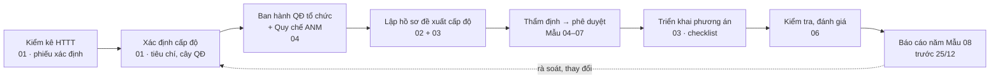

# Bộ khung tuân thủ An ninh mạng Việt Nam

Bộ tài liệu dùng chung để **xác định cấp độ hệ thống thông tin (HTTT)**, **lập hồ sơ đề xuất cấp độ** và **tuân thủ** các văn bản sau:

- **Luật An ninh mạng số 116/2025/QH15** (hiệu lực 01/7/2026);
- **NĐ 331/2026/NĐ-CP** về bảo vệ an ninh mạng đối với HTTT theo cấp độ; **NĐ 333/2026/NĐ-CP** quy định chi tiết Luật An ninh mạng; **NĐ 330/2026/NĐ-CP** về xử phạt. Cả ba có hiệu lực từ 19/8/2026;
- **TCVN 14423:2026** *An ninh mạng – Hệ thống thông tin – Yêu cầu cơ bản* (QĐ 3243/QĐ-BKHCN ngày 24/7/2026). Tiêu chuẩn này thay thế **TCVN 14423:2025** và TCVN 11930:2017;
- các văn bản về dữ liệu cá nhân có liên quan: Luật 91/2025/QH15, NĐ 356/2025/NĐ-CP, NQ 22/2026/NQ-CP.

> **Trạng thái: bản khung v0.1.** Đã đối chiếu với văn bản gốc ngày 24/09/2026. Đây là tài liệu tham khảo, **không phải ý kiến pháp lý**. Trước khi ký ban hành, phải đối chiếu lại văn bản gốc và bản chính thức TCVN 14423:2026 (mua tại VSQI), đồng thời xem các điểm còn mở trong [`docs/00-tong-quan/diem-can-doi-chieu.md`](docs/00-tong-quan/diem-can-doi-chieu.md).

## Cấu trúc

| Thư mục | Nội dung | Dùng khi |
|---|---|---|
| [`docs/00-tong-quan/`](docs/00-tong-quan/README.md) | Danh mục văn bản và hiệu lực, lộ trình và các mốc thời hạn, thuật ngữ, tóm tắt Luật 116, **điểm cần đối chiếu** | Bắt đầu, lập kế hoạch |
| [`docs/01-xac-dinh-cap-do/`](docs/01-xac-dinh-cap-do/README.md) | Tiêu chí cấp 1–5 (NĐ 331 Đ11–16), cây quyết định, phiếu xác định cấp độ, thẩm quyền–trình tự–thời hạn | Kiểm kê HTTT và đề xuất cấp độ |
| [`docs/02-ho-so-cap-do/`](docs/02-ho-so-cap-do/README.md) | Mẫu 01–08 NĐ 331; khung thuyết minh tổng quan, đề xuất cấp độ, phương án bảo đảm ANM; báo cáo đánh giá rủi ro | Lập hồ sơ đề xuất cấp độ |
| [`docs/03-yeu-cau-theo-cap-do/`](docs/03-yeu-cau-theo-cap-do/README.md) | Ma trận yêu cầu TCVN 14423:2026 theo 5 cấp, bảng ngưỡng định lượng, ánh xạ NĐ 331 Đ29–30, checklist tự đánh giá cấp 1–5 | Xây dựng phương án ANM, đánh giá khoảng trống |
| [`docs/04-chinh-sach-quy-trinh/`](docs/04-chinh-sach-quy-trinh/README.md) | Quyết định (chủ quản, bộ phận chuyên trách, hội đồng thẩm định, đơn vị vận hành), **Quy chế bảo đảm ANM**, các quy trình (sự cố, rủi ro, đánh giá trước vận hành, yêu cầu của cơ quan chức năng, nhà cung cấp), đào tạo–diễn tập, RACI | Ban hành văn bản nội bộ |
| [`docs/05-nghia-vu-lien-quan/`](docs/05-nghia-vu-lien-quan/README.md) | Nghĩa vụ doanh nghiệp theo NĐ 333 (lưu trữ dữ liệu tại VN, nhật ký, xác thực tài khoản, gỡ nội dung…), bảng mức phạt NĐ 330, giao thoa với bảo vệ DLCN, điều kiện kinh doanh dịch vụ xử lý DLCN | Rà soát nghĩa vụ ngoài phạm vi cấp độ |
| [`docs/06-kiem-tra-bao-cao/`](docs/06-kiem-tra-bao-cao/README.md) | Kiểm tra, đánh giá định kỳ; báo cáo năm (Mẫu 08, hạn 25/12); danh mục hồ sơ, bằng chứng cần lưu | Vận hành thường xuyên, chuẩn bị thanh tra |
| [`word/`](word/) · [`excel/`](excel/) | Bản Word các mẫu văn bản (thể thức NĐ 30/2020, Times New Roman 13, có dữ liệu mẫu tô vàng) và bản Excel checklist, ma trận, sổ rủi ro, RACI — sinh tự động bằng [`tools/`](tools/md2docx/README.md) | Soạn văn bản thực tế, tự đánh giá |
| [`sources/van-ban-goc/`](sources/van-ban-goc/README.md) | Toàn văn các văn bản quy phạm pháp luật để tra cứu | Kiểm tra trích dẫn |

## Quy trình sử dụng

Quy chế bảo đảm ANM phải được ban hành **trước** khi phê duyệt hồ sơ đề xuất cấp độ (NĐ 331 Đ30.7).

## Mốc cần nhớ

| Mốc | Nội dung | Căn cứ |
|---|---|---|
| 01/7/2026 | Luật An ninh mạng 116/2025 có hiệu lực | Luật 116 Đ44 |
| 19/8/2026 | NĐ 330, 331, 333 có hiệu lực. Nghĩa vụ theo cấp độ áp dụng từ ngày này, trừ các trường hợp chuyển tiếp | NĐ 331 Đ38; NĐ 330 Đ80; NĐ 333 Đ30 |
| 20/12 hằng năm | Đơn vị chuyên trách ANM và đơn vị vận hành gửi báo cáo cho chủ quản | NĐ 331 Đ35.4.a |
| 25/12 hằng năm | Chủ quản gửi báo cáo năm cho Bộ Công an (kỳ số liệu 15/12 năm trước đến 14/12) | NĐ 331 Đ35.3, 35.4.b |
| ~30/6/2027 **[CẦN ĐỐI CHIẾU cách tính thời hạn]** | Hết thời hạn 12 tháng để bảo đảm điều kiện, biện pháp theo cấp độ (với HTTT đã có cấp độ hoặc đang đầu tư trước 01/7/2026) | Luật 116 Đ45.1; NĐ 331 Đ39.1 |
| ≤ 24h / ≤ 72h | Thông báo ban đầu sự cố nghiêm trọng / báo cáo sự cố cho BCA | NĐ 331 Đ31.2.d |

## Quy ước

- Mọi nghĩa vụ đều kèm trích dẫn điều khoản, dạng `NĐ 331 Đ13.2.a` hoặc `TCVN 14423:2026 mục 5.8`. Chỗ nào chưa chắc chắn được ghi **[CẦN ĐỐI CHIẾU]**.
- Các mẫu dùng placeholder `{{TEN_TO_CHUC}}`, `{{TEN_HE_THONG}}`… Bộ khung không chứa dữ liệu riêng của tổ chức nào.
- **Bản quyền TCVN:** repo này công khai, nên TCVN 14423:2026 chỉ được tóm lược bằng lời riêng, kèm số mục, không chép nguyên văn. Toàn văn tiêu chuẩn không được lưu trong repo (xem `.gitignore`).
- Hồ sơ riêng của từng tổ chức (tên, IP, sơ đồ mạng, nhân sự) nên lưu trong **repo riêng tư**, dựng từ các mẫu trong bộ khung này.

## Giấy phép

Apache License 2.0. Xem [LICENSE](LICENSE). Văn bản quy phạm pháp luật trong `sources/` không thuộc đối tượng bảo hộ quyền tác giả.
