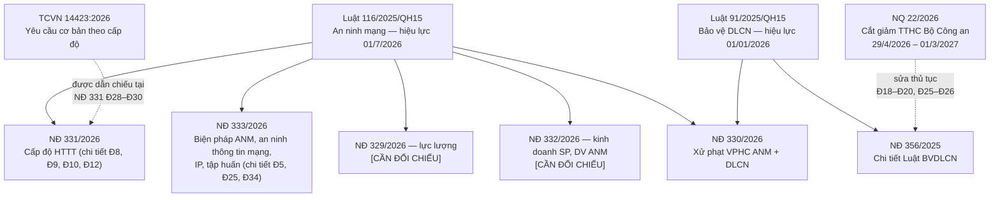

# Danh mục văn bản căn cứ

> **Căn cứ:** Luật 116/2025/QH15 Đ43–Đ45; NĐ 330/2026/NĐ-CP Đ80–Đ81; NĐ 331/2026/NĐ-CP Đ38–Đ39; NĐ 333/2026/NĐ-CP Đ30–Đ31; Luật 91/2025/QH15 Đ38–Đ39; NĐ 356/2025/NĐ-CP Đ42; NQ 22/2026/NQ-CP Đ4, Đ6; TCVN 14423:2026 (Lời nói đầu); Luật 143/2025/QH15 Đ51, Phụ lục IV; các văn bản dẫn chiếu ngoài tại mục 3a · **Đối chiếu văn bản gốc:** 29/09/2026 · **Trạng thái:** Bản khung v0.1

Danh mục các văn bản mà bộ khung này dùng làm căn cứ, kèm tình trạng hiệu lực và văn bản bị thay thế. Toàn văn (bản text để tra cứu) nằm ở [`sources/van-ban-goc/toan-van/`](../../sources/van-ban-goc/toan-van/). Riêng TCVN 14423:2026 có bản quyền, không lưu trong repo.

**Cách dùng:** trước khi trích dẫn một văn bản vào hồ sơ, kiểm tra cột "Hiệu lực" và mục 3 (văn bản đã bị thay thế). Nếu một văn bản ghi **[CẦN ĐỐI CHIẾU]**, tra lại trên Công báo hoặc Cơ sở dữ liệu quốc gia về VBQPPL trước khi dùng.

---

## 1. Văn bản đang dùng làm căn cứ

| # | Số hiệu | Tên văn bản | Ban hành / thông qua | Hiệu lực | Thay thế / làm hết hiệu lực | Phạm vi chính với tổ chức, doanh nghiệp | File nguồn |
|---|---|---|---|---|---|---|---|
| 1 | **Luật 116/2025/QH15** | Luật An ninh mạng | Quốc hội khóa XV, Kỳ họp thứ 10 thông qua **10/12/2025** (lời kết của Luật). Đăng Công báo số 35 ngày 21/01/2026 | **01/7/2026** (Luật 116 Đ44.1) | Luật An toàn thông tin mạng 86/2015/QH13 (đã sửa đổi, bổ sung theo Luật 35/2018/QH14) và Luật An ninh mạng 24/2018/QH14 **hết hiệu lực từ 01/7/2026** (Luật 116 Đ44.2). Thay thế/bãi bỏ cụm từ "an toàn thông tin" tại nhiều luật liên quan (Luật 116 Đ43, gồm 17 khoản) | Toàn bộ nghĩa vụ ANM: 5 cấp độ HTTT (Đ8), HTTT quan trọng về ANQG (Đ9, Đ11), nhiệm vụ và biện pháp theo cấp (Đ10), nghĩa vụ của doanh nghiệp cung cấp dịch vụ (Đ25, Đ41), trách nhiệm chủ quản (Đ40), chuyển tiếp (Đ45). Xem [tong-quan-luat-116.md](tong-quan-luat-116.md) | `luat-116-2025-qh15-an-ninh-mang.txt` |
| 2 | **NĐ 331/2026/NĐ-CP** | Về bảo vệ an ninh mạng đối với hệ thống thông tin | **19/8/2026** | **19/8/2026** (NĐ 331 Đ38) | Điều chỉnh cùng đối tượng với NĐ 85/2016/NĐ-CP (bảo đảm an toàn HTTT theo cấp độ) và **thay thế NĐ 85/2016 trên thực tế**, nhưng bản text hiện có **không có điều khoản bãi bỏ NĐ 85/2016**; Đ39.1 vẫn dẫn NĐ 85/2016 để chuyển tiếp. **[CẦN ĐỐI CHIẾU bản Công báo]** — xem mục 3 | Tiêu chí cấp độ (Đ11–Đ16), thẩm quyền–trình tự xác định cấp độ (Đ18–Đ25), kiểm tra (Đ26–Đ27), biện pháp và phương án ANM (Đ28–Đ30), trách nhiệm (Đ31–Đ33), báo cáo năm (Đ35–Đ36), Mẫu 01–08. Bắt buộc với HTTT phục vụ hoạt động của cơ quan, tổ chức nhà nước và HTTT cung cấp dịch vụ trực tuyến cho người dân, doanh nghiệp; tổ chức khác được khuyến khích áp dụng (Đ2) | `nd-331-2026-nd-cp-bao-ve-anm-httt.txt` |
| 3 | **NĐ 333/2026/NĐ-CP** | Quy định chi tiết một số điều và biện pháp thi hành Luật An ninh mạng | **19/8/2026** | **19/8/2026** (NĐ 333 Đ30) | Không có điều khoản bãi bỏ; Đ31 cho phép hồ sơ thẩm định/đánh giá điều kiện ANM đã được tiếp nhận hợp lệ theo **NĐ 53/2022/NĐ-CP** trước 19/8/2026 tiếp tục giải quyết theo NĐ 53/2022. **[CẦN ĐỐI CHIẾU]** tình trạng NĐ 53/2022 | Trình tự áp dụng biện pháp bảo vệ ANM (thẩm định, đánh giá điều kiện, giám sát, kiểm tra, ứng phó sự cố — Đ5–Đ13); bảo đảm an ninh thông tin mạng: xác thực tài khoản, cung cấp thông tin người dùng, gỡ nội dung, nhật ký hệ thống (Đ16–Đ18); lưu trữ dữ liệu tại Việt Nam (Đ19–Đ20); định danh IP (Đ21–Đ23); tập huấn chuyên sâu (Đ24–Đ29). Xem [../05-nghia-vu-lien-quan/nd-333-nghia-vu-doanh-nghiep.md](../05-nghia-vu-lien-quan/nd-333-nghia-vu-doanh-nghiep.md) | `nd-333-2026-nd-cp-chi-tiet-luat-anm.txt` |
| 4 | **NĐ 330/2026/NĐ-CP** | Quy định xử phạt vi phạm hành chính trong lĩnh vực an ninh mạng và bảo vệ dữ liệu cá nhân | **19/8/2026** | **19/8/2026** (NĐ 330 Đ80) | Văn bản không liệt kê nghị định bị thay thế. Hành vi xảy ra trước 19/8/2026 áp dụng nghị định xử phạt có hiệu lực tại thời điểm vi phạm, trừ khi NĐ 330 có lợi hơn (NĐ 330 Đ81.1) | Hành vi vi phạm và mức phạt ANM (Mục 1–5) và DLCN (Mục 6); thời hiệu 01 năm (Đ3); tổ chức bị phạt gấp đôi mức ghi cho cá nhân ở lĩnh vực ANM (Đ7.1). Xem [../05-nghia-vu-lien-quan/nd-330-muc-phat.md](../05-nghia-vu-lien-quan/nd-330-muc-phat.md) | `nd-330-2026-nd-cp-xu-phat-anm-dlcn.txt` |
| 5 | **Luật 91/2025/QH15** | Luật Bảo vệ dữ liệu cá nhân | Quốc hội khóa XV, Kỳ họp thứ 9 thông qua **26/6/2025** | **01/01/2026** (Luật 91 Đ38.1) | Chuyển tiếp với NĐ 13/2023/NĐ-CP: sự đồng ý và hồ sơ đánh giá tác động đã có theo NĐ 13/2023 tiếp tục dùng (Luật 91 Đ39) | Định nghĩa DLCN cơ bản/nhạy cảm (Đ2), chuyển DLCN xuyên biên giới (Đ20), đánh giá tác động (Đ21–Đ22), thông báo vi phạm 72 giờ (Đ23), bộ phận/nhân sự BVDLCN (Đ33.2), miễn trừ doanh nghiệp nhỏ (Đ38.2–3) | `luat-91-2025-qh15-bao-ve-dlcn.txt` |
| 6 | **NĐ 356/2025/NĐ-CP** | Quy định chi tiết một số điều và biện pháp thi hành Luật Bảo vệ dữ liệu cá nhân | **31/12/2025** | **01/01/2026** (NĐ 356 Đ42.1) | **NĐ 13/2023/NĐ-CP hết hiệu lực từ 01/01/2026** (NĐ 356 Đ42.2); sửa khoản 2 Điều 16 NĐ 165/2025/NĐ-CP (NĐ 356 Đ42.3) | Danh mục DLCN cơ bản (Đ3) và nhạy cảm (Đ4), điều kiện nhân sự BVDLCN (Đ13–Đ14), hồ sơ đánh giá tác động và chuyển xuyên biên giới (Đ17–Đ20), dịch vụ xử lý DLCN (Đ21–Đ27), nội dung thông báo vi phạm (Đ28–Đ29), Mẫu 01a–10 | `nd-356-2025-nd-cp-chi-tiet-luat-dlcn.txt` (bản có chèn ghi chú cập nhật theo NQ 22/2026) |
| 7 | **NQ 22/2026/NQ-CP** | Cắt giảm, phân cấp, đơn giản hóa thủ tục hành chính và cắt giảm, đơn giản hóa điều kiện kinh doanh thuộc phạm vi quản lý của Bộ Công an | **29/4/2026** | **Từ 29/4/2026 đến hết 01/3/2027** (NQ 22 Đ6.1) | Trong thời gian hiệu lực, nếu thủ tục trong NQ khác văn bản khác thì áp dụng NQ (NQ 22 Đ6.2). Quy định tương ứng trong NQ tự hết hiệu lực khi có luật/nghị định mới về cùng thủ tục có hiệu lực trong khoảng 29/4/2026 – trước 01/3/2027 (NQ 22 Đ6.1 đoạn 2) | Phụ lục I.7: thủ tục giấy phép kinh doanh sản phẩm, dịch vụ ATTT mạng (dẫn NĐ 108/2016), giấy chứng nhận kinh doanh dịch vụ xử lý DLCN, phân cấp tiếp nhận hồ sơ đánh giá tác động DLCN về BCA → Công an tỉnh. Xem [../05-nghia-vu-lien-quan/dlcn-giao-thoa-anm.md](../05-nghia-vu-lien-quan/dlcn-giao-thoa-anm.md) | `nq-22-2026-nq-cp-cat-giam-tthc-bo-cong-an.txt` |
| 8 | **TCVN 14423:2026** | An ninh mạng – Hệ thống thông tin – Yêu cầu cơ bản | Công bố theo QĐ 3243/QĐ-BKHCN ngày 24/7/2026 (theo [README nguồn](../../sources/van-ban-goc/README.md); **[CẦN ĐỐI CHIẾU]** số, ngày quyết định công bố — không thấy ghi trong phần text đã đọc của tiêu chuẩn) | Theo quyết định công bố | **Thay thế TCVN 14423:2025 và TCVN 11930:2017** (Lời nói đầu TCVN 14423:2026) | Yêu cầu cơ bản theo 5 cấp: mục 3 (cấp 1), 4 (cấp 2), 5 (cấp 3), 6 (cấp 4), 7 (cấp 5), Phụ lục A (an ninh vật lý). NĐ 331 dẫn chiếu "Tiêu chuẩn quốc gia về An ninh mạng – Hệ thống thông tin – Yêu cầu cơ bản" tại Đ28.1, Đ28.4, Đ29.1, Đ30.1. Tóm lược tại [`../03-yeu-cau-theo-cap-do/`](../03-yeu-cau-theo-cap-do/) | Không lưu (có bản quyền — mua tại VSQI) |
| 9 | NĐ 329/2026/NĐ-CP | Lực lượng bảo vệ an ninh mạng (theo [README nguồn](../../sources/van-ban-goc/README.md)) | **[CẦN ĐỐI CHIẾU]** — chưa có toàn văn trong repo | **[CẦN ĐỐI CHIẾU]** | **[CẦN ĐỐI CHIẾU]** | Dự kiến chi tiết Luật 116 Đ30.2 (lực lượng bảo vệ ANM, phối hợp). Chưa dùng làm căn cứ trong bộ khung | Chưa lưu |
| 10 | NĐ 332/2026/NĐ-CP | Kinh doanh sản phẩm, dịch vụ an ninh mạng (theo [README nguồn](../../sources/van-ban-goc/README.md)) | **[CẦN ĐỐI CHIẾU]** — chưa có toàn văn trong repo | **[CẦN ĐỐI CHIẾU]** | **[CẦN ĐỐI CHIẾU]** quan hệ với NĐ 108/2016/NĐ-CP | Dự kiến chi tiết Luật 116 Đ28.3, Đ29.3 (giấy phép kinh doanh sản phẩm, dịch vụ ANM). Cần khi **thuê** dịch vụ kiểm tra, đánh giá, giám sát ANM (xem [../06-kiem-tra-bao-cao/kiem-tra-danh-gia-dinh-ky.md](../06-kiem-tra-bao-cao/kiem-tra-danh-gia-dinh-ky.md)) | Chưa lưu |
| 11 | **Luật 143/2025/QH15** | Luật Đầu tư | Quốc hội khóa XV, Kỳ họp thứ 10 thông qua **11/12/2025** (lời kết). Đăng Công báo số 42 ngày 22/01/2026 | **01/3/2026**; riêng **Điều 7 và Phụ lục IV** (Danh mục ngành, nghề đầu tư kinh doanh có điều kiện) từ **01/7/2026** (Luật 143 Đ51.1–51.2) | Luật Đầu tư 61/2020/QH14 (đã sửa đổi, bổ sung) hết hiệu lực từ 01/3/2026, trừ Điều 7 và Danh mục ngành, nghề đầu tư kinh doanh có điều kiện của luật cũ hết hiệu lực từ 01/7/2026 (Luật 143 Đ51.4) | **Phụ lục IV** — danh mục mà NĐ 331 Đ12.2.a, Đ13.2.a dẫn chiếu (ranh giới cấp 2/3). Các mục liên quan: **98** kinh doanh dịch vụ viễn thông; **111** kinh doanh sản phẩm, dịch vụ an ninh mạng; **194–196** trung gian dữ liệu, phân tích, tổng hợp dữ liệu, sàn dữ liệu; **198** dịch vụ xử lý dữ liệu cá nhân | `luat-143-2025-qh15-dau-tu.txt` (Phụ lục IV từ dòng 2453) |

> Ghi chú về NĐ 329, NĐ 332: README nguồn ghi tên hai nghị định này nhưng repo **chưa có toàn văn**, nên bộ khung **không trích điều khoản** của hai văn bản. Mọi nội dung liên quan được đánh dấu **[CẦN ĐỐI CHIẾU]**.

## 2. Quan hệ giữa các văn bản

```mermaid
flowchart TD
    L116["Luật 116/2025/QH15<br/>An ninh mạng — hiệu lực 01/7/2026"]
    L91["Luật 91/2025/QH15<br/>Bảo vệ DLCN — hiệu lực 01/01/2026"]
    N331["NĐ 331/2026<br/>Cấp độ HTTT (chi tiết Đ8, Đ9, Đ10, Đ12)"]
    N333["NĐ 333/2026<br/>Biện pháp ANM, an ninh thông tin mạng,<br/>IP, tập huấn (chi tiết Đ5, Đ25, Đ34)"]
    N330["NĐ 330/2026<br/>Xử phạt VPHC ANM + DLCN"]
    N329["NĐ 329/2026 — lực lượng<br/>[CẦN ĐỐI CHIẾU]"]
    N332["NĐ 332/2026 — kinh doanh SP, DV ANM<br/>[CẦN ĐỐI CHIẾU]"]
    N356["NĐ 356/2025<br/>Chi tiết Luật BVDLCN"]
    NQ22["NQ 22/2026<br/>Cắt giảm TTHC Bộ Công an<br/>29/4/2026 – 01/3/2027"]
    TCVN["TCVN 14423:2026<br/>Yêu cầu cơ bản theo cấp độ"]
    L116 --> N331 & N333 & N329 & N332
    L116 --> N330
    L91 --> N356
    L91 --> N330
    TCVN -. "được dẫn chiếu tại<br/>NĐ 331 Đ28–Đ30" .-> N331
    NQ22 -. "sửa thủ tục<br/>Đ18–Đ20, Đ25–Đ26" .-> N356
```

Điểm giao thoa quan trọng: tiêu chí cấp độ 2 và cấp độ 3 dùng ngưỡng số chủ thể **DLCN cơ bản / DLCN nhạy cảm** (NĐ 331 Đ12.2.b, Đ13.2.c) — khái niệm của Luật 91 Đ2.2–2.3 và danh mục tại NĐ 356 Đ3–Đ4.

## 3a. Văn bản dẫn chiếu ngoài — đã có toàn văn trong `sources/`

Các điều khoản dưới đây được bộ mẫu dẫn chiếu. Toàn văn tải từ Công báo ngày 29/09/2026 (xem [báo cáo tải](../../sources/van-ban-goc/README-tai-ve-2026-09.md)): bản text trong [`sources/van-ban-goc/toan-van/`](../../sources/van-ban-goc/toan-van/), PDF gốc trong [`sources/van-ban-goc/ban-goc-tai-ve/`](../../sources/van-ban-goc/ban-goc-tai-ve/). Nội dung trong bảng đã **đối chiếu với toàn văn** ngày 29/09/2026. Bản text trích từ PDF nên hay có khoảng trắng chèn giữa chữ (ví dụ "trá i phép"); khi tìm kiếm, tìm theo nội dung chứ không chỉ theo "Điều NNN".

| Văn bản (tệp) | Điều khoản dùng | Nội dung (theo toàn văn) | Trạng thái sửa đổi (theo toàn văn) | Dùng ở |
|---|---|---|---|---|
| Bộ luật Lao động 45/2019/QH14 — dẫn theo **VBHN 18/VBHN-VPQH** ngày 12/02/2026 (`vbhn-18-2026-vpqh-bo-luat-lao-dong.txt`; bản gốc `luat-45-2019-qh14-bo-luat-lao-dong.txt`) | Đ21.2 | Người lao động làm việc liên quan trực tiếp đến bí mật kinh doanh, bí mật công nghệ: người sử dụng lao động có quyền thỏa thuận bằng văn bản về nội dung, thời hạn bảo vệ, quyền lợi và việc bồi thường khi vi phạm. Không ấn định thời hạn tối đa | Sửa đổi bởi Luật 71/2025/QH15, 113/2025/QH15, 124/2025/QH15 (VBHN 18). Chú thích sửa đổi trong VBHN **không rơi vào** Đ21, Đ118–Đ130 | 08 — mẫu 14 |
| nt | Đ118–Đ119 | Phải ban hành nội quy; từ **10 người lao động trở lên** thì nội quy bằng văn bản (Đ118.1), nội dung có bảo vệ bí mật kinh doanh, bí mật công nghệ (Đ118.2.đ) và hành vi vi phạm, hình thức kỷ luật (Đ118.2.g); đăng ký tại **cơ quan chuyên môn về lao động thuộc UBND cấp tỉnh**, nộp hồ sơ trong 10 ngày từ ngày ban hành (Đ119.1–119.2) | nt | 08 — mẫu 14 |
| nt | Đ123.1 | Thời hiệu kỷ luật 06 tháng; **12 tháng** nếu vi phạm liên quan trực tiếp đến tài chính, tài sản, tiết lộ bí mật công nghệ, bí mật kinh doanh | nt | 08 — mẫu 14 (hướng dẫn) |
| nt | Đ124; **Đ125.2** | 4 hình thức: khiển trách; kéo dài thời hạn nâng lương không quá 06 tháng; cách chức; sa thải. Sa thải khi "có hành vi tiết lộ bí mật kinh doanh, bí mật công nghệ, xâm phạm quyền sở hữu trí tuệ của người sử dụng lao động, có hành vi gây thiệt hại nghiêm trọng hoặc đe dọa gây thiệt hại đặc biệt nghiêm trọng về tài sản, lợi ích của người sử dụng lao động hoặc quấy rối tình dục tại nơi làm việc **được quy định trong nội quy lao động**" | nt | 08 — mẫu 14 |
| nt | Đ129; Đ130 | Bồi thường theo pháp luật hoặc nội quy lao động; sơ suất gây thiệt hại không nghiêm trọng với giá trị **không quá 10 tháng lương tối thiểu vùng** → bồi thường **nhiều nhất 03 tháng tiền lương**, khấu trừ hằng tháng vào lương (Đ129.1). Mức bồi thường căn cứ lỗi, thiệt hại thực tế, hoàn cảnh gia đình, nhân thân, tài sản (Đ130.1) | nt | 08 — mẫu 14 |
| Bộ luật Hình sự 100/2015/QH13 — dẫn theo **VBHN 135/VBHN-VPQH** ngày 05/09/2025 (`vbhn-135-2025-vpqh-bo-luat-hinh-su.txt`) | Đ159.1 | Xâm phạm bí mật hoặc an toàn thư tín, điện thoại, điện tín hoặc hình thức trao đổi thông tin riêng tư khác — chỉ khi **đã bị xử lý kỷ luật hoặc xử phạt VPHC về hành vi này mà còn vi phạm**; phạt cảnh cáo, phạt tiền 20–50 triệu đồng hoặc cải tạo không giam giữ đến 03 năm | VBHN 135 hợp nhất Luật 12/2017/QH14, Luật 59/2024/QH15 (Tư pháp người chưa thành niên) và **Luật 86/2025/QH15** (`luat-86-2025-qh15-sua-doi-bo-luat-hinh-su.txt`); Luật 86/2025 **không sửa** Đ159, Đ286–Đ289 | 08 — mẫu 14 (hướng dẫn) |
| nt | Đ288.1.b | Mua bán, trao đổi, tặng cho, sửa chữa, thay đổi hoặc công khai hóa thông tin riêng hợp pháp của cơ quan, tổ chức, cá nhân trên mạng máy tính, mạng viễn thông mà không được phép của chủ sở hữu — khi thu lợi bất chính 50–dưới 200 triệu, gây thiệt hại 100–dưới 500 triệu đồng hoặc gây dư luận xấu làm giảm uy tín; phạt tiền 30–200 triệu, cải tạo không giam giữ đến 03 năm hoặc tù 06 tháng–03 năm | nt | nt |
| nt | Đ289.1 | Xâm nhập trái phép vào mạng máy tính, mạng viễn thông, phương tiện điện tử của người khác (vượt cảnh báo, mã truy cập, tường lửa, dùng quyền quản trị của người khác…); phạt tiền 50–300 triệu đồng hoặc tù 01–05 năm | nt | nt |
| nt | Đ286, Đ287 | Phát tán chương trình tin học gây hại; cản trở, gây rối loạn hoạt động mạng máy tính, mạng viễn thông, phương tiện điện tử (khoản 1 có ngưỡng thu lợi, thiệt hại, số thiết bị hoặc thời gian gián đoạn) | nt | Tham khảo khi đánh giá sự cố |
| nt | — | **Không có tội riêng về dữ liệu cá nhân** (không có Điều 159a…) trong VBHN 135. Việc bổ sung tội danh về DLCN sau 09/2025 (nếu có) chưa có văn bản trong `sources/` **[CẦN ĐỐI CHIẾU]** | — | — |
| Luật Hỗ trợ DNNVV 04/2017/QH14 (`ban-goc-tai-ve/luat-04-2017-qh14-ho-tro-dnnvv.pdf` — **bản scan, không có bản text**; đọc trực tiếp trang 1–2, 14–15) | Đ3.2; Đ4 | Đ3.2: DNNVV khởi nghiệp sáng tạo là DNNVV thành lập để thực hiện ý tưởng trên cơ sở khai thác tài sản trí tuệ, công nghệ, mô hình kinh doanh mới và có khả năng tăng trưởng nhanh. Đ4.1: DNNVV có số lao động tham gia BHXH bình quân năm **không quá 200 người** và **một trong hai**: tổng nguồn vốn không quá 100 tỷ đồng; tổng doanh thu năm trước liền kề không quá 300 tỷ đồng. Thông qua 12/6/2017, hiệu lực 01/01/2018 (Đ34) | Chưa rà văn bản sửa đổi Đ3, Đ4 **[CẦN ĐỐI CHIẾU]** | 08 — trang BVDLCN mục 4 |
| NĐ 80/2021/NĐ-CP (`nd-80-2021-nd-cp-ho-tro-dnnvv.txt`) | Đ5–Đ9 | Đ5: ngưỡng siêu nhỏ, nhỏ, vừa theo 2 nhóm lĩnh vực (nông, lâm, thủy sản, công nghiệp, xây dựng / thương mại, dịch vụ). Đ6: lĩnh vực theo ngành, nghề kinh doanh chính đã đăng ký. Đ7: lao động BHXH bình quân năm = tổng các tháng năm trước liền kề ÷ 12. Đ8–Đ9: tổng nguồn vốn, doanh thu theo báo cáo tài chính năm trước liền kề | Hiệu lực 15/10/2021, thay NĐ 39/2018/NĐ-CP (Đ34). Chưa rà văn bản sửa đổi | nt |
| NĐ 30/2020/NĐ-CP (`nd-30-2020-nd-cp-cong-tac-van-thu.txt`) | Đ2; Phụ lục I Phần I Mục II khoản 7.b | Đ2.1: áp dụng với **cơ quan, tổ chức nhà nước và doanh nghiệp nhà nước**; Đ2.2: tổ chức chính trị, chính trị – xã hội, xã hội, xã hội – nghề nghiệp căn cứ để áp dụng cho phù hợp. Nghị định **không có quy định** cho doanh nghiệp ngoài nhà nước (bộ khung dùng thể thức để tham khảo). Phụ lục I: viết tắt quyền hạn người ký "TM." (thay mặt tập thể), "Q." (quyền cấp trưởng), "KT." (ký thay người đứng đầu), "TL." (thừa lệnh), "TUQ." (thừa ủy quyền); ký ban hành tại Đ13 | Hiệu lực từ ngày ký 05/3/2020, thay NĐ 110/2004 và NĐ 09/2010 (Đ37). Chưa rà văn bản sửa đổi | Thể thức các mẫu Word; 08 — mẫu 01, 02, 07 |
| Luật Doanh nghiệp 59/2020/QH14 (`luat-59-2020-qh14-doanh-nghiep.txt`) | Đ43.1–43.3 | Dấu gồm dấu làm tại cơ sở khắc dấu hoặc dấu dưới hình thức chữ ký số; doanh nghiệp quyết định loại dấu, số lượng, hình thức, nội dung dấu của doanh nghiệp, chi nhánh, văn phòng đại diện và đơn vị khác; quản lý, lưu giữ dấu theo Điều lệ hoặc quy chế | **Đ43 không bị sửa**: Luật 03/2022/QH15 Điều 7 chỉ sửa Đ49, Đ50, Đ60, Đ109, Đ148, Đ158, Đ217 (`luat-03-2022-qh15-sua-doi-9-luat.txt`); Luật 76/2025/QH15 (hiệu lực 01/7/2025) không có khoản nào sửa Đ43 (`luat-76-2025-qh15-sua-doi-luat-doanh-nghiep.txt`). Chưa có VBHN | 08 — mẫu 01, 02, 07 |

**Văn bản sửa đổi có toàn văn trong `sources/`** (chỉ để kiểm trạng thái sửa đổi, không trích làm căn cứ riêng):

| Văn bản | Thông qua | Hiệu lực | Sửa văn bản nào | Tệp |
|---|---|---|---|---|
| Luật Công nghiệp công nghệ số 71/2025/QH15 | 14/6/2025 | 01/01/2026 | Bộ luật Lao động (bổ sung một khoản — chú thích 5 VBHN 18) | `luat-71-2025-qh15-cong-nghiep-cong-nghe-so.txt` |
| Luật Dân số 113/2025/QH15 | 10/12/2025 | 01/7/2026 | Bộ luật Lao động (sửa một khoản — chú thích 4 VBHN 18) | `luat-113-2025-qh15-dan-so.txt` |
| Luật Giáo dục nghề nghiệp 124/2025/QH15 | 10/12/2025 | 01/01/2026 | Bộ luật Lao động (chú thích 2–3 VBHN 18) | `luat-124-2025-qh15-giao-duc-nghe-nghiep.txt` |
| Luật 86/2025/QH15 sửa đổi Bộ luật Hình sự | 25/6/2025 | 01/7/2025 (Đ3) | Bộ luật Hình sự (Đ40, 49, 62, 63, 109, 110, 114, 192–195, 235–256a, 317, 353–359, 421) và một số luật khác | `luat-86-2025-qh15-sua-doi-bo-luat-hinh-su.txt` |
| Luật 03/2022/QH15 sửa đổi 9 luật | 11/01/2022 | 01/3/2022 (Đ10) | Luật Doanh nghiệp tại Điều 7; Luật Đầu tư và các luật khác | `luat-03-2022-qh15-sua-doi-9-luat.txt` |
| Luật 76/2025/QH15 sửa đổi Luật Doanh nghiệp | 17/6/2025 | 01/7/2025 (Đ2) | Luật Doanh nghiệp (28 khoản, không có Đ43) | `luat-76-2025-qh15-sua-doi-luat-doanh-nghiep.txt` |

## 3b. Văn bản liên quan theo ngành — có toàn văn, chưa rà vào bộ khung

Các văn bản dưới đây có thể đặt yêu cầu **cao hơn** NĐ 333 với từng ngành. Toàn văn đã có trong `sources/`, nhưng **nội dung chưa được rà để đưa vào bộ khung**; khi dùng phải đọc trực tiếp và kiểm văn bản sửa đổi.

| Văn bản | Ban hành / thông qua | Hiệu lực | Ghi chú | Tệp |
|---|---|---|---|---|
| **Luật Thương mại điện tử 122/2025/QH15** | 10/12/2025 | 01/7/2026 (Đ40) | Dẫn đúng số hiệu 122/2025/QH15 | `luat-122-2025-qh15-thuong-mai-dien-tu.txt` |
| **NĐ 147/2024/NĐ-CP** — quản lý, cung cấp, sử dụng dịch vụ Internet và thông tin trên mạng | 09/11/2024 | 25/12/2024 (Đ83.1) | Bãi bỏ NĐ 72/2013, NĐ 27/2018 và Điều 2 NĐ 150/2018 (Đ83.2) | `nd-147-2024-nd-cp-internet-va-thong-tin-tren-mang.txt` |
| **TT 09/2020/TT-NHNN** — an toàn HTTT trong hoạt động ngân hàng | 21/10/2020 | 01/01/2021, trừ trường hợp tại Đ56.2 (Đ56.1) | Thay TT 18/2018/TT-NHNN. Có quy định về dịch vụ điện toán đám mây. **Chưa rà văn bản sửa đổi** **[CẦN ĐỐI CHIẾU]** | `tt-09-2020-tt-nhnn-an-toan-httt-ngan-hang.txt` |

## 3. Văn bản đã bị thay thế — không dùng làm căn cứ

| Văn bản | Tình trạng | Căn cứ | Trường hợp còn được viện dẫn |
|---|---|---|---|
| Luật An toàn thông tin mạng 86/2015/QH13 (sửa đổi, bổ sung theo Luật 35/2018/QH14) | Hết hiệu lực từ 01/7/2026 | Luật 116 Đ44.2 | (1) HTTT **đã được xác định cấp độ** theo luật này **giữ cấp độ đã xác định**, nhưng trong 12 tháng kể từ 01/7/2026 phải đáp ứng điều kiện, biện pháp theo Luật 116 (Luật 116 Đ45.1). (2) Giấy phép kinh doanh sản phẩm, dịch vụ ATTT mạng, mật mã dân sự đã cấp còn giá trị đến hết thời hạn ghi trên giấy phép (Đ45.2). (3) Sản phẩm, giải pháp ATTT mạng đã đưa vào sử dụng tiếp tục dùng, trong 12 tháng phải đáp ứng điều kiện ANM (Đ45.3) |
| Luật An ninh mạng 24/2018/QH14 | Hết hiệu lực từ 01/7/2026 | Luật 116 Đ44.2 | Không |
| NĐ 85/2016/NĐ-CP (bảo đảm an toàn HTTT theo cấp độ). PDF gốc: `ban-goc-tai-ve/nd-85-2016-nd-cp-an-toan-httt-theo-cap-do.pdf` — **chỉ bản scan**, không có bản text | Bị NĐ 331 thay thế **trên thực tế** (cùng đối tượng điều chỉnh; NĐ 85/2016 quy định chi tiết Luật 86/2015 đã hết hiệu lực), nhưng bản text NĐ 331 hiện có **không có điều khoản bãi bỏ** NĐ 85/2016. **[CẦN ĐỐI CHIẾU bản Công báo]** | NĐ 331 Đ39.1 (chỉ nhắc để chuyển tiếp) | HTTT **đang đầu tư, xây dựng trước 01/7/2026**: hoàn thành thẩm định, phê duyệt cấp độ **theo NĐ 85/2016** trong **06 tháng** kể từ 01/7/2026; trong **12 tháng** kể từ 01/7/2026 phải đáp ứng biện pháp theo NĐ 331 (NĐ 331 Đ39.1). Ngoài trường hợp này, xác định cấp độ theo NĐ 331 |
| NĐ 53/2022/NĐ-CP (quy định chi tiết Luật An ninh mạng 2018). PDF gốc: `ban-goc-tai-ve/nd-53-2022-nd-cp-chi-tiet-luat-an-ninh-mang-2018.pdf` — **chỉ bản scan**, không có bản text | **[CẦN ĐỐI CHIẾU]** — NĐ 333 không có điều khoản bãi bỏ; luật được quy định chi tiết đã hết hiệu lực | NĐ 333 Đ31 | Hồ sơ đề nghị thẩm định ANM, đánh giá điều kiện ANM đã được tiếp nhận hợp lệ trước 19/8/2026 mà chưa có kết quả |
| NĐ 13/2023/NĐ-CP (bảo vệ dữ liệu cá nhân) | Hết hiệu lực từ 01/01/2026 | NĐ 356 Đ42.2 | Sự đồng ý/thỏa thuận đã có theo NĐ 13/2023 không phải xin lại; hồ sơ đánh giá tác động đã được tiếp nhận vẫn dùng, cập nhật theo Luật 91 (Luật 91 Đ39) |
| TCVN 14423:2025 và TCVN 11930:2017 | Được thay thế bởi TCVN 14423:2026 | Lời nói đầu TCVN 14423:2026 | Không dùng để lập phương án mới. Thuật ngữ "an toàn thông tin mạng", "an toàn HTTT" trong các tiêu chuẩn, quy chuẩn được hiểu tương đương "an ninh mạng" trong phạm vi NĐ 331 (NĐ 331 Đ39.2) |
| NĐ 108/2016/NĐ-CP (điều kiện kinh doanh sản phẩm, dịch vụ ATTT mạng) | **[CẦN ĐỐI CHIẾU]** — quy định chi tiết Luật 86/2015 (đã hết hiệu lực) nhưng NQ 22 Phụ lục I.7 mục A.I–A.II vẫn đơn giản hóa thủ tục theo NĐ 108/2016; quan hệ với NĐ 332/2026 chưa kiểm tra được | NQ 22 Phụ lục I.7.A | Chỉ tham khảo khi kiểm tra giấy phép của nhà cung cấp dịch vụ cấp trước 01/7/2026 (Luật 116 Đ45.2) |
| Các nghị định xử phạt áp dụng trước 19/8/2026 trong lĩnh vực ANM, DLCN | Chỉ áp dụng cho hành vi xảy ra trước 19/8/2026 (trừ khi NĐ 330 nhẹ hơn) | NĐ 330 Đ81.1 | Vụ việc chuyển tiếp. **[CẦN ĐỐI CHIẾU]** số hiệu cụ thể — không có trong bộ nguồn |
| **TT 12/2022/TT-BTTTT** (12/8/2022, hiệu lực 01/10/2022, thay TT 03/2017/TT-BTTTT — Đ17.1) quy định chi tiết NĐ 85/2016; toàn văn kèm phụ lục: `tt-12-2022-tt-btttt-chi-tiet-nd-85-2016.txt` | Văn bản quy định chi tiết NĐ 85/2016, vốn quy định chi tiết Luật 86/2015 đã hết hiệu lực từ 01/7/2026. Chưa thấy văn bản bãi bỏ riêng **[CẦN ĐỐI CHIẾU]** | — | Tham khảo phương pháp, tiền lệ (ví dụ cách lập hồ sơ cấp độ, yêu cầu theo cấp) nhưng không trích làm căn cứ pháp lý; HTTT chuyển tiếp theo NĐ 331 Đ39.1 |
| Các thông tư khác hướng dẫn NĐ 85/2016, Luật 86/2015 | **[CẦN ĐỐI CHIẾU]** — không có trong bộ nguồn | — | Có thể tham khảo phương pháp nhưng không trích làm căn cứ pháp lý |
| Luật Đầu tư 61/2020/QH14 — **VBHN 09/VBHN-VPQH** ngày 24/02/2025 (`vbhn-09-vpqh-luat-dau-tu.txt`, Phụ lục IV cũ từ dòng 4007) | Hết hiệu lực từ **01/3/2026**; riêng Điều 7 và Phụ lục IV cũ hết hiệu lực từ **01/7/2026** | Luật 143/2025 Đ51.4 | Chỉ để đối chiếu danh mục ngành, nghề đầu tư kinh doanh có điều kiện trước 01/7/2026. Dẫn chiếu hiện hành: **Luật 143/2025/QH15 Phụ lục IV** (mục 1, dòng 11) |

## 4. Văn bản còn chờ ban hành (tại 24/09/2026)

Các nội dung dưới đây được luật/nghị định **giao** cho cơ quan khác quy định, nhưng repo chưa có văn bản. Trong khi chờ, bộ khung ghi **"chờ hướng dẫn của Bộ Công an"** kèm điều khoản giao việc và đưa phương án tạm thời.

| # | Nội dung chờ | Cơ quan ban hành | Điều khoản giao | Ảnh hưởng | Cách làm tạm thời trong bộ khung |
|---|---|---|---|---|---|
| 1 | Quy định về đánh giá rủi ro ANM | Bộ trưởng Bộ Công an | NĐ 331 Đ10.8 | Phương pháp, biểu mẫu đánh giá rủi ro khi xác định cấp độ | Dùng nội dung tối thiểu tại NĐ 331 Đ10.3 + TCVN 14423:2026 mục 3.1/4.1/5.1/6.1/7.1; xem [`../04-chinh-sach-quy-trinh/quy-trinh-quan-ly-rui-ro.md`](../04-chinh-sach-quy-trinh/quy-trinh-quan-ly-rui-ro.md) |
| 2 | **Khung quản lý rủi ro an ninh mạng** | Bộ Công an ban hành hoặc trình ban hành | NĐ 331 Đ34.1.c; được viện dẫn ở tiêu chí NĐ 331 Đ11.2, Đ12.4, Đ13.5, Đ14.4, Đ15.5 | Tiêu chí "được đánh giá rủi ro ANM theo Khung quản lý rủi ro ANM" chưa áp dụng được | Không dùng tiêu chí này để hạ cấp; nếu đánh giá rủi ro cho thấy mức rủi ro cao hơn thì đề xuất cấp cao hơn (NĐ 331 Đ10.5) |
| 3 | Quy định về giám sát ANM, ứng phó, khắc phục sự cố đối với HTTT | Bộ trưởng Bộ Công an | NĐ 331 Đ28.6 | Tiêu chí "sự cố nghiêm trọng" (mốc 24 giờ tại NĐ 331 Đ31.2.d), cách kết nối giám sát (Luật 116 Đ40.1.b) | Áp dụng mốc 24h/72h và "ngay" theo NĐ 331 Đ31.2.d; xem [`../04-chinh-sach-quy-trinh/quy-trinh-ung-pho-su-co.md`](../04-chinh-sach-quy-trinh/quy-trinh-ung-pho-su-co.md) |
| 4 | Hướng dẫn chi tiết việc xác định HTTT | Bộ Công an | NĐ 331 Đ34.1.b | Cách tách/gộp phạm vi HTTT | Áp dụng NĐ 331 Đ7.2, Đ8; xem [`../01-xac-dinh-cap-do/tieu-chi-cap-do.md`](../01-xac-dinh-cap-do/tieu-chi-cap-do.md) |
| 5 | Quy định chi tiết kiểm tra, đánh giá ANM và quản lý rủi ro trong cơ quan, tổ chức nhà nước; **biểu mẫu, tiêu chí, phương pháp tự đánh giá** | Bộ Công an / "cơ quan nhà nước có thẩm quyền" | NĐ 331 Đ34.1.đ, Đ31.2.c | Điều kiện hợp lệ của tự đánh giá nội bộ | Dùng mẫu tạm tại [`../06-kiem-tra-bao-cao/kiem-tra-danh-gia-dinh-ky.md`](../06-kiem-tra-bao-cao/kiem-tra-danh-gia-dinh-ky.md) |
| 6 | Danh mục các HTTT theo loại hình (cập nhật hằng năm, trước 15/01) | Bộ Công an công bố trên Cổng TTĐT | NĐ 331 Đ9.2.e | Đối chiếu loại hình HTTT | Tự phân loại theo NĐ 331 Đ9.2.a–đ; rà lại khi danh mục được công bố |
| 7 | Danh mục HTTT quan trọng về ANQG | Thủ tướng Chính phủ | Luật 116 Đ9.1, Đ9.4; NĐ 331 Đ18.3.đ | Xác định HTTT phải thẩm định, chứng nhận đủ điều kiện ANM trước vận hành | Tự rà soát theo NĐ 331 Đ16, Đ17 |
| 8 | Khung chương trình tập huấn, chuẩn kiến thức, kỹ năng chuyên sâu; hướng dẫn mẫu chứng nhận; công nhận chứng chỉ nước ngoài | Bộ trưởng Bộ Công an | NĐ 333 Đ24.5, Đ24.6, Đ29.1, Đ29.3 | Kế hoạch tập huấn người quản trị HTTT cấp 3–5 | Xem [../05-nghia-vu-lien-quan/nd-333-nghia-vu-doanh-nghiep.md](../05-nghia-vu-lien-quan/nd-333-nghia-vu-doanh-nghiep.md) mục tập huấn |
| 9 | Quy chuẩn kỹ thuật quốc gia về ANM | Bộ trưởng Bộ Công an | Luật 116 Đ27.5 | Chứng nhận/công bố hợp quy sản phẩm ANM | **[CẦN ĐỐI CHIẾU]** — chưa rõ đã ban hành |
| 10 | Văn bản thay thế các thủ tục trong NQ 22 trước 01/3/2027 | Bộ Công an trình / ban hành thông tư | NQ 22 Đ4.1.b–c | Thủ tục nộp hồ sơ DLCN, giấy phép sau 01/3/2027 | Theo dõi trước 01/3/2027 |
| 11 | Quy chế hoạt động Mạng lưới ứng phó, khắc phục sự cố ANM quốc gia | Bộ Công an điều phối | NĐ 333 Đ9.8; hành vi vi phạm tại NĐ 330 Đ21.1.d | Nghĩa vụ khai báo đầu mối ứng cứu (NĐ 330 Đ21.1.b) | **[CẦN ĐỐI CHIẾU]** |

## 5. Quy ước trích dẫn trong bộ khung

- `Luật 116 Đ8.1.a` = Luật 116/2025/QH15, Điều 8, khoản 1, điểm a. Tương tự `NĐ 331`, `NĐ 333`, `NĐ 330`, `Luật 91`, `NĐ 356`, `NQ 22`.
- `Luật 143/2025 Phụ lục IV mục 98` = số thứ tự trong Danh mục ngành, nghề đầu tư kinh doanh có điều kiện của Luật Đầu tư 143/2025/QH15. Bộ luật Lao động và Bộ luật Hình sự dẫn số điều theo văn bản hợp nhất (VBHN 18/VBHN-VPQH, VBHN 135/VBHN-VPQH).
- `TCVN 14423:2026 mục 5.8` = số mục của tiêu chuẩn (chỉ diễn giải, không chép nguyên văn).
- Với NĐ 330 lĩnh vực ANM (Mục 1–5 Chương II), số tiền ghi trong điều là **mức cho cá nhân**; tổ chức bị phạt **gấp hai lần** (NĐ 330 Đ7.1). Lĩnh vực DLCN (Mục 6) thì ngược lại: số tiền ghi là **mức cho tổ chức** (NĐ 330 Đ7.1 đoạn 2).
- Thuật ngữ: xem [thuat-ngu.md](thuat-ngu.md). Mốc thời gian: xem [lo-trinh-tuan-thu.md](lo-trinh-tuan-thu.md).
