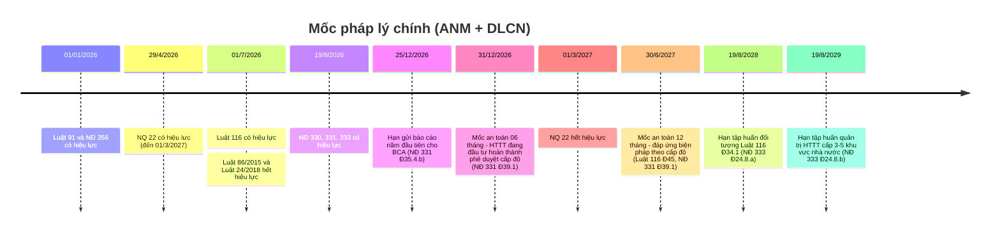
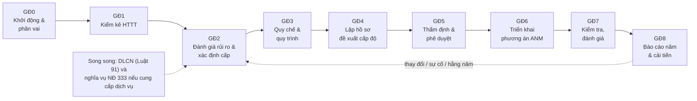

# Lộ trình tuân thủ

> **Căn cứ:** Luật 116/2025/QH15 Đ11.1.b, Đ44, Đ45; NĐ 331/2026/NĐ-CP Đ9.2.e, Đ10, Đ18–Đ24, Đ30.6–30.7, Đ31, Đ35, Đ38, Đ39; NĐ 333/2026/NĐ-CP Đ8.5.b, Đ24.8, Đ30; NĐ 330/2026/NĐ-CP Đ80; Luật 91/2025/QH15 Đ21–Đ23, Đ38; NĐ 356/2025/NĐ-CP Đ18–Đ20, Đ41, Đ42; NQ 22/2026/NQ-CP Đ4, Đ6 · **Đối chiếu văn bản gốc:** 24/09/2026 · **Trạng thái:** Bản khung v0.1

Tài liệu gồm hai phần: (A) **các mốc pháp lý** bắt buộc, có điều khoản; (B) **lộ trình triển khai đề xuất** cho một tổ chức mới bắt đầu. Phần B là khuyến nghị thực hành, thời lượng các giai đoạn là ước tính, không phải quy định.

---

## A. Các mốc pháp lý

### A.1. Mốc một lần

| Mốc | Sự kiện | Ai phải làm gì | Căn cứ |
|---|---|---|---|
| **01/01/2026** | Luật 91/2025 và NĐ 356/2025 có hiệu lực; NĐ 13/2023 hết hiệu lực | Bên kiểm soát/xử lý DLCN áp dụng quy định mới (đánh giá tác động, chuyển xuyên biên giới, nhân sự BVDLCN, thông báo vi phạm) | Luật 91 Đ38.1; NĐ 356 Đ42.1–42.2 |
| **29/4/2026** | NQ 22/2026 có hiệu lực (đến hết 01/3/2027) | Nộp hồ sơ đánh giá tác động DLCN theo thủ tục phân cấp: BCA tiếp nhận, chuyển Công an tỉnh xử lý | NQ 22 Đ6.1, Phụ lục I.7 mục B |
| **01/7/2026** | Luật 116/2025 có hiệu lực; Luật 86/2015 và Luật 24/2018 hết hiệu lực | Mọi chủ quản HTTT, doanh nghiệp cung cấp dịch vụ trên không gian mạng | Luật 116 Đ44 |
| **19/8/2026** | NĐ 330, NĐ 331, NĐ 333 có hiệu lực | Xác định cấp độ theo NĐ 331; nghĩa vụ NĐ 333; mức phạt NĐ 330 áp dụng cho hành vi từ ngày này | NĐ 331 Đ38; NĐ 333 Đ30; NĐ 330 Đ80, Đ81.1 |
| **06 tháng kể từ 01/7/2026** (mốc an toàn: **31/12/2026**) | HTTT **đang đầu tư, xây dựng trước 01/7/2026** phải hoàn thành thẩm định, phê duyệt cấp độ theo NĐ 85/2016 | Chủ đầu tư, chủ quản HTTT | NĐ 331 Đ39.1 câu 1 |
| **Trước 15/01/2027** (và hằng năm) | Bộ Công an cập nhật, công bố danh mục HTTT theo loại hình | Chủ quản rà lại phân loại HTTT của mình khi danh mục được công bố | NĐ 331 Đ9.2.e |
| **01/3/2027** | NQ 22 hết hiệu lực; hạn Bộ Công an trình văn bản/ban hành thông tư thay thế | Theo dõi thủ tục DLCN mới | NQ 22 Đ4.1.b–c, Đ6.1 |
| **12 tháng kể từ 01/7/2026** (mốc an toàn: **30/6/2027**) | (1) HTTT **đã có cấp độ theo Luật 86/2015** giữ cấp độ nhưng phải đáp ứng điều kiện, tiêu chuẩn, biện pháp ANM tương ứng theo Luật 116. (2) HTTT đang đầu tư trước 01/7/2026 phải bảo đảm biện pháp theo NĐ 331. (3) Sản phẩm, giải pháp ATTT mạng đã đưa vào sử dụng phải đáp ứng điều kiện ANM | Chủ quản HTTT, đơn vị vận hành | Luật 116 Đ45.1, Đ45.3; NĐ 331 Đ39.1 câu 2 |
| **24 tháng kể từ 19/8/2026** (19/8/2028) | Cơ quan, tổ chức, DNNN rà soát, tổ chức tập huấn cho người thuộc lực lượng bảo vệ ANM tại Luật 116 Đ34.1 | Bộ, ngành, UBND tỉnh, cơ quan quản lý HTTT quan trọng ANQG, DNNN | NĐ 333 Đ24.8.a |
| **36 tháng kể từ 19/8/2026** (19/8/2029) | Chủ quản HTTT cấp 3–5 **trong cơ quan, tổ chức, doanh nghiệp Nhà nước** tổ chức tập huấn cho người trực tiếp quản trị, vận hành | Chủ quản HTTT cấp 3–5 khu vực nhà nước (doanh nghiệp tư nhân: xem vùng chưa rõ tại [nd-333](../05-nghia-vu-lien-quan/nd-333-nghia-vu-doanh-nghiep.md)) | Luật 116 Đ34.2; NĐ 333 Đ24.8.b |
| **05 năm kể từ 01/01/2026** (mốc an toàn: **31/12/2030**) | Hết thời gian doanh nghiệp nhỏ, khởi nghiệp được **lựa chọn** không thực hiện đánh giá tác động DLCN, cập nhật hồ sơ, chỉ định nhân sự BVDLCN | DN nhỏ, khởi nghiệp (trừ trường hợp loại trừ) | Luật 91 Đ38.2; NĐ 356 Đ41.1 |

> **Cách tính mốc:** văn bản chỉ ghi "trong thời hạn X tháng kể từ ngày...". Bộ khung đề xuất lấy **mốc an toàn** (ngày cuối của tháng trước ngày tương ứng) để lập kế hoạch. Nếu cần xác định chính xác ngày hết hạn cho mục đích pháp lý, **[CẦN ĐỐI CHIẾU]** quy tắc tính thời hạn của Bộ luật Dân sự (không có trong bộ nguồn).

> **Lưu ý khoảng trống chuyển tiếp:** Luật 116 Đ45.1 chỉ áp dụng cho HTTT **đã được xác định cấp độ** theo Luật 86/2015; NĐ 331 Đ39.1 chỉ áp dụng cho HTTT **đang đầu tư, xây dựng** trước 01/7/2026. HTTT **đang vận hành nhưng chưa từng được xác định cấp độ** không có điều khoản chuyển tiếp riêng → áp dụng ngay trình tự NĐ 331 Đ20 từ 19/8/2026. **[CẦN ĐỐI CHIẾU]** hướng dẫn của Bộ Công an nếu có.

### A.2. Mốc định kỳ và mốc theo sự kiện

| Loại | Mốc/thời hạn | Nội dung | Căn cứ |
|---|---|---|---|
| **Báo cáo năm** | Kỳ số liệu **15/12 năm trước → 14/12 năm báo cáo** | Chốt số liệu | NĐ 331 Đ35.3 |
| | **Trước 20/12** hằng năm | Đơn vị chuyên trách ANM, đơn vị vận hành gửi báo cáo cho chủ quản HTTT | NĐ 331 Đ35.4.a |
| | **Trước 25/12** hằng năm | Chủ quản HTTT gửi báo cáo Bộ Công an (Mẫu 08) | NĐ 331 Đ35.4.b |
| | Đột xuất | Theo đề nghị của cơ quan có thẩm quyền | NĐ 331 Đ35.2.b |
| **HTTT quan trọng về ANQG** | **Trước 01/10** hằng năm | Thông báo bằng văn bản kết quả tự kiểm tra ANM định kỳ cho lực lượng chuyên trách | Luật 116 Đ11.1.b ("trước tháng 10"); NĐ 333 Đ8.5.b ("trước ngày 01 tháng 10") |
| **Sự cố ANM** | **24 giờ** kể từ khi phát hiện | Thông báo ban đầu sự cố ANM **nghiêm trọng** | NĐ 331 Đ31.2.d |
| | **72 giờ** kể từ khi phát hiện | Báo cáo nguyên nhân, phạm vi ảnh hưởng, biện pháp khắc phục; sự cố phức tạp: báo cáo sơ bộ rồi báo cáo cập nhật, báo cáo kết thúc | NĐ 331 Đ31.2.d |
| | **Ngay khi phát hiện** | Sự cố có dấu hiệu xâm phạm ANQG, TTATXH hoặc gây gián đoạn nghiêm trọng | NĐ 331 Đ31.2.d; Luật 116 Đ41.3 (DN cung cấp dịch vụ: "báo cáo ngay") |
| **Vi phạm DLCN** | **72 giờ** kể từ khi phát hiện | Thông báo cơ quan chuyên trách BVDLCN (vi phạm có thể gây tổn hại ANQG, TTATXH hoặc tính mạng, sức khỏe, danh dự, tài sản của chủ thể) | Luật 91 Đ23.1 |
| | **72 giờ** | Thông báo chủ thể dữ liệu khi sự cố liên quan dữ liệu vị trí, sinh trắc học | NĐ 356 Đ29.1.a |
| **Đánh giá tác động DLCN** | **60 ngày** kể từ ngày đầu tiên xử lý / chuyển xuyên biên giới | Nộp 01 bản chính hồ sơ | Luật 91 Đ20.2, Đ21.1; NĐ 356 Đ18.4, Đ19.4 |
| | Định kỳ **06 tháng** khi có thay đổi; **10 ngày** với thay đổi phải cập nhật ngay | Cập nhật hồ sơ | Luật 91 Đ22; NĐ 356 Đ20 |
| **Yêu cầu của lực lượng chuyên trách** (DN cung cấp dịch vụ) | **24 giờ** (khẩn cấp **03 giờ**) | Cung cấp thông tin người dùng | Luật 116 Đ25.2.a; NĐ 333 Đ16.3.c |
| | **24 giờ** (khẩn cấp **06 giờ**) | Ngăn chặn, xóa bỏ thông tin, gỡ dịch vụ, ứng dụng vi phạm | Luật 116 Đ25.2.b; NĐ 333 Đ16.4.b |
| **Thẩm định/phê duyệt cấp độ** | 05 ngày làm việc (phản hồi hồ sơ chưa hợp lệ); 15 ngày làm việc (thẩm định cấp 3); 25 ngày làm việc (thẩm định cấp 4–5); 07 ngày làm việc (phê duyệt) | Thời hạn xử lý của đơn vị thẩm định/phê duyệt | NĐ 331 Đ23.2, Đ23.3, Đ24.2 |

### A.3. Dòng thời gian tổng hợp

> **Báo cáo năm 2026:** NĐ 331 có hiệu lực 19/8/2026, kỳ số liệu 15/12/2025 – 14/12/2026 bắt đầu trước ngày hiệu lực. Văn bản không có quy định riêng cho kỳ đầu tiên → **[CẦN ĐỐI CHIẾU]** hướng dẫn của Bộ Công an. Khuyến nghị: vẫn lập và gửi báo cáo trước 25/12/2026, số liệu tính đến 14/12/2026. Hướng dẫn lập: [../06-kiem-tra-bao-cao/bao-cao-nam-mau-08.md](../06-kiem-tra-bao-cao/bao-cao-nam-mau-08.md).

---

## B. Lộ trình triển khai đề xuất cho tổ chức mới bắt đầu

### B.1. Tổng quan giai đoạn

Thứ tự bắt buộc về logic pháp lý: **Quy chế bảo đảm ANM phải được phê duyệt, ban hành trước khi Hồ sơ đề xuất cấp độ được phê duyệt** (NĐ 331 Đ30.7); HTTT xây mới/nâng cấp phải **triển khai đầy đủ phương án đã phê duyệt trước khi đưa vào vận hành** (NĐ 331 Đ30.6).

### B.2. Chi tiết từng giai đoạn

| GĐ | Thời lượng ước tính | Việc chính | Đầu ra | Căn cứ | Tài liệu khung |
|---|---|---|---|---|---|
| **0. Khởi động, phân vai** | 1–2 tuần | Xác định chủ quản HTTT (với doanh nghiệp: cấp có thẩm quyền quyết định đầu tư); ủy quyền bằng văn bản nếu cần; chỉ định đơn vị/bộ phận chuyên trách ANM; giao đơn vị vận hành; xử lý xung đột vai trò khi chuyên trách ANM kiêm vận hành | QĐ xác định chủ quản/ủy quyền; QĐ chỉ định chuyên trách ANM; QĐ giao đơn vị vận hành; (nếu cần) QĐ thành lập Hội đồng thẩm định độc lập | NĐ 331 Đ3.2–3.3, Đ4.2–4.3, Đ5, Đ18.4, Đ31.1 | [`../04-chinh-sach-quy-trinh/`](../04-chinh-sach-quy-trinh/README.md) mục 1, văn bản (1)–(4) |
| **1. Kiểm kê HTTT** | 2–4 tuần | Lập danh mục HTTT; xác định phạm vi từng HTTT theo chức năng, dòng dữ liệu, phụ thuộc vận hành, phạm vi ảnh hưởng; không chia/gộp hình thức; phân loại thông tin (công cộng/riêng/cá nhân/bí mật nhà nước) và loại hình HTTT; đếm số chủ thể DLCN cơ bản/nhạy cảm | Danh mục HTTT + phiếu xác định cho từng hệ thống | NĐ 331 Đ7, Đ8, Đ9; NĐ 356 Đ3–Đ4 | [`../01-xac-dinh-cap-do/`](../01-xac-dinh-cap-do/README.md) (phiếu xác định, cây quyết định) |
| **2. Đánh giá rủi ro, xác định cấp** | 2–4 tuần (chồng lấn GĐ1) | Đánh giá rủi ro ANM lần đầu với nội dung tối thiểu 7 yếu tố; đối chiếu tiêu chí Đ11–Đ16, lấy cấp cao nhất; nếu rủi ro cao hơn cấp tiêu chí → đề xuất cấp cao hơn; rà soát dấu hiệu HTTT quan trọng về ANQG | Báo cáo đánh giá rủi ro (lưu hồ sơ); đề xuất cấp cho từng HTTT | NĐ 331 Đ8.2, Đ10.2.a, Đ10.3, Đ10.5, Đ10.6, Đ11–Đ17. Phương pháp chi tiết: chờ hướng dẫn của Bộ Công an (NĐ 331 Đ10.8) | [`../01-xac-dinh-cap-do/tieu-chi-cap-do.md`](../01-xac-dinh-cap-do/tieu-chi-cap-do.md); [`../04-chinh-sach-quy-trinh/quy-trinh-quan-ly-rui-ro.md`](../04-chinh-sach-quy-trinh/quy-trinh-quan-ly-rui-ro.md) |
| **3. Quy chế, quy trình** | 3–6 tuần | Xây dựng Quy chế bảo đảm ANM đáp ứng yêu cầu quản lý theo cấp (7 nhóm: chính sách, tổ chức, nhân lực, thiết kế–xây dựng, vận hành, rủi ro, kết thúc vận hành); quy trình sự cố, rủi ro, nhà cung cấp, tiếp nhận yêu cầu cơ quan chức năng | QĐ ban hành Quy chế + phụ lục quy trình | NĐ 331 Đ28.1, Đ30.3, Đ30.7; Luật 116 Đ10.2.a | [`../04-chinh-sach-quy-trinh/quy-che-bao-dam-anm.md`](../04-chinh-sach-quy-trinh/quy-che-bao-dam-anm.md) |
| **4. Lập hồ sơ đề xuất cấp độ** | 3–6 tuần | Đơn vị vận hành lập hồ sơ: thuyết minh tổng quan, tài liệu thiết kế, thuyết minh đề xuất cấp độ, thuyết minh phương án ANM theo cấp (đối chiếu TCVN 14423:2026), ý kiến chuyên môn của chuyên trách ANM (cấp 4–5) | Hồ sơ theo NĐ 331 Đ21, Đ22 | NĐ 331 Đ20.1, Đ21, Đ22, Đ29, Đ30 | [`../02-ho-so-cap-do/`](../02-ho-so-cap-do/); [`../03-yeu-cau-theo-cap-do/`](../03-yeu-cau-theo-cap-do/) |
| **5. Thẩm định, phê duyệt** | Cấp 1–2: nội bộ; cấp 3: thẩm định ≤ 15 ngày làm việc + phê duyệt ≤ 07 ngày làm việc; cấp 4–5: thẩm định ≤ 25 ngày làm việc (BCA/BQP/BCY) | Cấp 1–2: chuyên trách ANM thẩm định, phê duyệt, báo cáo chủ quản; cấp 3: chuyên trách ANM thẩm định, chủ quản phê duyệt; cấp 4: BCA thẩm định, chủ quản phê duyệt; cấp 5: TTg phê duyệt Danh mục, chủ quản phê duyệt phương án | Ý kiến thẩm định (Mẫu 04); QĐ phê duyệt cấp độ (Mẫu 06) / phương án (Mẫu 07) | NĐ 331 Đ18, Đ20.2–20.4, Đ23, Đ24 | [`../01-xac-dinh-cap-do/tham-quyen-trinh-tu.md`](../01-xac-dinh-cap-do/tham-quyen-trinh-tu.md); [`../02-ho-so-cap-do/`](../02-ho-so-cap-do/) |
| **6. Triển khai phương án ANM** | Theo khoảng thiếu hụt; mục tiêu hoàn tất trong mốc 12 tháng (A.1) | Thực hiện biện pháp quản lý, kỹ thuật theo phương án đã duyệt; kết nối giám sát ANM; đánh giá điều kiện ANM trước khi đưa HTTT mới vào vận hành; lập kế hoạch/lộ trình cho hạng mục chưa đáp ứng | Hồ sơ triển khai, biên bản nghiệm thu, kế hoạch khắc phục | NĐ 331 Đ28.3–28.4, Đ30.6, Đ30.8–30.9, Đ33.1; Luật 116 Đ40.1.b | [`../04-chinh-sach-quy-trinh/quy-trinh-danh-gia-truoc-van-hanh.md`](../04-chinh-sach-quy-trinh/quy-trinh-danh-gia-truoc-van-hanh.md) |
| **7. Kiểm tra, đánh giá** | Theo kế hoạch năm; tần suất theo cấp và rủi ro | Kiểm tra tuân thủ, hiệu quả, dò quét/kiểm thử xâm nhập; tự đánh giá do bộ phận độc lập với vận hành hoặc tổ chức chuyên môn khi bắt buộc | Báo cáo kết quả kiểm tra, kế hoạch khắc phục | NĐ 331 Đ27, Đ28.5, Đ31.2.c, Đ32.5, Đ33.3 | [../06-kiem-tra-bao-cao/kiem-tra-danh-gia-dinh-ky.md](../06-kiem-tra-bao-cao/kiem-tra-danh-gia-dinh-ky.md) |
| **8. Báo cáo năm, cải tiến** | Tháng 11–12 hằng năm | Tổng hợp số liệu 15/12–14/12; nội bộ trước 20/12; gửi BCA trước 25/12; rà soát lại rủi ro, cấp độ khi có thay đổi | Báo cáo Mẫu 08 | NĐ 331 Đ10.2.b–đ, Đ25, Đ35, Đ36 | [../06-kiem-tra-bao-cao/bao-cao-nam-mau-08.md](../06-kiem-tra-bao-cao/bao-cao-nam-mau-08.md) |
| **Song song — DLCN** | Trong 60 ngày kể từ ngày bắt đầu xử lý | Chỉ định nhân sự/bộ phận BVDLCN; lập, nộp hồ sơ đánh giá tác động (và chuyển xuyên biên giới nếu có); quy trình thông báo vi phạm 72 giờ | Hồ sơ DPIA, hồ sơ chuyển xuyên biên giới, QĐ chỉ định | Luật 91 Đ20–Đ23, Đ33.2, Đ38; NĐ 356 Đ13, Đ17–Đ20, Đ28 | [../05-nghia-vu-lien-quan/dlcn-giao-thoa-anm.md](../05-nghia-vu-lien-quan/dlcn-giao-thoa-anm.md) |
| **Song song — NĐ 333** (nếu cung cấp dịch vụ trên mạng viễn thông, Internet, dịch vụ gia tăng tại VN) | Trước khi cung cấp dịch vụ | Xác thực tài khoản, quy trình 24h/03h/06h, nhật ký ≥ 12 tháng, lưu trữ dữ liệu tại Việt Nam | Quy trình tiếp nhận yêu cầu; cấu hình log; hồ sơ lưu trữ dữ liệu | Luật 116 Đ25.2–25.3, Đ41; NĐ 333 Đ16, Đ19, Đ20 | [../05-nghia-vu-lien-quan/nd-333-nghia-vu-doanh-nghiep.md](../05-nghia-vu-lien-quan/nd-333-nghia-vu-doanh-nghiep.md) |

### B.3. Checklist khởi động (90 ngày đầu)

- [ ] Có văn bản xác định chủ quản HTTT và (nếu có) văn bản ủy quyền nêu rõ phạm vi, trách nhiệm, thời hạn (NĐ 331 Đ4.2–4.3).
- [ ] Có quyết định chỉ định đơn vị/bộ phận chuyên trách ANM (NĐ 331 Đ31.1.b–c).
- [ ] Mỗi HTTT có đơn vị vận hành; hợp đồng thuê dịch vụ quy định rõ trách nhiệm quản trị dữ liệu, kiểm soát truy cập, bảo đảm ANM (NĐ 331 Đ5.3.a).
- [ ] Danh mục HTTT đã lập, mỗi HTTT có phiếu xác định cấp độ và báo cáo đánh giá rủi ro lần đầu (NĐ 331 Đ10.2.a, Đ10.6).
- [ ] Đã xác định HTTT nào thuộc diện chuyển tiếp (Luật 116 Đ45.1; NĐ 331 Đ39.1) và mốc hoàn thành tương ứng.
- [ ] Quy chế bảo đảm ANM đã được ban hành trước khi trình phê duyệt hồ sơ cấp độ (NĐ 331 Đ30.7).
- [ ] Đầu mối tiếp nhận và báo cáo sự cố 24h/72h đã được chỉ định (NĐ 331 Đ31.2.d).
- [ ] Đã chỉ định nhân sự BVDLCN hoặc ghi nhận căn cứ miễn trừ (Luật 91 Đ33.2, Đ38.2–3; NĐ 356 Đ41).
- [ ] Đã lập lịch báo cáo năm: chốt 14/12, nội bộ 20/12, BCA 25/12 (NĐ 331 Đ35).
- [ ] Đã lập danh mục hồ sơ, bằng chứng cần lưu: [../06-kiem-tra-bao-cao/ho-so-luu-tru-bang-chung.md](../06-kiem-tra-bao-cao/ho-so-luu-tru-bang-chung.md).
