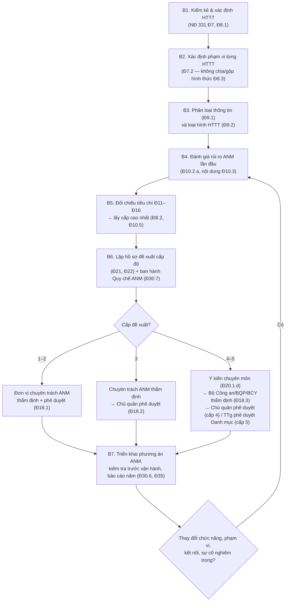

# 01 — Xác định cấp độ hệ thống thông tin

> **Căn cứ:** Luật An ninh mạng 116/2025/QH15 Đ8, Đ9, Đ45; NĐ 331/2026/NĐ-CP Đ2–Đ25, Đ37, Đ39 · **Đối chiếu văn bản gốc:** 24/09/2026 · **Trạng thái:** Bản khung v0.1

Thư mục này giúp chủ quản hệ thống thông tin (HTTT) và đơn vị vận hành trả lời ba câu hỏi: **hệ thống nào**, **cấp độ mấy**, **ai thẩm định/phê duyệt trong bao lâu**. Hồ sơ đề xuất cấp độ (Mẫu 01–08 và các thuyết minh) nằm ở [`../02-ho-so-cap-do/`](../02-ho-so-cap-do/README.md).

## Mục lục

| File | Nội dung | Dùng khi |
|---|---|---|
| [tieu-chi-cap-do.md](tieu-chi-cap-do.md) | Bảng tiêu chí cấp 1–5 (NĐ 331 Đ11–Đ15) theo loại HTTT (Đ9.2), tiêu chí HTTT quan trọng về ANQG (Đ16), nguyên tắc Đ7–Đ8, mức tổn hại Luật 116 Đ8.1, các vùng xám | Tra cứu tiêu chí, lập luận căn cứ đề xuất |
| [cay-quyet-dinh.md](cay-quyet-dinh.md) | Cây quyết định (mermaid) + bảng câu hỏi có/không | Phân loại nhanh từng hệ thống |
| [phieu-xac-dinh-cap-do.md](phieu-xac-dinh-cap-do.md) | Phiếu làm việc điền cho từng hệ thống | Kiểm kê, lưu vết lập luận, làm đầu vào cho thuyết minh đề xuất cấp độ |
| [tham-quyen-trinh-tu.md](tham-quyen-trinh-tu.md) | Thẩm quyền thẩm định/phê duyệt, trình tự, thời hạn, dự án mới/thuê dịch vụ, xác định lại, chuyển tiếp | Lập kế hoạch nộp hồ sơ |

## Quy trình tổng quát (1 trang)

Tóm tắt từng bước:

1. **Kiểm kê HTTT** — mỗi HTTT phải có chức năng nghiệp vụ rõ ràng, xử lý dữ liệu, người dùng/đối tượng phục vụ cụ thể, đầu ra là thông tin/dữ liệu (NĐ 331 Đ7.1); chỉ có một chủ quản và thuộc một loại hình tại Đ9.2 (Đ8.1).
2. **Xác định phạm vi** theo chức năng nghiệp vụ, dòng dữ liệu, mức phụ thuộc vận hành, phạm vi ảnh hưởng sự cố (Đ7.2.a); phản ánh bản chất vận hành thực tế (Đ7.2.b); không phân tách/hợp nhất hình thức để hạ cấp (Đ8.3).
3. **Phân loại thông tin** (công cộng / riêng / cá nhân / bí mật nhà nước — Đ9.1) và **loại hình HTTT** (nội bộ / phục vụ người dân–doanh nghiệp / cơ sở hạ tầng thông tin / điều khiển công nghiệp / khác — Đ9.2).
4. **Đánh giá rủi ro ANM** khi xác định cấp độ lần đầu là bắt buộc (Đ10.2.a); nội dung tối thiểu Đ10.3. Phương pháp chi tiết: chờ hướng dẫn của Bộ Công an (NĐ 331 Đ10.8).
5. **Đối chiếu tiêu chí** Đ11–Đ15 (và Đ16 nếu có dấu hiệu quan trọng về ANQG); đáp ứng nhiều tiêu chí → áp dụng cấp cao nhất (Đ8.2); rủi ro cao hơn cấp đã xác định → đề xuất cấp cao hơn (Đ10.5).
6. **Lập hồ sơ** theo Đ21–Đ22; Quy chế bảo đảm ANM phải được ban hành **trước khi** hồ sơ được phê duyệt (Đ30.7).
7. **Thẩm định, phê duyệt** theo cấp (Đ18, Đ20, Đ23, Đ24); sau đó triển khai đầy đủ phương án trước khi đưa vào vận hành (Đ30.6) và báo cáo định kỳ (Đ35, Mẫu 08).

## Lưu ý nhanh

- Phạm vi áp dụng bắt buộc của NĐ 331 là HTTT phục vụ hoạt động của cơ quan, tổ chức nhà nước và HTTT cung cấp dịch vụ trực tuyến phục vụ người dân, doanh nghiệp; tổ chức khác được **khuyến khích** áp dụng (NĐ 331 Đ2). Xem phân tích vùng xám tại [tieu-chi-cap-do.md mục 6](tieu-chi-cap-do.md).
- Không xây dựng hồ sơ đề xuất cấp độ cho cấp 3–5, hoặc đưa HTTT cấp 3–5 vào vận hành khi chưa được phê duyệt cấp độ: phạt 20–30 triệu đồng (NĐ 330 Đ23.1.b, c); không lập hồ sơ/không tổ chức thẩm định, phê duyệt: 20–30 triệu đồng (NĐ 330 Đ24.1). Mức này áp dụng cho cá nhân; tổ chức bị phạt gấp hai lần (NĐ 330 Đ7.1). Chi tiết: `../05-nghia-vu-lien-quan/`.
- Tài liệu này là khung tham khảo, không thay thế ý kiến của cơ quan có thẩm quyền.
