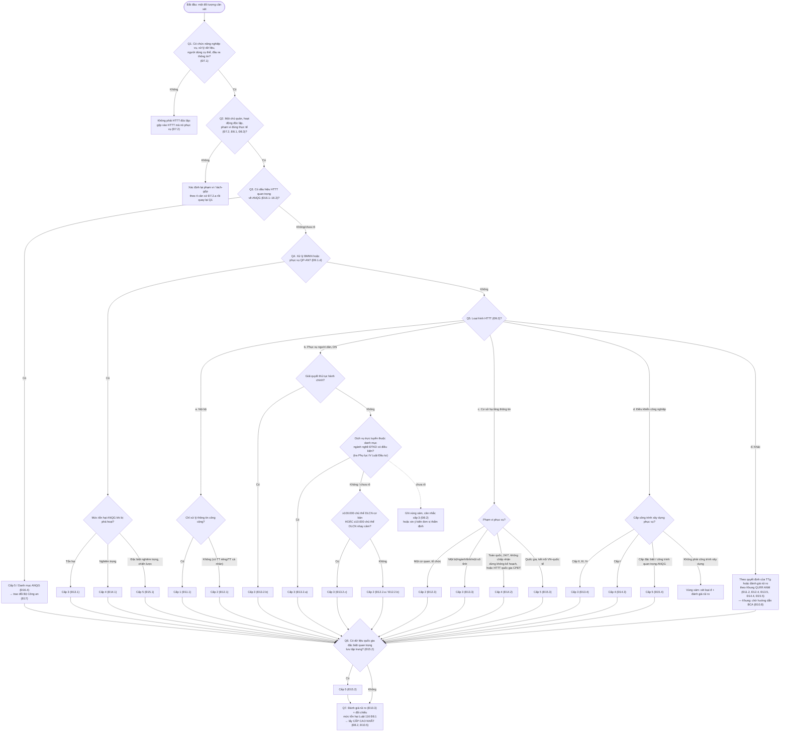

# Cây quyết định xác định cấp độ HTTT

> **Căn cứ:** NĐ 331/2026/NĐ-CP Đ2, Đ7–Đ16; Luật 116/2025/QH15 Đ8.1, Đ9 · **Đối chiếu văn bản gốc:** 24/09/2026 · **Trạng thái:** Bản khung v0.1

Dùng để phân loại nhanh. Kết quả cây là **cấp đề xuất sơ bộ**; phải hoàn thiện bằng [phiếu xác định cấp độ](phieu-xac-dinh-cap-do.md) và đánh giá rủi ro (NĐ 331 Đ10.2.a). Giải thích tiêu chí và vùng xám: [tieu-chi-cap-do.md](tieu-chi-cap-do.md).

Quy tắc chung: đi hết **tất cả** các nhánh khớp, ghi lại mọi cấp tìm được, rồi **lấy cấp cao nhất** (NĐ 331 Đ8.2). Nếu đánh giá rủi ro cho thấy cao hơn → nâng cấp (Đ10.5).

## 1. Sơ đồ

> Một HTTT có thể đồng thời thuộc nhiều nhánh (ví dụ: vừa là loại b vừa xử lý BMNN). Đi qua mọi nhánh khớp rồi mới chốt ở Q7.

## 2. Bảng câu hỏi có/không

Điền cho từng hệ thống. Cột "Nếu CÓ" cho biết cấp tối thiểu hoặc hành động tiếp theo.

| # | Câu hỏi | Căn cứ | Có/Không | Nếu CÓ | Bằng chứng cần lưu |
|---|---|---|---|---|---|
| Q1.1 | Có chức năng nghiệp vụ rõ ràng? | NĐ 331 Đ7.1 | ☐/☐ | Tiếp tục | Mô tả chức năng |
| Q1.2 | Có xử lý dữ liệu? | Đ7.1 | ☐/☐ | Tiếp tục | Sơ đồ luồng dữ liệu |
| Q1.3 | Có người dùng/đối tượng phục vụ cụ thể? | Đ7.1 | ☐/☐ | Tiếp tục | Danh sách nhóm người dùng |
| Q1.4 | Có đầu ra là thông tin, dữ liệu phục vụ quản lý, điều hành, giao dịch, dịch vụ? | Đ7.1 | ☐/☐ | Tiếp tục | — |
| Q2.1 | Chỉ có một chủ quản? | Đ8.1.a | ☐/☐ | Tiếp tục; nếu KHÔNG → tách theo chủ quản | Quyết định đầu tư / văn bản giao |
| Q2.2 | Phạm vi đã xét đủ 4 căn cứ Đ7.2.a và liên thông (Đ7.2.b)? | Đ7.2 | ☐/☐ | Tiếp tục | Biên bản xác định phạm vi |
| Q2.3 | Có tách/gộp nào nhằm hạ cấp độ? | Đ8.3 | ☐/☐ | **Dừng**, xác định lại phạm vi | — |
| Q3 | Có dấu hiệu một trong các tiêu chí Đ16.1–Đ16.3? | Đ16; Luật 116 Đ9.2 | ☐/☐ | Cấp 5 / hồ sơ Danh mục (Đ17) | Phân tích hậu quả |
| Q4.1 | Xử lý thông tin BMNN? | Đ9.1.d | ☐/☐ | ≥ Cấp 3 (Đ13.1–Đ15.1 theo mức tổn hại ANQG) | Văn bản xác định độ mật |
| Q4.2 | Phục vụ quốc phòng, an ninh? | Đ13.1–Đ15.1 | ☐/☐ | ≥ Cấp 3 | — |
| Q5.a1 | Chỉ phục vụ nội bộ? | Đ9.2.a | ☐/☐ | Xét Q5.a2 | — |
| Q5.a2 | Chỉ xử lý thông tin công cộng (không có tài khoản, dữ liệu riêng, cá nhân)? | Đ11.1 | ☐/☐ | Cấp 1; nếu KHÔNG → Cấp 2 (Đ12.1) | Danh mục dữ liệu |
| Q5.b1 | Trực tiếp/hỗ trợ cung cấp dịch vụ trực tuyến cho tổ chức, cá nhân? | Đ9.2.b, Đ3.5 | ☐/☐ | ≥ Cấp 2 | Mô tả dịch vụ |
| Q5.b2 | Giải quyết thủ tục hành chính? | Đ13.2.b | ☐/☐ | Cấp 3 | — |
| Q5.b3 | Dịch vụ trực tuyến thuộc danh mục ngành, nghề ĐTKD có điều kiện? | Đ13.2.a; Phụ lục IV Luật Đầu tư **[CẦN ĐỐI CHIẾU]** | ☐/☐ | Cấp 3 | Bản tra cứu danh mục, số thứ tự |
| Q5.b4 | ≥ 100.000 chủ thể DLCN cơ bản? | Đ13.2.c; NĐ 356 Đ3 | ☐/☐ | Cấp 3 | Truy vấn đếm |
| Q5.b5 | ≥ 10.000 chủ thể DLCN nhạy cảm? | Đ13.2.c; NĐ 356 Đ4 | ☐/☐ | Cấp 3 | Truy vấn đếm |
| Q5.c1 | Là CSHTTT phục vụ chung nhiều cơ quan, tổ chức (WAN, CSDL, TTDL, cloud, xác thực/chứng thực, chữ ký số, liên thông)? | Đ9.2.c | ☐/☐ | Xét Q5.c2–c4; nếu chỉ một tổ chức → Cấp 2 (Đ12.3) | Danh sách đơn vị sử dụng |
| Q5.c2 | Phục vụ trong phạm vi một bộ/ngành/tỉnh/một số tỉnh? | Đ13.3 | ☐/☐ | Cấp 3 | — |
| Q5.c3 | Toàn quốc, yêu cầu 24/7, không chấp nhận ngừng không kế hoạch (hoặc HTTT quốc gia phục vụ CPĐT)? | Đ14.2 | ☐/☐ | Cấp 4 | Thuyết minh 24/7 (Đ22.5.d) |
| Q5.c4 | CSHTTT quốc gia kết nối liên thông VN–quốc tế? | Đ15.3 | ☐/☐ | Cấp 5 | — |
| Q5.d1 | ICS phục vụ công trình xây dựng cấp II/III/IV? | Đ13.4 | ☐/☐ | Cấp 3 | Quyết định phân cấp công trình |
| Q5.d2 | ICS phục vụ công trình cấp I? | Đ14.3 | ☐/☐ | Cấp 4 | nt |
| Q5.d3 | ICS phục vụ công trình cấp đặc biệt/quan trọng liên quan ANQG? | Đ15.4 | ☐/☐ | Cấp 5 | nt |
| Q5.đ | Không thuộc a–d? | Đ9.2.đ | ☐/☐ | Theo quyết định TTg / đánh giá rủi ro (Khung QLRR — chờ hướng dẫn BCA, Đ10.8) | Báo cáo đánh giá rủi ro |
| Q6 | Lưu trữ tập trung dữ liệu đặc biệt quan trọng của quốc gia? | Đ15.2 | ☐/☐ | Cấp 5 | — |
| Q7.1 | Đánh giá rủi ro cho thấy mức tổn hại (Luật 116 Đ8.1) cao hơn cấp tìm được? | NĐ 331 Đ10.5 | ☐/☐ | Nâng lên cấp tương ứng | Báo cáo đánh giá rủi ro |
| Q7.2 | Cấp cao nhất trong các câu trả lời CÓ là: ___ | Đ8.2 | — | = **Cấp đề xuất** | Phiếu đã ký |

## 3. Ví dụ minh họa (giả định, không gắn với tổ chức cụ thể)

| Hệ thống giả định | Nhánh khớp | Cấp đề xuất sơ bộ | Lưu ý |
|---|---|---|---|
| Website giới thiệu tĩnh, không đăng nhập, không form thu thập | Vùng xám: không "chỉ phục vụ nội bộ" (Đ9.2.a) nhưng cũng khó coi là "dịch vụ trực tuyến" (Đ3.5, Đ9.2.b); chỉ xử lý thông tin công cộng | 1 hoặc 2 — ghi rõ lập luận | Có form liên hệ/đăng ký thu thập TTCN → xét theo loại b, tối thiểu cấp 2 |
| Email/HRM nội bộ | a + có TTCN nhân viên | 2 (Đ12.1) | — |
| Sàn TMĐT 300.000 tài khoản khách hàng | b + ≥ 100.000 chủ thể | 3 (Đ13.2.c) | Kiểm tra thêm Đ13.2.a |
| Ứng dụng khám bệnh từ xa 8.000 bệnh nhân (dữ liệu sức khỏe = nhạy cảm) | b; < 10.000 chủ thể nhạy cảm | ≥ 2; kiểm tra Đ13.2.a (dịch vụ y tế có thuộc ngành nghề có điều kiện?) | Tra Phụ lục IV Luật Đầu tư |
| Nền tảng SaaS cho 50 doanh nghiệp, tổng 400.000 hồ sơ khách hàng cuối | b (+ có thể c) | 3 (thận trọng, xem vùng xám 6.3) | Ghi phương pháp đếm |
