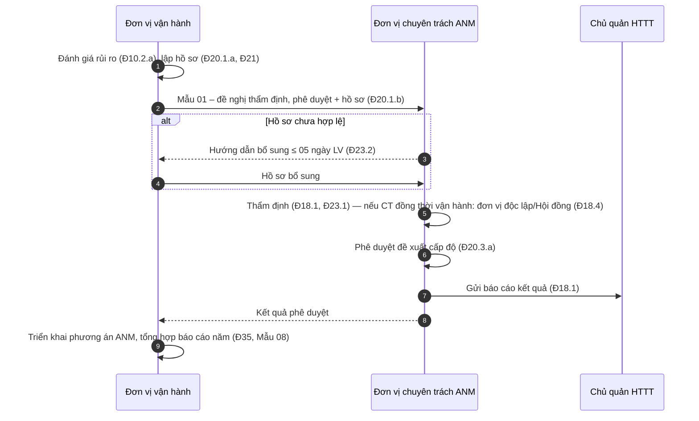
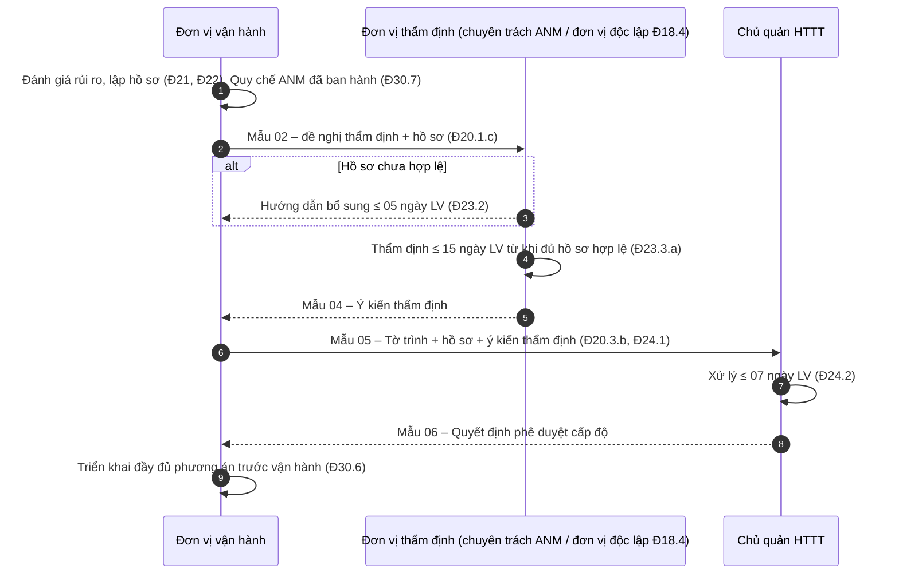
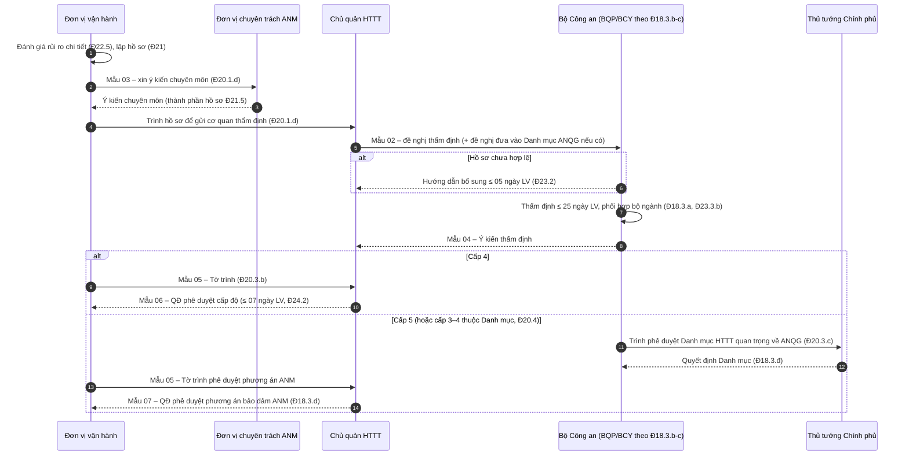

# Thẩm quyền, trình tự, thời hạn xác định cấp độ

> **Căn cứ:** NĐ 331/2026/NĐ-CP Đ10, Đ17–Đ25, Đ30.6, Đ30.7, Đ37, Đ38, Đ39; Luật 116/2025/QH15 Đ44, Đ45; NĐ 333/2026/NĐ-CP Đ5, Đ6; NĐ 330/2026/NĐ-CP Đ23, Đ24 · **Đối chiếu văn bản gốc:** 24/09/2026 · **Trạng thái:** Bản khung v0.1

Biểu mẫu tương ứng từng bước: [../02-ho-so-cap-do/README.md](../02-ho-so-cap-do/README.md).

## 1. Bảng thẩm quyền theo cấp độ

| Cấp đề xuất | Lập hồ sơ | Ý kiến chuyên môn | Thẩm định | Phê duyệt | Căn cứ |
|---|---|---|---|---|---|
| **1, 2** | Đơn vị vận hành | — | Đơn vị chuyên trách ANM của chủ quản | Đơn vị chuyên trách ANM của chủ quản, **gửi báo cáo chủ quản** | NĐ 331 Đ18.1, Đ20.1.a–b, Đ20.3.a |
| **3** | Đơn vị vận hành | — | Đơn vị chuyên trách ANM của chủ quản | **Chủ quản HTTT** (đơn vị vận hành trình) | Đ18.2, Đ20.1.c, Đ20.3.b |
| **4** | Đơn vị vận hành | Đơn vị chuyên trách ANM của chủ quản | **Bộ Công an** chủ trì, phối hợp chủ quản và bộ, ngành liên quan (HTTT quân sự: **Bộ Quốc phòng**; HTTT cơ yếu thuộc Ban Cơ yếu: **Ban Cơ yếu Chính phủ**) | **Chủ quản HTTT** phê duyệt hồ sơ đề xuất cấp độ | Đ18.3.a–d, Đ20.1.d, Đ20.3.b, Đ21.5 |
| **5** | Đơn vị vận hành | Đơn vị chuyên trách ANM của chủ quản | Như cấp 4 | **Thủ tướng** phê duyệt Danh mục HTTT cấp 5 (Danh mục HTTT quan trọng về ANQG) do Bộ Công an trình; **chủ quản** phê duyệt **phương án bảo đảm ANM** | Đ18.3.d–đ, Đ20.3.c |
| **3, 4 thuộc Danh mục ANQG** | Như cấp 5 | Như cấp 5 | Như cấp 5 | Như cấp 5 | Đ20.4 |

Hồ sơ phê duyệt gồm hồ sơ đề xuất cấp độ + ý kiến thẩm định của cơ quan chủ trì thẩm định (bắt buộc với cấp ≥ 3) (NĐ 331 Đ24.1).

### 1.1. Yêu cầu thẩm định độc lập (NĐ 331 Đ18.4)

Khi **đơn vị chuyên trách ANM đồng thời được giao quản lý, vận hành** HTTT (thường gặp ở doanh nghiệp nhỏ: phòng CNTT vừa vận hành vừa làm ANM), việc thẩm định thực hiện theo một trong hai phương án:

| Phương án | Nội dung | Căn cứ | Bằng chứng cần lưu |
|---|---|---|---|
| A | Đơn vị chuyên trách ANM trình chủ quản giao **một đơn vị trực thuộc có đủ năng lực** chủ trì, tổ chức thẩm định | Đ18.4.a | Quyết định giao nhiệm vụ thẩm định |
| B | Đơn vị chuyên trách ANM trình chủ quản **thành lập Hội đồng thẩm định độc lập** | Đ18.4.b | Quyết định thành lập Hội đồng, biên bản họp |

> Gợi ý: nếu chưa có đơn vị chuyên trách ANM độc lập, chủ quản phải chỉ định đơn vị chuyên trách CNTT/chuyển đổi số làm nhiệm vụ này hoặc thành lập/chỉ định bộ phận chuyên trách ANM (NĐ 331 Đ31.1.c). Hoàn thành việc chỉ định **trước** khi nộp hồ sơ. Mẫu quyết định: `../04-chinh-sach-quy-trinh/`.

## 2. Thời hạn

| Bước | Thời hạn tối đa | Tính từ | Áp dụng | Căn cứ |
|---|---|---|---|---|
| Phản hồi, hướng dẫn bổ sung hồ sơ chưa hợp lệ | **05 ngày làm việc** | Ngày nhận hồ sơ | HTTT đề xuất cấp độ (không phân biệt cấp) | NĐ 331 Đ23.2 |
| Thẩm định cấp 3 | **15 ngày làm việc** | Ngày nhận đủ hồ sơ hợp lệ | Cấp 3 | Đ23.3.a |
| Thẩm định cấp 4, 5 | **25 ngày làm việc** | Ngày nhận đủ hồ sơ hợp lệ | Cấp 4, 5 | Đ23.3.b |
| Thẩm định cấp 1, 2 | Không quy định | — | Cấp 1, 2 — nên tự đặt trong quy chế nội bộ | **[CẦN ĐỐI CHIẾU]** Đ23.3 không nêu |
| Xử lý hồ sơ phê duyệt | **07 ngày làm việc** | Ngày nhận đủ hồ sơ hợp lệ | Hồ sơ phê duyệt đề xuất cấp độ | Đ24.2 |
| Thẩm định ANM HTTT quan trọng về ANQG (thủ tục riêng) | 03 ngày LV kiểm tra hợp lệ; 25 ngày LV thẩm định; khảo sát thực tế ≤ 07 ngày LV (không tính vào thời hạn) | Nhận hồ sơ / cấp giấy tiếp nhận | HTTT thuộc Danh mục ANQG | NĐ 333 Đ5.7, Đ5.8 |

**Ước tính tổng thời gian** (chỉ thời hạn pháp định tối đa, chưa tính thời gian lập và bổ sung hồ sơ): cấp 3 ≈ 5 + 15 + 7 = 27 ngày làm việc; cấp 4 ≈ 5 + 25 + 7 = 37 ngày làm việc (chưa tính thời gian xin ý kiến chuyên môn — Đ20.1.d không quy định thời hạn).

## 3. Đánh giá rủi ro ANM bắt buộc khi nào (NĐ 331 Đ10.2)

| Trường hợp | Căn cứ | Hệ quả |
|---|---|---|
| Xác định cấp độ lần đầu | Đ10.2.a | Kết quả là căn cứ đề xuất cấp độ (Đ10.4.a) |
| Thay đổi chức năng, phạm vi phục vụ, đối tượng sử dụng, loại thông tin xử lý, công nghệ triển khai | Đ10.2.b | Xem xét xác định lại (Đ25) |
| Mở rộng quy mô, tích hợp, kết nối liên thông, chia sẻ dữ liệu với hệ thống khác | Đ10.2.c | nt |
| Sự cố ANM nghiêm trọng hoặc nguy cơ cao ảnh hưởng ANQG, TT-ATXH, lợi ích công cộng | Đ10.2.d | nt |
| Theo yêu cầu cơ quan nhà nước có thẩm quyền | Đ10.2.đ | nt |

Rủi ro cao hơn cấp đã xác định → phải đề xuất cấp cao hơn (Đ10.5). Chủ quản lưu hồ sơ đánh giá rủi ro, cung cấp khi thanh tra, kiểm tra (Đ10.6). Phương pháp: chờ hướng dẫn của Bộ Công an (NĐ 331 Đ10.8). Khung báo cáo: [../02-ho-so-cap-do/bao-cao-danh-gia-rui-ro.md](../02-ho-so-cap-do/bao-cao-danh-gia-rui-ro.md).

## 4. Sơ đồ trình tự

Việc gán Mẫu cho từng bước dưới đây là **suy luận** từ tiêu đề, người nhận và nội dung các Mẫu trong Phụ lục NĐ 331; Nghị định không ghi rõ mẫu nào dùng ở bước nào **[CẦN ĐỐI CHIẾU]**.

### 4.1. Cấp 1–2 (HTTT đang vận hành)

> **[CẦN ĐỐI CHIẾU]** Hình thức văn bản phê duyệt của đơn vị chuyên trách cho cấp 1–2 không được quy định riêng; Mẫu 06 để tên "(CHỦ QUẢN HTTT)" ở phần đầu. Có thể điều chỉnh Mẫu 06 cho đơn vị chuyên trách ban hành theo phân cấp nội bộ.

### 4.2. Cấp 3

### 4.3. Cấp 4–5

Với HTTT thuộc Danh mục ANQG còn có thủ tục **thẩm định ANM** đối với thiết kế/đề án xây mới, nâng cấp (NĐ 333 Đ5) và **đánh giá, chứng nhận đủ điều kiện ANM** trước khi vận hành (Luật 116 Đ9.3; NĐ 333 Đ6). Kết quả xác định cấp độ được kế thừa, không thẩm định lại trừ khi có thay đổi (NĐ 333 Đ5.2). Xem `../05-nghia-vu-lien-quan/`.

## 5. Dự án xây mới, mở rộng, nâng cấp và thuê dịch vụ (NĐ 331 Đ19, Đ22.1, Đ37)

| Tình huống | Ai lập thuyết minh đề xuất cấp độ | Lồng ghép vào | Căn cứ |
|---|---|---|---|
| Dự án đầu tư xây mới/mở rộng/nâng cấp | Chủ đầu tư | Báo cáo nghiên cứu khả thi, dự án khả thi ứng dụng CNTT hoặc báo cáo đầu tư; gửi cơ quan thẩm định, trình cấp có thẩm quyền phê duyệt | Đ19.1 |
| Thuê dịch vụ CNTT | Đơn vị chủ trì thuê dịch vụ | Kế hoạch, dự án thuê dịch vụ | Đ19.2.a |
| Thuê dịch vụ — cập nhật hiện trạng | Nhà cung cấp dịch vụ **phối hợp** cập nhật hồ sơ theo hiện trạng hạ tầng đã cài đặt để thẩm định, phê duyệt | — | Đ19.2.b |

- Phương án kỹ thuật trong BCKTKT (thiết kế 01 bước), thiết kế cơ sở trong BCNCKT (02 bước), kế hoạch thuê dịch vụ CNTT, hoặc đề cương và dự toán chi tiết phải đáp ứng phương án bảo đảm ANM theo cấp độ đề xuất (Đ22.1).
- Tài liệu thiết kế trong hồ sơ: thiết kế sơ bộ hoặc tương đương (Đ21.2.a).
- **Thời điểm phê duyệt:** hồ sơ đề xuất cấp độ **khuyến khích** được phê duyệt trước khi cấp có thẩm quyền phê duyệt BCKTKT/thiết kế cơ sở/kế hoạch thuê dịch vụ/đề cương và dự toán (Đ37).
- **Trước vận hành:** phải triển khai đầy đủ phương án đã phê duyệt và đáp ứng Đ29, Đ30 (Đ30.6). Đưa HTTT cấp 3–5 vào vận hành khi chưa được phê duyệt cấp độ bị xử phạt (NĐ 330 Đ23.1.c).
- **Hợp đồng thuê dịch vụ** phải quy định chi tiết trách nhiệm, thẩm quyền các bên trong quản trị dữ liệu, kiểm soát truy cập, bảo đảm ANM (Đ5.3.a). Với cấp 3–4 trên TTDL/cloud: yêu cầu tách lô-gic (Đ30.8); cấp 5/ANQG: tách vật lý (Đ30.9) — xem [../02-ho-so-cap-do/thuyet-minh-phuong-an-anm.md](../02-ho-so-cap-do/thuyet-minh-phuong-an-anm.md).

## 6. Xác định lại cấp độ (NĐ 331 Đ25)

HTTT đã được phê duyệt cấp độ, khi phải xác định lại cho phù hợp thực tế → **thực hiện theo trình tự, thủ tục như xác định lần đầu** (Đ25). Tín hiệu kích hoạt:

- [ ] Các trường hợp phải đánh giá rủi ro lại tại Đ10.2.b–đ (bảng mục 3).
- [ ] Kết quả đánh giá rủi ro cao hơn cấp đã xác định (Đ10.5).
- [ ] Cơ quan có thẩm quyền yêu cầu rà soát, đánh giá lại (Đ10.7) hoặc phát hiện tách/gộp không phù hợp (Đ8.3).
- [ ] Số chủ thể DLCN vượt ngưỡng 100.000/10.000 (Đ13.2.c).
- [ ] Dịch vụ trực tuyến mới thuộc ngành nghề có điều kiện (Đ13.2.a).

## 7. Chuyển tiếp

| Đối tượng | Quy định | Mốc thời gian (tính từ 01/7/2026) | Căn cứ |
|---|---|---|---|
| HTTT **đã được xác định cấp độ** theo Luật ATTTM 86/2015 | Tiếp tục giữ cấp độ đã xác định; trong 12 tháng phải bảo đảm điều kiện, tiêu chuẩn, biện pháp bảo vệ ANM tương ứng cấp độ theo Luật 116 | 12 tháng — khoảng cuối tháng 6/2027 **[CẦN ĐỐI CHIẾU cách tính thời hạn]** | Luật 116 Đ44.1, Đ45.1 |
| HTTT **đang đầu tư, xây dựng trước 01/7/2026** | Trong 06 tháng hoàn thành thẩm định, phê duyệt cấp độ theo **NĐ 85/2016/NĐ-CP**; trong 12 tháng bảo đảm điều kiện, tiêu chuẩn, biện pháp theo NĐ 331 | 06 tháng — khoảng cuối tháng 12/2026; 12 tháng — khoảng cuối tháng 6/2027 | NĐ 331 Đ39.1 |
| Sản phẩm, giải pháp ATTTM đã đưa vào sử dụng trước 01/7/2026 | Tiếp tục sử dụng; trong 12 tháng bảo đảm điều kiện ANM theo Luật 116 | Khoảng cuối tháng 6/2027 | Luật 116 Đ45.3 |
| Tiêu chuẩn, quy chuẩn dùng thuật ngữ "an toàn thông tin mạng", "an toàn HTTT" | Hiểu tương đương "an ninh mạng" trong phạm vi NĐ 331 | — | NĐ 331 Đ39.2 |
| HTTT **đang vận hành nhưng chưa từng xác định cấp độ** | Không có quy định chuyển tiếp riêng → áp dụng ngay trình tự Đ20 kể từ khi NĐ 331 có hiệu lực (19/8/2026, Đ38) | — | Suy luận **[CẦN ĐỐI CHIẾU]** |

Lưu ý:

- NĐ 331 có hiệu lực từ 19/8/2026 (Đ38), sau Luật 116 (01/7/2026). Bản NĐ 331 trong repo **không có điều khoản bãi bỏ NĐ 85/2016 một cách tường minh** tại Đ38; Đ39.1 vẫn dẫn chiếu NĐ 85/2016 cho dự án chuyển tiếp **[CẦN ĐỐI CHIẾU]** với bản Công báo.
- Cấp độ giữ lại theo Luật 116 Đ45.1 là cấp theo tiêu chí cũ; nên rà soát theo tiêu chí Đ11–Đ15 mới và xác định lại (Đ25) nếu chênh lệch, đặc biệt với ngưỡng chủ thể dữ liệu.

## 8. Checklist trước khi nộp hồ sơ

- [ ] Đã có quyết định chỉ định đơn vị/bộ phận chuyên trách ANM (Đ31.1).
- [ ] Nếu chuyên trách ANM đồng thời vận hành: đã có quyết định giao đơn vị độc lập hoặc lập Hội đồng thẩm định (Đ18.4).
- [ ] Đã hoàn tất đánh giá rủi ro (Đ10.2.a, Đ10.3).
- [ ] Đủ thành phần hồ sơ Đ21 (cấp 4–5: có ý kiến chuyên môn — Đ21.5).
- [ ] Quy chế bảo đảm ANM của hệ thống đã được ban hành hoặc sẽ ban hành trước khi phê duyệt (Đ30.7).
- [ ] Đã xác định đúng nơi nhận và mẫu văn bản theo cấp (bảng mục 1).
- [ ] Đã lên lịch theo thời hạn mục 2 và mốc chuyển tiếp mục 7.
