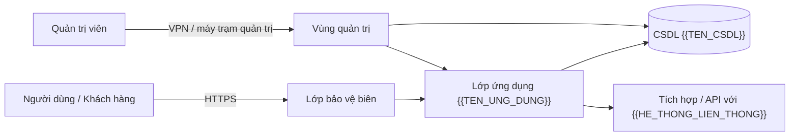

# Thuyết minh tổng quan về hệ thống thông tin — khung

> **Căn cứ:** NĐ 331/2026/NĐ-CP Đ4, Đ5, Đ7.2, Đ21.1, Đ22.2.a, Đ22.3 · **Đối chiếu văn bản gốc:** 24/09/2026 · **Trạng thái:** Bản khung v0.1

Đây là thành phần 1 của hồ sơ đề xuất cấp độ (Đ21.1) và phần a) của thuyết minh hồ sơ (Đ22.2.a). Khung bám **đúng 4 nội dung Đ22.3.a–d**. Thay `{{...}}` bằng thông tin thực tế; bỏ các hướng dẫn in nghiêng khi hoàn thiện.

> **Bảo mật tài liệu:** thuyết minh chứa sơ đồ mạng, IP, danh mục máy chủ — phân loại "thông tin riêng" (NĐ 331 Đ9.1.b), giới hạn người tiếp cận, gửi qua kênh an toàn. Không đưa vào kho mã/tài liệu công khai.

---

<b>{{TEN_CO_QUAN_TO_CHUC}}</b>

<b>THUYẾT MINH TỔNG QUAN VỀ HỆ THỐNG THÔNG TIN</b> <b>{{TEN_HE_THONG}}</b>

<i>(Kèm theo hồ sơ đề xuất cấp độ — phiên bản {{PHIEN_BAN}}, ngày {{NGAY}})</i>

## 1. Thông tin về chủ quản hệ thống thông tin (Đ22.3.a)

| Trường | Nội dung |
|---|---|
| Tên chủ quản HTTT | {{TEN_CHU_QUAN}} |
| Căn cứ xác định chủ quản | *Với doanh nghiệp/tổ chức khác: cấp có thẩm quyền quyết định đầu tư xây dựng, thiết lập, nâng cấp, mở rộng HTTT (Đ4.2).* {{VAN_BAN_CAN_CU}} |
| Văn bản quy định chức năng, nhiệm vụ, quyền hạn | {{VAN_BAN_CHUC_NANG_NHIEM_VU}} |
| Người đại diện, chức vụ | {{NGUOI_DAI_DIEN}}, {{CHUC_VU}} |
| Địa chỉ | {{DIA_CHI}} |
| Điện thoại / Thư điện tử | {{DIEN_THOAI}} / {{EMAIL}} |
| Ủy quyền chủ quản (nếu có) | Văn bản {{SO_VB_UY_QUYEN}}; tổ chức được ủy quyền {{TEN}}; phạm vi hệ thống; trách nhiệm; thời hạn (Đ4.3) |

## 2. Thông tin về đơn vị vận hành hệ thống thông tin (Đ22.3.b)

| Trường | Nội dung |
|---|---|
| Tên đơn vị vận hành | {{TEN_DON_VI_VAN_HANH}} |
| Văn bản giao nhiệm vụ vận hành / chức năng, nhiệm vụ, quyền hạn | {{VAN_BAN_GIAO_VAN_HANH}} (Đ5.1) |
| Người đại diện, chức vụ | {{NGUOI_DAI_DIEN}}, {{CHUC_VU}} |
| Địa chỉ | {{DIA_CHI}} |
| Điện thoại / Thư điện tử | {{DIEN_THOAI}} / {{EMAIL}} |
| Nhiều đơn vị vận hành — đơn vị chủ trì | {{DON_VI_CHU_TRI}} (Đ5.2) |
| Thuê dịch vụ CNTT | Nhà cung cấp {{TEN_NHA_CUNG_CAP}}; hợp đồng {{SO_HOP_DONG}}; phân định trách nhiệm quản trị dữ liệu, kiểm soát truy cập, bảo đảm ANM tại điều khoản {{DIEU_KHOAN}} (Đ5.3.a) |

Bổ sung (khuyến nghị): đơn vị chuyên trách ANM — tên, văn bản giao nhiệm vụ, đầu mối (Đ31.1).

## 3. Phạm vi, quy mô của hệ thống thông tin (Đ22.3.c)

### 3.1. Phạm vi hệ thống

*Mô tả chức năng nghiệp vụ cốt lõi và ranh giới hệ thống theo 4 căn cứ Đ7.2.a. Có thể dẫn từ [phiếu xác định cấp độ](../01-xac-dinh-cap-do/phieu-xac-dinh-cap-do.md) Phần B.*

| Thành phần trong phạm vi | Chức năng | Căn cứ đưa vào phạm vi (Đ7.2.a) |
|---|---|---|
| {{THANH_PHAN}} | {{CHUC_NANG}} | {{CAN_CU}} |

| Hệ thống ngoài phạm vi có kết nối | Quan hệ | Lý do để ngoài phạm vi / biện pháp kiểm soát lan truyền rủi ro (Đ7.2.b) |
|---|---|---|
| {{HE_THONG}} | {{QUAN_HE}} | {{LY_DO}} |

### 3.2. Quy mô hệ thống

| Chỉ tiêu | Giá trị |
|---|---|
| Số người dùng nội bộ | {{SO_NGUOI_DUNG_NOI_BO}} |
| Số tài khoản người dùng bên ngoài | {{SO_TAI_KHOAN_NGOAI}} |
| Số chủ thể DLCN cơ bản / nhạy cảm | {{SO_CO_BAN}} / {{SO_NHAY_CAM}} |
| Khối lượng dữ liệu lưu trữ | {{DUNG_LUONG}} |
| Số giao dịch/truy cập trung bình, cao điểm | {{GIAO_DICH}} |
| Số địa điểm triển khai | {{SO_DIA_DIEM}} |
| Yêu cầu thời gian hoạt động (giờ vận hành, mục tiêu sẵn sàng) | {{YEU_CAU_SAN_SANG}} |

### 3.3. Đối tượng phục vụ

| Nhóm đối tượng | Mô tả | Kênh truy cập |
|---|---|---|
| {{NHOM_DOI_TUONG}} | {{MO_TA}} | ☐ Web ☐ Ứng dụng di động ☐ API ☐ Mạng nội bộ ☐ VPN |

## 4. Kiến trúc hệ thống (Đ22.3.d)

*Hệ thống đang vận hành: mô tả **hiện trạng** kiến trúc. Hệ thống xây mới/nâng cấp/mở rộng: mô tả **kiến trúc thiết kế**.*

### 4.1. Mô hình lô-gic

*Sơ đồ các khối chức năng, luồng dữ liệu, ranh giới tin cậy. Có thể dùng mermaid hoặc hình đính kèm.*

### 4.2. Mô hình vật lý

*Sơ đồ vị trí đặt thiết bị/tài nguyên (TTDL, phòng máy, vùng cloud), kết nối đường truyền, thiết bị mạng và bảo mật, vùng mạng. Đính kèm hình: `{{TEN_FILE_SO_DO_VAT_LY}}`.*

### 4.3. Danh mục thiết bị và thiết bị mạng chính

| STT | Tên thiết bị / chủng loại | Hãng, model (nếu cần) | Số lượng | Vị trí triển khai | Mục đích sử dụng |
|---|---|---|---|---|---|
| 1 | {{TEN_THIET_BI}} | {{MODEL}} | {{SL}} | {{VI_TRI}} | {{MUC_DICH}} |
| 2 | *Ví dụ: Tường lửa biên* | | | *TTDL {{...}}, tủ rack {{...}}* | *Kiểm soát truy cập vùng DMZ – Internet* |

### 4.4. Danh mục ứng dụng / dịch vụ cung cấp bởi hệ thống

| STT | Tên dịch vụ / ứng dụng | Máy chủ triển khai | Vị trí triển khai | Hệ điều hành máy chủ | Mục đích sử dụng dịch vụ |
|---|---|---|---|---|---|
| 1 | {{TEN_DICH_VU}} | {{TEN_MAY_CHU}} | {{VI_TRI}} | {{HE_DIEU_HANH_PHIEN_BAN}} | {{MUC_DICH}} |
| 2 | *Ví dụ: Cổng web khách hàng* | *web-01, web-02* | *Vùng DMZ* | *{{OS}}* | *Cung cấp dịch vụ trực tuyến cho khách hàng* |

*Với dịch vụ cloud (PaaS/SaaS): ghi tên dịch vụ của nhà cung cấp, vùng (region), tài khoản/tenant thay cho "máy chủ".*

### 4.5. Quy hoạch vùng mạng và địa chỉ IP

| STT | Vùng mạng | Chức năng vùng | Dải IP nội bộ (IP Private) | Địa chỉ IP công khai (IP Public) | VLAN / VPC / Subnet | Kiểm soát truy cập giữa vùng |
|---|---|---|---|---|---|---|
| 1 | *Vùng DMZ* | *Máy chủ công khai* | {{IP_PRIVATE}} | {{IP_PUBLIC}} | {{VLAN}} | {{CHINH_SACH}} |
| 2 | *Vùng máy chủ nội bộ* | | {{IP_PRIVATE}} | — | | |
| 3 | *Vùng CSDL* | | | — | | |
| 4 | *Vùng quản trị* | | | — | | |
| 5 | *Vùng người dùng nội bộ* | | | | | |

*Cấp 3–4 thuê TTDL/cloud: thể hiện tách riêng lô-gic giữa hệ thống với hệ thống khác, giữa các vùng mạng, và phân vùng lưu trữ (NĐ 331 Đ30.8). Cấp 5/ANQG: tách vật lý theo Đ30.9.*

## 5. Tài liệu đính kèm

- [ ] Sơ đồ lô-gic, sơ đồ vật lý (bản vẽ gốc).
- [ ] Tài liệu thiết kế theo Đ21.2 (thiết kế sơ bộ / thiết kế thi công hoặc tương đương).
- [ ] Văn bản xác định chủ quản, giao đơn vị vận hành, ủy quyền (nếu có).
- [ ] Hợp đồng thuê dịch vụ (trích điều khoản trách nhiệm ANM) nếu có.

| Người lập | Người soát xét | Ngày |
|---|---|---|
| {{NGUOI_LAP}} | {{NGUOI_SOAT_XET}} | {{NGAY}} |
