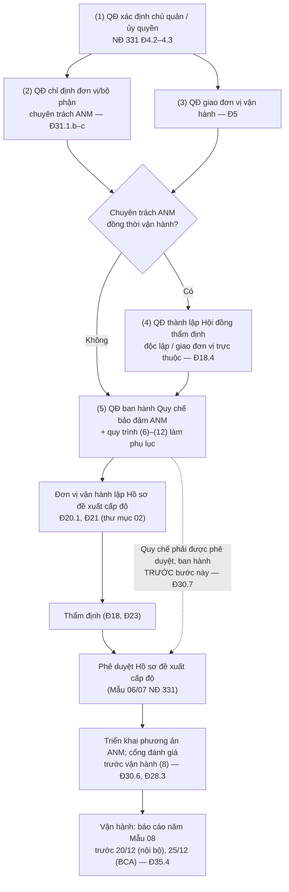

# 04 — Chính sách, quy chế, quyết định và quy trình mẫu

> **Căn cứ:** Luật An ninh mạng 116/2025/QH15 Đ10, Đ25, Đ26, Đ34, Đ40, Đ41; NĐ 331/2026/NĐ-CP Đ3–Đ5, Đ10, Đ18.4, Đ26–Đ33, Đ35–Đ36; NĐ 333/2026/NĐ-CP Đ7, Đ9, Đ16, Đ19–Đ20, Đ24; NĐ 330/2026/NĐ-CP Đ21, Đ23, Đ54; Luật 91/2025/QH15 Đ23, Đ33; NĐ 356/2025/NĐ-CP Đ8, Đ12–Đ14, Đ28–Đ29; TCVN 14423:2026 (phần quản lý) · **Đối chiếu văn bản gốc:** 24/09/2026 · **Trạng thái:** Bản khung v0.1

Bộ văn bản mẫu **cấp tổ chức**, dùng chung cho mọi hệ thống thông tin (HTTT) của một chủ quản. Mọi thông tin riêng được thay bằng placeholder `{{...}}`. Các mẫu quyết định theo thể thức văn bản hành chính (quốc hiệu, tiêu ngữ, số/ký hiệu, căn cứ, điều khoản, nơi nhận); quy chế và quy trình trình bày theo chương – điều hoặc theo bước.

> Phần diễn giải TCVN 14423:2026 trong thư mục này chỉ là **tóm lược để tra cứu; khi lập hồ sơ phải đối chiếu bản chính thức TCVN 14423:2026 (mua tại VSQI).**

## 1. Danh mục văn bản

| # | File | Loại | Ai ban hành | Khi nào | Căn cứ chính |
|---|---|---|---|---|---|
| 1 | [qd-chi-dinh-chu-quan-uy-quyen.md](qd-chi-dinh-chu-quan-uy-quyen.md) | Quyết định xác định chủ quản HTTT / ủy quyền thực hiện trách nhiệm chủ quản | Cấp có thẩm quyền quyết định đầu tư (HĐQT/HĐTV/Chủ tịch công ty/Tổng giám đốc theo điều lệ) | Bước 0 — trước mọi văn bản khác; khi thay đổi chủ quản/phạm vi ủy quyền | NĐ 331 Đ4.2, Đ4.3, Đ31.2 |
| 2 | [qd-chi-dinh-don-vi-bo-phan-chuyen-trach-anm.md](qd-chi-dinh-don-vi-bo-phan-chuyen-trach-anm.md) | Quyết định thành lập/chỉ định đơn vị (hoặc bộ phận) chuyên trách ANM | Người đứng đầu chủ quản | Ngay sau (1); trước khi lập hồ sơ cấp độ | NĐ 331 Đ3.2–3.3, Đ31.1.b–c, Đ32; Luật 116 Đ40.2.b |
| 3 | [qd-giao-don-vi-van-hanh.md](qd-giao-don-vi-van-hanh.md) | Quyết định giao đơn vị vận hành HTTT (gồm trường hợp thuê dịch vụ) | Người đứng đầu chủ quản | Cùng lúc với (2); khi thay đổi mô hình vận hành, ký/hết hạn hợp đồng thuê dịch vụ | NĐ 331 Đ5, Đ33 |
| 4 | [qd-thanh-lap-hoi-dong-tham-dinh.md](qd-thanh-lap-hoi-dong-tham-dinh.md) | Quyết định thành lập Hội đồng thẩm định độc lập (hoặc giao đơn vị trực thuộc thẩm định) | Người đứng đầu chủ quản, theo tờ trình của đơn vị chuyên trách ANM | Khi đơn vị chuyên trách ANM đồng thời là đơn vị vận hành; trước khi thẩm định hồ sơ cấp độ | NĐ 331 Đ18.4 |
| 5 | [quy-che-bao-dam-anm.md](quy-che-bao-dam-anm.md) | Quyết định ban hành + Quy chế bảo đảm ANM (7 nhóm quản lý) | Người đứng đầu chủ quản (cấp có thẩm quyền) | **Trước khi Hồ sơ đề xuất cấp độ được phê duyệt**; rà soát ≥ 01 lần/năm | NĐ 331 Đ28.1, Đ30.3, **Đ30.7**; Luật 116 Đ10.2.a |
| 6 | [quy-trinh-ung-pho-su-co.md](quy-trinh-ung-pho-su-co.md) | Quy trình ứng phó sự cố ANM + thông báo vi phạm DLCN | Người đứng đầu chủ quản (phụ lục của Quy chế) | Cùng Quy chế | NĐ 331 Đ31.2.d; Luật 116 Đ40.1.c, Đ41.2–3; NĐ 333 Đ9; NĐ 330 Đ21; Luật 91 Đ23; NĐ 356 Đ28–29 |
| 7 | [quy-trinh-quan-ly-rui-ro.md](quy-trinh-quan-ly-rui-ro.md) | Quy trình quản lý rủi ro ANM | Người đứng đầu chủ quản (phụ lục của Quy chế) | Cùng Quy chế; trước đánh giá rủi ro lần đầu | NĐ 331 Đ10; TCVN 14423:2026 mục 3.1/4.1/5.1/6.1/7.1 |
| 8 | [quy-trinh-danh-gia-truoc-van-hanh.md](quy-trinh-danh-gia-truoc-van-hanh.md) | Quy trình "cổng" đánh giá điều kiện ANM trước vận hành / thay đổi lớn | Người đứng đầu chủ quản | Cùng Quy chế; áp dụng cho mọi dự án mới, mở rộng, nâng cấp | NĐ 331 Đ19, Đ28.3, Đ30.6, Đ37; Luật 116 Đ10.2.c |
| 9 | [quy-trinh-tiep-nhan-yeu-cau-co-quan-chuc-nang.md](quy-trinh-tiep-nhan-yeu-cau-co-quan-chuc-nang.md) | Quy trình tiếp nhận yêu cầu của lực lượng chuyên trách (cung cấp thông tin, gỡ nội dung, kiểm tra, giám sát) | Người đứng đầu chủ quản | Trước khi cung cấp dịch vụ trên không gian mạng | Luật 116 Đ25.2, Đ41; NĐ 333 Đ7, Đ11, Đ13, Đ16, Đ18; NĐ 331 Đ26 |
| 10 | [quy-trinh-quan-ly-nha-cung-cap.md](quy-trinh-quan-ly-nha-cung-cap.md) | Quy trình quản lý nhà cung cấp + điều khoản hợp đồng mẫu | Người đứng đầu chủ quản | Cùng Quy chế; trước khi ký/gia hạn hợp đồng | NĐ 331 Đ5.3.a, Đ19.2.b, Đ30.8–9; NĐ 356 Đ12; TCVN mục 3.14/4.14/5.15/6.15/7.15 |
| 11 | [ke-hoach-dao-tao-dien-tap.md](ke-hoach-dao-tao-dien-tap.md) | Kế hoạch năm về đào tạo, tuyên truyền, diễn tập | Người đứng đầu chủ quản | Hằng năm (quý IV năm trước) | NĐ 331 Đ31.3; Luật 116 Đ34; NĐ 333 Đ24 |
| 12 | [ma-tran-raci.md](ma-tran-raci.md) | Ma trận RACI các vai trò | Kèm Quy chế | Cùng Quy chế | NĐ 331 Đ4, Đ5, Đ18, Đ31–Đ33; NĐ 356 Đ14 |

## 2. Thứ tự ban hành (bắt buộc về logic pháp lý)

**Điểm then chốt:**

- [ ] Quy chế bảo đảm ANM phải được xây dựng đáp ứng yêu cầu quản lý theo cấp độ và **được cấp có thẩm quyền phê duyệt, ban hành trước khi Hồ sơ đề xuất cấp độ được phê duyệt** (NĐ 331 Đ30.7). Không ban hành Quy chế → vừa không đủ điều kiện phê duyệt hồ sơ, vừa có thể bị phạt 40–60 triệu đồng đối với tổ chức (khung 20–30 triệu đồng ghi trong điều là mức cho cá nhân, tổ chức gấp đôi — NĐ 330 Đ7.1) vì "không ban hành quy định về bảo đảm ANM trong thiết kế, xây dựng, quản lý, vận hành, sử dụng, nâng cấp, hủy bỏ HTTT" (NĐ 330 Đ23.1.a).
- [ ] Quy chế là **đối tượng kiểm tra** về tính đầy đủ, phù hợp và việc tuân thủ (NĐ 331 Đ27.2.a–b) và là **nội dung báo cáo năm** ("Danh sách HTTT có Quy chế", "Thông tin Quyết định ban hành và Quy chế" — NĐ 331 Đ36.6, Đ36.7, Đ36.11).
- [ ] Đơn vị chuyên trách ANM phải tồn tại trước khi thẩm định (thẩm định cấp 1–3 do đơn vị này làm — NĐ 331 Đ18.1, Đ18.2.a).
- [ ] Nếu chủ quản dùng mô hình "đơn vị CNTT kiêm chuyên trách ANM kiêm vận hành", phải xử lý xung đột vai trò bằng văn bản (4) trước khi thẩm định (NĐ 331 Đ18.4).

## 3. Quan hệ với các thư mục khác

| Cần gì | Xem |
|---|---|
| Tiêu chí, cây quyết định cấp độ | [`../01-xac-dinh-cap-do/`](../01-xac-dinh-cap-do/README.md) |
| Mẫu 01–08 NĐ 331, thuyết minh hồ sơ | [`../02-ho-so-cap-do/`](../02-ho-so-cap-do/) |
| Yêu cầu chi tiết TCVN theo từng cấp | [`../03-yeu-cau-theo-cap-do/`](../03-yeu-cau-theo-cap-do/) |
| Nghĩa vụ NĐ 333, mức phạt NĐ 330, DLCN | [`../05-nghia-vu-lien-quan/`](../05-nghia-vu-lien-quan/) |
| Tự đánh giá, báo cáo năm Mẫu 08 | [`../06-kiem-tra-bao-cao/`](../06-kiem-tra-bao-cao/) |

## 4. Quy ước placeholder dùng chung

| Placeholder | Ý nghĩa |
|---|---|
| `{{TEN_CO_QUAN_CAP_TREN}}` | Cơ quan/tổ chức chủ quản cấp trên (nếu có; doanh nghiệp độc lập có thể bỏ dòng này) |
| `{{TEN_TO_CHUC}}` / `{{VIET_TAT}}` | Tên đầy đủ / chữ viết tắt dùng trong ký hiệu văn bản |
| `{{DIA_DANH}}`, `{{NGAY}}`, `{{SO_VB}}` | Địa danh, ngày ban hành, số văn bản |
| `{{CHUC_DANH_NGUOI_KY}}`, `{{HO_TEN_NGUOI_KY}}` | Người có thẩm quyền ký |
| `{{CAN_CU_THAM_QUYEN}}` | Điều lệ / quyết định thành lập / quy chế tổ chức hoạt động quy định thẩm quyền người ký |
| `{{TEN_HE_THONG}}`, `{{CAP_DO}}` | Tên HTTT, cấp độ đề xuất/đã phê duyệt |
| `{{DON_VI_CHUYEN_TRACH_ANM}}` | Đơn vị (hoặc bộ phận) chuyên trách ANM |
| `{{DON_VI_VAN_HANH}}` | Đơn vị vận hành HTTT |
| `{{DON_VI_DANH_GIA_DOC_LAP}}` | Bộ phận/đơn vị độc lập với đơn vị vận hành, thực hiện tự đánh giá (NĐ 331 Đ31.2.c) |
| `{{NHAN_SU_BVDLCN}}` | Bộ phận/nhân sự bảo vệ DLCN (Luật 91 Đ33.2; NĐ 356 Đ13–Đ14) |
| `{{CHU_KY_...}}`, `{{THOI_GIAN_...}}` | Tham số theo cấp độ — xem Phụ lục 1 của [Quy chế](quy-che-bao-dam-anm.md#phụ-lục-1--bảng-tham-số-theo-cấp-độ) |

## 5. Lưu ý về thể thức

Mẫu quyết định trong thư mục này trình bày theo bố cục văn bản hành chính phổ biến (và bố cục của Mẫu số 06, 07 Phụ lục NĐ 331). Cơ quan nhà nước áp dụng quy định về công tác văn thư (NĐ 30/2020/NĐ-CP) **[CẦN ĐỐI CHIẾU — văn bản này không có trong bộ nguồn của repo; doanh nghiệp tham khảo và áp dụng quy chế văn thư nội bộ]**. Doanh nghiệp tư nhân có thể dùng thể thức nội bộ, miễn thể hiện rõ: người có thẩm quyền, căn cứ, nội dung, hiệu lực, nơi nhận.

## 6. Điểm chờ hướng dẫn / cần đối chiếu (tổng hợp)

| # | Vấn đề | Trạng thái |
|---|---|---|
| 1 | Tiêu chí "sự cố ANM nghiêm trọng" để áp mốc 24 giờ (NĐ 331 Đ31.2.d) | Chưa định nghĩa trong NĐ 331/333; chờ quy định của Bộ trưởng Bộ Công an về giám sát, ứng phó sự cố (NĐ 331 Đ28.6) |
| 2 | Phương pháp, biểu mẫu đánh giá rủi ro; biểu mẫu tự đánh giá | Chờ hướng dẫn của Bộ Công an (NĐ 331 Đ10.8, Đ31.2.c, Đ34.1.đ) |
| 3 | Nghĩa vụ "địa chỉ tiếp nhận sự cố", "khai báo đầu mối", "Đội ứng cứu", "Kế hoạch ứng phó", "thường trực 24/7" | Là hành vi bị phạt tại NĐ 330 Đ21, nhưng NĐ 331/333 không quy định chi tiết nội dung/thời hạn — khuyến nghị thực hiện; **[CẦN ĐỐI CHIẾU]** văn bản của BCA về mạng lưới ứng cứu |
| 4 | Thời gian lưu nhật ký: TCVN (1–12 tháng tùy cấp) vs NĐ 333 (≥ 12 tháng cho DN cung cấp dịch vụ) | Áp mức cao hơn — xem Quy chế Điều 28 |
| 5 | Mốc báo cáo sự cố của DN cung cấp dịch vụ: "báo cáo ngay" (Luật 116 Đ41.3) vs 24h/72h (NĐ 331 Đ31.2.d) | Áp "ngay" + các mốc 24h/72h — xem quy trình sự cố |
