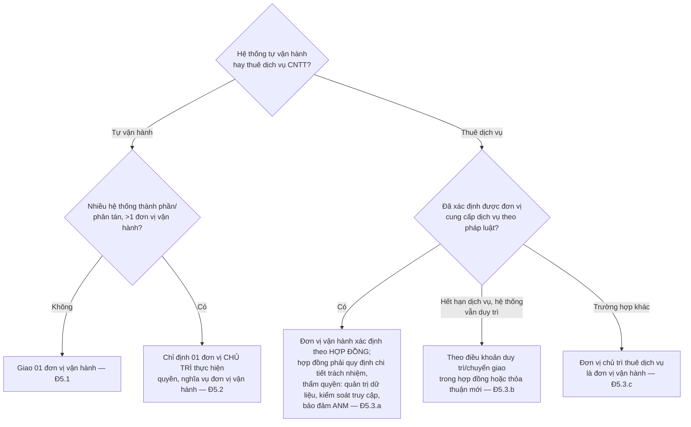

# Mẫu Quyết định giao đơn vị vận hành hệ thống thông tin

> **Căn cứ:** NĐ 331/2026/NĐ-CP Đ5, Đ19.2, Đ20.1, Đ30.8–30.9, Đ33, Đ35.4.a; Luật 116/2025/QH15 Đ10; NĐ 330/2026/NĐ-CP Đ23.2.d · **Đối chiếu văn bản gốc:** 24/09/2026 · **Trạng thái:** Bản khung v0.1

## Hướng dẫn sử dụng

### Xác định đơn vị vận hành (NĐ 331 Đ5)

### Trách nhiệm của đơn vị vận hành (NĐ 331 Đ33, Đ20)

| # | Trách nhiệm | Căn cứ |
|---|---|---|
| 1 | Lập hồ sơ đề xuất cấp độ, gửi thẩm định/trình phê duyệt | Đ20.1, Đ20.3.b–c |
| 2 | Thực hiện biện pháp bảo vệ ANM theo phương án đã được chủ quản phê duyệt và Luật 116 Đ10 | Đ33.1 |
| 3 | Bảo vệ hệ thống theo pháp luật, hướng dẫn, tiêu chuẩn, quy chuẩn | Đ33.2 |
| 4 | Định kỳ đánh giá hiệu quả biện pháp bảo vệ, báo cáo chủ quản điều chỉnh | Đ33.3 |
| 5 | Phối hợp đơn vị/bộ phận chuyên trách ANM xử lý điểm yếu, lỗ hổng, nguy cơ | Đ33.4 |
| 6 | Phối hợp lực lượng chuyên trách BCA; thiết lập kết nối, đấu nối đường truyền, truyền tải dữ liệu phục vụ giám sát | Đ33.5 |
| 7 | Báo cáo định kỳ/đột xuất; báo cáo năm gửi chủ quản trước 20/12 | Đ33.6, Đ35.4.a |

Việc thực hiện Đ33.1 là nội dung kiểm tra tuân thủ (NĐ 331 Đ27.1.c). Cản trở/không trao đổi thông tin, dữ liệu giám sát giữa **đơn vị được chủ quản thuê** và lực lượng chuyên trách có thể bị phạt 30–50 triệu đồng (NĐ 330 Đ23.2.d) → hợp đồng thuê phải có điều khoản buộc nhà cung cấp phối hợp giám sát.

### Trường hợp thuê dịch vụ — yêu cầu bổ sung

- [ ] Hợp đồng quy định chi tiết trách nhiệm, thẩm quyền về **quản trị dữ liệu, kiểm soát truy cập, bảo đảm ANM** (Đ5.3.a) — dùng điều khoản mẫu tại [quy-trinh-quan-ly-nha-cung-cap.md](quy-trinh-quan-ly-nha-cung-cap.md#5-điều-khoản-hợp-đồng-mẫu-về-an-ninh-mạng).
- [ ] Có điều khoản **cam kết duy trì, chuyển giao** khi hết hạn (Đ5.3.b).
- [ ] Nhà cung cấp phối hợp cập nhật hồ sơ đề xuất cấp độ theo hiện trạng hạ tầng đã cài đặt (Đ19.2.b).
- [ ] Cấp 3–4 trên trung tâm dữ liệu/đám mây: tách riêng lô-gic hệ thống, vùng mạng, phân vùng lưu trữ (Đ30.8); cấp 5: tách vật lý (Đ30.9).
- [ ] Nếu xử lý DLCN trên đám mây: hợp đồng đáp ứng NĐ 356 Đ12.2; mã hóa khi lưu trữ và truyền (NĐ 356 Đ12.4).

---

## MẪU QUYẾT ĐỊNH

| {{TEN_CO_QUAN_CAP_TREN}} **{{TEN_TO_CHUC}}** ------- | **CỘNG HÒA XÃ HỘI CHỦ NGHĨA VIỆT NAM** **Độc lập - Tự do - Hạnh phúc** --------------- |
|:---:|:---:|
| Số: {{SO_VB}}/QĐ-{{VIET_TAT}} | *{{DIA_DANH}}, ngày ... tháng ... năm ...* |

<b>QUYẾT ĐỊNH</b> <b>Về việc giao đơn vị vận hành hệ thống thông tin {{TEN_HE_THONG}}</b>

<b>{{CHUC_DANH_NGUOI_KY_IN_HOA}} {{TEN_TO_CHUC_IN_HOA}}</b>

*Căn cứ Luật An ninh mạng số 116/2025/QH15;*

*Căn cứ Nghị định số 331/2026/NĐ-CP ngày 19 tháng 8 năm 2026 của Chính phủ về bảo vệ an ninh mạng đối với hệ thống thông tin;*

*Căn cứ {{CAN_CU_THAM_QUYEN}};*

*Căn cứ Hợp đồng số {{SO_HOP_DONG}} ngày {{NGAY}} giữa {{TEN_TO_CHUC}} và {{NHA_CUNG_CAP}} (trường hợp thuê dịch vụ);*

*Theo đề nghị của {{DON_VI_DE_NGHI}}.*

<b>QUYẾT ĐỊNH:</b>

**Điều 1. Giao đơn vị vận hành**

1. Giao {{DON_VI_VAN_HANH}} là đơn vị vận hành hệ thống thông tin {{TEN_HE_THONG}} (cấp độ {{CAP_DO}}) theo khoản 1 Điều 5 Nghị định số 331/2026/NĐ-CP.

2. *(Trường hợp nhiều đơn vị vận hành — Đ5.2)* Các đơn vị cùng vận hành các hệ thống thành phần: {{DANH_SACH_DON_VI_THANH_PHAN}}. Chỉ định {{DON_VI_CHU_TRI}} là đơn vị chủ trì thực hiện quyền và nghĩa vụ của đơn vị vận hành; các đơn vị còn lại cung cấp thông tin, thực hiện biện pháp trong phạm vi thành phần mình phụ trách theo phân công tại Phụ lục.

3. *(Trường hợp thuê dịch vụ — Đ5.3)* Chọn một:
   - a) Đơn vị vận hành là {{NHA_CUNG_CAP}} theo thỏa thuận tại Điều {{DIEU_HD}} Hợp đồng số {{SO_HOP_DONG}}; {{DON_VI_CHU_TRI_THUE}} là đầu mối quản lý hợp đồng, giám sát việc thực hiện trách nhiệm an ninh mạng của nhà cung cấp.
   - b) Hết thời hạn cung cấp dịch vụ, hệ thống tiếp tục duy trì: đơn vị vận hành là {{DON_VI}} theo điều khoản duy trì/chuyển giao {{DIEU_KHOAN}} *(hoặc thỏa thuận mới số …)*.
   - c) {{DON_VI_CHU_TRI_THUE}} (đơn vị chủ trì thuê dịch vụ) đóng vai trò đơn vị vận hành.

**Điều 2. Trách nhiệm của đơn vị vận hành**

1. Lập, cập nhật hồ sơ đề xuất cấp độ; trình thẩm định, phê duyệt theo Điều 20 Nghị định số 331/2026/NĐ-CP.
2. Thực hiện đầy đủ trách nhiệm tại Điều 33 Nghị định số 331/2026/NĐ-CP và Quy chế bảo đảm an ninh mạng của {{TEN_TO_CHUC}}.
3. Duy trì danh mục tài sản, sơ đồ mạng, cấu hình, danh sách tài khoản của hệ thống; cung cấp cho đơn vị chuyên trách an ninh mạng và bộ phận đánh giá độc lập khi có yêu cầu.
4. Báo cáo sự cố ngay cho {{DON_VI_CHUYEN_TRACH_ANM}} theo Quy trình ứng phó sự cố; báo cáo năm gửi chủ quản trước ngày 20 tháng 12.
5. Không tự thẩm định, tự đánh giá hệ thống do mình vận hành (điểm c khoản 2 Điều 31, khoản 4 Điều 18 Nghị định số 331/2026/NĐ-CP).

**Điều 3. Hiệu lực và trách nhiệm thi hành**

1. Quyết định này có hiệu lực từ ngày ký *(trường hợp thuê dịch vụ: đến hết thời hạn hợp đồng hoặc khi có quyết định thay thế)*.
2. {{DON_VI_VAN_HANH}}, {{DON_VI_CHUYEN_TRACH_ANM}} và các đơn vị liên quan chịu trách nhiệm thi hành.

| **Nơi nhận:** - Như Điều 3; - {{NHA_CUNG_CAP}} (nếu có); - Lưu: VT, {{DON_VI_SOAN_THAO}}. | **{{CHUC_DANH_NGUOI_KY_IN_HOA}}** *(Ký, ghi rõ họ tên, đóng dấu)*   **{{HO_TEN_NGUOI_KY}}** |
|:---|:---:|

### Phụ lục — Phân công theo thành phần (khi nhiều đơn vị vận hành / thuê dịch vụ)

| Thành phần/lớp | Đơn vị thực hiện | Quản trị dữ liệu | Kiểm soát truy cập | Giám sát, nhật ký | Sao lưu | Vá lỗ hổng | Ứng phó sự cố |
|---|---|---|---|---|---|---|---|
| Hạ tầng vật lý/ảo hóa | {{…}} | | | | | | |
| Hệ điều hành, middleware | {{…}} | | | | | | |
| Ứng dụng, dữ liệu | {{…}} | | | | | | |

## Bằng chứng cần lưu

Quyết định; hợp đồng thuê dịch vụ (điều khoản Đ5.3.a); biên bản bàn giao vận hành; phụ lục phân công; báo cáo định kỳ Đ33.6.
