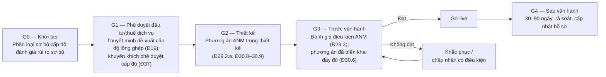

# Quy trình đánh giá điều kiện an ninh mạng trước khi vận hành ("cổng" dự án mới / thay đổi lớn)

> **Căn cứ:** Luật 116/2025/QH15 Đ10.2.b–c, Đ10.3–10.5; NĐ 331/2026/NĐ-CP Đ10.2.b–c, Đ19, Đ25, Đ28.3, Đ30.6–30.9, Đ31.2.c, Đ37; NĐ 330/2026/NĐ-CP Đ23.1.b–d; TCVN 14423:2026 mục 5.12.2.3, 5.17.2.4, 6.16.2.9 · **Đối chiếu văn bản gốc:** 24/09/2026 · **Trạng thái:** Bản khung v0.1

> Phần TCVN 14423:2026 là tóm lược để tra cứu; khi lập hồ sơ phải đối chiếu bản chính thức TCVN 14423:2026 (mua tại VSQI).

Mã quy trình: **QT-DGTVH** · Ban hành kèm Quy chế bảo đảm ANM (Điều 22, 32) · Chủ trì: {{DON_VI_CHUYEN_TRACH_ANM}} · Người quyết định "qua cổng": {{CHUC_DANH_NGUOI_DUNG_DAU}} hoặc người được ủy quyền.

## 1. Cơ sở pháp lý

| Quy định | Nội dung | Căn cứ |
|---|---|---|
| Đánh giá điều kiện ANM | Xem xét mức độ đáp ứng điều kiện ANM **trước khi đưa vào vận hành, sử dụng** | NĐ 331 Đ28.3 |
| Nội dung | Chính sách, quy chế, quy trình; tổ chức bộ máy, nhân sự phụ trách; biện pháp quản lý và kỹ thuật; khả năng giám sát, phát hiện, ứng phó, khắc phục sự cố; tuân thủ pháp luật | Đ28.3.a |
| Trường hợp | Trước khi đưa vào vận hành; **khi có thay đổi lớn** về chức năng, quy mô, công nghệ hoặc mức độ rủi ro; theo yêu cầu cơ quan có thẩm quyền | Đ28.3.b |
| Kết quả | Hệ thống **đủ / không đủ điều kiện** đưa vào vận hành; yêu cầu bổ sung biện pháp; phục vụ quản lý nhà nước | Đ28.3.c |
| Triển khai đầy đủ phương án | Hệ thống xây mới/mở rộng/nâng cấp phải triển khai đầy đủ phương án ANM đã phê duyệt tại Hồ sơ đề xuất cấp độ và đáp ứng Đ29, Đ30 **trước khi vận hành, khai thác** | Đ30.6 |
| Lồng ghép vào đầu tư | Thuyết minh đề xuất cấp độ lồng ghép vào báo cáo nghiên cứu khả thi/báo cáo đầu tư/kế hoạch thuê dịch vụ | Đ19.1–19.2 |
| Thời điểm phê duyệt | **Khuyến khích** phê duyệt Hồ sơ đề xuất cấp độ trước khi phê duyệt BCKTKT/thiết kế cơ sở/kế hoạch thuê dịch vụ/đề cương dự toán | Đ37 |
| Mức áp dụng theo luật | "Đánh giá điều kiện ANM" (Luật 116 Đ10.2.c): cấp 1–2 tùy chọn; cấp 3–4 không thuộc danh mục quan trọng về ANQG: **theo nhu cầu, khả năng**; thuộc danh mục quan trọng về ANQG: **bắt buộc** | Luật 116 Đ10.3–10.5 |
| Chế tài | Đưa HTTT cấp 3–5 vào vận hành khi chưa được phê duyệt cấp độ; không triển khai đầy đủ biện pháp như hồ sơ đã phê duyệt: 20–30 triệu đồng | NĐ 330 Đ23.1.c–d |

> **Mâu thuẫn cần lưu ý:** Luật 116 Đ10.4 cho phép chủ quản cấp 3–4 (không thuộc danh mục ANQG) *lựa chọn* áp dụng biện pháp "đánh giá điều kiện ANM", trong khi NĐ 331 Đ28.3 mô tả đánh giá điều kiện "trước khi đưa vào vận hành" và Đ30.6 yêu cầu triển khai đầy đủ phương án trước vận hành với mọi cấp. Cách tiếp cận an toàn: **luôn thực hiện cổng nội bộ** (tự đánh giá độc lập) cho mọi hệ thống cấp 3 trở lên; việc thuê đánh giá bên ngoài theo Đ31.2.c. **[CẦN ĐỐI CHIẾU]** hướng dẫn của BCA.

## 2. Khi nào phải qua cổng

- [ ] Hệ thống mới (tự xây hoặc thuê dịch vụ) trước go-live.
- [ ] Mở rộng, nâng cấp hệ thống.
- [ ] **Thay đổi lớn** — định nghĩa nội bộ (tối thiểu gồm các trường hợp NĐ 331 Đ10.2.b–c):
  - thay đổi chức năng nghiệp vụ, phạm vi phục vụ, đối tượng sử dụng (ví dụ mở cho người dùng Internet);
  - thay đổi loại thông tin xử lý (ví dụ bắt đầu xử lý DLCN nhạy cảm);
  - thay đổi công nghệ nền tảng (chuyển lên đám mây, đổi hệ quản trị CSDL, đổi kiến trúc);
  - tích hợp, kết nối liên thông, chia sẻ dữ liệu với hệ thống khác;
  - thay đổi nhà cung cấp dịch vụ hạ tầng/vận hành;
  - `{{TIEU_CHI_THAY_DOI_LON_KHAC}}`.
- [ ] Theo yêu cầu của cơ quan có thẩm quyền.

## 3. Các cổng (gate) trong vòng đời dự án

| Cổng | Câu hỏi quyết định | Người quyết định | Hồ sơ đầu vào |
|---|---|---|---|
| G0 | Hệ thống thuộc loại hình nào, cấp độ dự kiến? Có xử lý DLCN? | Chủ dự án + ANM | Phiếu xác định cấp độ ([`../01-xac-dinh-cap-do/`](../01-xac-dinh-cap-do/README.md)); đánh giá rủi ro sơ bộ |
| G1 | Thuyết minh đề xuất cấp độ đã lồng ghép? Kinh phí ANM đã dự toán? | Cấp phê duyệt đầu tư | BCNCKT/kế hoạch thuê dịch vụ có mục ANM |
| G2 | Thiết kế đáp ứng phương án ANM theo cấp? | Đơn vị chuyên trách ANM | Thiết kế sơ bộ/thi công; thuyết minh phương án ANM |
| **G3** | **Đủ điều kiện ANM để vận hành?** | Chủ quản (hoặc người được ủy quyền) theo đề xuất của bộ phận đánh giá độc lập | Checklist mục 4 + báo cáo kiểm thử + QĐ phê duyệt cấp độ |
| G4 | Hồ sơ, danh mục, giám sát đã cập nhật? | ANM | Báo cáo sau vận hành |

## 4. Checklist G3 — đánh giá điều kiện ANM trước vận hành

Cột "Bằng chứng" là tài liệu phải có trong hồ sơ cổng. Đánh dấu Đạt / Không đạt / Không áp dụng (N/A phải có lý do).

### 4.1 Pháp lý và hồ sơ

| # | Tiêu chí | Căn cứ | Bằng chứng |
|---|---|---|---|
| ☐ | Hồ sơ đề xuất cấp độ đã được **phê duyệt** (cấp 3–5 bắt buộc trước vận hành) | NĐ 331 Đ20; NĐ 330 Đ23.1.c | QĐ phê duyệt (Mẫu 06/07) |
| ☐ | Quy chế bảo đảm ANM đã ban hành, áp dụng cho hệ thống mới (Phụ lục 3 Quy chế) | Đ30.7, Đ28.3.a | QĐ ban hành, Phụ lục cập nhật |
| ☐ | QĐ giao đơn vị vận hành; hợp đồng thuê dịch vụ có điều khoản Đ5.3.a | Đ5 | QĐ, hợp đồng |
| ☐ | Đánh giá tác động xử lý DLCN (nếu xử lý DLCN) đã lập | Luật 91; NĐ 356 Đ19 | Hồ sơ đánh giá tác động |
| ☐ | Nếu là DN cung cấp dịch vụ: xác thực tài khoản, nhật ký ≥ 12 tháng, lưu trữ dữ liệu tại VN, quy trình tiếp nhận yêu cầu | NĐ 333 Đ16, Đ19–20 | Tài liệu thiết kế, cấu hình |

### 4.2 Tổ chức, nhân sự

| # | Tiêu chí | Căn cứ | Bằng chứng |
|---|---|---|---|
| ☐ | Có nhân sự quản trị, vận hành, bảo vệ ANM được phân công; cấp 3+: tách vai trò | Đ28.3.a; TCVN 5.14 | Bảng phân công |
| ☐ | Nhân sự vận hành cấp 3–5 (DN Nhà nước) đã/đang trong lộ trình tập huấn chuyên sâu | Luật 116 Đ34.2; NĐ 333 Đ24.8.b | Chứng nhận/kế hoạch |
| ☐ | Người dùng đã được hướng dẫn quy định sử dụng | TCVN 5.14.2.2 | Biên bản |

### 4.3 Biện pháp kỹ thuật (theo phương án đã phê duyệt)

| # | Tiêu chí | Căn cứ | Bằng chứng |
|---|---|---|---|
| ☐ | Mọi hạng mục của phương án ANM đã triển khai (đối chiếu từng dòng) | Đ30.6 | Bảng đối chiếu phương án – hiện trạng |
| ☐ | Danh mục tài sản phần cứng, phần mềm, tài sản thông tin đã lập | TCVN 5.2–5.4 | Danh mục |
| ☐ | Cấu hình chuẩn/hardening đã áp dụng; tài khoản mặc định đã đổi/vô hiệu | Đ27.2.đ; TCVN 5.5, 5.6 | Báo cáo kiểm tra cấu hình |
| ☐ | Danh sách tài khoản, quyền được phê duyệt; MFA tài khoản quản trị (cấp 3+) | TCVN 5.6 | Danh sách, ảnh cấu hình |
| ☐ | Phân vùng mạng, tường lửa, WAF/IPS/DDoS theo cấp; thuê DC/đám mây: tách lô-gic (C3–4)/vật lý (C5) | Đ30.8–30.9; TCVN 5.12 | Sơ đồ mạng, rule set |
| ☐ | Nhật ký được thu thập tập trung, đồng bộ thời gian, thời gian lưu đạt tham số | TCVN 5.8; NĐ 333 Đ16.6 | Cấu hình SIEM/log |
| ☐ | Sao lưu tự động, lưu tách biệt, **đã khôi phục thử thành công** | TCVN 5.11 | Biên bản khôi phục thử |
| ☐ | Chống mã độc/EDR trên máy chủ | TCVN 5.10 | Console |
| ☐ | Hệ thống đã đưa vào giám sát ANM; kết nối giám sát theo hướng dẫn của lực lượng chuyên trách (nếu có yêu cầu) | NĐ 333 Đ7.2; Luật 116 Đ40.1.b; NĐ 331 Đ33.5 | Ảnh dashboard, cảnh báo thử |

### 4.4 Kiểm tra, kiểm thử

| # | Tiêu chí | Căn cứ | Bằng chứng |
|---|---|---|---|
| ☐ | Rà quét lỗ hổng hạ tầng + ứng dụng; lỗ hổng Nghiêm trọng/Cao đã khắc phục hoặc có kế hoạch được chấp thuận | Đ27.3.a–b, d | Báo cáo rà quét, bản đánh giá lại |
| ☐ | Kiểm tra lỗ hổng mã nguồn, thư viện bên thứ ba **trước khi vận hành chính thức** (cấp 3+); **cấp 4+: kiểm thử xâm nhập trước vận hành** | Đ27.3.c; TCVN 5.17.2.4, 6.16.2.9 | Báo cáo SAST/SCA, pentest |
| ☐ | Thử nghiệm – nghiệm thu ANM có bộ phận/đơn vị độc lập giám sát; báo cáo nghiệm thu được chuyên trách ANM xác nhận, chủ quản phê duyệt (cấp 3+) | TCVN 5.12.2.3 | Biên bản nghiệm thu |
| ☐ | Hình thức kiểm tra ghi rõ: hộp đen/xám/trắng | Đ27.4 | Báo cáo |

### 4.5 Sẵn sàng ứng phó

| # | Tiêu chí | Căn cứ | Bằng chứng |
|---|---|---|---|
| ☐ | Hệ thống đã được đưa vào phạm vi quy trình sự cố, danh bạ, kịch bản | Đ28.3.a; NĐ 333 Đ9.3.a | QT-SC cập nhật |
| ☐ | Phương án dự phòng, khôi phục thảm họa (nếu cấp độ/yêu cầu sẵn sàng đòi hỏi) | Đ29.2.e | Tài liệu DR |
| ☐ | Sổ rủi ro đã cập nhật; rủi ro còn lại được chấp thuận | Đ10.2.b–c | Sổ rủi ro |

### 4.6 Kết luận cổng

| Kết luận | Điều kiện | Hệ quả |
|---|---|---|
| **Đủ điều kiện** | Mọi tiêu chí bắt buộc Đạt | Ký biên bản; cho phép go-live |
| **Đủ điều kiện có điều kiện** | Chỉ còn tồn tại mức thấp/trung bình có kế hoạch khắc phục ≤ `{{HAN_KHAC_PHUC_CO_DIEU_KIEN}}` và biện pháp bù | Chủ quản phê duyệt bằng văn bản; theo dõi đến khi đóng. **Không áp dụng** cho thiếu QĐ phê duyệt cấp độ (cấp 3–5) |
| **Không đủ điều kiện** | Thiếu tiêu chí bắt buộc | Không go-live; khắc phục, đánh giá lại |

## 5. Mẫu Biên bản đánh giá điều kiện ANM trước vận hành

> **BIÊN BẢN ĐÁNH GIÁ ĐIỀU KIỆN AN NINH MẠNG TRƯỚC KHI ĐƯA VÀO VẬN HÀNH**
>
> Hệ thống: {{TEN_HE_THONG}} · Cấp độ: {{CAP_DO}} (QĐ số {{…}}) · Loại: ☐ Mới ☐ Mở rộng/nâng cấp ☐ Thay đổi lớn: …
>
> Thời gian, địa điểm: … · Thành phần: bộ phận đánh giá độc lập ({{DON_VI_DANH_GIA_DOC_LAP}}); {{DON_VI_CHUYEN_TRACH_ANM}}; {{DON_VI_VAN_HANH}}; chủ dự án; nhà cung cấp (nếu có — không biểu quyết).
>
> 1. Phạm vi đánh giá. 2. Phương pháp (xem xét hồ sơ, kiểm tra cấu hình, kiểm thử — hộp đen/xám/trắng). 3. Kết quả theo checklist mục 4 (đính kèm). 4. Tồn tại và kế hoạch khắc phục (người, hạn). 5. Kết luận: ☐ Đủ ☐ Đủ có điều kiện ☐ Không đủ.
>
> Đại diện bộ phận đánh giá độc lập · Đại diện đơn vị chuyên trách ANM · Đại diện đơn vị vận hành — ký.
>
> **Phê duyệt của chủ quản:** ☐ Cho phép vận hành từ ngày … ☐ Không cho phép. Ký, ghi rõ họ tên.

## Bằng chứng cần lưu

Biên bản cổng G0–G4; checklist có bằng chứng đính kèm; báo cáo kiểm thử; phê duyệt chấp nhận rủi ro. Lưu cùng hồ sơ cấp độ — phục vụ kiểm tra "việc triển khai phương án bảo đảm ANM theo phương án được phê duyệt" (NĐ 331 Đ27.1.a, Đ27.1.d) và nội dung báo cáo năm Đ36.5.
