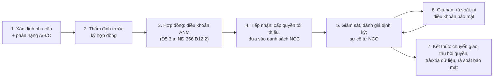

# Quy trình quản lý nhà cung cấp sản phẩm, dịch vụ

> **Căn cứ:** NĐ 331/2026/NĐ-CP Đ5.3, Đ19.2.b, Đ30.8–30.9, Đ33.5; Luật 116/2025/QH15 Đ28–Đ29, Đ41; NĐ 356/2025/NĐ-CP Đ12; Luật 91/2025/QH15 Đ23.1; NĐ 330/2026/NĐ-CP Đ23.2.d; TCVN 14423:2026 mục 3.14, 4.14, 5.15, 6.15, 7.15 · **Đối chiếu văn bản gốc:** 24/09/2026 · **Trạng thái:** Bản khung v0.1

> Phần TCVN 14423:2026 là tóm lược để tra cứu; khi lập hồ sơ phải đối chiếu bản chính thức TCVN 14423:2026 (mua tại VSQI).

Mã quy trình: **QT-NCC** · Ban hành kèm Quy chế bảo đảm ANM (Điều 33) · Chủ trì: {{DON_VI_MUA_SAM}} · Thẩm tra ANM: {{DON_VI_CHUYEN_TRACH_ANM}} · Pháp lý/DLCN: pháp chế, {{NHAN_SU_BVDLCN}}.

## 1. Yêu cầu nguồn

| Yêu cầu | Căn cứ |
|---|---|
| Hợp đồng thuê dịch vụ CNTT phải quy định **chi tiết trách nhiệm, thẩm quyền** của các bên trong **quản trị dữ liệu, kiểm soát truy cập, bảo đảm ANM**, phù hợp pháp luật dân sự và pháp luật ANM | NĐ 331 Đ5.3.a |
| Điều khoản **cam kết duy trì, chuyển giao** dịch vụ khi hết hạn | NĐ 331 Đ5.3.b |
| Nhà cung cấp phối hợp cập nhật hồ sơ đề xuất cấp độ theo hiện trạng hạ tầng đã cài đặt | NĐ 331 Đ19.2.b |
| Cấp 3–4 trên DC/đám mây thuê: tách lô-gic hệ thống, vùng mạng, lưu trữ; cấp 5: tách vật lý, thiết bị mạng chính tách vật lý | NĐ 331 Đ30.8–30.9 |
| Đơn vị được chủ quản thuê không được cản trở trao đổi dữ liệu giám sát với lực lượng chuyên trách | NĐ 330 Đ23.2.d; NĐ 331 Đ33.5 |
| Hợp đồng liên quan xử lý DLCN với nhà cung cấp đám mây: tuân thủ pháp luật VN về DLCN, thông tin nhân sự BVDLCN, luồng dữ liệu và vai trò, biện pháp bảo mật, thông báo ngay thay đổi ảnh hưởng DLCN, thời hạn xử lý và xóa/hủy, quyền chủ thể, phân quyền truy cập | NĐ 356 Đ12.2 |
| Bên xử lý DLCN phát hiện vi phạm phải thông báo kịp thời cho bên kiểm soát | Luật 91 Đ23.1 |
| Nhà cung cấp sản phẩm, dịch vụ ANM phải đủ điều kiện kinh doanh | TCVN 6.15.2.1 (cấp 4+); Luật 116 Đ29 |
| Danh sách, phân loại, văn bản phạm vi trách nhiệm; cập nhật ≥ 01 lần/năm | TCVN 3.14.2, 4.14.2, 5.15.2, 6.15.2.1, 7.15.2.1 |
| **[C4+]** Quy định quản lý NCC; hợp đồng NCC dịch vụ ANM có đủ yêu cầu bảo mật, rà soát khi gia hạn; giám sát NCC; rà soát bảo mật khi kết thúc hợp đồng | TCVN 6.15.2.2–6.15.2.5, 7.15.2 |

## 2. Phạm vi và phân loại nhà cung cấp

Áp dụng cho NCC: (i) sản phẩm, dịch vụ ANM; (ii) lưu trữ, xử lý dữ liệu nhạy cảm/DLCN; (iii) chịu trách nhiệm quy trình, nền tảng quan trọng của hệ thống (TCVN 3.14.1, 5.15.1) — gồm trung tâm dữ liệu, đám mây, SaaS, dịch vụ vận hành thuê ngoài (MSP/SOC), phát triển phần mềm thuê khoán, thư viện/linh kiện quan trọng.

| Hạng | Tiêu chí | Mức thẩm định | Chu kỳ đánh giá lại |
|---|---|---|---|
| **A — Trọng yếu** | Vận hành/lưu trữ hệ thống cấp 3+; truy cập đặc quyền; xử lý DLCN nhạy cảm; dịch vụ ANM (SOC, EDR, pentest) | Bảng câu hỏi đầy đủ + bằng chứng (chứng chỉ, báo cáo đánh giá độc lập) + điều khoản hợp đồng đầy đủ | `{{CHU_KY_DANH_GIA_NCC_A}}` (gợi ý hằng năm) |
| **B — Quan trọng** | Xử lý dữ liệu nội bộ/DLCN cơ bản; tích hợp API | Bảng câu hỏi rút gọn + điều khoản chuẩn | `{{CHU_KY_DANH_GIA_NCC_B}}` |
| **C — Thông thường** | Không truy cập dữ liệu/hệ thống | Cam kết chung | Khi gia hạn |

## 3. Vòng đời quản lý nhà cung cấp

| Bước | Việc chính | Bằng chứng |
|---|---|---|
| 1 | Mô tả dịch vụ, dữ liệu liên quan, hệ thống, cấp độ; phân hạng | Phiếu yêu cầu |
| 2 | Bảng câu hỏi ANM (mục 4); kiểm tra điều kiện kinh doanh sản phẩm, dịch vụ ANM (nếu là NCC ANM); vị trí lưu trữ dữ liệu (lưu ý nghĩa vụ lưu trữ tại VN — NĐ 333 Đ19 nếu áp dụng); chuyển dữ liệu xuyên biên giới (Luật 91; NĐ 356 Đ17–18) | Bảng câu hỏi, bằng chứng, ý kiến ANM/pháp chế |
| 3 | Điều khoản hợp đồng mẫu (mục 5); phụ lục phân công trách nhiệm (RACI) | Hợp đồng, phụ lục |
| 4 | Tài khoản riêng từng người của NCC, MFA, giới hạn thời gian/nguồn; ghi nhật ký | Danh sách tài khoản |
| 5 | Theo dõi SLA, báo cáo ANM định kỳ, quyền kiểm tra; ghi nhận sự cố từ NCC vào QT-SC (nhóm N7) | Báo cáo, biên bản họp |
| 6 | Rà soát điều khoản bảo mật khi gia hạn (TCVN 6.15.2.3) | Biên bản rà soát |
| 7 | Kế hoạch chuyển giao (Đ5.3.b); thu hồi mọi quyền; trả lại/xóa dữ liệu kèm **xác nhận bằng văn bản**; rà soát bảo mật khi kết thúc (TCVN 6.15.2.5) | Biên bản thanh lý, xác nhận xóa |

## 4. Bảng câu hỏi thẩm định ANM (rút gọn)

- [ ] Pháp nhân, trụ sở, nơi đặt hạ tầng và dữ liệu; nhà thầu phụ.
- [ ] Giấy phép/điều kiện kinh doanh sản phẩm, dịch vụ ANM (nếu là NCC ANM).
- [ ] Chứng nhận/báo cáo đánh giá độc lập (ví dụ ISO/IEC 27001, báo cáo kiểm toán dịch vụ) và phạm vi.
- [ ] Cách tách biệt khách hàng (lô-gic/vật lý) — đối chiếu yêu cầu NĐ 331 Đ30.8–30.9 theo cấp độ.
- [ ] Mã hóa khi lưu trữ và truyền; quản lý khóa (ai giữ khóa).
- [ ] Quản lý truy cập đặc quyền của nhân viên NCC; MFA; nhật ký truy cập có cung cấp cho khách hàng không; thời gian lưu nhật ký.
- [ ] Quản lý lỗ hổng, vá; kiểm thử xâm nhập định kỳ.
- [ ] Sao lưu, khôi phục; RPO/RTO cam kết.
- [ ] Quy trình sự cố; **thời hạn thông báo cho khách hàng** (phải đủ ngắn để khách hàng đáp ứng mốc 24h/72h — xem mục 5).
- [ ] Khả năng hỗ trợ khi cơ quan chức năng yêu cầu (trích xuất log, gỡ nội dung trong 24h/06h/03h — nếu dịch vụ liên quan).
- [ ] Khả năng hỗ trợ kết nối giám sát ANM theo yêu cầu của lực lượng chuyên trách.
- [ ] Xử lý DLCN: vai trò (bên xử lý?), nhân sự BVDLCN, đánh giá tuân thủ DLCN định kỳ 01 năm/lần (bắt buộc với tổ chức cung cấp dịch vụ đám mây — NĐ 356 Đ12.3.d).
- [ ] Chuyển giao, trả dữ liệu, xóa khi kết thúc.

## 5. Điều khoản hợp đồng mẫu về an ninh mạng

> Điều chỉnh theo hạng NCC và loại dịch vụ. Đánh số theo hợp đồng thực tế. Ngôn ngữ dưới đây là gợi ý, cần pháp chế rà soát.

**Điều X. Bảo đảm an ninh mạng và quản trị dữ liệu**

1. **Phân định vai trò.** Các bên thống nhất: {{BEN_NAO}} là đơn vị vận hành hệ thống {{TEN_HE_THONG}} theo điểm a khoản 3 Điều 5 Nghị định số 331/2026/NĐ-CP *(hoặc: Bên A là đơn vị vận hành; Bên B là nhà cung cấp hạ tầng/dịch vụ)*. Phân công trách nhiệm chi tiết tại Phụ lục RACI.

2. **Quản trị dữ liệu.** Bên A là chủ sở hữu dữ liệu. Bên B chỉ xử lý dữ liệu theo chỉ dẫn bằng văn bản của Bên A, cho mục đích của Hợp đồng; nêu rõ luồng xử lý, vị trí lưu trữ ({{VI_TRI_LUU_TRU}}), nhà thầu phụ được chấp thuận. Không chuyển dữ liệu ra ngoài lãnh thổ Việt Nam khi chưa có chấp thuận bằng văn bản của Bên A và hoàn thành thủ tục theo pháp luật.

3. **Kiểm soát truy cập.** Bên B cấp tài khoản riêng cho từng nhân sự, áp dụng MFA cho truy cập quản trị, nguyên tắc đặc quyền tối thiểu; cung cấp danh sách nhân sự có quyền truy cập và cập nhật khi thay đổi trong {{SO_NGAY}} ngày; thu hồi quyền trong ngày khi nhân sự nghỉ việc. Bên A có quyền phê duyệt, rà soát, thu hồi quyền.

4. **Biện pháp ANM tối thiểu.** Bên B bảo đảm các biện pháp tương ứng cấp độ {{CAP_DO}} theo phương án bảo đảm ANM đã phê duyệt và TCVN 14423:2026 trong phạm vi trách nhiệm của mình, gồm: tách biệt {{lô-gic/vật lý}} hệ thống, vùng mạng, phân vùng lưu trữ (khoản {{8/9}} Điều 30 Nghị định số 331/2026/NĐ-CP); mã hóa khi lưu trữ và truyền; vá lỗ hổng trong thời hạn {{SLA_VA}}; sao lưu theo {{…}}.

5. **Nhật ký.** Bên B ghi và lưu nhật ký truy cập, quản trị, sự kiện ANM thuộc phạm vi mình tối thiểu {{THOI_GIAN_LUU_NHAT_KY}}; cung cấp cho Bên A trong {{SO_GIO}} giờ khi được yêu cầu, kể cả để đáp ứng yêu cầu của cơ quan có thẩm quyền.

6. **Sự cố.** Bên B thông báo cho Bên A mọi sự cố ANM, vi phạm DLCN liên quan đến dịch vụ **trong vòng {{SO_GIO_THONG_BAO_NCC}} giờ** kể từ khi phát hiện *(khuyến nghị ≤ 4–12 giờ để Bên A đáp ứng mốc 24h/72h tại điểm d khoản 2 Điều 31 Nghị định số 331/2026/NĐ-CP và khoản 1 Điều 23 Luật Bảo vệ dữ liệu cá nhân; sự cố có dấu hiệu xâm phạm ANQG: ngay lập tức)*; phối hợp xử lý, bảo toàn chứng cứ, cung cấp thông tin để Bên A báo cáo cơ quan có thẩm quyền.

7. **Phối hợp cơ quan chức năng.** Bên B phối hợp thiết lập kết nối, cung cấp dữ liệu phục vụ giám sát ANM, kiểm tra ANM theo yêu cầu hợp pháp của lực lượng chuyên trách; không cản trở việc trao đổi thông tin, dữ liệu giám sát. Khi nhận yêu cầu trực tiếp từ cơ quan chức năng liên quan đến dữ liệu của Bên A, Bên B thông báo cho Bên A trong phạm vi pháp luật cho phép.

8. **Kiểm tra, đánh giá.** Bên A (hoặc bên thứ ba được Bên A chỉ định) có quyền kiểm tra, đánh giá việc tuân thủ Điều này {{tần suất}} và khi xảy ra sự cố; Bên B cung cấp báo cáo đánh giá độc lập, kết quả kiểm thử định kỳ.

9. **Cập nhật hồ sơ cấp độ.** Bên B cung cấp thông tin hiện trạng hạ tầng (sơ đồ, danh mục thiết bị, quy hoạch mạng) để Bên A lập/cập nhật Hồ sơ đề xuất cấp độ (điểm b khoản 2 Điều 19 Nghị định số 331/2026/NĐ-CP); bảo mật các thông tin này.

10. **Bảo mật, nhân sự.** Nhân sự Bên B ký cam kết bảo mật; Bên B chịu trách nhiệm về vi phạm của nhân sự và nhà thầu phụ.

11. **DLCN** *(nếu có)*. Các bên thực hiện theo pháp luật về bảo vệ DLCN; nêu vai trò bên kiểm soát/bên xử lý; thông tin nhân sự BVDLCN của mỗi bên; Bên B thông báo ngay mọi thay đổi có thể ảnh hưởng DLCN; tuân thủ thời hạn xử lý, xóa, hủy; hỗ trợ thực hiện quyền chủ thể (khoản 2 Điều 12 Nghị định số 356/2025/NĐ-CP).

12. **Duy trì, chuyển giao, kết thúc.** Khi hết hạn/chấm dứt: Bên B duy trì dịch vụ tối thiểu {{SO_NGAY}} ngày và hỗ trợ chuyển giao (điểm b khoản 3 Điều 5 Nghị định số 331/2026/NĐ-CP); trả lại toàn bộ dữ liệu ở định dạng {{…}}; xóa an toàn dữ liệu còn lưu và cung cấp **biên bản xác nhận xóa** trong {{SO_NGAY}} ngày; thu hồi mọi quyền truy cập.

13. **Vi phạm.** Vi phạm Điều này là vi phạm cơ bản; Bên A có quyền tạm ngừng kết nối, yêu cầu khắc phục, phạt vi phạm {{…}}, bồi thường thiệt hại, đơn phương chấm dứt.

## 6. Danh sách nhà cung cấp (mẫu)

| Mã | Nhà cung cấp | Dịch vụ/sản phẩm | Hạng | Hệ thống liên quan | Dữ liệu xử lý (có DLCN?) | Vị trí dữ liệu | Hợp đồng số / hạn | Điều khoản ANM (Có/Thiếu) | Đầu mối sự cố | Đánh giá gần nhất | Trạng thái |
|---|---|---|---|---|---|---|---|---|---|---|---|
| NCC-01 | {{NHA_CUNG_CAP}} | | | | | | | | | | |

Cập nhật `{{CHU_KY_CAP_NHAT_DS_NCC}}` hoặc khi có thay đổi (Phụ lục 1 Quy chế).

## Bằng chứng cần lưu

Danh sách NCC có phân hạng; bảng câu hỏi thẩm định; hợp đồng + phụ lục ANM/RACI; báo cáo đánh giá định kỳ; biên bản rà soát khi gia hạn; biên bản thanh lý, xác nhận xóa dữ liệu.
