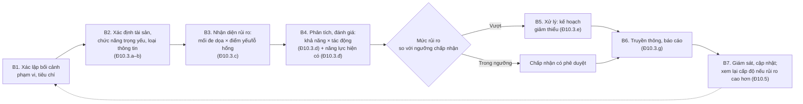

# Quy trình quản lý rủi ro an ninh mạng

> **Căn cứ:** NĐ 331/2026/NĐ-CP Đ10, Đ22.4.c, Đ22.5, Đ28.5, Đ29.2.d, Đ30.3.e, Đ31.2.c; Luật 116/2025/QH15 Đ10.1.b, Đ26.2.đ; TCVN 14423:2026 mục 3.1, 4.1, 5.1, 6.1, 7.1 · **Đối chiếu văn bản gốc:** 24/09/2026 · **Trạng thái:** Bản khung v0.1

> Phần TCVN 14423:2026 là tóm lược để tra cứu; khi lập hồ sơ phải đối chiếu bản chính thức TCVN 14423:2026 (mua tại VSQI).
>
> **Phương pháp chính thức** đánh giá rủi ro ANM **chờ quy định của Bộ trưởng Bộ Công an** (NĐ 331 Đ10.8; "Khung quản lý rủi ro ANM" — Đ34.1.c). Quy trình này là khung tạm thời, bám nội dung tối thiểu Đ10.3; khi BCA ban hành phương pháp/biểu mẫu, thay Phụ lục A–B cho phù hợp.

Mã quy trình: **QT-RR** · Ban hành kèm Quy chế bảo đảm ANM (Điều 38) · Chủ trì: {{DON_VI_CHUYEN_TRACH_ANM}} · Thực hiện: {{DON_VI_VAN_HANH}}, chủ sở hữu nghiệp vụ · Đánh giá độc lập: {{DON_VI_DANH_GIA_DOC_LAP}}.

## 1. Khi nào phải đánh giá rủi ro

| Sự kiện kích hoạt | Căn cứ | Ghi chú |
|---|---|---|
| Xác định cấp độ lần đầu | NĐ 331 Đ10.2.a | Kết quả đưa vào thuyết minh đề xuất cấp độ (Đ22.4.c); cấp 4–5: báo cáo rủi ro chi tiết (Đ22.5) |
| Thay đổi chức năng, phạm vi phục vụ, đối tượng sử dụng, loại thông tin xử lý hoặc công nghệ | Đ10.2.b | Kết hợp cổng [đánh giá trước vận hành](quy-trinh-danh-gia-truoc-van-hanh.md) |
| Mở rộng quy mô, tích hợp, kết nối liên thông, chia sẻ dữ liệu với hệ thống khác | Đ10.2.c | |
| Sự cố ANM nghiêm trọng hoặc nguy cơ cao ảnh hưởng ANQG, TTATXH, lợi ích công cộng | Đ10.2.d | Từ bước B7 [quy trình sự cố](quy-trinh-ung-pho-su-co.md) |
| Yêu cầu của cơ quan nhà nước có thẩm quyền | Đ10.2.đ, Đ10.7 | |
| **Định kỳ** | TCVN 5.1.2.2 (cấp 3: ≥ 01 lần/năm); 6.1.2.2, 7.1.2.2 (cấp 4–5: ≥ 01 lần/6 tháng); cấp 1–2: TCVN chỉ yêu cầu rà soát quy trình ≥ 01 lần/năm (3.1, 4.1) | Tham số `{{CHU_KY_DANH_GIA_RUI_RO}}` — Phụ lục 1 Quy chế |
| Có lỗ hổng mới nghiêm trọng, sự kiện ANM, thay đổi tổ chức | TCVN 5.1.2.2, 5.1.2.3 (cấp 3+) | |

## 2. Các bước

| Bước | Nội dung | Đầu ra | Căn cứ |
|---|---|---|---|
| **B1. Bối cảnh** | Phạm vi HTTT (đúng phạm vi đã xác định theo Đ7.2); tiêu chí khả năng, tác động, ngưỡng chấp nhận (Phụ lục A); người tham gia | Kế hoạch đánh giá | Đ10.1 |
| **B2. Tài sản** | Liệt kê tài sản, chức năng trọng yếu, vai trò; phân loại theo thứ tự quan trọng. Xác định loại thông tin: công cộng/riêng/cá nhân/bí mật nhà nước | Danh mục tài sản xếp hạng | Đ10.3.a–b; Đ9.1 |
| **B3. Nhận diện** | Mối đe dọa (tấn công mạng, mã độc, nội gián, lỗi nhà cung cấp, thiên tai…); điểm yếu, lỗ hổng (kết quả rà quét, kiểm thử, kiểm tra cấu hình); khả năng bị khai thác. **[C3+]** gồm rủi ro từ bên thứ ba, nhà cung cấp | Danh sách kịch bản rủi ro | Đ10.3.c; TCVN 5.1.2.2 |
| **B4. Đánh giá** | Khả năng xảy ra × mức tác động tới ANQG, TTATXH, quyền và lợi ích hợp pháp của tổ chức, cá nhân, lợi ích công cộng → mức rủi ro. Đánh giá năng lực hiện có (phòng ngừa, phát hiện, ứng phó, khắc phục) → rủi ro hiện tại | Sổ rủi ro (Phụ lục B) | Đ10.3.d–đ |
| **B5. Xử lý** | Với rủi ro vượt ngưỡng: giảm thiểu / tránh / chuyển giao / chấp nhận (phải được chủ quản hoặc người được ủy quyền phê duyệt). Kế hoạch: biện pháp, người chịu trách nhiệm, hạn, chi phí; phương án ứng phó khi rủi ro còn lại xảy ra | Kế hoạch xử lý rủi ro | Đ10.3.e; TCVN 5.1.2.4 |
| **B6. Truyền thông, báo cáo** | Báo cáo chủ quản; thông báo kịp thời cho bên liên quan về thay đổi quan trọng; báo cáo cơ quan có thẩm quyền khi được yêu cầu/theo quy định | Báo cáo rủi ro | Đ10.3.g; TCVN 5.1.2.6 |
| **B7. Giám sát, cập nhật** | Theo dõi khả năng, tác động, mức rủi ro, tài sản, biện pháp; đánh giá hiệu quả biện pháp kiểm soát (cấp 3: ≥ 1 lần/năm; cấp 4–5: ≥ 1 lần/6 tháng) | Sổ rủi ro cập nhật | TCVN 5.1.2.4–5.1.2.5, 6.1.2.4, 7.1.2.4 |

## 3. Kết quả đánh giá dùng để làm gì

| Sử dụng | Căn cứ |
|---|---|
| Đề xuất, xác định, điều chỉnh cấp độ (Đ11–Đ16) | NĐ 331 Đ10.4.a |
| Lựa chọn, triển khai biện pháp tương ứng cấp độ | Đ10.4.b |
| Xây dựng, điều chỉnh phương án bảo vệ HTTT, phương án ứng cứu sự cố | Đ10.4.c |
| **Rủi ro cao hơn cấp độ đã xác định → chủ quản phải đề xuất áp dụng cấp độ cao hơn** (xác định lại theo Đ25) | Đ10.5 |
| Nội dung "quản lý rủi ro ANM" trong phương án bảo đảm ANM | Đ29.2.d |

## 4. Tính độc lập và trách nhiệm

- Chủ quản chịu trách nhiệm trước pháp luật về tính trung thực, đầy đủ, chính xác của kết quả đánh giá (NĐ 331 Đ31.2.c).
- Tự đánh giá nội bộ phải do bộ phận/đơn vị **độc lập với đơn vị trực tiếp vận hành** thực hiện, theo biểu mẫu, tiêu chí, phương pháp do cơ quan có thẩm quyền ban hành (Đ31.2.c) → đơn vị vận hành **cung cấp dữ liệu** (B2–B3), {{DON_VI_DANH_GIA_DOC_LAP}} **thẩm tra và kết luận** (B4).
- Thuê tổ chức chuyên môn trong các trường hợp Đ31.2.c gạch 2 (cấp 5/quan trọng về ANQG; sự cố nghiêm trọng; thay đổi lớn; nghi ngờ tự đánh giá; yêu cầu cơ quan có thẩm quyền).
- Lưu giữ hồ sơ đánh giá rủi ro và cung cấp cho cơ quan có thẩm quyền khi thanh tra, kiểm tra (Đ10.6).

## Phụ lục A — Thang đo gợi ý (tổ chức điều chỉnh)

**Khả năng (L):** 1 Hiếm (< 1 lần/5 năm) · 2 Ít (1 lần/2–5 năm) · 3 Có thể (1 lần/năm) · 4 Thường (vài lần/năm) · 5 Gần như chắc chắn.

**Tác động (I)** — lấy mức cao nhất trên các chiều (bám các đối tượng tác động tại Đ10.3.d):

| Mức | ANQG, TTATXH, lợi ích công cộng | Quyền, lợi ích tổ chức/cá nhân (gồm DLCN) | Hoạt động nghiệp vụ |
|---|---|---|---|
| 1 | Không | Không đáng kể | Gián đoạn < `{{…}}` giờ, không mất dữ liệu |
| 2 | Không | Ảnh hưởng ít người dùng, khắc phục được | Gián đoạn ngắn |
| 3 | Có thể ảnh hưởng cục bộ | Lộ DLCN cơ bản quy mô nhỏ; thiệt hại tài chính trung bình | Gián đoạn dịch vụ chính |
| 4 | Ảnh hưởng TTATXH, lợi ích công cộng | Lộ DLCN nhạy cảm/quy mô lớn | Gián đoạn kéo dài, mất dữ liệu quan trọng |
| 5 | Có dấu hiệu xâm phạm ANQG | Thiệt hại nghiêm trọng diện rộng | Tê liệt hoạt động |

**Mức rủi ro R = L × I:** 1–4 Thấp · 5–9 Trung bình · 10–16 Cao · 20–25 Rất cao. **Ngưỡng chấp nhận:** `{{NGUONG_CHAP_NHAN_RUI_RO}}` (gợi ý ≤ 4; 5–9 chấp nhận có phê duyệt của trưởng đơn vị chuyên trách ANM; ≥ 10 bắt buộc xử lý hoặc chủ quản phê duyệt chấp nhận bằng văn bản).

## Phụ lục B — Mẫu sổ rủi ro (risk register)

| Mã | Tài sản / chức năng | Loại thông tin (Đ9.1) | Mối đe dọa | Điểm yếu / lỗ hổng | Biện pháp hiện có | L | I | R | Xử lý (giảm/tránh/chuyển/chấp nhận) | Biện pháp bổ sung | Chủ rủi ro | Hạn | R còn lại | Trạng thái | Ngày cập nhật |
|---|---|---|---|---|---|---|---|---|---|---|---|---|---|---|---|
| RR-01 | {{…}} | | | | | | | | | | | | | | |

## Checklist

- [ ] Có Quy trình này được ban hành (TCVN 3.1a/5.1.2.1a: có quy định, quy trình QLRR gồm xác định, phân tích, đánh giá, xử lý).
- [ ] Đánh giá lần đầu hoàn thành trước khi lập hồ sơ đề xuất cấp độ.
- [ ] Sổ rủi ro có đủ trường theo dõi khả năng, tác động, mức rủi ro, tài sản, biện pháp (TCVN 5.1.2.5).
- [ ] Rủi ro nhà cung cấp đã được nhận diện (cấp 3+).
- [ ] Kết quả đã đối chiếu với cấp độ hiện hành (Đ10.5).
- [ ] Rà soát, cập nhật quy trình theo chu kỳ Phụ lục 1 Quy chế.

## Bằng chứng cần lưu

Kế hoạch đánh giá; danh mục tài sản xếp hạng; sổ rủi ro các phiên bản; kế hoạch xử lý và phê duyệt chấp nhận rủi ro; biên bản thẩm tra độc lập; báo cáo gửi chủ quản; bằng chứng thông báo bên liên quan (NĐ 331 Đ10.6).
