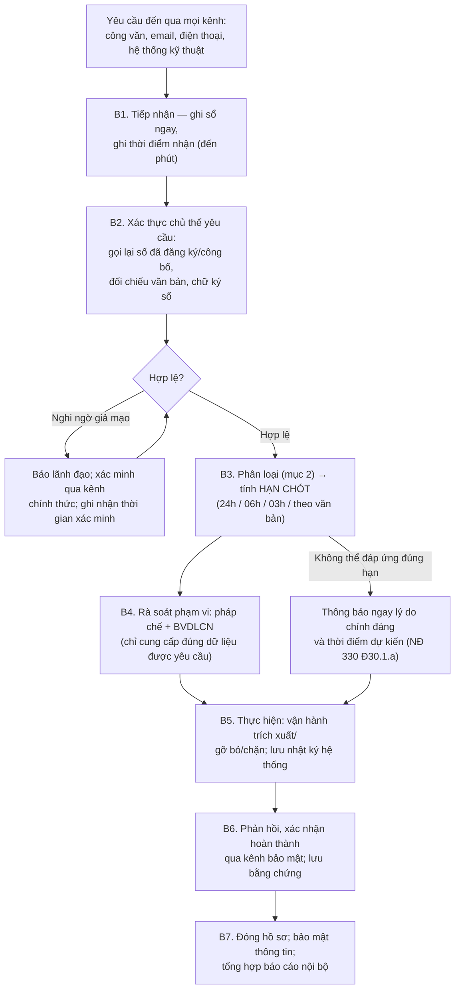

# Quy trình tiếp nhận, xử lý yêu cầu của cơ quan chức năng về an ninh mạng

> **Căn cứ:** Luật 116/2025/QH15 Đ12, Đ25.2, Đ41.5–41.6, Đ42.3–42.4; NĐ 333/2026/NĐ-CP Đ4, Đ7.5–7.6, Đ10.3, Đ11, Đ12, Đ13, Đ14.2, Đ16.3–16.5, Đ18, Đ23; NĐ 331/2026/NĐ-CP Đ26, Đ33.5; NĐ 330/2026/NĐ-CP Đ27.1, Đ29.2, Đ30.1 · **Đối chiếu văn bản gốc:** 24/09/2026 · **Trạng thái:** Bản khung v0.1

Mã quy trình: **QT-YC** · Ban hành kèm Quy chế bảo đảm ANM (Điều 14, 36) · Đầu mối tiếp nhận: {{DON_VI_CHUYEN_TRACH_ANM}} (thường trực {{SDT_TRUC_24_7}}, {{EMAIL_TIEP_NHAN_YEU_CAU}}) · Phối hợp: pháp chế, {{NHAN_SU_BVDLCN}}, {{DON_VI_VAN_HANH}}.

## 1. Phạm vi áp dụng

| Nhóm đối tượng | Áp dụng các mục |
|---|---|
| Mọi chủ quản HTTT | Kiểm tra ANM (mục 2.8), giám sát (2.9), khắc phục lỗ hổng (2.11), mã hóa (2.10), đình chỉ hệ thống (2.7) |
| **Doanh nghiệp (trong nước, nước ngoài) cung cấp dịch vụ trên mạng viễn thông, Internet, dịch vụ gia tăng trên không gian mạng tại Việt Nam** | Thêm: cung cấp thông tin người dùng (2.1), ngăn chặn/gỡ bỏ (2.2–2.4), ngừng dịch vụ (2.5), xóa thông tin (2.6) |
| Doanh nghiệp viễn thông, Internet, hosting, trung tâm dữ liệu, ứng dụng viễn thông | Thêm: NĐ 333 Đ18.2; định danh IP (2.12) |

## 2. Danh mục loại yêu cầu và thời hạn

| # | Loại yêu cầu | Chủ thể yêu cầu | Thời hạn thực hiện (tính từ khi nhận yêu cầu) | Hình thức yêu cầu hợp lệ | Căn cứ | Chế tài |
|---|---|---|---|---|---|---|
| 2.1 | Cung cấp thông tin người sử dụng dịch vụ | Lực lượng chuyên trách bảo vệ ANM thuộc BCA | **≤ 24 giờ**; khẩn cấp đe dọa xâm hại ANQG, tính mạng con người: **≤ 03 giờ** | Văn bản, thư điện tử, điện thoại hoặc hình thức trao đổi khác **đã được xác nhận** (Luật); văn bản, phương tiện điện tử hoặc hình thức khác bảo đảm xác thực chủ thể yêu cầu (NĐ 333) | Luật 116 Đ25.2.a; NĐ 333 Đ16.3 | NĐ 330 Đ30.1.a: 25–50 triệu đồng (không cung cấp/quá 24 giờ không lý do chính đáng) |
| 2.2 | Ngăn chặn chia sẻ, xóa bỏ thông tin, gỡ bỏ dịch vụ, ứng dụng vi phạm; **lưu nhật ký** phục vụ điều tra | Lực lượng chuyên trách thuộc BCA | **≤ 24 giờ**; khẩn cấp đe dọa xâm hại ANQG: **≤ 06 giờ** | Yêu cầu của lực lượng chuyên trách | Luật 116 Đ25.2.b; NĐ 333 Đ16.4.a–b | NĐ 330 Đ29.2.a: 50–70 triệu đồng; buộc ngừng dịch vụ/xóa khỏi kho ứng dụng (Đ29.3.b–c) |
| 2.3 | Ngăn chặn, gỡ bỏ nội dung, dịch vụ, ứng dụng (DN viễn thông, Internet, hosting, data center, ứng dụng viễn thông) | Lực lượng chuyên trách thuộc BCA | **≤ 24 giờ** | Văn bản, điện thoại hoặc thư điện tử | NĐ 333 Đ18.2.a | |
| 2.4 | Hạn chế hiển thị/khóa tạm thời hoặc vô thời hạn tài khoản, trang, nhóm, kênh vi phạm lặp lại; xem xét khôi phục | Theo yêu cầu cơ quan có thẩm quyền | Theo yêu cầu | | NĐ 333 Đ16.4.c–e | |
| 2.5 | Không cung cấp/tạm ngừng/ngừng dịch vụ cho tổ chức, cá nhân đăng tải thông tin vi phạm Luật 116 Đ13.1–13.3, Đ14.2 | Lực lượng chuyên trách thuộc BCA | Theo yêu cầu; bảo đảm đúng phạm vi, đối tượng, thời hạn | | Luật 116 Đ25.2.c; NĐ 333 Đ16.5, Đ18.2.b | NĐ 330 Đ29.2.b |
| 2.6 | Xóa bỏ thông tin trái pháp luật, sai sự thật, tin giả xâm phạm ANQG, TTATXH, quyền và lợi ích hợp pháp | Lực lượng chuyên trách thuộc BCA (HTTT quân sự: BQP) | Theo văn bản yêu cầu **[CẦN ĐỐI CHIẾU: Đ11 không nêu thời hạn riêng; khi là DN dịch vụ áp mốc 24h/06h của mục 2.2]** | Văn bản | NĐ 333 Đ11.2.b | NĐ 330 Đ30.1.c |
| 2.7 | Đình chỉ, tạm đình chỉ, yêu cầu ngừng hoạt động HTTT; tạm ngừng, thu hồi tên miền | Bộ trưởng BCA quyết định; lực lượng chuyên trách thực hiện | Theo quyết định; **cấp bách**: có thể yêu cầu trực tiếp, qua fax, thư điện tử — BCA phải gửi văn bản trong ≤ 24 giờ, quá hạn không có văn bản thì hệ thống được tiếp tục hoạt động | Quyết định + văn bản; lập **biên bản 02 bản** | NĐ 333 Đ13.2–13.4 | |
| 2.8 | Kiểm tra ANM (HTTT không thuộc danh mục ANQG) | Lực lượng chuyên trách thuộc BCA | Theo kế hoạch được thông báo | Thông báo kế hoạch; quyết định thành lập Đoàn kiểm tra | Luật 116 Đ12; NĐ 331 Đ26 | NĐ 330 Đ27.1.a |
| 2.9 | Giám sát ANM | Lực lượng chuyên trách thuộc BCA | Thông báo **trước** bằng văn bản; khẩn cấp: triển khai ngay, văn bản thông báo trong ≤ 24 giờ kể từ khi triển khai | Văn bản thông báo (lý do, phạm vi, nội dung, thời gian) | NĐ 333 Đ7.5.a–b, Đ7.6; NĐ 331 Đ33.5 | NĐ 330 Đ23.2.b, d |
| 2.10 | Mã hóa thông tin (không thuộc bí mật nhà nước) trước khi lưu trữ, truyền đưa trên Internet | Lực lượng chuyên trách | Theo văn bản | Văn bản nêu lý do, phạm vi, nội dung, biện pháp mã hóa | NĐ 333 Đ10.3 | |
| 2.11 | Khắc phục điểm yếu, lỗ hổng bảo mật, hành vi vi phạm | Lực lượng chuyên trách | Theo yêu cầu | | NĐ 330 Đ27.1.c | 25–50 triệu đồng |
| 2.12 | Cung cấp thông tin định danh địa chỉ IP (DN viễn thông, Internet) | Lực lượng chuyên trách | **≤ 24 giờ**; khẩn cấp (ANQG, khủng bố mạng, tấn công mạng, tội phạm đặc biệt nghiêm trọng): **≤ 03 giờ** | Văn bản hoặc yêu cầu điện tử hợp lệ | Luật 116 Đ41.5; NĐ 333 Đ23.2 | |
| 2.13 | Thu thập dữ liệu điện tử phục vụ điều tra | Lực lượng chuyên trách thuộc BCA/BQP | Theo quyết định | Phê duyệt của người có thẩm quyền; biên bản, hình ảnh | NĐ 333 Đ12 | |
| 2.14 | Cung cấp thông tin, phối hợp điều tra, xử lý hành vi vi phạm; tạo điều kiện cho biện pháp bảo vệ ANM | Cơ quan có thẩm quyền | Kịp thời | | Luật 116 Đ41.6, Đ42.3–42.4; NĐ 333 Đ14.2 | NĐ 330 Đ30 |

> **Nguyên tắc cân bằng:** Biện pháp bảo vệ ANM chỉ được áp dụng đúng thẩm quyền, trình tự và **sau khi có quyết định phê duyệt bằng văn bản của người có thẩm quyền** (NĐ 333 Đ4.2). Do đó phải **xác thực** yêu cầu — nhưng đồng hồ 24h/06h/03h **chạy từ khi nhận yêu cầu**, nên việc xác thực phải nhanh (gợi ý ≤ `{{THOI_HAN_XAC_THUC}}` phút với yêu cầu khẩn cấp). Không dùng việc xác thực để trì hoãn.

## 3. Luồng xử lý

| Bước | Nội dung | Ai | Bằng chứng |
|---|---|---|---|
| B1 | Mọi nhân viên nhận được yêu cầu (kể cả qua điện thoại cá nhân) phải chuyển ngay cho đầu mối; đầu mối ghi sổ: số/ký hiệu, cơ quan, người yêu cầu, kênh, **thời điểm nhận** | Đầu mối | Sổ theo dõi (mục 5) |
| B2 | Xác thực: đối chiếu danh bạ cơ quan chức năng đã xác minh (xem [danh bạ](quy-trinh-ung-pho-su-co.md#9-danh-bạ-ứng-phó-sự-cố)); gọi lại số chính thức; kiểm tra văn bản, chữ ký số, email tên miền cơ quan | Đầu mối + pháp chế | Ghi chú xác minh |
| B3 | Xác định loại, hạn chót; khẩn cấp → kích hoạt trực 24/7 | Đầu mối | Sổ |
| B4 | Xác định đúng phạm vi dữ liệu/nội dung; tối thiểu hóa; nếu yêu cầu vượt phạm vi pháp luật, trao đổi lại với cơ quan yêu cầu **song song** với việc chuẩn bị | Pháp chế, {{NHAN_SU_BVDLCN}} | Ý kiến pháp chế |
| B5 | Thực hiện bởi người được phân quyền; **không** thông báo cho người dùng bị yêu cầu nếu cơ quan yêu cầu bảo mật; lưu nhật ký hệ thống liên quan (Luật 116 Đ25.2.b) | {{DON_VI_VAN_HANH}} | Log thao tác, ảnh chụp trước/sau |
| B6 | Gửi phản hồi/xác nhận; dữ liệu cung cấp được bảo vệ (mã hóa, kênh an toàn) — bảo đảm bảo mật thông tin được cung cấp (NĐ 333 Đ16.3.b) | Đầu mối | Bản phản hồi, xác nhận nhận |
| B7 | Lưu hồ sơ; hạn chế người tiếp cận; tổng hợp số liệu định kỳ cho lãnh đạo | Đầu mối | Hồ sơ |

## 4. Quy trình riêng khi có đoàn kiểm tra ANM (NĐ 331 Đ26)

1. Nhận **thông báo kế hoạch kiểm tra** → xác thực, báo lãnh đạo, chỉ định đầu mối phối hợp (Đ26.1.a).
2. Nhận **quyết định thành lập Đoàn kiểm tra**; chuẩn bị hồ sơ: QĐ phê duyệt cấp độ, Quy chế, báo cáo tự đánh giá, sổ sự cố, sổ rủi ro, kết quả rà quét, danh mục tài sản (Đ26.1.b; nội dung kiểm tra Đ27).
3. **Phối hợp chặt chẽ** trong quá trình kiểm tra; bố trí quyền truy cập có giám sát; ghi nhật ký hoạt động của đoàn (Đ26.1.c).
4. Ký **biên bản** quá trình, kết quả kiểm tra; ghi ý kiến (nếu có) (Đ26.1.d). Kết quả kiểm tra được bảo mật (Luật 116 Đ12.4).
5. Nhận **thông báo kết quả**; lập kế hoạch khắc phục, báo cáo kết quả khắc phục (Đ26.1.đ).
6. Trường hợp lực lượng chuyên trách đề nghị **giữ nguyên hiện trạng**/tạm ngừng kiểm tra: văn bản phải ghi rõ lý do, mục đích, thời gian; chủ quản **lập phương án dự phòng bảo đảm tính liên tục** trước khi cách ly hiện trạng, trừ trường hợp khẩn cấp ngăn chặn xâm phạm ANQG (Đ26.2).
7. Chủ quản có thể **chủ động đề nghị** kiểm tra ANM (Luật 116 Đ12.1.b).

## 5. Sổ theo dõi yêu cầu của cơ quan chức năng

| Mã YC | Thời điểm nhận | Kênh | Cơ quan / người yêu cầu | Số, ký hiệu văn bản | Loại (mục 2) | Khẩn cấp? | Hạn chót | Xác thực (cách, người, thời điểm) | Phạm vi được yêu cầu | Người thực hiện | Thời điểm hoàn thành | Đúng hạn? | Phản hồi (số, ngày) | Ghi chú/pháp chế |
|---|---|---|---|---|---|---|---|---|---|---|---|---|---|---|
| YC-{{NAM}}-001 | | | | | | ☐ | | | | | | ☐ | | |

Quy định quản lý sổ:

- [ ] Sổ điện tử có kiểm soát truy cập (chỉ đầu mối, pháp chế, lãnh đạo); nhật ký truy cập sổ.
- [ ] Lưu tối thiểu `{{THOI_GIAN_LUU_SO_YEU_CAU}}` (gợi ý ≥ 5 năm hoặc theo quy định lưu trữ nội bộ).
- [ ] Rà soát tỷ lệ đúng hạn hằng quý; phân tích nguyên nhân trễ hạn.

## 6. Chuẩn bị sẵn (điều kiện tiên quyết để đáp ứng 03h/06h)

- [ ] Thường trực 24/7 và danh sách người được quyền thực hiện ngoài giờ.
- [ ] Công cụ/runbook trích xuất nhanh thông tin người dùng (tài khoản, thời gian đăng nhập/đăng xuất, IP, cổng nguồn — NĐ 333 Đ16.6.b) và gỡ/chặn nội dung theo định danh.
- [ ] Nhật ký hệ thống truy xuất được **≥ 12 tháng** (NĐ 333 Đ16.6.c, Đ20.3).
- [ ] Mẫu văn bản phản hồi; kênh truyền an toàn đã thống nhất với cơ quan chức năng.
- [ ] Diễn tập tình huống "yêu cầu khẩn cấp 03 giờ lúc 2 giờ sáng" ít nhất 01 lần/năm (đưa vào [kế hoạch diễn tập](ke-hoach-dao-tao-dien-tap.md)).

## Bằng chứng cần lưu

Sổ theo dõi; văn bản yêu cầu; ghi chú xác thực; log thao tác thực hiện; văn bản phản hồi; biên bản kiểm tra/đình chỉ (02 bản — NĐ 333 Đ13.4.đ); kế hoạch và báo cáo khắc phục sau kiểm tra.
