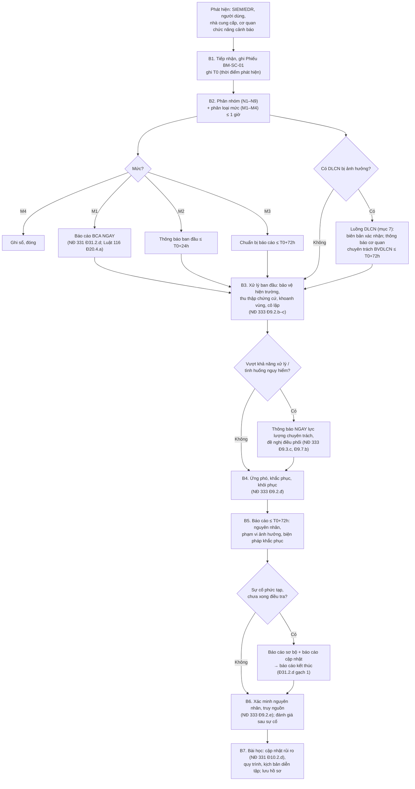

# Quy trình ứng phó sự cố an ninh mạng (hợp nhất thông báo vi phạm dữ liệu cá nhân)

> **Căn cứ:** Luật 116/2025/QH15 Đ2.17–2.18, Đ12.3, Đ20, Đ40.1.c, Đ41.2–41.3; NĐ 331/2026/NĐ-CP Đ10.2.d, Đ28.6, Đ31.2.c–d, Đ31.3; NĐ 333/2026/NĐ-CP Đ9; NĐ 330/2026/NĐ-CP Đ21, Đ54; Luật 91/2025/QH15 Đ23; NĐ 356/2025/NĐ-CP Đ8.3, Đ14, Đ28, Đ29, Mẫu 08; TCVN 14423:2026 mục 3.15, 4.15, 5.16, 6.17, 7.17 · **Đối chiếu văn bản gốc:** 24/09/2026 · **Trạng thái:** Bản khung v0.1

> Phần TCVN 14423:2026 là tóm lược để tra cứu; khi lập hồ sơ phải đối chiếu bản chính thức TCVN 14423:2026 (mua tại VSQI).

Mã quy trình: **QT-SC** · Ban hành kèm Quy chế bảo đảm ANM (Điều 34) · Chủ trì: {{DON_VI_CHUYEN_TRACH_ANM}} · Áp dụng: mọi HTTT thuộc chủ quản {{TEN_TO_CHUC}}.

## 1. Mục đích và nguồn nghĩa vụ

| Nghĩa vụ | Căn cứ | Chế tài nếu vi phạm |
|---|---|---|
| Báo cáo sự cố với cơ quan chuyên trách của Bộ Công an (hệ thống do BQP quản lý: báo cáo lực lượng chuyên trách BQP) | Luật 116 Đ40.1.c; NĐ 331 Đ31.2.d | NĐ 330 Đ21.2.a: 20–30 triệu đồng |
| Mốc 72h / 24h / "ngay" | NĐ 331 Đ31.2.d | NĐ 330 Đ21.3.c (không báo cáo đúng quy trình): 30–50 triệu đồng |
| DN cung cấp dịch vụ trên không gian mạng: phương án ứng cứu khẩn cấp; khi xảy ra sự cố **triển khai ngay** và **báo cáo ngay** | Luật 116 Đ41.2–41.3 | |
| Tình huống nguy hiểm về ANM: kịp thời thông báo lực lượng chuyên trách, áp dụng ngay phương án ứng phó khẩn cấp | Luật 116 Đ20.4.a, Đ20.3.a–b | NĐ 330 Đ18 |
| Xây dựng, duy trì phương án ứng phó; thông báo ngay khi vượt khả năng xử lý; báo cáo kết quả (quy định cho HTTT quan trọng về ANQG — khuyến nghị áp dụng cho mọi hệ thống) | NĐ 333 Đ9.3, Đ9.7 | |
| Đội ứng cứu sự cố, kế hoạch ứng phó, đầu mối, địa chỉ tiếp nhận sự cố | NĐ 330 Đ21.1, Đ21.3.b, Đ21.3.d, Đ21.4.a, Đ21.4.k (hành vi bị xử phạt) | 10–70 triệu đồng tùy hành vi |
| Thông báo vi phạm DLCN chậm nhất 72 giờ | Luật 91 Đ23.1 | NĐ 330 Đ54.3: 40–60 triệu đồng |
| Đánh giá lại rủi ro sau sự cố nghiêm trọng | NĐ 331 Đ10.2.d | |
| Diễn tập | NĐ 331 Đ31.3; TCVN 5.16.1, 6.17.2.6, 7.17.2.6 | |

## 2. Định nghĩa

- **Sự cố ANM:** sự việc bất ngờ xảy ra trên không gian mạng xâm phạm an ninh quốc gia, trật tự, an toàn xã hội, quyền và lợi ích hợp pháp của cơ quan, tổ chức, cá nhân (Luật 116 Đ2.17).
- **Tình huống nguy hiểm về ANM:** trạng thái/diễn biến có yếu tố tấn công, xâm nhập, kích động, làm lộ, mất thông tin… đe dọa xâm phạm nghiêm trọng (Luật 116 Đ2.18); gồm các trường hợp tại Đ20.1 (tấn công HTTT quan trọng về ANQG; tấn công nhiều hệ thống quy mô lớn, cường độ cao…).
- **Vi phạm quy định về bảo vệ DLCN** (gọi tắt "vi phạm DLCN"): gồm lộ, mất, truy cập trái phép, xử lý sai mục đích DLCN (Luật 91 Đ23.1, Đ23.3).
- **T0** = thời điểm **phát hiện** sự cố (mốc tính cả 72h ANM — NĐ 331 Đ31.2.d — và 72h DLCN — Luật 91 Đ23.1). Ghi chính xác đến phút vào Phiếu BM-SC-01.

## 3. Phân nhóm và phân loại mức độ

### 3.1 Phân nhóm sự cố (TCVN yêu cầu "phân nhóm sự cố" — mục 3.15.2.2, 5.16.2.2)

| Mã | Nhóm | Ví dụ |
|---|---|---|
| N1 | Mã độc | Ransomware, trojan, botnet, cryptominer |
| N2 | Xâm nhập, chiếm quyền | Khai thác lỗ hổng, chiếm tài khoản quản trị, webshell |
| N3 | Từ chối dịch vụ | DDoS làm gián đoạn dịch vụ |
| N4 | Lộ, lọt, mất dữ liệu | Rò rỉ CSDL, cấu hình lưu trữ công khai, nhân viên đưa dữ liệu ra ngoài |
| N5 | Thay đổi, phá hoại nội dung | Deface, chèn nội dung vi phạm Luật 116 Đ13 |
| N6 | Lừa đảo, giả mạo | Phishing nhắm nhân viên, giả mạo thương hiệu/tên miền |
| N7 | Sự cố từ nhà cung cấp/chuỗi cung ứng | Nhà cung cấp đám mây, SaaS, thư viện bị xâm phạm |
| N8 | Vi phạm nội bộ | Lạm dụng quyền, truy cập trái phép |
| N9 | Khác | |

### 3.2 Mức độ (nội bộ) và ánh xạ nghĩa vụ báo cáo

> **[CẦN ĐỐI CHIẾU]** NĐ 331/333 **không định nghĩa** "sự cố ANM nghiêm trọng" và "gián đoạn nghiêm trọng". Tiêu chí dưới đây là đề xuất nội bộ, cần cập nhật khi Bộ trưởng Bộ Công an ban hành quy định về giám sát, ứng phó, khắc phục sự cố (NĐ 331 Đ28.6). Khi nghi ngờ, **xếp mức cao hơn**.

| Mức | Tên | Tiêu chí gợi ý (thỏa một) | Nghĩa vụ báo cáo BCA |
|---|---|---|---|
| **M1** | Đặc biệt nghiêm trọng | Có dấu hiệu xâm phạm an ninh quốc gia, trật tự, an toàn xã hội; gây **gián đoạn nghiêm trọng** hoạt động HTTT (ví dụ: dịch vụ chính ngừng > `{{NGUONG_GIAN_DOAN_M1}}` giờ, hoặc HTTT cấp 4–5 bị gián đoạn); thuộc tình huống nguy hiểm (Luật 116 Đ20.1); tấn công có chủ đích vào hệ thống cấp 4–5 | **Ngay khi phát hiện** (NĐ 331 Đ31.2.d gạch 3) + báo cáo 72h |
| **M2** | Nghiêm trọng | Chiếm quyền quản trị; mã độc mã hóa dữ liệu; lộ dữ liệu quan trọng hoặc DLCN quy mô ≥ `{{NGUONG_SO_CHU_THE}}` chủ thể/DLCN nhạy cảm; gián đoạn dịch vụ > `{{NGUONG_GIAN_DOAN_M2}}` giờ; ảnh hưởng nhiều tổ chức/người dùng bên ngoài | **Thông báo ban đầu ≤ 24h** (gạch 2) + báo cáo **≤ 72h** (gạch 1) |
| **M3** | Trung bình | Xâm nhập bị chặn một phần; mã độc trên một số máy trạm đã cô lập; gián đoạn ngắn, không ảnh hưởng dữ liệu | Báo cáo **≤ 72h** (nguyên nhân, phạm vi, biện pháp — NĐ 331 Đ31.2.d gạch 1) **[CẦN ĐỐI CHIẾU: Đ31.2.d không giới hạn mức độ cho mốc 72h → hiểu an toàn là mọi sự cố ANM đều báo cáo]** |
| **M4** | Thấp / sự kiện | Sự kiện ANM đã chặn tự động, không có tác động (quét cổng, phishing bị lọc) | Không phải sự cố theo Luật 116 Đ2.17 → ghi sổ nội bộ; tổng hợp vào báo cáo năm |

**Doanh nghiệp cung cấp dịch vụ trên không gian mạng:** với mọi sự cố M1–M3 ảnh hưởng dịch vụ cung cấp → **báo cáo ngay** (Luật 116 Đ41.3), sau đó bổ sung báo cáo 72h.

## 4. Tổ chức lực lượng ứng phó

| Vai trò | Người | Dự phòng | Nhiệm vụ |
|---|---|---|---|
| Chỉ huy ứng phó (người chủ chốt) | {{HO_TEN}} | {{HO_TEN_DU_PHONG}} | Quyết định phân loại, cô lập, báo cáo ra ngoài (TCVN 3.15.2.1a, 5.16.2.1a) |
| Đầu mối liên lạc với cơ quan chức năng | {{HO_TEN}} | | Gửi thông báo/báo cáo BCA; duy trì đầu mối với cơ quan QLNN, cơ quan điều hành Liên minh ứng phó sự cố quốc gia (TCVN 4.15.2.1b, 5.16.2.1b) |
| Kỹ thuật – phân tích | {{HO_TEN}} | | Thu thập chứng cứ, phân tích, khoanh vùng |
| Vận hành hệ thống | {{DON_VI_VAN_HANH}} | | Cô lập, khôi phục, vá |
| Bảo vệ DLCN | {{NHAN_SU_BVDLCN}} | | Đánh giá tác động DLCN, lập biên bản, thông báo 72h (NĐ 356 Đ14.1.d) |
| Pháp chế / truyền thông | {{HO_TEN}} | | Thông báo chủ thể dữ liệu, khách hàng, báo chí |
| Lãnh đạo phê duyệt | {{CHUC_DANH_NGUOI_DUNG_DAU}} | | Phê duyệt báo cáo, quyết định ngừng dịch vụ |

- [ ] Thường trực 24/7: {{SDT_TRUC_24_7}} — khuyến nghị cho mọi tổ chức; đối với doanh nghiệp viễn thông/Internet, "không thiết lập đầu mối thường trực 24/7" là hành vi bị phạt (NĐ 330 Đ21.4.k).
- [ ] Công bố **địa chỉ tiếp nhận sự cố** trên trang/cổng thông tin điện tử: {{URL_TIEP_NHAN_SU_CO}} (NĐ 330 Đ21.1.a).
- [ ] Khai báo, cập nhật đầu mối ứng cứu sự cố, nhân lực kỹ thuật với lực lượng chuyên trách thuộc Bộ Công an; cập nhật khi thay đổi (NĐ 330 Đ21.1.b–c) **[CẦN ĐỐI CHIẾU: thời hạn cập nhật "đúng thời gian quy định" — chưa tìm thấy quy định cụ thể trong NĐ 331/333]**.
- [ ] Tham gia mạng lưới ứng cứu sự cố ANM quốc gia (NĐ 330 Đ21.4.a; NĐ 333 Đ9.8).
- [ ] Cơ chế liên lạc chính và phụ (kênh dự phòng khi email/chat nội bộ bị xâm phạm) — TCVN 6.17.2.4 (cấp 4+), khuyến nghị mọi cấp.

## 5. Luồng xử lý

### Chi tiết từng bước

| Bước | Việc | Ai (R) | Thời hạn | Bằng chứng |
|---|---|---|---|---|
| B1 | Tiếp nhận qua mọi kênh (SIEM, {{KENH_BAO_SU_CO_NOI_BO}}, {{URL_TIEP_NHAN_SU_CO}}, cảnh báo của cơ quan chức năng — NĐ 333 Đ7.6.d); mở Phiếu BM-SC-01; ghi T0 | Trực ANM | Ngay | Phiếu, ticket |
| B2 | Phân nhóm, phân loại; xác định DLCN bị ảnh hưởng; chỉ huy ứng phó phê duyệt mức | Chỉ huy ứng phó | ≤ `{{THOI_HAN_PHAN_LOAI}}` (gợi ý 1 giờ) | Phiếu (mục phân loại) |
| B3 | Bảo vệ hiện trường: chụp ảnh bộ nhớ, sao lưu log, **không** xóa/cài lại trước khi thu chứng cứ; khoanh vùng, cô lập (NĐ 333 Đ9.2.b–c). Nếu lực lượng chuyên trách đề nghị giữ nguyên hiện trạng: lập phương án dự phòng bảo đảm tính liên tục trước khi cách ly, trừ trường hợp khẩn cấp (NĐ 331 Đ26.2) | Kỹ thuật + Vận hành | Ngay | Chuỗi lưu giữ chứng cứ (hash, người giữ, thời điểm) |
| B4 | Loại trừ nguyên nhân, vá, khôi phục từ bản sao lưu sạch, giám sát tăng cường | Vận hành | Theo RTO | Nhật ký thay đổi, biên bản khôi phục |
| B5 | Báo cáo BCA theo mốc tại mục 6 | Đầu mối liên lạc | Mục 6 | Bản báo cáo + bằng chứng gửi (email/phần mềm BCA — NĐ 331 Đ35.1) |
| B6 | Điều tra nguyên nhân gốc; đánh giá sau sự cố trong ≤ `{{THOI_HAN_DANH_GIA_SAU_SC}}` ngày | Chỉ huy ứng phó | | BM-SC-05 |
| B7 | Cập nhật sổ rủi ro; đánh giá lại rủi ro nếu M1–M2 (NĐ 331 Đ10.2.d); cân nhắc đánh giá bởi tổ chức chuyên môn khi sự cố nghiêm trọng (Đ31.2.c) | ANM | | Sổ rủi ro, kế hoạch khắc phục |

## 6. Mốc báo cáo — bảng hợp nhất (ANM + DLCN)

| Mốc (tính từ T0) | Việc | Gửi ai | Nội dung tối thiểu | Căn cứ |
|---|---|---|---|---|
| **Ngay khi phát hiện** | Báo cáo sự cố có dấu hiệu xâm phạm ANQG, TTATXH hoặc gây gián đoạn nghiêm trọng | Cơ quan chuyên trách của BCA (HTTT do BQP quản lý: lực lượng chuyên trách BQP) | Thông tin sơ bộ | NĐ 331 Đ31.2.d |
| **Ngay** | DN cung cấp dịch vụ: triển khai phương án ứng cứu khẩn cấp + báo cáo | Lực lượng chuyên trách bảo vệ ANM | | Luật 116 Đ41.3 |
| **Kịp thời** | Tình huống nguy hiểm về ANM | Lực lượng chuyên trách bảo vệ ANM | | Luật 116 Đ20.4.a |
| **Kịp thời** | Bên xử lý DLCN (nếu tổ chức là bên xử lý) thông báo bên kiểm soát | Bên kiểm soát / kiểm soát và xử lý DLCN | | Luật 91 Đ23.1 |
| **≤ 24 giờ** | Thông báo ban đầu về sự cố ANM **nghiêm trọng** | Cơ quan chuyên trách của BCA | BM-SC-02 | NĐ 331 Đ31.2.d |
| **≤ 72 giờ** | Báo cáo nguyên nhân, phạm vi ảnh hưởng, biện pháp khắc phục; sự cố phức tạp: thông tin sơ bộ + biện pháp, sau đó báo cáo cập nhật và báo cáo kết thúc | Cơ quan chuyên trách của BCA | BM-SC-03 | NĐ 331 Đ31.2.d |
| **≤ 72 giờ** | Thông báo vi phạm DLCN có thể gây tổn hại đến quốc phòng, ANQG, TTATXH hoặc xâm phạm tính mạng, sức khỏe, danh dự, nhân phẩm, tài sản của chủ thể | Cơ quan chuyên trách bảo vệ DLCN (đơn vị thuộc BCA — NĐ 356 Đ39.1) hoặc qua Cổng thông tin quốc gia về bảo vệ DLCN | Mẫu số 08 NĐ 356; nội dung NĐ 356 Đ28.1 | Luật 91 Đ23.1; NĐ 356 Đ28.2 |
| **≤ 72 giờ** | Lộ, mất **dữ liệu nhạy cảm** trong lĩnh vực tài chính, ngân hàng, thông tin tín dụng: thông báo cơ quan chuyên trách **và chủ thể dữ liệu** | Như trên + chủ thể dữ liệu | Nội dung NĐ 356 Đ28.1 | NĐ 356 Đ8.3 |
| **≤ 72 giờ** | Vi phạm liên quan **dữ liệu vị trí/sinh trắc học**: thông báo chủ thể dữ liệu bị ảnh hưởng + báo cáo cơ quan có thẩm quyền | Chủ thể dữ liệu; cơ quan chuyên trách BVDLCN | NĐ 356 Đ29.2 (6 nội dung) | NĐ 356 Đ29.1.a–b |
| Khi có yêu cầu | Tổng hợp, báo cáo diễn biến sự cố | Lực lượng chuyên trách thuộc BCA | | NĐ 330 Đ21.3.a |
| Sau khi hoàn thành | Báo cáo kết thúc: kết quả xử lý, nguyên nhân, hậu quả, biện pháp đã áp dụng | Lực lượng chuyên trách | BM-SC-03 (phần kết thúc) | NĐ 331 Đ31.2.d; NĐ 333 Đ9.3.đ, Đ9.7.e |
| Hằng năm | Tổng hợp sự cố vào báo cáo năm | Chủ quản (trước 20/12) → BCA (trước 25/12) | Mẫu 08 NĐ 331 | NĐ 331 Đ35.4 |

**Lưu ý hợp nhất:**

- Hai mốc 72 giờ (ANM và DLCN) **cùng tính từ khi phát hiện** nhưng gửi **hai đầu mối khác nhau** (cơ quan chuyên trách ANM của BCA và cơ quan chuyên trách bảo vệ DLCN — cùng thuộc BCA). Chuẩn bị **một bộ dữ kiện chung** (BM-SC-01), xuất ra hai văn bản: BM-SC-03 (ANM) và Mẫu 08 NĐ 356 (DLCN). **[CẦN ĐỐI CHIẾU]** khả năng dùng một văn bản/kênh cho cả hai nghĩa vụ — chưa có hướng dẫn.
- Luật 91 Đ23 dùng "phát hiện **hành vi vi phạm**"; NĐ 331 dùng "phát hiện **sự cố**" — thời điểm có thể khác nhau (ví dụ phát hiện sự cố xâm nhập ngày D, xác định có lộ DLCN ngày D+2). Khuyến nghị: tính T0 DLCN là thời điểm **có căn cứ hợp lý** cho thấy DLCN bị ảnh hưởng, nhưng ghi nhận cả hai mốc; khi nghi ngờ, lấy mốc sớm hơn.
- Phạt chậm hơn 72 giờ thông báo DLCN: 40–60 triệu đồng (NĐ 330 Đ54.3); cố ý che giấu, sai lệch thông tin về quy mô, loại dữ liệu, số chủ thể: 10–20 triệu đồng (NĐ 330 Đ54.1.c).
- Lập **biên bản xác nhận** về việc xảy ra vi phạm DLCN (Luật 91 Đ23.2; không lập: NĐ 330 Đ54.1.b). Hồ sơ vi phạm dữ liệu vị trí/sinh trắc học lưu ≥ **5 năm** kể từ khi khắc phục xong (NĐ 356 Đ29.1.c).

## 7. Luồng DLCN chi tiết

- [ ] {{NHAN_SU_BVDLCN}} tham gia từ B2; xác định: loại DLCN (cơ bản/nhạy cảm — NĐ 356 Đ3, Đ4), số lượng chủ thể, vai trò của tổ chức (bên kiểm soát / kiểm soát và xử lý / bên xử lý / bên thứ ba).
- [ ] Đánh giá ngưỡng: vi phạm "có thể gây tổn hại đến quốc phòng, ANQG, TTATXH hoặc xâm phạm tính mạng, sức khỏe, danh dự, nhân phẩm, tài sản của chủ thể" → bắt buộc thông báo 72h (Luật 91 Đ23.1). Các trường hợp khác tại Luật 91 Đ23.3 (phát hiện vi phạm, xử lý sai mục đích, không bảo đảm quyền chủ thể) cũng phải thông báo — **không nêu thời hạn** → thông báo sớm nhất có thể.
- [ ] Lập biên bản xác nhận vi phạm (BM-SC-04).
- [ ] Soạn thông báo theo Mẫu số 08 NĐ 356 (thông tin tổ chức; nhân sự BVDLCN; mô tả thời gian, địa điểm, hành vi, tổ chức/cá nhân liên quan, loại và số lượng DLCN; hậu quả; biện pháp; tài liệu kèm; cam kết).
- [ ] Thông báo chủ thể dữ liệu khi thuộc NĐ 356 Đ8.3 hoặc Đ29.1.a (nội dung Đ29.2: thời điểm và hình thức phát hiện; loại dữ liệu; mức độ và rủi ro; biện pháp; hướng dẫn phòng ngừa; liên hệ).
- [ ] Ngăn chặn vi phạm, khắc phục hậu quả, phối hợp cơ quan chuyên trách (Luật 91 Đ23.4; không thực hiện: NĐ 330 Đ54.4 — 60–80 triệu đồng).

## 8. Mẫu biểu nội bộ

> Biểu mẫu báo cáo sự cố chính thức gửi BCA: **chờ quy định của Bộ trưởng Bộ Công an** (NĐ 331 Đ28.6). Các mẫu dưới đây là mẫu nội bộ, thiết kế để chứa đủ dữ kiện mà Đ31.2.d yêu cầu (nguyên nhân, phạm vi ảnh hưởng, biện pháp khắc phục).

### BM-SC-01 — Phiếu ghi nhận và phân loại sự cố

| Trường | Nội dung |
|---|---|
| Mã sự cố | SC-{{NAM}}-{{SO}} |
| Hệ thống / cấp độ | {{TEN_HE_THONG}} / {{CAP_DO}} |
| T0 — thời điểm phát hiện (ngày, giờ, phút) | |
| Nguồn phát hiện | ☐ SIEM/EDR ☐ Người dùng ☐ Nhà cung cấp ☐ Cơ quan chức năng ☐ Bên ngoài |
| Người phát hiện / liên hệ | |
| Mô tả ban đầu | |
| Nhóm (N1–N9) / Mức (M1–M4) / người phê duyệt phân loại, thời điểm | |
| Có dấu hiệu xâm phạm ANQG, TTATXH? Gián đoạn nghiêm trọng? | ☐ Có ☐ Không — lý do |
| DLCN bị ảnh hưởng? Loại, số chủ thể ước tính | |
| Tài sản bị ảnh hưởng | |
| Hành động xử lý ban đầu (thời điểm) | |
| Mốc báo cáo phải đáp ứng (tự tính) | Ngay: … / 24h: … / 72h ANM: … / 72h DLCN: … |

### BM-SC-02 — Thông báo ban đầu sự cố ANM (≤ 24 giờ / "ngay")

> **Kính gửi:** {{CO_QUAN_CHUYEN_TRACH_BCA}} *(lực lượng chuyên trách bảo vệ ANM thuộc Bộ Công an — thông tin liên hệ: {{LIEN_HE_BCA}} [CẦN ĐỐI CHIẾU thông tin chính thức])*
>
> 1. Chủ quản HTTT: {{TEN_TO_CHUC}}; đầu mối: {{HO_TEN}}, {{SDT}}, {{EMAIL}}.
> 2. Hệ thống bị ảnh hưởng: {{TEN_HE_THONG}}, cấp độ {{CAP_DO}}, QĐ phê duyệt số {{…}}.
> 3. Thời điểm phát hiện (T0): … ; thời điểm xảy ra (nếu biết): …
> 4. Mô tả sơ bộ: nhóm sự cố, dấu hiệu, phạm vi đã biết.
> 5. Đánh giá sơ bộ mức độ; có/không dấu hiệu xâm phạm ANQG, TTATXH, gián đoạn nghiêm trọng.
> 6. Biện pháp đã áp dụng; đề nghị hỗ trợ (nếu có).
> 7. Thời điểm dự kiến gửi báo cáo 72 giờ.

### BM-SC-03 — Báo cáo sự cố ANM (≤ 72 giờ / cập nhật / kết thúc)

| Mục | Nội dung |
|---|---|
| Loại báo cáo | ☐ 72 giờ ☐ Sơ bộ (sự cố phức tạp) ☐ Cập nhật số … ☐ Kết thúc |
| 1. Thông tin chung | Như BM-SC-02 mục 1–3 |
| 2. **Nguyên nhân** | Đã xác định / giả thuyết; vector tấn công; lỗ hổng khai thác |
| 3. **Phạm vi ảnh hưởng** | Tài sản, dữ liệu (có DLCN?), người dùng, thời gian gián đoạn, tổ chức bên ngoài bị ảnh hưởng |
| 4. **Biện pháp khắc phục** | Đã làm / đang làm / kế hoạch; thời điểm khôi phục |
| 5. Chứng cứ đã thu thập, bảo quản | |
| 6. Đánh giá tác động (với báo cáo kết thúc) | Nguyên nhân gốc, hậu quả, bài học |
| 7. Kiến nghị | |

### BM-SC-04 — Biên bản xác nhận vi phạm quy định về bảo vệ DLCN (Luật 91 Đ23.2)

Thời gian, địa điểm lập; thành phần (chỉ huy ứng phó, {{NHAN_SU_BVDLCN}}, đại diện đơn vị vận hành, pháp chế); mô tả hành vi vi phạm; loại, số lượng DLCN và số chủ thể; thời điểm phát hiện; hậu quả có thể xảy ra; biện pháp ngăn chặn đã áp dụng; kết luận có/không thuộc diện thông báo 72 giờ; chữ ký.

### BM-SC-05 — Đánh giá sau sự cố

Dòng thời gian; điều gì hiệu quả/không hiệu quả; nguyên nhân gốc; hành động khắc phục (người, hạn); cập nhật sổ rủi ro; cập nhật quy trình/kịch bản diễn tập; có cần đánh giá bởi tổ chức chuyên môn (NĐ 331 Đ31.2.c)?

## 9. Danh bạ ứng phó sự cố

> Xác minh, cập nhật danh bạ **ít nhất hằng năm** (TCVN 3.15.2.1b, 5.16.2.1c, 6.17.2.1b) và khi thay đổi. Không điền số điện thoại cá nhân vào bản công khai.

| Đối tượng | Đầu mối | Kênh chính | Kênh phụ | Ngày xác minh |
|---|---|---|---|---|
| Chỉ huy ứng phó | {{HO_TEN}} | {{SDT}} | {{…}} | |
| Người dự phòng | {{HO_TEN}} | | | |
| Lãnh đạo chủ quản | {{HO_TEN}} | | | |
| Đơn vị vận hành / trực hệ thống | {{…}} | | | |
| {{NHAN_SU_BVDLCN}} | | | | |
| Lực lượng chuyên trách bảo vệ ANM thuộc BCA | {{LIEN_HE_BCA}} **[CẦN ĐỐI CHIẾU]** | | | |
| Công an tỉnh/thành phố (lực lượng ANM địa phương) | {{LIEN_HE_CONG_AN_TINH}} | | | |
| Cơ quan chuyên trách bảo vệ DLCN / Cổng thông tin quốc gia về bảo vệ DLCN | {{LIEN_HE_BVDLCN}} | | | |
| Cơ quan điều hành mạng lưới/Liên minh ứng phó sự cố ANM quốc gia | {{…}} | | | |
| Trung tâm An ninh mạng quốc gia (kết nối giám sát — Luật 116 Đ40.1.b) | {{…}} | | | |
| Nhà cung cấp trung tâm dữ liệu/đám mây | {{NHA_CUNG_CAP}} | | | |
| Nhà cung cấp dịch vụ giám sát (SOC)/EDR | {{…}} | | | |
| Nhà cung cấp dịch vụ ứng cứu sự cố thuê ngoài | {{…}} | | | |
| Cơ quan quản lý chuyên ngành (nếu có) | {{…}} | | | |

## 10. Diễn tập

| Yêu cầu | Căn cứ |
|---|---|
| Diễn tập bảo đảm ANM trong hoạt động của tổ chức; tham gia diễn tập quốc gia, quốc tế do BCA tổ chức | NĐ 331 Đ31.3 |
| Cấp 3: định kỳ diễn tập phương án xử lý sự cố (không ấn định chu kỳ) | TCVN 14423:2026 mục 5.16.1 |
| Cấp 4–5: có kế hoạch và diễn tập kịch bản ít nhất 01 lần/năm | TCVN 14423:2026 mục 6.17.2.6, 7.17.2.6 |

Kịch bản gợi ý và kế hoạch năm: xem [ke-hoach-dao-tao-dien-tap.md](ke-hoach-dao-tao-dien-tap.md). Mỗi cuộc diễn tập phải kiểm tra được: (1) phân loại đúng mức; (2) đáp ứng mốc "ngay/24h/72h" trên giấy; (3) quyết định có/không thông báo DLCN; (4) kênh liên lạc phụ.

## 11. Bằng chứng cần lưu

| Bằng chứng | Thời gian lưu gợi ý | Phục vụ |
|---|---|---|
| Sổ sự cố (mọi mức, kể cả M4) | ≥ `{{THOI_GIAN_LUU_HO_SO_SU_CO}}` (gợi ý 5 năm, đồng bộ NĐ 356 Đ29.1.c) | Kiểm tra NĐ 331 Đ27; NĐ 330 Đ21.3.c |
| Phiếu BM-SC-01…05, bản gửi và xác nhận gửi | như trên | Chứng minh đúng hạn |
| Chứng cứ kỹ thuật (log, image) và chuỗi lưu giữ | Theo yêu cầu điều tra | NĐ 333 Đ9.2.b, Đ9.10 |
| Biên bản xác nhận vi phạm DLCN, Mẫu 08 NĐ 356 đã gửi | ≥ 5 năm (vị trí/sinh trắc học — NĐ 356 Đ29.1.c) | Luật 91 Đ23.2 |
| Ảnh chụp trang công bố địa chỉ tiếp nhận sự cố; văn bản khai báo đầu mối | Hiện hành + lịch sử | NĐ 330 Đ21.1 |
| Kế hoạch, biên bản diễn tập | 3 năm | NĐ 331 Đ27.1.a (nội dung "diễn tập") |
