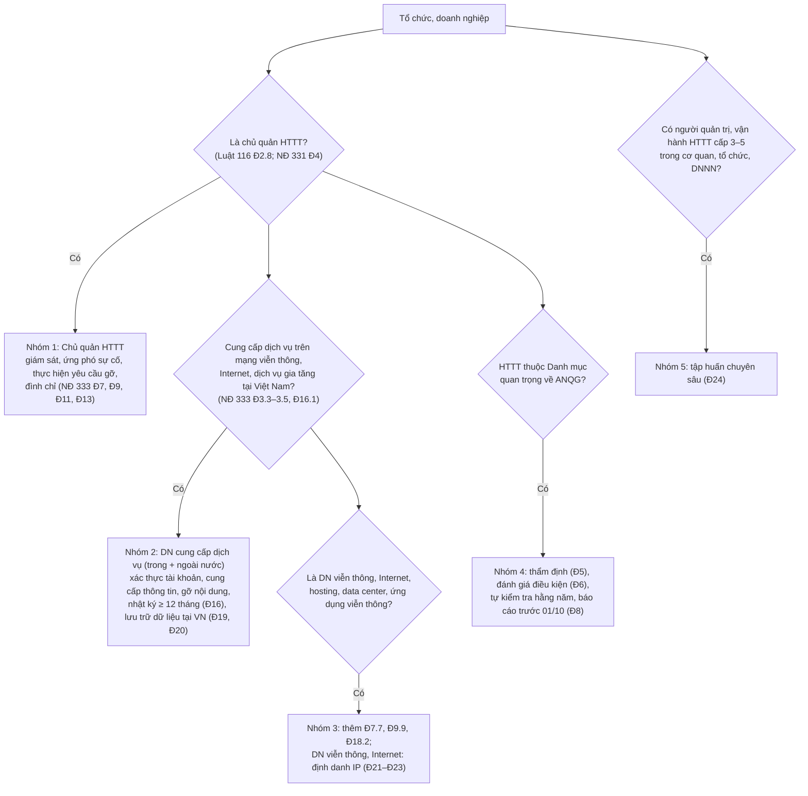

# Nghĩa vụ theo Nghị định 333/2026/NĐ-CP

> **Căn cứ:** NĐ 333/2026/NĐ-CP Đ1–Đ31 (chi tiết Luật 116/2025/QH15 Đ5.1, Đ25.2–25.4, Đ34.5, Đ41.5); đối chiếu mức phạt tại NĐ 330/2026/NĐ-CP Đ7, Đ12, Đ21, Đ23, Đ26, Đ29, Đ30, Đ32, Đ33, Đ34 · **Đối chiếu văn bản gốc:** 24/09/2026 · **Trạng thái:** Bản khung v0.1

NĐ 333 (hiệu lực 19/8/2026 — Đ30) quy định: trình tự áp dụng các biện pháp bảo vệ ANM (Chương II), **bảo đảm an ninh thông tin mạng** với doanh nghiệp cung cấp dịch vụ (Chương III), **định danh địa chỉ IP** (Chương IV) và **tập huấn chuyên sâu** về ANM (Chương V). Tài liệu này liệt kê nghĩa vụ của **tổ chức, doanh nghiệp** (không liệt kê nhiệm vụ của cơ quan nhà nước trừ khi cần để hiểu thời hạn).

> **Mức phạt** trong bảng là mức áp dụng cho **tổ chức** = 2 lần khung ghi trong NĐ 330 Mục 1–5 (NĐ 330 Đ7.1). Chi tiết: [nd-330-muc-phat.md](nd-330-muc-phat.md).

---

## 1. Ai thuộc diện áp dụng?

## 2. Bảng nghĩa vụ

### 2.1. Chủ quản HTTT (mọi cấp độ)

| # | Nghĩa vụ | Đối tượng áp dụng | Thời hạn / tần suất | Điều khoản | Bằng chứng cần lưu | Phạt nếu vi phạm (tổ chức) |
|---|---|---|---|---|---|---|
| 1 | Tổ chức **giám sát ANM** HTTT thuộc phạm vi quản lý; cơ chế tự giám sát, tự cảnh báo, tiếp nhận cảnh báo; duy trì hệ thống giám sát và hệ thống phòng, chống mã độc tập trung đáp ứng yêu cầu **kết nối, chia sẻ dữ liệu cảnh báo** với cơ quan có thẩm quyền | Chủ quản HTTT | Thường xuyên | NĐ 333 Đ7.2; Luật 116 Đ40.1.b | Sơ đồ giải pháp giám sát (SIEM/SOC), danh mục nguồn log, quy trình cảnh báo, hồ sơ kết nối với Trung tâm ANM (khi có hướng dẫn) | Không kiểm tra, giám sát tuân thủ, lưu nhật ký: 60–100 tr (NĐ 330 Đ23.2.a) |
| 2 | Khi lực lượng chuyên trách triển khai giám sát: phối hợp; bảo đảm điều kiện kỹ thuật; cung cấp, cập nhật thông tin cấu hình, kết nối, vận hành khi có yêu cầu; tiếp nhận, xử lý cảnh báo và khắc phục theo yêu cầu | Chủ quản HTTT được thông báo | Theo văn bản thông báo (lực lượng chuyên trách thông báo trước, trừ khẩn cấp; khẩn cấp thì gửi văn bản trong 24 giờ sau khi triển khai — Đ7.5.a–b) | NĐ 333 Đ7.6 | Văn bản thông báo nhận được, biên bản phối hợp, phiếu xử lý cảnh báo | Không phối hợp giám sát: 60–100 tr (NĐ 330 Đ23.2.b); cản trở trao đổi dữ liệu giám sát giữa đơn vị được thuê và lực lượng chuyên trách: 60–100 tr (Đ23.2.d) |
| 3 | Ứng phó, khắc phục sự cố: xây dựng, ban hành, duy trì phương án; phát hiện, phân loại, triển khai ứng phó ban đầu; **thông báo ngay** lực lượng chuyên trách khi sự cố vượt khả năng xử lý hoặc có tình huống nguy hiểm; phối hợp; **báo cáo kết quả xử lý** sau khi khắc phục | Chủ quản HTTT (xem vùng chưa rõ 3.1) | Ngay; báo cáo sau khi hoàn thành | NĐ 333 Đ9.3, Đ9.7; mốc 24h/72h: NĐ 331 Đ31.2.d | Phương án ứng phó đã ban hành, nhật ký sự cố, báo cáo sự cố, báo cáo kết thúc | Nhiều mức tại NĐ 330 Đ21 (20–140 tr); xem [nd-330-muc-phat.md](nd-330-muc-phat.md) mục B |
| 4 | Khi lực lượng chuyên trách yêu cầu (vì ANQG, TTATXH…) **mã hóa** thông tin không thuộc bí mật nhà nước trước khi lưu trữ, truyền đưa trên Internet | Cơ quan, tổ chức, cá nhân nhận văn bản yêu cầu | Theo văn bản yêu cầu (nêu lý do, phạm vi, biện pháp) | NĐ 333 Đ10.3 | Văn bản yêu cầu, bằng chứng đã mã hóa | Không thấy hành vi tương ứng trong NĐ 330 |
| 5 | **Xóa bỏ** thông tin trái pháp luật, thông tin sai sự thật xâm phạm ANQG, TTATXH, quyền lợi hợp pháp khi lực lượng chuyên trách BCA gửi văn bản yêu cầu | DN cung cấp dịch vụ trên mạng viễn thông, Internet, dịch vụ gia tăng; **chủ quản HTTT** | Theo văn bản yêu cầu (với DN nhóm 2: 24h/06h — dòng 9) | NĐ 333 Đ11.2.b | Văn bản yêu cầu, log thao tác gỡ, xác nhận hoàn thành | 50–100 tr (NĐ 330 Đ32.1.a) |
| 6 | Thực hiện quyết định **đình chỉ, tạm đình chỉ, yêu cầu ngừng hoạt động HTTT**; khẩn cấp có thể nhận yêu cầu trực tiếp/fax/email, văn bản chính thức gửi trong 24 giờ, quá hạn không có văn bản thì HTTT được tiếp tục hoạt động; lập biên bản 02 bản, mỗi bên giữ 01 | Cơ quan, tổ chức, cá nhân sở hữu, quản lý HTTT | Theo quyết định | NĐ 333 Đ13.4.c–đ | Quyết định, biên bản (bản lưu của tổ chức) | Không đình chỉ/ngừng HTTT, thu hồi tên miền khi có đề nghị: 50–100 tr (NĐ 330 Đ32.1.b) |
| 7 | Phối hợp với cơ quan chức năng ngăn chặn, xử lý DN cung cấp dịch vụ qua biên giới đã bị công bố vi phạm | Tổ chức, DN Việt Nam | Khi có yêu cầu | NĐ 333 Đ14.3 | Văn bản phối hợp | — |
| 8 | Thông báo, phối hợp với cơ quan có thẩm quyền khi phát hiện hành vi vi phạm pháp luật về an ninh thông tin mạng | Mọi cơ quan, tổ chức, cá nhân | Khi phát hiện | NĐ 333 Đ18.3; Luật 116 Đ12.3 | Văn bản/biên nhận thông báo | Không thông báo khi phát hiện vi phạm trên HTTT của cơ quan nhà nước, tổ chức chính trị: 50–100 tr (NĐ 330 Đ27.1.b) |

### 2.2. Doanh nghiệp cung cấp dịch vụ trên mạng viễn thông, Internet, dịch vụ gia tăng tại Việt Nam (trong và ngoài nước)

| # | Nghĩa vụ | Đối tượng áp dụng | Thời hạn / tần suất | Điều khoản | Bằng chứng cần lưu | Phạt nếu vi phạm (tổ chức) |
|---|---|---|---|---|---|---|
| 9 | **Xác thực thông tin người dùng tại thời điểm đăng ký tài khoản số** | DN trong và ngoài nước (Đ16.1) | Khi đăng ký | NĐ 333 Đ16.2.a; Luật 116 Đ25.2.a | Luồng đăng ký, log xác thực | Không xác thực: 60–100 tr (NĐ 330 Đ29.1.a); không xác thực, định danh bằng giấy tờ hợp pháp với tài khoản bắt buộc: 40–60 tr (Đ34.1.a) |
| 10 | Xác thực tài khoản bằng **số điện thoại di động tại Việt Nam**; không có số di động VN thì bằng **số định danh cá nhân** hoặc phương thức định danh điện tử hợp pháp khác | Như trên | Khi đăng ký | NĐ 333 Đ16.2.b | Cấu hình OTP/eKYC, tỷ lệ tài khoản đã xác thực | Như dòng 9 |
| 11 | Người dùng **livestream nhằm mục đích thương mại** phải xác thực bằng **số định danh cá nhân** | DN có tính năng livestream | Trước khi cho phép livestream thương mại | NĐ 333 Đ16.2.c | Quy tắc kiểm soát tính năng, log | Như dòng 9 |
| 12 | Biện pháp bảo đảm an toàn, bảo mật thông tin, tài khoản; **chỉ cho phép tài khoản đã xác thực** đăng tải, chia sẻ, dùng tính năng tương tác | Như trên | Liên tục | NĐ 333 Đ16.2.d | Chính sách phân quyền theo trạng thái xác thực | Không bảo mật thông tin, tài khoản: 60–100 tr (NĐ 330 Đ29.1.b) |
| 13 | **Cung cấp thông tin người dùng** cho lực lượng chuyên trách BCA khi có yêu cầu hợp lệ (văn bản, phương tiện điện tử, hình thức khác bảo đảm xác thực chủ thể yêu cầu) | Như trên | **≤ 24 giờ** từ khi nhận yêu cầu; khẩn cấp (đe dọa ANQG, tính mạng) **≤ 03 giờ** | NĐ 333 Đ16.3; Luật 116 Đ25.2.a | Sổ theo dõi yêu cầu (thời điểm nhận – thời điểm cung cấp), bằng chứng xác thực người yêu cầu | Không cung cấp hoặc chậm quá 24 giờ không lý do chính đáng: 50–100 tr (NĐ 330 Đ30.1.a) |
| 14 | **Ngăn chặn, xóa bỏ thông tin, gỡ dịch vụ, ứng dụng** vi phạm theo yêu cầu của lực lượng chuyên trách BCA | Như trên | **≤ 24 giờ**; khẩn cấp đe dọa ANQG **≤ 06 giờ** | NĐ 333 Đ16.4.a–b; Luật 116 Đ25.2.b | Log thao tác, ảnh chụp trước/sau, xác nhận hoàn thành | 100–140 tr (NĐ 330 Đ29.2.a); buộc xóa khỏi kho ứng dụng, buộc ngừng dịch vụ tại VN (Đ29.3.b–c) |
| 15 | Hạn chế, tạm ngừng, ngừng cung cấp dịch vụ với tổ chức, cá nhân **nhiều lần** đăng tải thông tin vi phạm theo yêu cầu của cơ quan có thẩm quyền | Như trên | Theo yêu cầu | NĐ 333 Đ16.4.c, Đ16.5; Luật 116 Đ25.2.c | Văn bản yêu cầu, log áp dụng | Cung cấp/không dừng dịch vụ cho người đăng thông tin vi phạm: 100–140 tr (NĐ 330 Đ29.2.b) |
| 16 | **Hạn chế hiển thị tại VN / khóa tạm thời** tài khoản, trang, nhóm, kênh: ≥ 03 lần vi phạm trong 30 ngày → tối đa **60 ngày**; ≥ 10 lần trong 90 ngày → tối đa **180 ngày**. **Hạn chế/khóa vô thời hạn** khi: đăng tải thông tin xâm phạm ANQG; đã bị khóa tạm ≥ 03 lần mà tiếp tục vi phạm; có căn cứ tiếp tục dùng làm công cụ vi phạm. Xem xét khôi phục khi không còn căn cứ, nhầm lẫn, tình tiết mới… | Như trên (xem vùng chưa rõ 3.4) | Theo ngưỡng | NĐ 333 Đ16.4.d–e | Bộ đếm vi phạm theo tài khoản, quyết định khóa/khôi phục | **[CẦN ĐỐI CHIẾU]** — không thấy hành vi riêng trong NĐ 330 |
| 17 | **Lưu trữ và quản lý nhật ký hệ thống**; nội dung tối thiểu: **tài khoản người dùng, thời gian đăng nhập, đăng xuất, địa chỉ IP, cổng nguồn khi đăng nhập/đăng xuất, nhật ký xử lý thông tin được đăng tải** | Như trên | Truy xuất được **ít nhất 12 tháng** | NĐ 333 Đ16.6; Đ20.3 (nhật ký theo Luật 116 Đ25.2.b lưu **tối thiểu 12 tháng**) | Chính sách lưu log, cấu hình retention, kiểm thử truy xuất định kỳ | Không bảo đảm thời gian lưu nhật ký: 60–100 tr (NĐ 330 Đ33.1.c) |
| 18 | Lưu trữ thông tin cá nhân người dùng và dữ liệu người dùng tạo ra (tên tài khoản, thời gian sử dụng, thanh toán, IP…) sau khi người dùng kết thúc dịch vụ | Như trên | "Trong thời gian theo quy định của pháp luật" — **[CẦN ĐỐI CHIẾU]** (NĐ 333 không nêu riêng thời hạn cho nghĩa vụ này) | Luật 116 Đ25.2.d | Chính sách lưu trữ sau khi đóng tài khoản | Xem dòng 20 |

### 2.3. Lưu trữ dữ liệu tại Việt Nam, chi nhánh/văn phòng đại diện (NĐ 333 Đ19–Đ20)

| # | Nghĩa vụ | Đối tượng áp dụng | Thời hạn / tần suất | Điều khoản | Bằng chứng cần lưu | Phạt nếu vi phạm (tổ chức) |
|---|---|---|---|---|---|---|
| 19 | **Loại dữ liệu phải lưu tại Việt Nam:** (a) thông tin cá nhân của người sử dụng dịch vụ tại VN; (b) dữ liệu do người dùng tại VN tạo ra: **tên tài khoản, thời gian sử dụng dịch vụ, thông tin thẻ tín dụng, địa chỉ thư điện tử, địa chỉ IP đăng nhập/đăng xuất gần nhất, số điện thoại đăng ký gắn với tài khoản hoặc dữ liệu** | DN thuộc Luật 116 Đ25.3 | — | NĐ 333 Đ19.1 | Danh mục dữ liệu (data inventory) đánh dấu loại phải lưu tại VN | — |
| 20 | **Doanh nghiệp trong nước** lưu trữ dữ liệu tại dòng 19 **tại Việt Nam** | DN trong nước | Thường xuyên; thời gian lưu **tối thiểu 24 tháng** (xem vùng chưa rõ 3.2) | NĐ 333 Đ19.2, Đ20.1 | Hồ sơ vị trí lưu trữ (trung tâm dữ liệu/đám mây đặt tại VN), hợp đồng, sơ đồ luồng dữ liệu | Không lưu trữ/lưu không đầy đủ: 60–100 tr (NĐ 330 Đ33.1.a); không áp dụng biện pháp bảo vệ và lưu tại VN: 100–140 tr (Đ29.2.c) |
| 21 | **Doanh nghiệp nước ngoài** thuộc 11 lĩnh vực (viễn thông; lưu trữ, chia sẻ dữ liệu; tên miền; TMĐT; thanh toán trực tuyến; trung gian thanh toán; kết nối vận chuyển; mạng xã hội, truyền thông xã hội; trò chơi điện tử trực tuyến; ứng dụng trực tuyến; tin nhắn, gọi thoại, video, thư điện tử, chat) phải lưu dữ liệu và đặt chi nhánh/VPĐD **khi** dịch vụ bị dùng để vi phạm, đã được thông báo, yêu cầu **sau 03 lần và tối đa 06 tháng** mà không khắc phục, không chấp hành, chấp hành không đầy đủ hoặc cản trở biện pháp bảo vệ ANM | DN nước ngoài | Hoàn thành trong **12 tháng** kể từ quyết định của Bộ trưởng BCA; bất khả kháng: thông báo trong **03 ngày làm việc**, có **25 ngày làm việc** tìm phương án | NĐ 333 Đ19.3, Đ19.6; Đ20.2 | Văn bản yêu cầu nhận được; kế hoạch thực hiện | Không thực hiện quyết định: 60–100 tr (NĐ 330 Đ33.1.b); DN nước ngoài không đặt chi nhánh/VPĐD: 100–140 tr (Đ29.2.d) |
| 22 | Dữ liệu thu thập **không đủ** các loại tại dòng 19 → phối hợp lực lượng chuyên trách BCA xác nhận và lưu các loại đang thu thập; **bổ sung** loại dữ liệu → phối hợp bổ sung, **thông báo công khai cho người dùng**, cập nhật danh sách dữ liệu phải lưu tại VN | DN thuộc diện lưu trữ | Khi phát sinh | NĐ 333 Đ19.4 | Biên bản xác nhận, thông báo công khai | — |
| 23 | Hình thức lưu trữ do DN tự quyết, bảo đảm **truy xuất, cung cấp kịp thời** khi có yêu cầu và an toàn thông tin theo tiêu chuẩn, quy chuẩn quốc gia | DN thuộc diện lưu trữ | — | NĐ 333 Đ19.5 | Kết quả kiểm thử truy xuất; đánh giá theo TCVN 14423:2026 | — |

### 2.4. Doanh nghiệp viễn thông, Internet, hosting, trung tâm dữ liệu, ứng dụng viễn thông

| # | Nghĩa vụ | Đối tượng áp dụng | Thời hạn / tần suất | Điều khoản | Bằng chứng cần lưu | Phạt nếu vi phạm (tổ chức) |
|---|---|---|---|---|---|---|
| 24 | Phối hợp, cung cấp thông tin, dữ liệu kỹ thuật, hỗ trợ lực lượng chuyên trách trong **giám sát ANM** và **điều phối ứng phó sự cố** | DN viễn thông, DN dịch vụ Internet, DN CNTT | Khi có yêu cầu | NĐ 333 Đ7.7, Đ9.9 | Văn bản yêu cầu, biên bản phối hợp | Không bố trí cổng kết nối, điều kiện kỹ thuật theo yêu cầu BCA: 60–100 tr (NĐ 330 Đ12.3.a); 100–140 tr (Đ21.4.c) |
| 25 | **Ngăn chặn, gỡ bỏ** nội dung, dịch vụ, ứng dụng vi phạm khi có yêu cầu bằng **văn bản, điện thoại hoặc thư điện tử**; từ chối/tạm ngừng dịch vụ với người đăng tải thông tin vi phạm | DN viễn thông, Internet, **hosting**, **data center**, dịch vụ ứng dụng viễn thông | **≤ 24 giờ** | NĐ 333 Đ18.2.a–b | Như dòng 14 | Như dòng 14–15 |
| 26 | Kết nối, nhận yêu cầu điều phối ngăn chặn, gỡ bỏ thông tin qua hệ thống kỹ thuật, báo cáo kết quả; bảo đảm hạ tầng, năng lực xử lý đáp ứng yêu cầu an ninh thông tin mạng | DN viễn thông, DN dịch vụ Internet | Liên tục | NĐ 333 Đ18.2.c–d | Hồ sơ kết nối hệ thống | Không triển khai/duy trì biện pháp ngăn chặn truy cập theo yêu cầu: 60–100 tr (NĐ 330 Đ12.3.c–d) |
| 27 | **Định danh địa chỉ IP**: hệ thống ghi nhận, lưu trữ thông tin định danh IP gắn thuê bao; xác định chính xác danh tính thuê bao khi cấp phát IP | DN cung cấp dịch vụ viễn thông, Internet | Xuyên suốt cấp phát – sử dụng – thu hồi | NĐ 333 Đ21.2–21.3, Đ22.1; Luật 116 Đ41.5 | Mô tả hệ thống định danh IP | Không lưu trữ/cung cấp thông tin IP thuê bao, log, nhật ký DNS: 100–140 tr (NĐ 330 Đ21.4.h) |
| 28 | Nhật ký cấp phát, quản lý IP đồng bộ **chuẩn thời gian quốc gia**, tối thiểu: IP/cổng nguồn, IP/cổng đích, giao thức; **ánh xạ NAT**; thời điểm bắt đầu/kết thúc phiên; Gateway ID, Session ID; thông tin thuê bao, tài khoản | Như trên | Lưu đầy đủ, liên tục **tối thiểu 12 tháng**; trích xuất cho lực lượng chuyên trách **theo thời gian thực** | NĐ 333 Đ22.2–22.3 | Cấu hình log CGNAT, chính sách toàn vẹn log | Như dòng 27 |
| 29 | **Cung cấp thông tin định danh IP** (họ tên, thông tin tổ chức, số định danh, tên/mã thuê bao, địa chỉ lắp đặt/số điện thoại) theo yêu cầu hợp pháp; **cấm** dùng, tiết lộ, khai thác thông tin định danh IP vì mục đích thương mại | Như trên | **≤ 24 giờ**; khẩn cấp (ANQG, khủng bố, tấn công mạng, tội phạm đặc biệt nghiêm trọng) **≤ 03 giờ** | NĐ 333 Đ23.2–23.3 | Sổ theo dõi yêu cầu | Như dòng 27 |

### 2.5. Chủ quản HTTT quan trọng về an ninh quốc gia

| # | Nghĩa vụ | Thời hạn / tần suất | Điều khoản | Bằng chứng cần lưu | Phạt nếu vi phạm (tổ chức) |
|---|---|---|---|---|---|
| 30 | Gửi 01 bộ hồ sơ **thẩm định ANM** (Mẫu 01 NĐ 333) sau khi đã xác định cấp độ; kế thừa nội dung đã đánh giá khi xác định cấp độ | Trước khi phê duyệt thiết kế, đề án xây mới/nâng cấp. Cơ quan thẩm định: 03 ngày làm việc kiểm tra hồ sơ; ≤ 25 ngày làm việc thẩm định; khảo sát thực tế ≤ 07 ngày làm việc (không tính vào hạn) | NĐ 333 Đ5.2, Đ5.6–5.8 | Hồ sơ, giấy tiếp nhận, văn bản kết quả | 60–80 tr (NĐ 330 Đ26.2) |
| 31 | Đề nghị **đánh giá, chứng nhận đủ điều kiện ANM** (Mẫu 02 NĐ 333) trước khi đưa vào vận hành; duy trì điều kiện suốt vòng đời; đáp ứng 14 nhóm điều kiện (Đ6.3.a–o, gồm nhật ký, quản lý tài khoản, an ninh vật lý…) | Trước vận hành. Cơ quan: 03 ngày làm việc kiểm tra hồ sơ; ≤ 25 ngày làm việc đánh giá | NĐ 333 Đ6.2–6.8 | Giấy chứng nhận đủ điều kiện ANM | Không đánh giá điều kiện trước vận hành: 80–100 tr (NĐ 330 Đ26.3.a) |
| 32 | **Tự kiểm tra ANM** khi đưa phương tiện điện tử, dịch vụ ANM vào sử dụng; khi thay đổi hiện trạng; **định kỳ hằng năm**; **gửi văn bản thông báo kết quả kiểm tra định kỳ trước 01/10 hằng năm**; phối hợp kiểm tra đột xuất; khắc phục theo kết luận | Hằng năm, trước 01/10 | NĐ 333 Đ8.2, Đ8.5; Luật 116 Đ11.1.b | Báo cáo tự kiểm tra, văn bản thông báo | Không kiểm tra định kỳ hằng năm; không thông báo kết quả: 100–140 tr (NĐ 330 Đ26.4.a, c) |
| 33 | Phối hợp giám sát thường xuyên với lực lượng chuyên trách; bảo đảm điều kiện kỹ thuật, nhân lực | Thường xuyên | NĐ 333 Đ7.3 | Hồ sơ phối hợp | 80–100 tr (NĐ 330 Đ26.3.g–h) |

### 2.6. Tập huấn kiến thức, kỹ năng chuyên sâu về ANM (NĐ 333 Chương V)

| # | Nghĩa vụ | Đối tượng áp dụng | Thời hạn | Điều khoản | Bằng chứng cần lưu |
|---|---|---|---|---|---|
| 34 | Người thuộc **lực lượng bảo vệ ANM** tại Luật 116 Đ30.1.a–b (lực lượng chuyên trách BCA, BQP; lực lượng tại Bộ, ngành, UBND tỉnh, cơ quan quản lý trực tiếp HTTT quan trọng về ANQG) phải đáp ứng 1 trong 4 tiêu chí: (a) ĐH chuyên ngành ANM; (b) ĐH CNTT/ngành gần + chứng chỉ chuyên môn ANM được BCA công nhận; (c) ĐH CNTT/ngành gần + ≥ 05 năm kinh nghiệm bảo vệ ANM, phòng chống tội phạm công nghệ cao; (d) ĐH CNTT/ngành gần + được tập huấn chuyên sâu | Luật 116 Đ34.1 | Rà soát, tổ chức tập huấn trong **24 tháng** kể từ 19/8/2026 | NĐ 333 Đ24.1, Đ24.8.a | Hồ sơ năng lực từng người, bằng cấp, chứng chỉ |
| 35 | **Người trực tiếp quản trị, vận hành HTTT cấp độ 3, 4, 5 trong cơ quan, tổ chức, doanh nghiệp Nhà nước**: tập huấn **khối kiến thức nền tảng** (pháp luật, chính sách ANM, BVDLCN, bí mật nhà nước; tổng quan ANM) **và ít nhất một** khối chuyên sâu (9 khối: quản trị–pháp lý; ứng cứu sự cố, điều tra số; kiểm tra điểm yếu, an toàn phần mềm; giám sát, cảnh báo sớm; R&D sản phẩm; thiết kế kiến trúc; triển khai vận hành; cloud, OT/IoT; bảo mật dữ liệu, quyền riêng tư), **trừ** người đã được đào tạo chuyên ngành ANM. Có chứng chỉ nước ngoài còn hiệu lực được BCA công nhận tương đương → chỉ học khối nền tảng | Luật 116 Đ34.2 | Chủ quản HTTT cấp 3–5 khu vực nhà nước tổ chức trong **36 tháng** kể từ 19/8/2026 | NĐ 333 Đ24.2–24.5, Đ24.8.b | Danh sách người quản trị/vận hành theo HTTT; chứng nhận tập huấn |
| 36 | Điều kiện được cấp chứng nhận: dự **≥ 80%** thời lượng; hoàn thành bài tập, thực hành; đạt kiểm tra cuối khóa. Chứng nhận do người đứng đầu cơ sở tập huấn ký, đóng dấu | Học viên | — | NĐ 333 Đ28.1–28.2 | Chứng nhận |
| 37 | Cơ quan, tổ chức, DNNN định kỳ rà soát, cử cán bộ cập nhật, bồi dưỡng kiến thức | Cơ quan, tổ chức, DNNN | Định kỳ | NĐ 333 Đ28.4 | Kế hoạch đào tạo năm |
| 38 | (Nếu tổ chức **tự mở** cơ sở tập huấn) đáp ứng điều kiện Đ25.1; **lưu hồ sơ khóa tập huấn tối thiểu 05 năm**; báo cáo kết quả về BCA trong **25 ngày làm việc** sau khi kết thúc khóa; gửi thông tin chứng nhận đã cấp | Cơ sở tập huấn | — | NĐ 333 Đ25.1–25.2, Đ28.3 | Hồ sơ khóa học |

Không thấy hành vi xử phạt riêng về tập huấn trong NĐ 330. Khung chương trình, chuẩn kiến thức: **chờ hướng dẫn của Bộ Công an** (NĐ 333 Đ24.6, Đ29.1, Đ29.3). Kế hoạch đào tạo mẫu: [`../04-chinh-sach-quy-trinh/ke-hoach-dao-tao-dien-tap.md`](../04-chinh-sach-quy-trinh/ke-hoach-dao-tao-dien-tap.md).

## 3. Vùng áp dụng chưa rõ

| # | Vấn đề | Chi tiết | Khuyến nghị tạm thời |
|---|---|---|---|
| 3.1 | Nghĩa vụ ứng phó sự cố tại NĐ 333 Đ9.3 áp dụng cho mọi chủ quản hay chỉ HTTT quan trọng về ANQG? | Tên Điều 9 giới hạn "đối với HTTT quan trọng về ANQG", nhưng khoản 3 ghi chung "Chủ quản HTTT" | Áp dụng cho mọi HTTT từ cấp 3 (đồng thời là nghĩa vụ của NĐ 331 Đ29.2.e, Đ31.2.d và Luật 116 Đ40.1.c). **[CẦN ĐỐI CHIẾU]** |
| 3.2 | Mốc bắt đầu thời gian lưu dữ liệu ≥ 24 tháng với **DN trong nước** | NĐ 333 Đ20.1 tính "từ khi doanh nghiệp nhận được yêu cầu lưu trữ dữ liệu đến khi kết thúc yêu cầu", nhưng Đ19.2 đặt nghĩa vụ lưu tại VN cho DN trong nước **không cần yêu cầu** | DN trong nước: lưu tại VN ngay và giữ tối thiểu 24 tháng (cách hiểu an toàn; khớp hướng dẫn của A05 khi phổ biến NĐ 53/2022). Phân tích: [luu-tru-du-lieu-tai-viet-nam-website-saas.md](luu-tru-du-lieu-tai-viet-nam-website-saas.md) mục 4.3. **[CẦN ĐỐI CHIẾU]** |
| 3.3 | DN nước ngoài có **bắt buộc** đặt chi nhánh/VPĐD ngay không? | Luật 116 Đ25.3 đoạn 2: "phải đặt chi nhánh hoặc văn phòng đại diện" (không kèm điều kiện); NĐ 330 Đ29.2.d phạt "không đặt"; nhưng NĐ 333 Đ19.3.a chỉ đặt nghĩa vụ khi có quyết định của Bộ trưởng BCA sau vi phạm | Theo dõi hướng dẫn; DN nước ngoài nên chuẩn bị phương án. **[CẦN ĐỐI CHIẾU]** — mâu thuẫn giữa luật và nghị định |
| 3.4 | Khóa/hạn chế tài khoản theo ngưỡng (Đ16.4.d–đ) do DN **tự áp dụng** hay **theo yêu cầu**? | Điểm a và c có "theo yêu cầu", điểm d, đ không ghi | Xây dựng bộ đếm vi phạm và quy trình để áp dụng khi có yêu cầu; không tự khóa vô thời hạn khi chưa có căn cứ. **[CẦN ĐỐI CHIẾU]** |
| 3.5 | Phạm vi "DN cung cấp dịch vụ trên mạng viễn thông, Internet, dịch vụ gia tăng" | Định nghĩa dẫn chiếu pháp luật viễn thông (NĐ 333 Đ3.3–3.5). Một website/ứng dụng bán hàng, cổng dịch vụ khách hàng có thuộc "dịch vụ nội dung thông tin" / "dịch vụ viễn thông giá trị gia tăng" hay không cần đối chiếu Luật Viễn thông. Lưu ý: Luật Viễn thông 24/2023/QH15 Đ3.12 định nghĩa "dịch vụ ứng dụng viễn thông" rộng (dùng mạng viễn thông để cung cấp dịch vụ ứng dụng trong lĩnh vực CNTT, thương mại, tài chính, ngân hàng, y tế, giáo dục và lĩnh vực khác) → nhiều dịch vụ trực tuyến có thể thuộc "dịch vụ trên mạng viễn thông" theo NĐ 333 Đ3.3; Đ3.7.b định nghĩa dịch vụ viễn thông giá trị gia tăng | Có tài khoản người dùng tại VN (TMĐT, thanh toán, nội dung người dùng, SaaS…) → áp dụng như thuộc diện. Website không có tài khoản → rủi ro thấp, nhưng vẫn xử lý nghĩa vụ chuyển DLCN xuyên biên giới nếu host ở nước ngoài. Phân tích đầy đủ, bảng quyết định theo 7 tình huống: [luu-tru-du-lieu-tai-viet-nam-website-saas.md](luu-tru-du-lieu-tai-viet-nam-website-saas.md). **[CẦN ĐỐI CHIẾU]** |
| 3.6 | Tập huấn bắt buộc với **doanh nghiệp tư nhân** có HTTT cấp 3–5? | Luật 116 Đ34.2 và NĐ 333 Đ24.8.b dùng cụm "trong cơ quan, tổ chức, doanh nghiệp Nhà nước" — có thể hiểu "Nhà nước" bổ nghĩa cho cả ba | Theo câu chữ: không bắt buộc với DN tư nhân; khuyến nghị vẫn tập huấn vì TCVN 14423:2026 có nhóm yêu cầu nhân sự (mục 3.13/4.13/5.14/6.14/7.14). **[CẦN ĐỐI CHIẾU]** |
| 3.7 | Thời gian lưu nhật ký: 12 tháng (NĐ 333 Đ16.6.c, Đ20.3) vs 90 ngày (NĐ 330 Đ34.1.c — thông tin thiết bị, IP, thời gian đăng nhập tài khoản số) vs 01–12 tháng theo cấp (TCVN 14423:2026 mục 4.8/5.8/6.8/7.8) | Các văn bản điều chỉnh đối tượng khác nhau | Áp mức cao nhất: **≥ 12 tháng** cho log đăng nhập và log xử lý nội dung của dịch vụ cung cấp cho người dùng |
| 3.8 | Thời hạn lưu dữ liệu người dùng sau khi kết thúc dịch vụ (Luật 116 Đ25.2.d) | Luật giao "thời gian theo quy định của pháp luật", NĐ 333 không quy định riêng | Tạm áp ≥ 24 tháng (Đ20.1) cho dữ liệu tại dòng 19. **[CẦN ĐỐI CHIẾU]** |

## 4. Checklist nhanh cho doanh nghiệp cung cấp dịch vụ trực tuyến

- [ ] Xác định dịch vụ có thuộc "dịch vụ trên mạng viễn thông, Internet, dịch vụ gia tăng tại VN" (vùng 3.5; bảng quyết định tại [luu-tru-du-lieu-tai-viet-nam-website-saas.md](luu-tru-du-lieu-tai-viet-nam-website-saas.md) mục 3).
- [ ] Đăng ký tài khoản: xác thực bằng số di động VN hoặc số định danh; livestream thương mại xác thực bằng số định danh; tài khoản chưa xác thực không được đăng/chia sẻ/tương tác (NĐ 333 Đ16.2).
- [ ] Có đầu mối và quy trình 24/7 tiếp nhận yêu cầu của lực lượng chuyên trách: cung cấp thông tin ≤ 24h (≤ 03h), gỡ nội dung ≤ 24h (≤ 06h) (NĐ 333 Đ16.3–16.4) — mẫu: [`../04-chinh-sach-quy-trinh/quy-trinh-tiep-nhan-yeu-cau-co-quan-chuc-nang.md`](../04-chinh-sach-quy-trinh/quy-trinh-tiep-nhan-yeu-cau-co-quan-chuc-nang.md).
- [ ] Nhật ký có đủ trường tối thiểu (tài khoản, đăng nhập/đăng xuất, IP, cổng nguồn, xử lý nội dung) và truy xuất được ≥ 12 tháng (NĐ 333 Đ16.6, Đ20.3).
- [ ] Dữ liệu tại NĐ 333 Đ19.1 lưu tại Việt Nam (DN trong nước) — ghi rõ vị trí trong sơ đồ luồng dữ liệu.
- [ ] Có phương án ứng cứu khẩn cấp; báo cáo ngay khi có sự cố (Luật 116 Đ41.2–41.3).
- [ ] Đối chiếu với nghĩa vụ DLCN (thông tin tài khoản số là DLCN cơ bản — NĐ 356 Đ3.10; IP, log gắn với một người cụ thể có thể là DLCN theo Đ3.11; lịch sử giao dịch tài khoản ngân hàng, dữ liệu theo dõi hành vi sử dụng dịch vụ là DLCN nhạy cảm — NĐ 356 Đ4.1.k, Đ4.1.l): [dlcn-giao-thoa-anm.md](dlcn-giao-thoa-anm.md).
- [ ] Lưu bằng chứng theo [../06-kiem-tra-bao-cao/ho-so-luu-tru-bang-chung.md](../06-kiem-tra-bao-cao/ho-so-luu-tru-bang-chung.md).
