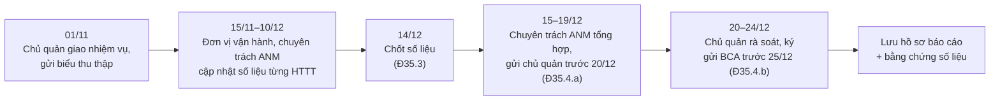

# Hướng dẫn lập báo cáo năm (Mẫu số 08)

> **Căn cứ:** NĐ 331/2026/NĐ-CP Đ33.6, Đ34.4.c, Đ35, Đ36, Phụ lục Mẫu số 08; Luật 116/2025/QH15 Đ10.1.đ · **Đối chiếu văn bản gốc:** 24/09/2026 · **Trạng thái:** Bản khung v0.1

"Thực hiện chế độ báo cáo theo quy định" là một trong 6 nhiệm vụ bảo vệ ANM đối với HTTT (Luật 116 Đ10.1.đ). NĐ 331 quy định chế độ báo cáo tại Đ35 (quy định chung) và Đ36 (12 nội dung), biểu mẫu là **Mẫu số 08**. Bản chép nguyên văn Mẫu 08 kèm placeholder: [`../02-ho-so-cap-do/mau-08-bao-cao.md`](../02-ho-so-cap-do/mau-08-bao-cao.md). Tài liệu này hướng dẫn **cách thu thập số liệu, lập và gửi**.

---

## 1. Quy định chung (NĐ 331 Đ35)

| Nội dung | Quy định | Căn cứ |
|---|---|---|
| Tần suất | **Định kỳ hằng năm**; **đột xuất** theo đề nghị của cơ quan có thẩm quyền | NĐ 331 Đ35.2 |
| Kỳ số liệu | Từ **15/12 năm trước** đến **14/12 năm báo cáo** | NĐ 331 Đ35.3 |
| Hạn nội bộ | Đơn vị chuyên trách về ANM, đơn vị vận hành HTTT gửi báo cáo **tới chủ quản HTTT trước 20/12** hằng năm | NĐ 331 Đ35.4.a |
| Hạn gửi Bộ Công an | Chủ quản HTTT gửi báo cáo **Bộ Công an trước 25/12** hằng năm | NĐ 331 Đ35.4.b |
| Phương thức | (a) hệ thống quản lý văn bản và điều hành; (b) **hệ thống phần mềm báo cáo do Bộ Công an triển khai**; (c) thư điện tử; (d) phương thức khác theo quy định | NĐ 331 Đ35.1 |
| Báo cáo khác của đơn vị vận hành | Định kỳ hoặc đột xuất báo cáo công tác thực thi bảo đảm ANM theo yêu cầu của chủ quản hoặc cơ quan quản lý chuyên ngành | NĐ 331 Đ33.6 |
| Bộ, ngành, UBND tỉnh | Định kỳ hằng năm trao đổi với Bộ Công an về tình hình thực hiện bảo đảm ANM theo cấp độ | NĐ 331 Đ34.4.c |

> **[CẦN ĐỐI CHIẾU]** (1) Địa chỉ/tài khoản của "hệ thống phần mềm báo cáo do Bộ Công an triển khai" chưa có trong bộ nguồn. (2) Dòng "Kính gửi" của Mẫu 08 ghi "(Đơn vị chuyên trách về an ninh mạng/Lực lượng chuyên trách về an ninh mạng)", trong khi Đ35.4.b ghi chủ quản gửi **Bộ Công an** → khi gửi BCA, ghi tên đơn vị thuộc lực lượng chuyên trách ANM của BCA theo hướng dẫn tiếp nhận. (3) Kỳ báo cáo 2026 bắt đầu trước ngày NĐ 331 có hiệu lực (19/8/2026) — khuyến nghị vẫn gửi trước 25/12/2026.

## 2. Lịch lập báo cáo đề xuất

Thời điểm 01/11, 15/11–10/12 là đề xuất; chỉ các mốc 14/12, 20/12, 25/12 là quy định.

## 3. Mười hai nội dung bắt buộc (NĐ 331 Đ36) và nơi thể hiện trong Mẫu 08

| # | Nội dung theo Đ36 | Thể hiện ở Mẫu 08 | Nguồn dữ liệu nội bộ | Bằng chứng kèm theo (lưu nội bộ) |
|---|---|---|---|---|
| 1 | Thông tin chung về chủ quản, đơn vị chuyên trách ANM, đơn vị vận hành của từng HTTT: tên; quy định chức năng, nhiệm vụ, quyền hạn; người đại diện, chức vụ; địa chỉ; điện thoại, thư điện tử | Mục 2.a (chủ quản), 2.b (chuyên trách ANM); tên đơn vị vận hành ở cột (4) mục 3 | QĐ xác định chủ quản, QĐ chỉ định chuyên trách ANM, QĐ giao đơn vị vận hành ([`../04-chinh-sach-quy-trinh/`](../04-chinh-sach-quy-trinh/README.md)) | Bản sao các QĐ |
| 2 | Danh sách HTTT thuộc phạm vi quản lý: tên, đơn vị vận hành, cấp độ đề xuất | Mục 1 (tổng số); mục 3 cột (2), (4), (5) | Danh mục HTTT ([`../01-xac-dinh-cap-do/phieu-xac-dinh-cap-do.md`](../01-xac-dinh-cap-do/phieu-xac-dinh-cap-do.md)) | Danh mục HTTT có ngày cập nhật |
| 3 | Danh sách HTTT có căn cứ đề xuất đưa vào Danh mục HTTT quan trọng về ANQG | Không có cột riêng → **bổ sung Phụ lục 1** (mục 5) | Kết quả rà soát theo NĐ 331 Đ16, Đ17 | Biên bản rà soát |
| 4 | Danh sách HTTT được phê duyệt Hồ sơ đề xuất cấp độ | Mục 1 (tổng số đã phê duyệt); mục 3 cột (6), (7) | Sổ theo dõi hồ sơ cấp độ | QĐ phê duyệt (Mẫu 06/07) |
| 5 | Danh sách HTTT đã triển khai đầy đủ / một phần / chưa triển khai biện pháp theo phương án được duyệt | Mục 3 cột (10), (11) | Kết quả tự đánh giá ([kiem-tra-danh-gia-dinh-ky.md](kiem-tra-danh-gia-dinh-ky.md)) | Báo cáo tự đánh giá, kế hoạch khắc phục |
| 6 | Danh sách HTTT có Quy chế bảo đảm ANM | Mục 3 cột (8) | [`../04-chinh-sach-quy-trinh/quy-che-bao-dam-anm.md`](../04-chinh-sach-quy-trinh/quy-che-bao-dam-anm.md) | QĐ ban hành Quy chế |
| 7 | Danh sách HTTT tuân thủ quy định, quy trình trong Quy chế trong vận hành, khai thác, kết thúc, hủy bỏ | Không có cột riêng → **bổ sung Phụ lục 2** | Kết quả kiểm tra tuân thủ NĐ 331 Đ27.2.b | Biên bản kiểm tra |
| 8 | Danh sách HTTT được kiểm tra, đánh giá theo quy định | Mục 1 (tổng số được kiểm tra định kỳ); mục 3 cột (12) | Kế hoạch và kết quả kiểm tra năm | Báo cáo kiểm tra, báo cáo pentest |
| 9 | Đánh giá việc triển khai biện pháp theo phương án được duyệt **theo từng tiêu chí, yêu cầu** | Không có cột riêng → **bổ sung Phụ lục 3** (bảng đáp ứng theo yêu cầu) | Checklist theo cấp ([`../03-yeu-cau-theo-cap-do/`](../03-yeu-cau-theo-cap-do/README.md)) | Checklist đã chấm, bằng chứng từng yêu cầu |
| 10 | Thông tin QĐ phê duyệt Hồ sơ đề xuất cấp độ, phương án được duyệt theo từng tiêu chí (**đã đáp ứng đầy đủ / chưa đáp ứng đầy đủ; kế hoạch hoặc lộ trình hoàn thiện** tiêu chí chưa đáp ứng) | Cột (7), (11) + **Phụ lục 3** | Như 9 | Kế hoạch khắc phục có mốc thời gian |
| 11 | Thông tin QĐ ban hành và Quy chế bảo đảm ANM | Cột (8) | Như 6 | Như 6 |
| 12 | Thông tin khác theo yêu cầu của cơ quan có thẩm quyền | Theo yêu cầu | — | — |

## 4. Bảng tổng hợp danh sách HTTT (Mẫu 08 mục 3) — giá trị hợp lệ

Cấu trúc 12 cột theo Mẫu 08 NĐ 331; giá trị cho phép lấy từ phần "Chú thích" của mẫu.

| Cột | Tên cột | Giá trị hợp lệ / cách ghi (theo chú thích Mẫu 08) |
|---|---|---|
| (1) | STT | Số thứ tự |
| (2) | Tên HTTT | Tên hệ thống |
| (3) | Chủ quản HTTT | Tên cơ quan chủ quản |
| (4) | Đơn vị vận hành HTTT | Tên đơn vị vận hành |
| (5) | Cấp độ đề xuất | 1–5 |
| (6) | Tình trạng phê duyệt cấp độ | "Đang dự thảo" / "Đã gửi thẩm định" / "Đã thẩm định" / "Đã được phê duyệt" |
| (7) | Quyết định phê duyệt cấp độ | Số, ngày quyết định, tên cơ quan phê duyệt (nếu đã phê duyệt) |
| (8) | Quy chế bảo đảm ANM cho hệ thống | Số, ngày quyết định, tên cơ quan ban hành quy chế (nếu có) |
| (9) | Dự kiến thời điểm phê duyệt HSĐXCĐ | Thời điểm dự kiến (nếu chưa phê duyệt) |
| (10) | Đã triển khai đầy đủ PA BĐANM | "Chưa triển khai" / "Đã triển khai một số hạng mục" / "Đã triển khai đầy đủ" |
| (11) | Dự kiến thời điểm triển khai đầy đủ PA BĐANM | Thời điểm dự kiến |
| (12) | Đã kiểm tra, đánh giá ANM | "Trước khi đưa vào sử dụng" / "Định kỳ" / cả hai; để trống nếu chưa thực hiện |

**Ví dụ điền (placeholder):**

| (1) | (2) | (3) | (4) | (5) | (6) | (7) | (8) | (9) | (10) | (11) | (12) |
|---|---|---|---|---|---|---|---|---|---|---|---|
| 1 | {{TEN_HE_THONG_1}} | {{TEN_TO_CHUC}} | {{DON_VI_VAN_HANH}} | 3 | Đã được phê duyệt | QĐ số {{SO_QD}} ngày {{NGAY}} của {{CO_QUAN_PHE_DUYET}} | QĐ số {{SO_QD_QUY_CHE}} ngày {{NGAY}} | — | Đã triển khai một số hạng mục | {{THANG_NAM}} | Trước khi đưa vào sử dụng; Định kỳ |
| 2 | {{TEN_HE_THONG_2}} | {{TEN_TO_CHUC}} | {{DON_VI_VAN_HANH}} | 2 | Đã gửi thẩm định | — | QĐ số {{SO_QD_QUY_CHE}} ngày {{NGAY}} | {{THANG_NAM}} | Chưa triển khai | {{THANG_NAM}} | |

**Quy tắc kiểm tra nhất quán trước khi gửi:**

- [ ] Số dòng của bảng = "Tổng số HTTT thuộc phạm vi quản lý" ở mục 1.
- [ ] Số dòng có cột (6) = "Đã được phê duyệt" = "Tổng số HTTT đã được phê duyệt cấp độ" ở mục 1; mỗi dòng này phải có cột (7).
- [ ] Dòng chưa phê duyệt phải có cột (9); dòng chưa triển khai đầy đủ phải có cột (11).
- [ ] Dòng đã phê duyệt phải có cột (8) — Quy chế phải ban hành **trước** khi phê duyệt hồ sơ (NĐ 331 Đ30.7).
- [ ] Số dòng có cột (12) chứa "Định kỳ" = "Tổng số HTTT đã phê duyệt cấp độ được kiểm tra, đánh giá ANM định kỳ" ở mục 1.
- [ ] Cột (5) phù hợp tiêu chí NĐ 331 Đ11–Đ15 và phiếu xác định cấp độ đã lưu.
- [ ] Mục 1 có "Dự kiến thời gian hoàn thành phê duyệt đề xuất cấp độ đối với tất cả các HTTT".

## 5. Phụ lục bổ sung đề xuất (cho nội dung Đ36 chưa có cột trong Mẫu 08)

Mẫu 08 bao quát trực tiếp các nội dung 1, 2, 4, 5, 6, 8, 11 của Đ36. Để đủ 12 nội dung, đề xuất đính kèm:

**Phụ lục 1 — HTTT có căn cứ đề xuất đưa vào Danh mục HTTT quan trọng về ANQG (Đ36.3)**

| STT | Tên HTTT | Tiêu chí NĐ 331 Đ16 đáp ứng (khoản/điểm) | Tình trạng hồ sơ đề nghị (NĐ 331 Đ17) |
|---|---|---|---|
| 1 | {{TEN_HE_THONG}} | {{DIEM_KHOAN}} | {{TINH_TRANG}} |

Không có HTTT nào → ghi "Không có".

**Phụ lục 2 — Tuân thủ Quy chế bảo đảm ANM trong vận hành (Đ36.7)**

| STT | Tên HTTT | Kỳ kiểm tra | Số quy định/quy trình kiểm tra | Số điểm không tuân thủ | Đã khắc phục | Ghi chú |
|---|---|---|---|---|---|---|
| 1 | {{TEN_HE_THONG}} | {{KY}} | {{N}} | {{N}} | {{N}} | |

**Phụ lục 3 — Mức đáp ứng phương án bảo đảm ANM theo từng tiêu chí, yêu cầu (Đ36.9, Đ36.10)**

| STT | Tên HTTT | Nhóm yêu cầu (NĐ 331 Đ30.3–30.4 / TCVN 14423:2026 mục) | Yêu cầu | Đã đáp ứng đầy đủ / Chưa đáp ứng đầy đủ | Kế hoạch, lộ trình hoàn thiện (mốc) | Người chịu trách nhiệm |
|---|---|---|---|---|---|---|
| 1 | {{TEN_HE_THONG}} | {{NHOM}} | {{YEU_CAU}} | {{TRANG_THAI}} | {{MOC}} | {{DON_VI}} |

Bảng ánh xạ yêu cầu NĐ 331 Đ30 – TCVN: [`../03-yeu-cau-theo-cap-do/anh-xa-nd331-d30-tcvn.md`](../03-yeu-cau-theo-cap-do/anh-xa-nd331-d30-tcvn.md).

## 6. Checklist trước khi ký gửi

- [ ] Số liệu chốt đến 14/12 (NĐ 331 Đ35.3); ghi rõ kỳ số liệu trong báo cáo.
- [ ] Đơn vị chuyên trách ANM, đơn vị vận hành đã gửi báo cáo cho chủ quản trước 20/12 (Đ35.4.a) — lưu văn bản/email gửi.
- [ ] Đủ 12 nội dung Đ36 (Mẫu 08 + Phụ lục 1–3).
- [ ] Mục 2 dùng thông tin của đơn vị chuyên trách ANM đúng với QĐ chỉ định hiện hành.
- [ ] Người ký là người đứng đầu chủ quản hoặc người được ủy quyền (NĐ 331 Đ4.3, Đ31.1.a).
- [ ] Gửi Bộ Công an trước 25/12 qua một trong các phương thức Đ35.1; lưu biên nhận/bằng chứng gửi.
- [ ] Báo cáo và bằng chứng số liệu được lưu theo [ho-so-luu-tru-bang-chung.md](ho-so-luu-tru-bang-chung.md).
- [ ] Mọi hạng mục "chưa đáp ứng" có kế hoạch, mốc thời gian — cơ quan kiểm tra có thể dùng để đối chiếu hành vi "không triển khai đầy đủ biện pháp như hồ sơ đã phê duyệt" (NĐ 330 Đ23.1.d).
