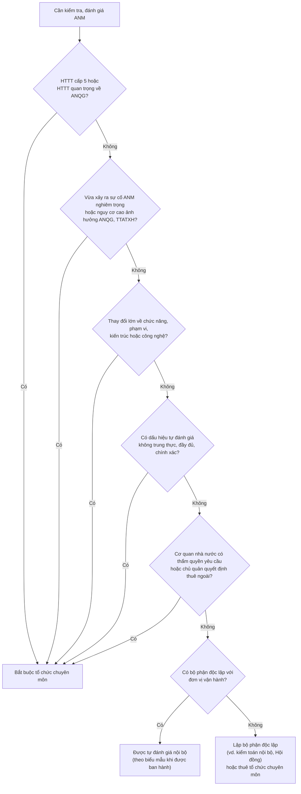

# Kiểm tra, đánh giá an ninh mạng định kỳ

> **Căn cứ:** Luật 116/2025/QH15 Đ7.3, Đ7.5, Đ10.1.c, Đ10.2.e, Đ11.1.b, Đ12, Đ29.1; NĐ 331/2026/NĐ-CP Đ26, Đ27, Đ28.3, Đ28.5, Đ31.2.c, Đ32.5, Đ33.3, Đ34.1.đ, Đ36.8; NĐ 333/2026/NĐ-CP Đ8; NĐ 330/2026/NĐ-CP Đ23.2.a, Đ27.1, Đ35.4.a; TCVN 14423:2026 mục 3.1/4.1/5.1/6.1/7.1, 3.7–7.7, 3.8–7.8, 5.16, 6.17, 7.17, 5.18, 6.18, 7.18 · **Đối chiếu văn bản gốc:** 24/09/2026 · **Trạng thái:** Bản khung v0.1

> Phần diễn giải TCVN 14423:2026 trong tài liệu này là **tóm lược để tra cứu; khi lập hồ sơ phải đối chiếu bản chính thức TCVN 14423:2026 (mua tại VSQI).**

Ba loại hoạt động kiểm tra cần phân biệt:

| Loại | Ai thực hiện | Khi nào | Căn cứ | Mục |
|---|---|---|---|---|
| **Tự kiểm tra, đánh giá** của chủ quản (tuân thủ + hiệu quả + kỹ thuật) | Bộ phận/đơn vị độc lập với vận hành, hoặc tổ chức chuyên môn | Định kỳ theo cấp độ và rủi ro; thường xuyên qua giám sát; đột xuất; theo yêu cầu | NĐ 331 Đ27, Đ28.5, Đ31.2.c | 1–4, 6–7 |
| **Đánh giá điều kiện ANM trước vận hành** | Chủ quản (HTTT quan trọng về ANQG: cơ quan có thẩm quyền) | Trước khi đưa vào vận hành; khi thay đổi lớn; theo yêu cầu | NĐ 331 Đ28.3; NĐ 333 Đ6 | Xem [`../04-chinh-sach-quy-trinh/quy-trinh-danh-gia-truoc-van-hanh.md`](../04-chinh-sach-quy-trinh/quy-trinh-danh-gia-truoc-van-hanh.md) |
| **Kiểm tra ANM của lực lượng chuyên trách BCA** | Đoàn kiểm tra BCA | Khi có hành vi tội phạm mạng, tấn công, khủng bố, gián điệp mạng hoặc khi chủ quản đề nghị | Luật 116 Đ12; NĐ 331 Đ26 | 5 |

---

## 1. Nội dung kiểm tra, đánh giá (NĐ 331 Đ27)

### 1.1. Kiểm tra tuân thủ (Đ27.1)

| # | Đối tượng | Nội dung | Căn cứ | Bằng chứng cần xem |
|---|---|---|---|---|
| 1 | Chủ quản HTTT | Thành lập/chỉ định đơn vị, bộ phận chuyên trách ANM; lập hồ sơ đề xuất cấp độ, tổ chức thẩm định, phê duyệt; triển khai phương án đã duyệt; tổ chức kiểm tra, đánh giá, quản lý rủi ro; đào tạo, tuyên truyền, diễn tập | NĐ 331 Đ27.1.a (dẫn Đ31) | QĐ chỉ định; hồ sơ cấp độ và QĐ phê duyệt; kế hoạch, báo cáo kiểm tra; hồ sơ rủi ro; hồ sơ đào tạo, diễn tập |
| 2 | Đơn vị chuyên trách ANM | Tham mưu, tổ chức thực thi, đôn đốc, kiểm tra, giám sát; thẩm định, phê duyệt hoặc cho ý kiến chuyên môn với hồ sơ cấp độ | NĐ 331 Đ27.1.b (dẫn Đ32) | Văn bản tham mưu, ý kiến thẩm định (Mẫu 04), biên bản kiểm tra nội bộ |
| 3 | Đơn vị vận hành | Thực hiện biện pháp theo phương án đã duyệt và theo Luật 116 Đ10 | NĐ 331 Đ27.1.c (dẫn Đ33.1) | Hồ sơ triển khai, nhật ký vận hành |
| 4 | Biện pháp theo phương án | Việc tổ chức thực thi các biện pháp theo phương án được phê duyệt | NĐ 331 Đ27.1.d | Checklist theo cấp ([`../03-yeu-cau-theo-cap-do/`](../03-yeu-cau-theo-cap-do/README.md)) |

### 1.2. Kiểm tra hiệu quả biện pháp (Đ27.2)

| # | Nội dung | Căn cứ | Gợi ý phương pháp |
|---|---|---|---|
| 1 | Tính đầy đủ, phù hợp của **Quy chế bảo đảm ANM** so với phương án quản lý được duyệt | NĐ 331 Đ27.2.a | Đối chiếu từng nhóm yêu cầu quản lý (NĐ 331 Đ30.3.a–g) với điều khoản Quy chế |
| 2 | Việc **tuân thủ Quy chế** trong vận hành, khai thác, kết thúc, hủy bỏ | NĐ 331 Đ27.2.b | Lấy mẫu hồ sơ: phiếu cấp quyền, phiếu thay đổi, biên bản hủy thiết bị, rà soát log |
| 3 | Thiết kế hệ thống theo phương án đã duyệt | NĐ 331 Đ27.2.c | So sánh sơ đồ thực tế với thiết kế trong hồ sơ cấp độ (vùng mạng, IP — NĐ 331 Đ22.3.d) |
| 4 | Thiết lập, cấu hình theo phương án | NĐ 331 Đ27.2.d | Rà soát cấu hình tường lửa, phân vùng, xác thực |
| 5 | Cấu hình, **tăng cường bảo mật (hardening)** thiết bị, hệ điều hành, ứng dụng, cơ sở dữ liệu | NĐ 331 Đ27.2.đ | So với chuẩn cấu hình an toàn nội bộ (TCVN 14423:2026 nhóm cấu hình an toàn — mục 3.5/4.5/5.5/6.5/7.5) |

Kết quả đánh giá hiệu quả phải: xác định mức hiệu quả trong giảm thiểu rủi ro; đánh giá khả năng đáp ứng yêu cầu theo cấp; làm căn cứ điều chỉnh, thay thế biện pháp không còn phù hợp (NĐ 331 Đ28.5.b). Đơn vị vận hành **định kỳ** đánh giá hiệu quả và báo cáo chủ quản (NĐ 331 Đ33.3).

### 1.3. Kiểm tra kỹ thuật: mã độc, lỗ hổng, kiểm thử xâm nhập (Đ27.3–27.4)

| # | Nội dung | Căn cứ |
|---|---|---|
| 1 | **Dò quét** phát hiện mã độc, lỗ hổng, điểm yếu; **thử nghiệm tấn công xâm nhập** với thiết bị, hệ điều hành, ứng dụng, CSDL và thành phần khác | NĐ 331 Đ27.3.a |
| 2 | Việc duy trì, cập nhật, **khắc phục** tồn tại, lỗ hổng đã phát hiện trong vận hành | NĐ 331 Đ27.3.b |
| 3 | **Đánh giá an toàn mã nguồn** với phần mềm nội bộ | NĐ 331 Đ27.3.c |
| 4 | Phương án, kế hoạch xử lý lỗ hổng và tăng cường bảo mật với nội dung chưa đạt | NĐ 331 Đ27.3.d |

**Ba hình thức** (NĐ 331 Đ27.4):

| Hình thức | Thông tin cấp cho người kiểm tra | Phù hợp khi | Lưu ý |
|---|---|---|---|
| **Hộp đen** (Black box) — Đ27.4.a | Không cung cấp thông tin nội bộ; mô phỏng kẻ tấn công bên ngoài | Kiểm tra dịch vụ công khai ra Internet | Phạm vi, thời gian, IP nguồn phải được phê duyệt bằng văn bản |
| **Hộp xám** (Gray box) — Đ27.4.b | Cung cấp một phần (tài khoản người dùng thường, tài liệu API) | Ứng dụng có đăng nhập; kiểm tra phân quyền | Tài khoản kiểm thử riêng, thu hồi sau khi xong |
| **Hộp trắng** (White box) — Đ27.4.c | Cung cấp đầy đủ (kiến trúc, cấu hình, **mã nguồn**) | Rà soát mã nguồn (Đ27.3.c), rà soát cấu hình (Đ27.2.đ) | Thỏa thuận bảo mật với bên kiểm tra; mã nguồn là tài sản cần bảo vệ |

> **Kiểm thử xâm nhập phải có phê duyệt:** xâm nhập trái phép HTTT của người khác và gây sự cố, gián đoạn HTTT là hành vi bị nghiêm cấm (Luật 116 Đ7.3, Đ7.5); "phát hiện, thử nghiệm hoặc sử dụng điểm yếu, lỗ hổng kỹ thuật… không đúng quy định" bị phạt (NĐ 330 Đ16.1.đ). Luôn có văn bản phê duyệt của chủ quản nêu phạm vi, thời gian, phương pháp, đầu mối, phương án xử lý dữ liệu thu được (TCVN 14423:2026 mục 5.18.2.1/6.18.2.1/7.18.2.1 cũng yêu cầu chương trình kiểm thử được phê duyệt).

## 2. Tần suất

NĐ 331 **không quy định số lần cụ thể**; hoạt động kiểm tra, đánh giá hiệu quả được thực hiện **định kỳ theo cấp độ và mức độ rủi ro**, **thường xuyên** qua giám sát, **đột xuất** khi có dấu hiệu vi phạm hoặc nguy cơ, và **theo yêu cầu** của cơ quan có thẩm quyền (NĐ 331 Đ28.5.a). Tần suất tối thiểu tham khảo từ TCVN 14423:2026 (tóm lược bằng lời, đối chiếu bản chính thức):

| Hoạt động | Cấp 1 | Cấp 2 | Cấp 3 | Cấp 4 | Cấp 5 | Mục TCVN 14423:2026 |
|---|---|---|---|---|---|---|
| Rà quét lỗ hổng, rà soát quy trình quản lý lỗ hổng | ≥ 1 lần/năm | ≥ 1 lần/năm | ≥ 1 lần/6 tháng | ≥ 1 lần/6 tháng (tài sản quan trọng: ≥ 1 lần/quý) | ≥ 1 lần/quý (tài sản quan trọng: ≥ 1 lần/tháng) | 3.7.2.1, 4.7.2.1, 5.7.2.1, 6.7.2.1, 7.7.2.1 |
| Rà soát nhật ký ANM | ≥ 1 lần/năm | ≥ 1 lần/năm | ≥ 1 lần/6 tháng | ≥ 1 lần/tháng | ≥ 1 lần/tháng | 3.8.2.1, 4.8.2.1, 5.8.2.1, 6.8.2.1, 7.8.2.1 |
| Dung lượng lưu nhật ký tối thiểu | Không nêu số | 01 tháng | 03 tháng | 06 tháng | 12 tháng | 4.8.2.1, 5.8.2.1, 6.8.2.1, 7.8.2.1 |
| Xác định rủi ro ANM định kỳ | — | — | ≥ 1 lần/năm | ≥ 1 lần/6 tháng | ≥ 1 lần/6 tháng | 5.1.2.2, 6.1.2.2, 7.1.2.2 |
| Kiểm thử xâm nhập | — (không có nhóm "Quản lý kiểm tra ANM") | — | Có chương trình kiểm thử được phê duyệt (tần suất do tổ chức chọn: quý/nửa năm/năm/đột xuất) | **Từ bên ngoài ≥ 1 lần/năm; từ bên trong ≥ 1 lần/năm** | **Từ bên ngoài ≥ 1 lần/6 tháng; từ bên trong ≥ 1 lần/6 tháng** | 5.18, 6.18.2.2, 6.18.2.5, 7.18.2.2, 7.18.2.5 |
| Diễn tập ứng phó sự cố | — | — | Định kỳ (không nêu số) | ≥ 1 lần/năm | ≥ 1 lần/năm | 5.16, 6.17.2.6, 7.17.2.6 |

> Với HTTT quan trọng về ANQG: **tự kiểm tra hằng năm** và thông báo kết quả bằng văn bản **trước 01/10** (Luật 116 Đ11.1.b; NĐ 333 Đ8.5.b). Ô "—" nghĩa là không tìm thấy yêu cầu có số cụ thể ở cấp đó trong bản đã đọc; kiểm tra lại với bản chính thức và checklist tại [`../03-yeu-cau-theo-cap-do/`](../03-yeu-cau-theo-cap-do/README.md). Cấp 1–2 (TCVN 14423:2026 mục 3.1 b, 4.1 b) chỉ yêu cầu rà soát, cập nhật quy trình quản lý rủi ro ≥ 1 lần/năm hoặc khi có thay đổi; không đặt chu kỳ riêng cho việc xác định lại rủi ro (nên thực hiện cùng kỳ rà soát).

## 3. Ai được thực hiện: tự đánh giá nội bộ hay tổ chức chuyên môn? (NĐ 331 Đ31.2.c)

Chủ quản **chịu trách nhiệm trước pháp luật về tính trung thực, đầy đủ, chính xác** của kết quả đánh giá (NĐ 331 Đ31.2.c).

**Tự đánh giá nội bộ** được phép với điều kiện:
1. Do **bộ phận hoặc đơn vị độc lập với đơn vị trực tiếp vận hành** hệ thống thực hiện;
2. Tuân thủ **biểu mẫu, tiêu chí, phương pháp** do cơ quan nhà nước có thẩm quyền ban hành — **chưa ban hành** tại 24/09/2026; chờ hướng dẫn của Bộ Công an (NĐ 331 Đ31.2.c, Đ34.1.đ). Tạm dùng mẫu tại mục 7.

**Bắt buộc** kiểm tra, đánh giá bởi **tổ chức chuyên môn** (được cơ quan có thẩm quyền cấp phép; tổ chức sự nghiệp nhà nước có chức năng phù hợp; hoặc tổ chức được cấp có thẩm quyền chỉ định) khi (NĐ 331 Đ31.2.c):



Lưu ý khi thuê ngoài:
- Doanh nghiệp cung cấp dịch vụ kiểm tra, đánh giá ANM phải **có giấy phép kinh doanh sản phẩm, dịch vụ ANM** (Luật 116 Đ28.2.a, Đ29.1); kinh doanh không giấy phép bị phạt 150–200 tr với tổ chức (NĐ 330 Đ35.4.a). Giấy phép cấp theo Luật 86/2015 còn giá trị đến hết hạn (Luật 116 Đ45.2). Quy định cấp phép mới: NĐ 332/2026 **[CẦN ĐỐI CHIẾU]**.
- Đơn vị chuyên trách ANM phối hợp đơn vị vận hành dò quét, kiểm thử xâm nhập (NĐ 331 Đ32.5) — dù thuê ngoài vẫn cần đầu mối nội bộ.
- Hợp đồng: phạm vi, hình thức (hộp đen/xám/trắng), bảo mật kết quả, xử lý dữ liệu thu được, xóa dữ liệu sau hợp đồng — xem [`../04-chinh-sach-quy-trinh/quy-trinh-quan-ly-nha-cung-cap.md`](../04-chinh-sach-quy-trinh/quy-trinh-quan-ly-nha-cung-cap.md).

## 4. Hậu quả nếu không kiểm tra

| Hành vi | Mức phạt tổ chức | Căn cứ |
|---|---|---|
| Không kiểm tra, giám sát tuân thủ, lưu nhật ký hoặc không đánh giá hiệu quả biện pháp | 60–100 tr | NĐ 330 Đ23.2.a |
| Không triển khai đầy đủ biện pháp như hồ sơ đã phê duyệt (cấp 3–5) | 40–60 tr | NĐ 330 Đ23.1.d |
| HTTT quan trọng về ANQG: không kiểm tra định kỳ hằng năm; không thông báo kết quả | 100–140 tr | NĐ 330 Đ26.4.a, c |
| Không khắc phục lỗ hổng theo yêu cầu của lực lượng chuyên trách (HTTT không thuộc danh mục ANQG) | 50–100 tr | NĐ 330 Đ27.1.c |

Bảng đầy đủ: [../05-nghia-vu-lien-quan/nd-330-muc-phat.md](../05-nghia-vu-lien-quan/nd-330-muc-phat.md).

## 5. Kiểm tra của Bộ Công an — chuẩn bị gì? (Luật 116 Đ12; NĐ 331 Đ26)

**Khi nào:** HTTT không thuộc danh mục quan trọng về ANQG chỉ bị kiểm tra khi có hành vi tội phạm mạng, tấn công mạng, khủng bố mạng, gián điệp mạng, **hoặc khi chủ quản đề nghị** (Luật 116 Đ12.1). Đối tượng: phần cứng, phần mềm, thiết bị số; thông tin lưu trữ, xử lý, truyền đưa; biện pháp bảo vệ bí mật nhà nước (Đ12.2). Kết quả kiểm tra được bảo mật (Đ12.4).

**Trình tự** (NĐ 331 Đ26.1): (a) thông báo kế hoạch kiểm tra → (b) thành lập Đoàn kiểm tra → (c) tiến hành kiểm tra, phối hợp chặt chẽ với chủ quản → (d) lập biên bản quá trình, kết quả → (đ) thông báo kết quả sau khi hoàn thành.

**Tạm ngừng / giữ nguyên hiện trạng** (NĐ 331 Đ26.2): khi cần giữ nguyên hiện trạng phục vụ điều tra hoặc khắc phục, lực lượng chuyên trách gửi văn bản đề nghị chủ quản tạm ngừng, nêu lý do, mục đích, thời gian; **chủ quản phải thiết lập phương án dự phòng, bảo đảm tính liên tục** trước khi cách ly hiện trạng (trừ trường hợp khẩn cấp).

**Checklist sẵn sàng:**

- [ ] Có đầu mối tiếp đoàn (chuyên trách ANM) và người có thẩm quyền ký biên bản.
- [ ] Danh mục HTTT, sơ đồ mạng, danh mục thiết bị, dịch vụ, quy hoạch IP cập nhật (khớp hồ sơ cấp độ — NĐ 331 Đ22.3.d).
- [ ] Hồ sơ cấp độ và QĐ phê duyệt; Quy chế bảo đảm ANM; báo cáo đánh giá rủi ro (NĐ 331 Đ10.6).
- [ ] Nhật ký hệ thống truy xuất được trong khoảng thời gian yêu cầu; quy trình **bảo toàn chứng cứ** (không ghi đè log, snapshot, hash).
- [ ] Phương án dự phòng/chuyển đổi để có thể cách ly một phần hệ thống mà dịch vụ vẫn chạy (NĐ 331 Đ26.2).
- [ ] Quy định nội bộ về bảo mật kết quả kiểm tra (Luật 116 Đ12.4).
- [ ] Sổ theo dõi kiến nghị sau kiểm tra, có người chịu trách nhiệm và hạn khắc phục — không khắc phục theo yêu cầu bị phạt (NĐ 330 Đ27.1.c).
- [ ] Phối hợp thông báo khi phát hiện hành vi vi phạm pháp luật về ANM trên HTTT của mình (Luật 116 Đ12.3).

> Chủ quản có thể **chủ động đề nghị** lực lượng chuyên trách BCA kiểm tra (Luật 116 Đ12.1.b), ví dụ sau sự cố nghi do tấn công có chủ đích.

**HTTT quan trọng về ANQG** có trình tự riêng: kiểm tra đột xuất được báo trước ít nhất **12 giờ** (sự cố, hành vi xâm phạm) hoặc **72 giờ** (yêu cầu quản lý nhà nước, hết hạn khắc phục lỗ hổng); kết quả thông báo trong **25 ngày làm việc** sau khi kết thúc; kiểm tra theo kế hoạch: thông báo kết quả trong **03 ngày làm việc** sau khi hoàn thành (NĐ 333 Đ8.6.a–b, Đ8.7.đ).

## 6. Kế hoạch kiểm tra, đánh giá năm (mẫu)

**KẾ HOẠCH KIỂM TRA, ĐÁNH GIÁ AN NINH MẠNG NĂM {{NAM}}**
Chủ quản: {{TEN_TO_CHUC}} · Đơn vị chủ trì: {{DON_VI_CHUYEN_TRACH_ANM}} · Đơn vị đánh giá độc lập: {{DON_VI_DANH_GIA_DOC_LAP}} · Phê duyệt: {{CHUC_DANH_NGUOI_KY}}, ngày {{NGAY}}

| Quý | Hoạt động | HTTT áp dụng | Hình thức / người thực hiện | Căn cứ | Đầu ra |
|---|---|---|---|---|---|
| I | Rà soát danh mục HTTT, cấp độ, rủi ro đầu năm; cập nhật theo danh mục BCA công bố trước 15/01 | Tất cả | Nội bộ | NĐ 331 Đ9.2.e, Đ10.2 | Danh mục HTTT, sổ rủi ro cập nhật |
| I | Kiểm tra tuân thủ tổ chức: QĐ chỉ định, hồ sơ cấp độ, Quy chế | Tất cả | Bộ phận độc lập | NĐ 331 Đ27.1.a–c | Biên bản kiểm tra |
| I–IV | Rà quét lỗ hổng theo tần suất cấp độ | Tất cả | Nội bộ/thuê ngoài | NĐ 331 Đ27.3.a; TCVN mục x.7 | Báo cáo quét, phiếu khắc phục |
| II | Kiểm tra hiệu quả: Quy chế, tuân thủ quy trình, cấu hình, hardening | Cấp ≥ 3 | Bộ phận độc lập | NĐ 331 Đ27.2 | Báo cáo đánh giá hiệu quả |
| II | Kiểm thử xâm nhập (hộp đen từ bên ngoài) | Cấp 3–5 có dịch vụ công khai | Tổ chức có giấy phép | NĐ 331 Đ27.4.a; TCVN 6.18.2.2/7.18.2.2 | Báo cáo pentest |
| III | Kiểm thử xâm nhập (hộp xám/từ bên trong); đánh giá an toàn mã nguồn phần mềm nội bộ | Cấp 3–5; phần mềm tự phát triển | Tổ chức chuyên môn / nội bộ độc lập | NĐ 331 Đ27.3.c, Đ27.4.b–c; TCVN 6.18.2.5/7.18.2.5 | Báo cáo kiểm thử, báo cáo rà soát mã nguồn |
| III | Diễn tập ứng phó sự cố | Cấp ≥ 3 | Nội bộ; tham gia diễn tập do BCA tổ chức | NĐ 331 Đ31.3; TCVN 6.17.2.6/7.17.2.6 | Biên bản diễn tập, bài học |
| III (trước 01/10) | Tự kiểm tra và **gửi thông báo kết quả** (chỉ HTTT quan trọng về ANQG) | HTTT quan trọng ANQG | Tổ chức chuyên môn | Luật 116 Đ11.1.b; NĐ 333 Đ8.5.b; NĐ 331 Đ31.2.c | Văn bản thông báo |
| IV | Kiểm tra khắc phục (re-test); tổng hợp kết quả năm | Tất cả | Bộ phận độc lập | NĐ 331 Đ27.3.b, Đ28.5.c | Báo cáo kết quả tự đánh giá (mục 7) |
| IV (trước 20/12, 25/12) | Báo cáo năm Mẫu 08 | Tất cả | Chuyên trách ANM, chủ quản | NĐ 331 Đ35, Đ36.8 | [bao-cao-nam-mau-08.md](bao-cao-nam-mau-08.md) |
| Đột xuất | Kiểm tra sau sự cố nghiêm trọng, thay đổi lớn, khi có yêu cầu | Theo sự kiện | **Tổ chức chuyên môn** (NĐ 331 Đ31.2.c) | NĐ 331 Đ10.2.b–đ, Đ28.5.a | Báo cáo đột xuất |

## 7. Mẫu báo cáo kết quả tự đánh giá

> Mẫu tạm thời của bộ khung. Khi Bộ Công an ban hành biểu mẫu, tiêu chí, phương pháp tự đánh giá (NĐ 331 Đ31.2.c, Đ34.1.đ), thay bằng mẫu chính thức.

```markdown
{{TEN_TO_CHUC}}                              CỘNG HÒA XÃ HỘI CHỦ NGHĨA VIỆT NAM
{{DON_VI_DANH_GIA_DOC_LAP}}                   Độc lập - Tự do - Hạnh phúc
Số: {{SO_VB}}                                 {{DIA_DANH}}, ngày {{NGAY}}

BÁO CÁO KẾT QUẢ TỰ KIỂM TRA, ĐÁNH GIÁ AN NINH MẠNG
Hệ thống thông tin: {{TEN_HE_THONG}} — Cấp độ: {{CAP_DO}} (QĐ phê duyệt số {{SO_QD}} ngày {{NGAY}})
Kỳ đánh giá: từ {{NGAY}} đến {{NGAY}}

Kính gửi: {{CHUC_DANH_NGUOI_DUNG_DAU_CHU_QUAN}}

1. Căn cứ
   - NĐ 331/2026/NĐ-CP Đ27, Đ28.5, Đ31.2.c; Kế hoạch kiểm tra năm {{NAM}} số {{SO_KH}}.
   - Phương án bảo đảm ANM đã phê duyệt; TCVN 14423:2026 mục {{MUC}}.

2. Tính độc lập của đơn vị đánh giá (NĐ 331 Đ31.2.c)
   - Đơn vị đánh giá: {{DON_VI_DANH_GIA_DOC_LAP}}; quan hệ với đơn vị vận hành {{DON_VI_VAN_HANH}}: {{MO_TA_DOC_LAP}}.
   - Có thuộc trường hợp bắt buộc thuê tổ chức chuyên môn không? {{CO/KHONG — ly do}}

3. Phạm vi, phương pháp
   - Thành phần hệ thống được đánh giá: {{PHAM_VI}}.
   - Hình thức kỹ thuật: [ ] hộp đen  [ ] hộp xám  [ ] hộp trắng (NĐ 331 Đ27.4); văn bản phê duyệt kiểm thử số {{SO}}.
   - Công cụ, thời gian thực hiện: {{CONG_CU}}, {{THOI_GIAN}}.

4. Kết quả kiểm tra tuân thủ (NĐ 331 Đ27.1)
   | Nội dung | Kết quả (Đạt/Chưa đạt) | Bằng chứng | Ghi chú |

5. Kết quả đánh giá hiệu quả biện pháp (NĐ 331 Đ27.2.a–đ)
   | Nội dung | Kết quả | Mức hiệu quả trong giảm thiểu rủi ro | Đề xuất điều chỉnh |

6. Kết quả kỹ thuật (NĐ 331 Đ27.3)
   | Mã phát hiện | Mô tả ngắn | Mức độ (Nghiêm trọng/Cao/TB/Thấp) | Thành phần | Trạng thái khắc phục lần trước |
   - Đánh giá an toàn mã nguồn phần mềm nội bộ: {{KET_QUA}}.

7. Mức đáp ứng phương án theo từng yêu cầu (dùng cho báo cáo năm — NĐ 331 Đ36.9, Đ36.10)
   | Nhóm yêu cầu | Tổng số yêu cầu | Đáp ứng đầy đủ | Chưa đáp ứng đầy đủ | Lộ trình |

8. Kế hoạch khắc phục (NĐ 331 Đ27.3.d)
   | Tồn tại | Biện pháp | Đơn vị thực hiện | Hạn | Cách kiểm tra lại |

9. Kết luận và kiến nghị
   - Hệ thống {{DAP_UNG/CHUA_DAP_UNG}} yêu cầu bảo đảm ANM theo cấp độ {{CAP_DO}}.
   - Kiến nghị điều chỉnh cấp độ/phương án (nếu rủi ro cao hơn cấp đã xác định — NĐ 331 Đ10.5): {{KIEN_NGHI}}.

Nơi nhận: Chủ quản; Đơn vị chuyên trách ANM; Đơn vị vận hành; Lưu.
NGƯỜI ĐỨNG ĐẦU ĐƠN VỊ ĐÁNH GIÁ (ký, ghi rõ họ tên)
```

Báo cáo này là bằng chứng cho nội dung "Danh sách HTTT được kiểm tra, đánh giá" trong báo cáo năm (NĐ 331 Đ36.8) và phải lưu theo [ho-so-luu-tru-bang-chung.md](ho-so-luu-tru-bang-chung.md).
