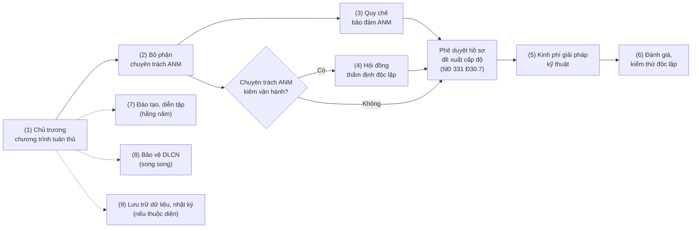

# 07 — Mẫu tờ trình lãnh đạo

> **Căn cứ:** Luật 116/2025/QH15 Đ10, Đ25, Đ34, Đ38.2, Đ44, Đ45; NĐ 331/2026/NĐ-CP Đ2, Đ18.4, Đ30.5–30.8, Đ31, Đ32, Đ35, Đ39; NĐ 333/2026/NĐ-CP Đ16, Đ19, Đ20, Đ24; NĐ 330/2026/NĐ-CP Đ7, Đ21, Đ23, Đ24, Đ29, Đ30, Đ33, Đ55–Đ57; Luật 91/2025/QH15 Đ20, Đ21, Đ23, Đ33, Đ38; NĐ 356/2025/NĐ-CP Đ13, Đ21, Đ41 · **Đối chiếu văn bản gốc:** 25/09/2026 · **Trạng thái:** Bản khung v0.1

Bộ **mẫu tờ trình nội bộ** giúp bộ phận IT, an ninh mạng (ANM), pháp chế, nhân sự, tài chính đề xuất với ban lãnh đạo các việc cần làm để tuân thủ pháp luật về ANM và bảo vệ dữ liệu cá nhân (DLCN). Mỗi tờ trình nêu căn cứ pháp lý, hiện trạng, rủi ro (có mức phạt đối với tổ chức), nội dung đề xuất, kinh phí, tiến độ, phân công và kiến nghị. Cuối mỗi tờ trình có ô ý kiến phê duyệt của lãnh đạo.

> **Lưu ý:**
> - Tờ trình là **văn bản nội bộ** của doanh nghiệp (phòng ban trình ban lãnh đạo), không phải hồ sơ gửi cơ quan nhà nước. Bố cục theo thể thức văn bản hành chính phổ biến; doanh nghiệp điều chỉnh theo quy chế văn thư nội bộ. **[CẦN ĐỐI CHIẾU]** NĐ 30/2020/NĐ-CP về công tác văn thư không có trong bộ nguồn của repo.
> - Bản Word điền sẵn dữ liệu mẫu (tô vàng) sẽ nằm trong `templates/07-to-trinh-lanh-dao/`. Thư mục này **sẽ được sinh sau** bằng công cụ [`tools/md2docx`](../../tools/md2docx/README.md).
> - Đây là tài liệu tham khảo, không phải ý kiến pháp lý. Trước khi trình, đối chiếu lại văn bản gốc và các điểm còn mở tại [`../00-tong-quan/diem-can-doi-chieu.md`](../00-tong-quan/diem-can-doi-chieu.md).

## 1. Danh mục tờ trình

| # | File | Ai trình | Nội dung | Căn cứ chính | Thứ tự trình gợi ý |
|---|---|---|---|---|---|
| 1 | [to-trinh-trien-khai-chuong-trinh-tuan-thu-anm.md](to-trinh-trien-khai-chuong-trinh-tuan-thu-anm.md) | Đơn vị chuyên trách ANM (hoặc CNTT) | Chủ trương chương trình tuân thủ tổng thể: kiểm kê, xác định cấp độ, lộ trình, nhân lực, tổng kinh phí | NĐ 331 Đ2, Đ31, Đ35, Đ39; Luật 116 Đ10, Đ45 | **1** — trình đầu tiên |
| 2 | [to-trinh-thanh-lap-bo-phan-chuyen-trach-anm.md](to-trinh-thanh-lap-bo-phan-chuyen-trach-anm.md) | CNTT (và Nhân sự) | Thành lập, chỉ định đơn vị/bộ phận chuyên trách ANM; nhân sự; bảo đảm độc lập; nhân sự BVDLCN | NĐ 331 Đ3.2–3.3, Đ18.4, Đ31.1.b–c, Đ31.2.c, Đ32; Luật 91 Đ33.2; NĐ 356 Đ13 | **2** |
| 3 | [to-trinh-ban-hanh-quy-che-bao-dam-anm.md](to-trinh-ban-hanh-quy-che-bao-dam-anm.md) | Đơn vị chuyên trách ANM | Ban hành Quy chế bảo đảm ANM | NĐ 331 Đ30.3, Đ30.7; NĐ 330 Đ23.1.a | **3** — trước khi phê duyệt hồ sơ cấp độ |
| 4 | [to-trinh-thanh-lap-hoi-dong-tham-dinh.md](to-trinh-thanh-lap-hoi-dong-tham-dinh.md) | Đơn vị chuyên trách ANM | Thành lập Hội đồng thẩm định độc lập (khi chuyên trách ANM kiêm vận hành) | NĐ 331 Đ18.4, Đ23 | **4** — chỉ khi có xung đột vai trò |
| 5 | [to-trinh-phe-duyet-kinh-phi-giai-phap-ky-thuat-anm.md](to-trinh-phe-duyet-kinh-phi-giai-phap-ky-thuat-anm.md) | Chuyên trách ANM, Vận hành | Đầu tư, thuê giải pháp kỹ thuật theo cấp độ, dựa trên kết quả checklist | NĐ 331 Đ29, Đ30.4–30.6, Đ30.8; TCVN 14423:2026 | **5** — sau tự đánh giá |
| 6 | [to-trinh-thue-dich-vu-danh-gia-kiem-thu-anm.md](to-trinh-thue-dich-vu-danh-gia-kiem-thu-anm.md) | Chuyên trách ANM hoặc Kiểm soát nội bộ | Thuê tổ chức chuyên môn đánh giá, kiểm thử xâm nhập độc lập | NĐ 331 Đ27, Đ31.2.c; Luật 116 Đ29.1 | **6** — theo kế hoạch năm hoặc khi bắt buộc |
| 7 | [to-trinh-ke-hoach-dao-tao-dien-tap.md](to-trinh-ke-hoach-dao-tao-dien-tap.md) | Chuyên trách ANM, Nhân sự | Kế hoạch và kinh phí đào tạo, tuyên truyền, diễn tập năm | NĐ 331 Đ31.3; Luật 116 Đ34; NĐ 333 Đ24 | Hằng năm, quý IV |
| 8 | [to-trinh-tuan-thu-bao-ve-du-lieu-ca-nhan.md](to-trinh-tuan-thu-bao-ve-du-lieu-ca-nhan.md) | Pháp chế, nhân sự BVDLCN | DPIA, hồ sơ chuyển DLCN xuyên biên giới, nhân sự BVDLCN, rà soát kinh doanh dịch vụ xử lý DLCN, miễn trừ | Luật 91 Đ20–Đ23, Đ33, Đ38; NĐ 356 Đ13, Đ21–Đ22, Đ41 | Song song với (1); **hạn 60 ngày** kể từ ngày đầu xử lý |
| 9 | [to-trinh-luu-tru-du-lieu-va-nhat-ky-tai-viet-nam.md](to-trinh-luu-tru-du-lieu-va-nhat-ky-tai-viet-nam.md) | Chuyên trách ANM, Pháp chế | Lưu dữ liệu tại Việt Nam, nhật ký ≥ 12 tháng, xác thực tài khoản, tiếp nhận yêu cầu 24h/03h, 24h/06h | Luật 116 Đ25.2–25.3; NĐ 333 Đ16, Đ19, Đ20 | Song song với (1), nếu thuộc diện NĐ 333 Đ16.1 |

Tờ trình (5) có thể trình trước khi phê duyệt hồ sơ cấp độ nếu HTTT đang xây mới hoặc nâng cấp. NĐ 331 Đ30.6 yêu cầu triển khai đầy đủ phương án đã phê duyệt **trước khi** đưa vào vận hành, nên kinh phí phải được duyệt sớm.

## 2. Luận cứ trình lãnh đạo (dùng chung)

Mức phạt dưới đây là mức áp dụng cho **tổ chức**. Trong NĐ 330, số tiền ghi ở các điều về ANM là mức cho cá nhân, tổ chức bị phạt gấp hai lần; số tiền ghi ở các điều về DLCN là mức cho tổ chức (NĐ 330 Đ7.1). Mỗi hành vi bị xử lý riêng; **không cộng dồn** thành một con số "tổng rủi ro". Bảng đầy đủ: [`../05-nghia-vu-lien-quan/nd-330-muc-phat.md`](../05-nghia-vu-lien-quan/nd-330-muc-phat.md).

| Nghĩa vụ | Căn cứ | Mức phạt tổ chức | Mốc thời gian |
|---|---|---|---|
| Người đứng đầu chủ quản trực tiếp chỉ đạo, chịu trách nhiệm trước pháp luật về bảo vệ ANM | NĐ 331 Đ31.1.a | — (trách nhiệm quản lý) | Từ 19/8/2026 (NĐ 331 Đ38) |
| Bố trí bộ phận/nhân sự chuyên trách ANM; tổ chức thực thi, đôn đốc, kiểm tra | NĐ 331 Đ31.1.b–c, Đ32 | 60–100 triệu đồng (NĐ 330 Đ23.2.c) | Trước khi thẩm định hồ sơ cấp độ |
| Ban hành Quy chế bảo đảm ANM trước khi phê duyệt hồ sơ cấp độ | NĐ 331 Đ30.7 | 40–60 triệu đồng (NĐ 330 Đ23.1.a) | Trước ngày phê duyệt hồ sơ |
| Lập hồ sơ đề xuất cấp độ; tổ chức thẩm định, phê duyệt | NĐ 331 Đ20, Đ31.2.a | 40–60 triệu đồng (NĐ 330 Đ23.1.b, Đ24.1) | HTTT đang vận hành chưa có cấp độ: từ 19/8/2026 **[CẦN ĐỐI CHIẾU]**; HTTT đang đầu tư trước 01/7/2026: 06 tháng kể từ 01/7/2026 (NĐ 331 Đ39.1) |
| Không đưa HTTT cấp 3–5 vào vận hành khi chưa được phê duyệt cấp độ | NĐ 331 Đ30.6 | 40–60 triệu đồng (NĐ 330 Đ23.1.c) | Trước khi vận hành |
| Triển khai đầy đủ biện pháp theo hồ sơ đã phê duyệt (cấp 3–5) | NĐ 331 Đ30.6; Luật 116 Đ45.1 | 40–60 triệu đồng (NĐ 330 Đ23.1.d) | 12 tháng kể từ 01/7/2026, **chỉ** với HTTT đã có cấp độ theo Luật 86/2015 hoặc đang đầu tư trước 01/7/2026 (Luật 116 Đ45.1; NĐ 331 Đ39.1) |
| Kiểm tra, giám sát tuân thủ; lưu nhật ký; đánh giá hiệu quả biện pháp | NĐ 331 Đ27, Đ28.5, Đ31.2.c | 60–100 triệu đồng (NĐ 330 Đ23.2.a) | Định kỳ theo cấp độ và rủi ro |
| Báo cáo sự cố: thông báo ban đầu sự cố nghiêm trọng 24 giờ; báo cáo 72 giờ | NĐ 331 Đ31.2.d | 40–60 triệu đồng khi không báo cáo (NĐ 330 Đ21.2.a) | 24 giờ / 72 giờ kể từ khi phát hiện |
| Kế hoạch ứng phó sự cố; Đội ứng cứu sự cố | NĐ 330 Đ21.3 (hành vi bị phạt; NĐ 331, NĐ 333 chưa quy định chi tiết nghĩa vụ gốc **[CẦN ĐỐI CHIẾU]**) | 60–100 triệu đồng (NĐ 330 Đ21.3.b, d) | Thường xuyên |
| Báo cáo năm cho Bộ Công an | NĐ 331 Đ35.3–35.4 | — | Nội bộ trước 20/12; gửi Bộ Công an trước 25/12 hằng năm |
| DN cung cấp dịch vụ: cung cấp thông tin người dùng khi có yêu cầu | Luật 116 Đ25.2.a; NĐ 333 Đ16.3 | 50–100 triệu đồng (NĐ 330 Đ30.1.a) | 24 giờ; khẩn cấp 03 giờ |
| DN cung cấp dịch vụ: gỡ thông tin, dịch vụ vi phạm | Luật 116 Đ25.2.b; NĐ 333 Đ16.4 | 100–140 triệu đồng; có thể buộc ngừng dịch vụ tại Việt Nam (NĐ 330 Đ29.2.a, Đ29.3) | 24 giờ; khẩn cấp 06 giờ |
| DN cung cấp dịch vụ: nhật ký hệ thống | NĐ 333 Đ16.6, Đ20.3 | 60–100 triệu đồng (NĐ 330 Đ33.1.c) | Lưu ít nhất 12 tháng |
| DN trong nước cung cấp dịch vụ: lưu dữ liệu người dùng tại Việt Nam | Luật 116 Đ25.3; NĐ 333 Đ19.2, Đ20.1 | 60–100 triệu đồng (NĐ 330 Đ33.1.a) hoặc 100–140 triệu đồng (Đ29.2.c) **[CẦN ĐỐI CHIẾU]** điều áp dụng | Tối thiểu 24 tháng |
| DPIA | Luật 91 Đ21; NĐ 356 Đ19 | 20–30 triệu đồng; có thể buộc dừng xử lý (NĐ 330 Đ55.1, Đ55.3.b) | 60 ngày kể từ ngày đầu xử lý; cập nhật 06 tháng / 10 ngày |
| Hồ sơ chuyển DLCN xuyên biên giới | Luật 91 Đ20; NĐ 356 Đ18 | 30–50 triệu đồng; nếu dẫn đến lộ, mất DLCN: 1–5% doanh thu tại Việt Nam (NĐ 330 Đ56.1, Đ56.3) | 60 ngày kể từ ngày đầu chuyển |
| Chỉ định nhân sự BVDLCN đủ điều kiện | Luật 91 Đ33.2; NĐ 356 Đ13 | 20–30 triệu đồng (NĐ 330 Đ57.2) | Khi xử lý DLCN (trừ diện miễn trừ — Luật 91 Đ38; NĐ 356 Đ41) |
| Thông báo vi phạm DLCN | Luật 91 Đ23.1 | 40–60 triệu đồng khi chậm (NĐ 330 Đ54.3) | 72 giờ kể từ khi phát hiện |

Mức tối đa: lĩnh vực ANM 200 triệu đồng đối với tổ chức (NĐ 330 Đ7.3); lĩnh vực DLCN 03 tỷ đồng, riêng chuyển DLCN xuyên biên giới là 5% doanh thu năm trước liền kề nếu cao hơn (NĐ 330 Đ7.4). Thời hiệu xử phạt 01 năm (NĐ 330 Đ3.1).

**Nguyên tắc trình bày luận cứ:**

- Thuyết phục bằng căn cứ và hệ quả vận hành: không đủ điều kiện phê duyệt cấp độ, buộc dừng xử lý DLCN, buộc ngừng dịch vụ. Không dọa, không phóng đại.
- Không khẳng định vượt văn bản. NĐ 331 bắt buộc với HTTT phục vụ cơ quan, tổ chức nhà nước và HTTT cung cấp dịch vụ trực tuyến; tổ chức khác được khuyến khích áp dụng (NĐ 331 Đ2). Dịch vụ trực tuyến **không đương nhiên** là cấp 3; cấp độ xác định theo tiêu chí NĐ 331 Đ11–Đ16.
- Nêu đúng phạm vi của mốc chuyển tiếp 30/6/2027 (mốc an toàn của thời hạn 12 tháng). Không dùng làm hạn chung cho mọi HTTT.
- Tập huấn chuyên sâu có chứng nhận theo Luật 116 Đ34.2 chỉ bắt buộc với người quản trị, vận hành HTTT cấp 3–5 trong cơ quan, tổ chức, doanh nghiệp Nhà nước.

## 3. Cấu trúc chung của mỗi tờ trình

| Phần | Nội dung | Ghi chú |
|---|---|---|
| Khi nào dùng | Ai trình, trình ai, lúc nào, kèm tài liệu gì | Không xuất sang Word |
| Khối thể thức | Tên tổ chức, tên phòng trình, số ký hiệu `{{SO_TO_TRINH}}/TTr-{{VIET_TAT_PHONG}}`; quốc hiệu, tiêu ngữ; địa danh, ngày tháng | |
| Tên loại, trích yếu; Kính gửi; Căn cứ | | |
| I. Sự cần thiết | Cơ sở pháp lý (có trích điều); hiện trạng; rủi ro nếu không thực hiện | Mức phạt ghi mức cho tổ chức |
| II. Nội dung đề xuất | | |
| III. Kinh phí dự kiến | Bảng; mọi con số là placeholder | |
| IV. Tiến độ | Bảng mốc | |
| V. Tổ chức thực hiện | Phân công các phòng | |
| VI. Kiến nghị | "Kính trình … xem xét, phê duyệt: 1… 2…" | |
| Nơi nhận, chữ ký; Ý kiến phê duyệt của lãnh đạo | | |
| Hướng dẫn điền | Cách điền, điểm [CẦN ĐỐI CHIẾU], mẹo thuyết phục, tài liệu đính kèm | Không xuất sang Word |

## 4. Placeholder dùng chung

| Placeholder | Ý nghĩa |
|---|---|
| `{{TEN_TO_CHUC}}` | Tên doanh nghiệp |
| `{{TEN_PHONG_TRINH}}`, `{{VIET_TAT_PHONG}}` | Tên, chữ viết tắt của phòng trình (dùng trong số ký hiệu) |
| `{{SO_TO_TRINH}}` | Số tờ trình (phần số/năm, ví dụ `05/2026`) |
| `{{DIA_DANH}}`, `{{NGAY}}`, `{{THANG}}`, `{{NAM}}` | Địa danh, ngày tháng năm |
| `{{CHUC_DANH_LANH_DAO}}` | Chức danh người phê duyệt (ví dụ Tổng Giám đốc) |
| `{{CHUC_DANH_NGUOI_TRINH_IN_HOA}}`, `{{HO_TEN_NGUOI_TRINH}}` | Chức danh (in hoa), họ tên người ký tờ trình |
| `{{CAN_CU_THAM_QUYEN}}` | Điều lệ hoặc quy chế nội bộ quy định thẩm quyền |
| `{{DON_VI_CHUYEN_TRACH_ANM}}`, `{{DON_VI_VAN_HANH}}`, `{{DON_VI_DANH_GIA_DOC_LAP}}`, `{{NHAN_SU_BVDLCN}}` | Như quy ước tại [`../04-chinh-sach-quy-trinh/README.md`](../04-chinh-sach-quy-trinh/README.md) mục 4 |
| `{{PHONG_PHAP_CHE}}`, `{{PHONG_NHAN_SU}}`, `{{PHONG_TAI_CHINH}}` | Các phòng phối hợp |
| `{{KINH_PHI}}`, `{{TONG_KINH_PHI}}`, `{{NGUON_KINH_PHI}}` | Kinh phí từng dòng, tổng, nguồn |
| `{{THOI_HAN}}`, `{{TINH_TRANG}}` | Thời hạn từng dòng tiến độ; hiện trạng từng dòng |

Placeholder xuất hiện nhiều lần trong bảng (như `{{KINH_PHI}}`, `{{THOI_HAN}}`) được điền theo từng dòng.
