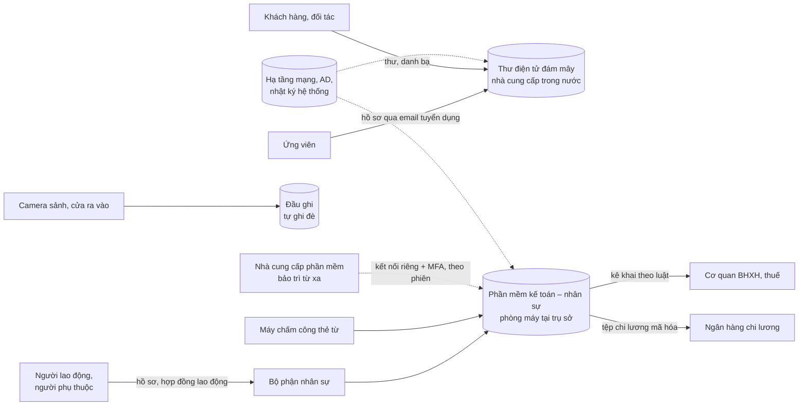

# 20 — Hồ sơ đánh giá tác động xử lý dữ liệu cá nhân (Mẫu số 02a, Mẫu số 10 NĐ 356)

> **Căn cứ:** Luật 91/2025/QH15 Đ2.7–2.10, Đ17.1, Đ21, Đ22, Đ38, Đ39.2; NĐ 356/2025/NĐ-CP Đ3, Đ4, Đ14.2.d, Đ19, Đ20, Đ41, Đ42, Phụ lục Mẫu số 02a, Mẫu số 03a, Mẫu số 10; NQ 22/2026/NQ-CP Đ4.1, Đ6, Phụ lục I.7 mục B.II–B.III; NĐ 330/2026/NĐ-CP Đ7.1, Đ55; NĐ 80/2021/NĐ-CP Đ5 · **Đối chiếu văn bản gốc:** 29/09/2026 · **Trạng thái:** Bản khung v0.1

## Hướng dẫn sử dụng

**Tài liệu gồm ba phần, xuất Word liền nhau:** (1) Thông báo gửi hồ sơ theo **Mẫu số 02a** (dành cho tổ chức); (2) **Mẫu số 10** — "Hồ sơ đánh giá tác động xử lý dữ liệu cá nhân" (NĐ 356 Đ19.2.a gọi là *Báo cáo* đánh giá tác động), gồm Phần A (mục I–IV) và Phần B; danh mục tài liệu kèm theo (thành phần Đ19.2.b–c) nằm ở **mục IV Phần A**; (3) **Phiếu theo dõi hồ sơ** (nội bộ, không nộp): căn cứ lập hồ sơ theo quy mô, các mốc nộp, kết quả, cập nhật. Mẫu 02a và Mẫu 10 chép nguyên văn cấu trúc, số mục, câu chữ tiêu đề mục của Phụ lục NĐ 356 (đã đối chiếu `sources/van-ban-goc/toan-van/nd-356-2025-nd-cp-chi-tiet-luat-dlcn.txt`: Mẫu 02a dòng 939–978, Mẫu 10 dòng 1528–1741); chỗ trống thay bằng `{{...}}`. Bảng nhiều dòng (luồng dữ liệu, rủi ro, thời hạn lưu…) có số dòng theo dữ liệu mẫu — thêm, bớt dòng theo thực tế.

**Nội dung kê khai là của tổ chức.** Dữ liệu mẫu khi xuất Word (tô vàng) chỉ minh họa cách kê khai; phải viết lại toàn bộ theo thực tế và khớp bảng kiểm kê DLCN ([checklist-cap-1-2.md](checklist-cap-1-2.md) mục F), Phiếu xác định miễn trừ ([17](17-phieu-xac-dinh-mien-tru-bvdlcn.md)), Quy định BVDLCN ([19](19-quy-dinh-bvdlcn.md)) và các mẫu 10–16.

### 1. Tổ chức nào phải lập

| Quy mô, loại tổ chức (NĐ 80/2021 Đ5) | DPIA (Luật 91 Đ21) và cập nhật (Đ22) | Căn cứ |
|---|---|---|
| DN vừa, DN lớn; tổ chức khác (không phải cơ quan nhà nước có thẩm quyền) | **Bắt buộc**: lập, lưu, gửi 01 bản chính trong 60 ngày | Luật 91 Đ21.1 |
| DN nhỏ, DN khởi nghiệp | **Được lựa chọn** thực hiện hay không trong 05 năm kể từ 01/01/2026 (đến hết 31/12/2030) | Luật 91 Đ38.2; NĐ 356 Đ41.1 |
| DN siêu nhỏ, hộ kinh doanh | **Không phải** thực hiện | Luật 91 Đ38.3; NĐ 356 Đ41.2 |
| **Ngoại lệ** — DN nhỏ, khởi nghiệp, siêu nhỏ, hộ kinh doanh **mất miễn trừ** khi: (a) kinh doanh dịch vụ xử lý DLCN; (b) **trực tiếp xử lý DLCN nhạy cảm**; (c) xử lý DLCN kể từ khi đạt **từ 100.000 chủ thể** (tích lũy) | **Bắt buộc** như DN vừa, lớn | Luật 91 Đ38.2–38.3; NĐ 356 Đ41 |
| Cơ quan nhà nước có thẩm quyền | Không phải thực hiện | Luật 91 Đ21.6 |
| Bên xử lý DLCN | Luật: lập, lưu "theo thỏa thuận" với bên kiểm soát; NĐ 356 Đ19.1, Đ19.4 buộc cả bên xử lý nộp — điểm C13 [diem-can-doi-chieu.md](../00-tong-quan/diem-can-doi-chieu.md) **[CẦN ĐỐI CHIẾU]** | Luật 91 Đ21.3 |

**Điểm vướng thường gặp của DN nhỏ, siêu nhỏ (điểm C19):** hồ sơ nhân sự thường có ảnh thẻ căn cước (NĐ 356 Đ4.1.i), giấy khám sức khỏe (Đ4.1.d), vân tay, khuôn mặt chấm công (Đ4.1.đ).

- **Cách đọc thận trọng (bộ khung áp dụng):** lưu, sử dụng các dữ liệu này là "trực tiếp xử lý DLCN nhạy cảm" → **mất miễn trừ** → phải lập DPIA và chỉ định nhân sự BVDLCN.
- **Cách đọc còn lại:** dữ liệu nhạy cảm của chính người lao động, thu thập để thực hiện nghĩa vụ luật định (bảo hiểm xã hội, khám sức khỏe), có thể không bị coi là "trực tiếp xử lý DLCN nhạy cảm" theo nghĩa của Đ38, Đ41 — chưa có hướng dẫn **[CẦN ĐỐI CHIẾU]**.
- **Cách giữ miễn trừ:** thôi lưu dữ liệu nhạy cảm không bắt buộc (chỉ ghi số định danh thay cho ảnh thẻ căn cước; chấm công bằng thẻ thay vân tay; chỉ ghi kết luận "đủ/không đủ sức khỏe"). DN nhỏ, siêu nhỏ **không** xử lý DLCN nhạy cảm thì mẫu này là **tùy chọn**; các nghĩa vụ chung (đồng ý, thông báo, quyền chủ thể, thông báo vi phạm 72 giờ…) vẫn phải làm.
- Ghi kết luận vào Phiếu xác định miễn trừ ([17](17-phieu-xac-dinh-mien-tru-bvdlcn.md)) và tích ô tương ứng ở Phiếu theo dõi (trang cuối). Ví dụ (dữ liệu mẫu): DN nhỏ, 38 lao động, có lưu ảnh thẻ căn cước khi làm hồ sơ bảo hiểm xã hội và giấy khám sức khỏe → lập DPIA theo cách đọc thận trọng.

**Người soạn:** bộ phận, nhân sự BVDLCN "thực hiện lập hồ sơ đánh giá tác động xử lý dữ liệu cá nhân" (NĐ 356 Đ14.1.d, Đ14.2.d) — xem [18 QĐ chỉ định](18-qd-chi-dinh-nhan-su-bvdlcn.md); bộ phận vận hành CNTT, an ninh mạng, nhân sự cung cấp số liệu. Người đại diện theo pháp luật ký Mẫu 02a.

### 2. Thời hạn, nơi nộp, kết quả (đã đối chiếu NQ 22)

| Nội dung | Quy định | Căn cứ |
|---|---|---|
| Lập, lưu | Lập, lưu **kể từ thời điểm bắt đầu xử lý** DLCN; hồ sơ **luôn có sẵn** phục vụ kiểm tra; duy trì tại trụ sở | NĐ 356 Đ19.1, Đ19.4; NĐ 330 Đ55.1.a |
| Lập mấy lần | **01 lần** cho suốt thời gian hoạt động, sau đó cập nhật | Luật 91 Đ21.2 |
| Hạn gửi | **60 ngày** kể từ ngày đầu tiên xử lý DLCN (Luật: "ngày đầu tiên xử lý"; NĐ: "ngày tiến hành xử lý") | Luật 91 Đ21.1; NĐ 356 Đ19.4 |
| Hoạt động xử lý có **từ trước 01/01/2026** (ngày Luật 91 và NĐ 356 có hiệu lực) | Luật 91 Đ39.2 chỉ cho tiếp tục dùng hồ sơ **đã được cơ quan chuyên trách tiếp nhận** theo NĐ 13/2023 trước 01/01/2026 (cập nhật sau đó theo Luật 91). Không có quy định cách tính 60 ngày cho hoạt động đang diễn ra mà chưa có hồ sơ; NĐ 356 Đ42 không có điều khoản chuyển tiếp. Cách hiểu thận trọng: tính từ 01/01/2026 → hạn đã qua (01/3/2026) → lập, nộp **ngay**, ghi nhận là biện pháp khắc phục **[CẦN ĐỐI CHIẾU]** | Luật 91 Đ38.1, Đ39.2; NĐ 356 Đ42.1 |
| DN nhỏ **vừa mất miễn trừ** (vd đạt 100.000 chủ thể, bắt đầu lưu dữ liệu nhạy cảm) | Mốc tính 60 ngày chưa được quy định rõ; cách hiểu thận trọng: từ ngày phát sinh sự kiện làm mất miễn trừ **[CẦN ĐỐI CHIẾU]** | NĐ 356 Đ41 ("kể từ thời điểm có quy mô đạt…") |
| Nơi nộp **theo NQ 22** (hiệu lực 29/4/2026 – hết 01/3/2027) | Nộp **01 bản chính** hồ sơ đầy đủ **qua Cổng Dịch vụ công quốc gia**, trực tiếp hoặc qua bưu chính **về Bộ Công an**, kèm Mẫu số 02a; Bộ Công an tiếp nhận, phân loại, **chuyển Công an tỉnh, thành phố** xử lý theo địa bàn, quy mô, lĩnh vực. Trong thời gian hiệu lực, thủ tục của NQ 22 được áp dụng khi khác văn bản khác | NQ 22 Phụ lục I.7 mục B.II; Đ6.1–6.2 |
| Nơi nộp theo NĐ 356 (gốc) | "Cơ quan chuyên trách bảo vệ dữ liệu cá nhân" (đơn vị thuộc Bộ Công an), trực tuyến, trực tiếp, bưu chính. NĐ 330 Đ55.1.b ghi cơ quan nhận là Cục An ninh mạng và phòng, chống tội phạm sử dụng công nghệ cao (Bộ Công an). Dòng "Kính gửi" của Mẫu 02a giữ nguyên | NĐ 356 Đ19.4, Đ39.1; NĐ 330 Đ55.1.b |
| Kết quả | Đánh giá, trả kết quả **đạt / không đạt trong 15 ngày**; hồ sơ chưa đầy đủ, đúng → **hoàn thiện trong 30 ngày** | NĐ 356 Đ19.5–19.6; NQ 22 Phụ lục I.7 mục B.II |
| Sau 01/3/2027 | NQ 22 hết hiệu lực; Bộ Công an phải trình, ban hành văn bản thay thế có hiệu lực trước 01/3/2027 → kiểm tra lại thủ tục **[CẦN ĐỐI CHIẾU]** | NQ 22 Đ4.1.b–c, Đ6.1 |

NQ 22 Phụ lục I.7 mục B.II (thủ tục DPIA) có câu "hoàn thiện hồ sơ đánh giá tác động **chuyển dữ liệu cá nhân xuyên biên giới**" — có vẻ sao chép từ mục B.I; bộ khung áp dụng thời hạn 15/30 ngày như NĐ 356 Đ19.5–19.6 (xem [dlcn-giao-thoa-anm.md](../05-nghia-vu-lien-quan/dlcn-giao-thoa-anm.md) mục 3.2) **[CẦN ĐỐI CHIẾU]**.

### 3. Cập nhật hồ sơ

| Trường hợp | Thời hạn | Căn cứ |
|---|---|---|
| Phát sinh mục đích xử lý mới; phát sinh hoặc thay đổi bên kiểm soát, bên xử lý, bên thứ ba (đổi nhà cung cấp thư điện tử, phần mềm…) | **Định kỳ 06 tháng** kể từ lần đầu nộp hồ sơ | NĐ 356 Đ20.1; Luật 91 Đ22.1 |
| Tổ chức lại, chấm dứt hoạt động, giải thể, phá sản; thay đổi thông tin tổ chức, cá nhân cung cấp dịch vụ BVDLCN; phát sinh, thay đổi ngành nghề, dịch vụ kinh doanh liên quan xử lý DLCN đã đăng ký | **Trong 10 ngày** | NĐ 356 Đ20.2; Luật 91 Đ22.2 |
| Thay đổi khác về nội dung hồ sơ đã gửi | Cập nhật, bổ sung | Luật 91 Đ21.5 |
| Mẫu, nơi nộp | **Mẫu số 03a**; qua Cổng Dịch vụ công quốc gia, trực tiếp hoặc bưu chính về Bộ Công an; Bộ Công an chuyển Công an tỉnh, thành phố | NĐ 356 Đ20.3; NQ 22 Phụ lục I.7 mục B.III |

Câu chữ "định kỳ 06 tháng" chưa thống nhất: Luật 91 Đ22.1 "cập nhật định kỳ 06 tháng khi có sự thay đổi"; NĐ 356 Đ20.1 "định kỳ 06 tháng kể từ lần đầu nộp hồ sơ trong các trường hợp sau" (điểm a–b); NĐ 330 Đ55.1.d phạt "không cập nhật định kỳ 06 tháng… khi có sự thay đổi". Cách hiểu: **không có thay đổi thì không phải nộp** **[CẦN ĐỐI CHIẾU]**. Cách làm an toàn: rà soát hồ sơ mỗi 06 tháng, ghi kết quả vào Phiếu theo dõi (kể cả "không thay đổi"); có thay đổi thì nộp Mẫu 03a.

### 4. Mức phạt (NĐ 330 Đ55 — Mục 6, đã là mức cho tổ chức theo Đ7.1)

| Hành vi | Mức phạt | Căn cứ |
|---|---|---|
| Bắt đầu xử lý DLCN nhưng không lập, không duy trì hồ sơ tại trụ sở; không gửi bản chính trong 60 ngày; cố ý không hoàn thiện theo yêu cầu; không cập nhật định kỳ 06 tháng khi có thay đổi; không cập nhật trong 10 ngày | 20–30 triệu đồng | Đ55.1.a–đ |
| Cố tình làm giả số liệu, khai sai lệch; từ chối chỉnh sửa, hoàn thiện khi có văn bản yêu cầu | 50–100 triệu đồng | Đ55.2 |
| Biện pháp khắc phục | Buộc lập, hoàn thiện, nộp hồ sơ; **buộc dừng xử lý DLCN** đến khi nộp đủ và được xác nhận (hành vi không lập, không duy trì hồ sơ) | Đ55.3.a–b |

### 5. Nội dung bắt buộc (NĐ 356 Đ19.3) và nơi kê khai trong Mẫu 10

| NĐ 356 Đ19.3 | Mục Mẫu 10 | Nguồn trong bộ cấp 1–2 |
|---|---|---|
| a) Thông tin, liên lạc các bên | Phần A mục I.1–7; Phần B | Hợp đồng; [15 Phụ lục hợp đồng](15-phu-luc-hop-dong-bvdlcn.md) |
| b) Liên lạc bộ phận, nhân sự BVDLCN; tổ chức, cá nhân cung cấp dịch vụ BVDLCN | Phần A mục I.8 | [18 QĐ chỉ định](18-qd-chi-dinh-nhan-su-bvdlcn.md) |
| c) Mục đích, loại dữ liệu, hoạt động xử lý, sơ đồ luồng | Mục II.1–3 và Phụ lục 1 | [Checklist mục F](checklist-cap-1-2.md); sơ đồ mục 7 dưới đây |
| d) Xin đồng ý; lưu trữ, xóa, hủy | Mục II.4–6 | [10](10-thong-bao-xu-ly-dlcn-nguoi-lao-dong.md), [11](11-thong-bao-xu-ly-dlcn-ung-vien.md), [12](12-phieu-dong-y-xu-ly-dlcn.md), [13](13-quy-trinh-yeu-cau-chu-the-du-lieu.md), [16](16-bien-bao-camera.md), [19 Quy định BVDLCN](19-quy-dinh-bvdlcn.md) |
| đ) Phương án an toàn, biện pháp, sơ đồ thiết kế, tiêu chuẩn | Mục II.11 | [03 Quy chế ANM](03-quy-che-anm-cap-1-2.md); sơ đồ mạng tại [04 Hồ sơ đề xuất cấp độ](04-ho-so-de-xuat-cap-do.md) |
| e) Kết quả đánh giá tuân thủ | Mục II.12 | Tự đánh giá của nhân sự BVDLCN |
| g) Mức độ ảnh hưởng, rủi ro, hậu quả, biện pháp giảm thiểu | Mục III | Sổ rủi ro ANM (cùng thang Khả năng × Tác động) |

### 6. Cách kê khai một số mục

- **Vai trò (II.1):** tổ chức tự quyết định mục đích, phương tiện và trực tiếp xử lý → ô 1.1 (Luật 91 Đ2.7, Đ2.9). Tổ chức còn xử lý DLCN **thay khách hàng** (vận hành hệ thống, phần mềm, dịch vụ đám mây…) → tích thêm 1.2 và rà soát mục 9 "Kinh doanh dịch vụ xử lý dữ liệu cá nhân" (NĐ 356 Đ21; điểm C15) **[CẦN ĐỐI CHIẾU]**. Dòng "-Tên đối tượng chủ thể dữ liệu cá nhân: … Số lượng: …" lặp lại cho từng nhóm chủ thể, như hướng dẫn trong ngoặc của mẫu; số lượng tính đến thời điểm nộp.
- **Loại dữ liệu (II.3):** giữ nguyên danh mục (xếp hai cột như bản gốc), tích √. Mục 3.2 bản gốc lặp hai dòng ("Vị trí của cá nhân được xác định qua dịch vụ định vị"; "Dữ liệu tiết lộ nguồn gốc chủng tộc, nguồn gốc dân tộc") — giữ nguyên, chỉ tích một lần. Số tài khoản ngân hàng nhận lương chưa rõ có thuộc Đ4.1.k — nên kê ở "Các thông tin khác" (3.1) và bảo vệ như dữ liệu nhạy cảm **[CẦN ĐỐI CHIẾU]**. Nhật ký truy cập Internet của người lao động có thể thuộc Đ4.1.l — kê thận trọng ở 3.2 **[CẦN ĐỐI CHIẾU]**. "Tổng số loại" = số ô đã tích.
- **Chuyển giao (II.7):** chuyển cho bên xử lý (Luật 91 Đ17.1.d), cho cơ quan nhà nước theo yêu cầu hoặc theo luật (Đ17.1.đ, e) đều là chuyển giao → thường tích **Có**.
- **Chuyển xuyên biên giới (II.10):** hỏi bộ phận CNTT vị trí máy chủ, bản sao lưu, nhân sự hỗ trợ của nhà cung cấp đám mây. Có dữ liệu khách hàng, đối tác, ứng viên ra nước ngoài → tích Có và lập thêm hồ sơ chuyển DLCN xuyên biên giới (Mẫu 09, Mẫu 01a — NĐ 356 Đ18); dữ liệu chỉ của người lao động lưu trên đám mây được miễn (Luật 91 Đ20.6.b).
- **Mục III.2.3:** chỉ đánh giá khi xử lý DLCN cơ bản của **trên 100.000** chủ thể hoặc DLCN nhạy cảm của **trên 10.000** chủ thể (câu chữ Mẫu 10); dưới ngưỡng thì ghi "Không áp dụng" ở từng tiểu mục, giữ số tiểu mục.
- **Phần B:** kê khai theo đúng vai trò (Luật 91 Đ2.7–2.10). Cơ quan bảo hiểm xã hội, cơ quan thuế nhận dữ liệu theo quy định pháp luật — không kê là bên xử lý; ngân hàng chi lương: vai trò chưa rõ (xem [15](15-phu-luc-hop-dong-bvdlcn.md)), dữ liệu mẫu kê ở mục III (bên thứ ba) theo cách hiểu thận trọng **[CẦN ĐỐI CHIẾU]**. Không có bên nào thì ghi "—" và giải thích ở cột Ghi chú.
- **Ký, đóng dấu:** Mẫu 02a ký "TM. TỔ CHỨC, DOANH NGHIỆP" (người đại diện theo pháp luật). Mẫu 10 không có ô ký — khuyến nghị đóng dấu giáp lai khi nộp bản giấy hoặc ký số khi nộp trực tuyến.
- **Mức rủi ro (III.2):** Mức = Khả năng (1–5) × Tác động (1–5); 1–4 Thấp, 5–9 Trung bình, 10–25 Cao — nên dùng cùng thang với sổ rủi ro ANM để một bảng phục vụ cả hai hồ sơ.

### 7. Sơ đồ luồng DLCN (Phụ lục 1 của Mẫu 10)

Mẫu 10 mục II.2 yêu cầu "mô hình hóa sơ đồ quy trình và hệ thống xử lý dữ liệu cá nhân". Lập sơ đồ theo bảng kiểm kê, xuất thành hình và đính kèm làm Phụ lục 1. Ví dụ (dữ liệu mẫu):

**Dữ liệu mẫu khi xuất Word:** Thông báo gửi hồ sơ ngày 25/11/2026 (hồ sơ lập 20/11/2026) của một DN nhỏ 38 lao động, là bên kiểm soát DLCN, HTTT nội bộ cấp độ 2, thư điện tử đám mây đặt máy chủ trong nước. Mọi thông tin ngoài tên công ty trong dữ liệu mẫu là giả lập.

---

| **{{TEN_TO_CHUC_IN_HOA}}** ------- | **CỘNG HÒA XÃ HỘI CHỦ NGHĨA VIỆT NAM** **Độc lập – Tự do – Hạnh phúc** --------------- |
|:---:|:---:|
| Số: {{C12_DPIA_SO_CV}} | *{{DIA_DANH}}, ngày {{C12_DPIA_NGAY}} tháng {{C12_DPIA_THANG}} năm {{C12_DPIA_NAM}}* |

<b>THÔNG BÁO</b> <b>GỬI HỒ SƠ ĐÁNH GIÁ TÁC ĐỘNG XỬ LÝ DỮ LIỆU CÁ NHÂN</b>

Kính gửi: Cơ quan chuyên trách bảo vệ dữ liệu cá nhân, Bộ Công an

Thực hiện quy định về bảo vệ dữ liệu cá nhân, {{TEN_TO_CHUC}}¹ xin gửi Cơ quan chuyên trách bảo vệ dữ liệu cá nhân, Bộ Công an Hồ sơ đánh giá tác động xử lý dữ liệu cá nhân, như sau:

**1. Thông tin về tổ chức, doanh nghiệp**

- Tên tổ chức, doanh nghiệp (tiếng Việt - tiếng nước ngoài): {{TEN_TO_CHUC}} - {{C12_TEN_TIENG_NUOC_NGOAI}}
- Địa chỉ trụ sở chính: {{DIA_CHI}}
- Địa chỉ trụ sở giao dịch: {{C12_DIA_CHI_GIAO_DICH}}
- Loại hình doanh nghiệp (trong nước/ngoài nước): {{C12_LOAI_HINH_DN}}
- Quyết định thành lập/Giấy chứng nhận đăng ký doanh nghiệp/Giấy chứng nhận đăng ký kinh doanh/Giấy chứng nhận đầu tư số: {{C12_SO_GCN_DKDN}} do {{C12_NOI_CAP_DKDN}} cấp ngày {{C12_NGAY_CAP_DKDN}} tháng {{C12_THANG_CAP_DKDN}} năm {{C12_NAM_CAP_DKDN}} tại {{C12_NOI_CAP_TAI}}
- Mã số thuế: {{C12_MA_SO_THUE}}
- Người đại diện theo pháp luật: {{HO_TEN_NGUOI_KY}}
- Điện thoại: {{DIEN_THOAI}} Website: {{C12_WEBSITE}}
- Bộ phận, nhân sự bảo vệ dữ liệu cá nhân hoặc tổ chức, cá nhân cung cấp dịch vụ bảo vệ dữ liệu cá nhân: {{C12_BVDLCN_BO_PHAN}}

  Họ và tên: {{C12_BV_HO_TEN}}

  Chức vụ: {{C12_BV_CHUC_DANH}}

  Số điện thoại liên lạc (cố định và di động): {{C12_SDT_BVDLCN}}; {{C12_BVDLCN_DI_DONG}}

  Email: {{C12_EMAIL_BVDLCN}}

**2. Hồ sơ đánh giá tác động xử lý dữ liệu cá nhân (bao gồm các hồ sơ theo mẫu, tài liệu, văn bản, hình ảnh kèm theo)**

a) {{C12_HS_KEM_A}}

b) {{C12_HS_KEM_B}}

c) {{C12_HS_KEM_C}}

**3. Cam kết**

{{TEN_TO_CHUC}}² xin cam kết chịu trách nhiệm về tính chính xác và tính hợp pháp của hồ sơ đánh giá tác động xử lý dữ liệu cá nhân cùng các tài liệu kèm theo và cam kết thực hiện đúng các quy định của pháp luật.

| *Nơi nhận:* - Như trên; - Lưu: VT, {{C12_VT_SOAN_THAO_DLCN}}. | **TM. TỔ CHỨC, DOANH NGHIỆP** *(Ký, ghi rõ họ tên, đóng dấu)*   **{{HO_TEN_NGUOI_KY}}** |
|:---|:---:|

¹ Tên tổ chức, doanh nghiệp.

² Tên tổ chức, doanh nghiệp.

---

<b>HỒ SƠ</b> <b>ĐÁNH GIÁ TÁC ĐỘNG XỬ LÝ DỮ LIỆU CÁ NHÂN</b>

<b>PHẦN A. HỒ SƠ ĐÁNH GIÁ TÁC ĐỘNG XỬ LÝ DỮ LIỆU CÁ NHÂN CỦA BÊN NỘP HỒ SƠ</b>

**I. THÔNG TIN CƠ BẢN CỦA BÊN NỘP HỒ SƠ**

| Mục | Nội dung | Kê khai |
|:---:|---|---|
| 1 | Tên tổ chức/cá nhân (tiếng Việt): | {{TEN_TO_CHUC}} |
| 1a | Tên tổ chức/cá nhân (nước ngoài): | {{C12_TEN_TIENG_NUOC_NGOAI}} |
| 1b | Tên tổ chức/cá nhân (viết tắt): | {{VIET_TAT}} |
| 1c | Mã số thuế: | {{C12_MA_SO_THUE}} |
| 2 | Địa chỉ (trụ sở chính): | {{DIA_CHI}} |
| 3 | Điện thoại: | {{DIEN_THOAI}} |
| 4 | Lĩnh vực kinh doanh có xử lý dữ liệu cá nhân (kèm theo mã ngành đăng ký kinh doanh tương ứng): | {{C12_LINH_VUC_DLCN}} |
| 5 | Số lượng chi nhánh, văn phòng đại diện: | {{C12_SO_CHI_NHANH}} |
| 6 | Email: | {{C12_EMAIL_TO_CHUC}} |
| 7 | Website: | {{C12_WEBSITE}} |

**8. Bộ phận/Nhân sự bảo vệ dữ liệu cá nhân của tổ chức, cá nhân**

**8.1. Tổ chức cung cấp dịch vụ bảo vệ dữ liệu cá nhân (nếu có, kèm theo hợp đồng sử dụng dịch vụ):**

Tên tổ chức: {{C12_DVBV_TEN}} Mã số thuế: {{C12_DVBV_MST}}

Người đại diện theo pháp luật: {{C12_DVBV_DAI_DIEN}}

Địa chỉ: {{C12_DVBV_DIA_CHI}} Điện thoại: {{C12_DVBV_DIEN_THOAI}}

Email: {{C12_DVBV_EMAIL}} Website: {{C12_DVBV_WEBSITE}}

**8.2. Cá nhân cung cấp dịch vụ bảo vệ dữ liệu cá nhân (nếu có, kèm theo hợp đồng sử dụng dịch vụ):**

| TT | Họ và tên | Đơn vị công tác | Số điện thoại | Email |
|:---:|---|---|---|---|
| {{C12_DVCN_TT}} | {{C12_DVCN_HO_TEN}} | {{C12_DVCN_DON_VI}} | {{C12_DVCN_SDT}} | {{C12_DVCN_EMAIL}} |

**8.3. Bộ phận/ nhân sự bảo vệ dữ liệu cá nhân nội bộ của tổ chức (kèm theo bản sao quyết định hoặc văn bản thể hiện việc chỉ định, phân công)**

Tên Bộ phận: {{C12_BVDLCN_BO_PHAN}}

Điện thoại Bộ phận: {{C12_SDT_BVDLCN}} Email Bộ phận: {{C12_EMAIL_BVDLCN}}

Tên người đứng đầu Bộ phận/ Tên nhân sự: {{C12_BV_HO_TEN}} Chức vụ: {{C12_BV_CHUC_DANH}}

Điện thoại di động: {{C12_BVDLCN_DI_DONG}} Email cá nhân: {{C12_BVDLCN_EMAIL_CA_NHAN}}

**II. HOẠT ĐỘNG XỬ LÝ DỮ LIỆU CÁ NHÂN**

**1. Xác định vai trò xử lý dữ liệu cá nhân của bên kê khai hồ sơ**

1.1. Bên kiểm soát dữ liệu cá nhân, Bên kiểm soát và xử lý dữ liệu cá nhân {{C12_VT_KIEM_SOAT}}

- Tên đối tượng chủ thể dữ liệu cá nhân: {{C12_KS_DOI_TUONG}} Số lượng: {{C12_KS_SO_LUONG}}
- Tên đối tượng chủ thể dữ liệu cá nhân: {{C12_KS_DOI_TUONG}} Số lượng: {{C12_KS_SO_LUONG}}
- Tên đối tượng chủ thể dữ liệu cá nhân: {{C12_KS_DOI_TUONG}} Số lượng: {{C12_KS_SO_LUONG}}
- Tên đối tượng chủ thể dữ liệu cá nhân: {{C12_KS_DOI_TUONG}} Số lượng: {{C12_KS_SO_LUONG}}
- Tên đối tượng chủ thể dữ liệu cá nhân: {{C12_KS_DOI_TUONG}} Số lượng: {{C12_KS_SO_LUONG}}

(Ghi rõ các loại đối tượng chủ thể như khách hàng, người lao động, ứng viên... kèm theo số lượng tính đến thời điểm nộp hồ sơ)

1.2. Bên xử lý dữ liệu cá nhân {{C12_VT_XU_LY}}

- Tên đối tượng chủ thể dữ liệu cá nhân: {{C12_XL_DOI_TUONG}} Số lượng: {{C12_XL_SO_LUONG}}
- Tên đối tượng chủ thể dữ liệu cá nhân: {{C12_XL_DOI_TUONG}} Số lượng: {{C12_XL_SO_LUONG}}

1.3. Bên thứ ba {{C12_VT_BEN_THU_BA}}

- Tên đối tượng chủ thể dữ liệu cá nhân: {{C12_BTB_DOI_TUONG}} Số lượng: {{C12_BTB_SO_LUONG}}
- Tên đối tượng chủ thể dữ liệu cá nhân: {{C12_BTB_DOI_TUONG}} Số lượng: {{C12_BTB_SO_LUONG}}

**2. Luồng xử lý dữ liệu cá nhân theo vai trò (nêu rõ đối tượng chủ thể, mục đích xử lý, loại dữ liệu cá nhân cơ bản/ dữ liệu cá nhân nhạy cảm được xử lý và hoạt động xử lý tương ứng; mô hình hóa sơ đồ quy trình và hệ thống xử lý dữ liệu cá nhân)**

1.1. Bên kiểm soát dữ liệu cá nhân, Bên kiểm soát và xử lý dữ liệu cá nhân

| Chủ thể | Mục đích | Loại DLCN (cơ bản/nhạy cảm) | Hoạt động xử lý | Hệ thống, nơi lưu | Bên nhận |
|---|---|---|---|---|---|
| {{C12_LX_CHU_THE}} | {{C12_LX_MUC_DICH}} | {{C12_LX_LOAI}} | {{C12_LX_HOAT_DONG}} | {{C12_LX_NOI_LUU}} | {{C12_LX_BEN_NHAN}} |
| {{C12_LX_CHU_THE}} | {{C12_LX_MUC_DICH}} | {{C12_LX_LOAI}} | {{C12_LX_HOAT_DONG}} | {{C12_LX_NOI_LUU}} | {{C12_LX_BEN_NHAN}} |
| {{C12_LX_CHU_THE}} | {{C12_LX_MUC_DICH}} | {{C12_LX_LOAI}} | {{C12_LX_HOAT_DONG}} | {{C12_LX_NOI_LUU}} | {{C12_LX_BEN_NHAN}} |
| {{C12_LX_CHU_THE}} | {{C12_LX_MUC_DICH}} | {{C12_LX_LOAI}} | {{C12_LX_HOAT_DONG}} | {{C12_LX_NOI_LUU}} | {{C12_LX_BEN_NHAN}} |
| {{C12_LX_CHU_THE}} | {{C12_LX_MUC_DICH}} | {{C12_LX_LOAI}} | {{C12_LX_HOAT_DONG}} | {{C12_LX_NOI_LUU}} | {{C12_LX_BEN_NHAN}} |
| {{C12_LX_CHU_THE}} | {{C12_LX_MUC_DICH}} | {{C12_LX_LOAI}} | {{C12_LX_HOAT_DONG}} | {{C12_LX_NOI_LUU}} | {{C12_LX_BEN_NHAN}} |
| {{C12_LX_CHU_THE}} | {{C12_LX_MUC_DICH}} | {{C12_LX_LOAI}} | {{C12_LX_HOAT_DONG}} | {{C12_LX_NOI_LUU}} | {{C12_LX_BEN_NHAN}} |
| {{C12_LX_CHU_THE}} | {{C12_LX_MUC_DICH}} | {{C12_LX_LOAI}} | {{C12_LX_HOAT_DONG}} | {{C12_LX_NOI_LUU}} | {{C12_LX_BEN_NHAN}} |

Sơ đồ quy trình và hệ thống xử lý dữ liệu cá nhân: Phụ lục 1 kèm theo.

1.2. Bên xử lý dữ liệu cá nhân: {{C12_LX_XU_LY}}

1.3. Bên thứ ba: {{C12_LX_BEN_THU_BA}}

**3. Loại dữ liệu cá nhân được xử lý**

Tổng số loại dữ liệu cá nhân cơ bản: {{C12_TONG_LOAI_CO_BAN}}

Tổng số loại dữ liệu cá nhân nhạy cảm: {{C12_TONG_LOAI_NHAY_CAM}}

**3.1. Dữ liệu cá nhân cơ bản (căn cứ Điều 3 Nghị định số 356/2025/NĐ-CP ngày 31 tháng 12 năm 2025 của Chính phủ quy định chi tiết một số điều và biện pháp thi hành Luật Bảo vệ dữ liệu cá nhân; tích √ vào loại dữ liệu cá nhân quy định)**

| Loại dữ liệu | √ | Loại dữ liệu | √ |
|---|:---:|---|:---:|
| Họ, chữ đệm và tên khai sinh | {{C12_CB}} | Địa chỉ liên hệ | {{C12_CB}} |
| Tên gọi khác (nếu có) | {{C12_CB}} | Quốc tịch | {{C12_CB}} |
| Ngày, tháng, năm sinh | {{C12_CB}} | Hình ảnh của cá nhân | {{C12_CB}} |
| Ngày, tháng, năm chết hoặc mất tích | {{C12_CB}} | Số điện thoại | {{C12_CB}} |
| Giới tính | {{C12_CB}} | Số định danh cá nhân | {{C12_CB}} |
| Nơi sinh | {{C12_CB}} | Số hộ chiếu | {{C12_CB}} |
| Nơi đăng ký khai sinh | {{C12_CB}} | Số giấy phép lái xe | {{C12_CB}} |
| Nơi đăng ký thường trú | {{C12_CB}} | Số biển số xe | {{C12_CB}} |
| Nơi đăng ký tạm trú | {{C12_CB}} | Tình trạng hôn nhân | {{C12_CB}} |
| Nơi ở hiện tại | {{C12_CB}} | Thông tin về mối quan hệ gia đình (cha mẹ, con, vợ chồng) | {{C12_CB}} |
| Quê quán | {{C12_CB}} | Thông tin về tài khoản số của cá nhân | {{C12_CB}} |
| Các thông tin khác gắn liền với một con người cụ thể hoặc giúp xác định một con người cụ thể không thuộc các mục trên | {{C12_CB}} | {{C12_CB_KHAC}} | |

**3.2. Dữ liệu cá nhân nhạy cảm (căn cứ khoản 1 Điều 4 Nghị định số 356/2025/NĐ-CP ngày 31 tháng 12 năm 2025 của Chính phủ quy định chi tiết một số điều và biện pháp thi hành Luật Bảo vệ dữ liệu cá nhân; tích √ vào loại dữ liệu cá nhân quy định)**

| Loại dữ liệu | √ | Loại dữ liệu | √ |
|---|:---:|---|:---:|
| Dữ liệu tiết lộ nguồn gốc chủng tộc, nguồn gốc dân tộc | {{C12_NC}} | Vị trí của cá nhân được xác định qua dịch vụ định vị | {{C12_NC}} |
| Quan điểm chính trị | {{C12_NC}} | Thông tin tên đăng nhập và mật khẩu truy cập tài khoản định danh điện tử của cá nhân | {{C12_NC}} |
| Quan điểm tôn giáo, tín ngưỡng | {{C12_NC}} | Hình ảnh thẻ căn cước, thẻ căn cước công dân, chứng minh nhân dân | {{C12_NC}} |
| Thông tin về đời sống riêng tư, bí mật cá nhân, bí mật gia đình | {{C12_NC}} | Tên đăng nhập, mật khẩu truy cập của tài khoản ngân hàng | {{C12_NC}} |
| Tình trạng sức khỏe | {{C12_NC}} | Thông tin thẻ ngân hàng, dữ liệu về lịch sử giao dịch của tài khoản ngân hàng | {{C12_NC}} |
| Dữ liệu sinh trắc học, đặc điểm di truyền | {{C12_NC}} | Thông tin tài chính, tín dụng và các thông tin về hoạt động, lịch sử giao dịch tài chính, chứng khoán, bảo hiểm của khách hàng tại các tổ chức tín dụng, chi nhánh ngân hàng nước ngoài, tổ chức cung ứng dịch vụ trung gian thanh toán, chứng khoán, bảo hiểm, các tổ chức được phép khác | {{C12_NC}} |
| Dữ liệu tiết lộ đời sống tình dục, xu hướng tình dục của cá nhân | {{C12_NC}} | Dữ liệu theo dõi hành vi, hoạt động sử dụng dịch vụ viễn thông, mạng xã hội, dịch vụ truyền thông trực tuyến và các dịch vụ khác trên không gian mạng | {{C12_NC}} |
| Dữ liệu về tội phạm, vi phạm pháp luật được thu thập, lưu trữ bởi các cơ quan thực thi pháp luật | {{C12_NC}} | Vị trí của cá nhân được xác định qua dịch vụ định vị | {{C12_NC}} |
| Dữ liệu tiết lộ nguồn gốc chủng tộc, nguồn gốc dân tộc | {{C12_NC}} | Dữ liệu cá nhân khác được pháp luật quy định cần giữ bí mật hoặc cần có biện pháp bảo mật chặt chẽ | {{C12_NC}} |

{{C12_NC_GHI_CHU}}

**4. Sự đồng ý của chủ thể dữ liệu cá nhân (mô tả cụ thể nội dung, hình thức, quy trình xin sự đồng ý của từng đối tượng chủ thể dữ liệu và kèm theo biểu mẫu liên quan)**

| Chủ thể | Căn cứ xử lý, nội dung đồng ý | Hình thức, quy trình | Biểu mẫu kèm theo |
|---|---|---|---|
| {{C12_DYA_CHU_THE}} | {{C12_DYA_NOI_DUNG}} | {{C12_DYA_HINH_THUC}} | {{C12_DYA_BIEU_MAU}} |
| {{C12_DYA_CHU_THE}} | {{C12_DYA_NOI_DUNG}} | {{C12_DYA_HINH_THUC}} | {{C12_DYA_BIEU_MAU}} |
| {{C12_DYA_CHU_THE}} | {{C12_DYA_NOI_DUNG}} | {{C12_DYA_HINH_THUC}} | {{C12_DYA_BIEU_MAU}} |
| {{C12_DYA_CHU_THE}} | {{C12_DYA_NOI_DUNG}} | {{C12_DYA_HINH_THUC}} | {{C12_DYA_BIEU_MAU}} |
| {{C12_DYA_CHU_THE}} | {{C12_DYA_NOI_DUNG}} | {{C12_DYA_HINH_THUC}} | {{C12_DYA_BIEU_MAU}} |

**5. Nội dung quy định về việc lưu trữ dữ liệu cá nhân (kèm theo văn bản thể hiện chính sách, quy định lưu trữ dữ liệu cá nhân)**

Chính sách lưu trữ quy định tại Quy định bảo vệ dữ liệu cá nhân ban hành kèm theo Quyết định số {{C12_SO_QD_QUY_DINH_DLCN}} ngày {{C12_NGAY_QD_QUY_DINH_DLCN}}. {{C12_LUU_VI_TRI_CHUNG}} Thời hạn lưu:

| Nhóm dữ liệu | Thời hạn lưu | Nơi lưu |
|---|---|---|
| {{C12_LUU_NHOM}} | {{C12_LUU_THOI_HAN}} | {{C12_LUU_NOI}} |
| {{C12_LUU_NHOM}} | {{C12_LUU_THOI_HAN}} | {{C12_LUU_NOI}} |
| {{C12_LUU_NHOM}} | {{C12_LUU_THOI_HAN}} | {{C12_LUU_NOI}} |
| {{C12_LUU_NHOM}} | {{C12_LUU_THOI_HAN}} | {{C12_LUU_NOI}} |
| {{C12_LUU_NHOM}} | {{C12_LUU_THOI_HAN}} | {{C12_LUU_NOI}} |
| {{C12_LUU_NHOM}} | {{C12_LUU_THOI_HAN}} | {{C12_LUU_NOI}} |
| {{C12_LUU_NHOM}} | {{C12_LUU_THOI_HAN}} | {{C12_LUU_NOI}} |
| {{C12_LUU_NHOM}} | {{C12_LUU_THOI_HAN}} | {{C12_LUU_NOI}} |
| {{C12_LUU_NHOM}} | {{C12_LUU_THOI_HAN}} | {{C12_LUU_NOI}} |

**6. Nội dung quy định về việc xóa, hủy dữ liệu cá nhân (kèm theo văn bản thể hiện chính sách, quy định xóa, hủy dữ liệu cá nhân)**

{{C12_CHINH_SACH_XOA_HUY}}

**7. Chuyển giao dữ liệu cá nhân (theo quy định tại Điều 17 Luật Bảo vệ dữ liệu cá nhân)**

Có {{C12_CHUYEN_GIAO_CO}} / Không: {{C12_CHUYEN_GIAO_KHONG}}

Chuyển giao dữ liệu cá nhân có thu phí:

Có {{C12_THU_PHI_CO}} / Không: {{C12_THU_PHI_KHONG}}

{{C12_NOI_DUNG_CHUYEN_GIAO}}

**8. Tham gia hoạt động giao dịch trên sàn dữ liệu:**

Có {{C12_SAN_DL_CO}} / Không: {{C12_SAN_DL_KHONG}}

**9. Kinh doanh dịch vụ xử lý dữ liệu cá nhân:**

Có {{C12_KD_DVXL_CO}} / Không: {{C12_KD_DVXL_KHONG}}

Danh mục dịch vụ xử lý dữ liệu cá nhân tổ chức cung cấp:

| Dịch vụ | ☐ | Dịch vụ | ☐ |
|---|:---:|---|:---:|
| Dịch vụ cung cấp và vận hành hệ thống, phần mềm tự động để thay mặt Bên kiểm soát, Bên kiểm soát và xử lý tiến hành xử lý dữ liệu cá nhân | {{C12_DVXL}} | Dịch vụ phân tích và khai thác dữ liệu cá nhân, gồm: sử dụng các công cụ phân tích để tìm kiếm thông tin, xu hướng và mẫu từ dữ liệu cá nhân; áp dụng các phương pháp khai thác dữ liệu để trích xuất giá trị từ dữ liệu cá nhân, dự đoán hành vi người dùng hoặc tối ưu hóa dịch vụ | {{C12_DVXL}} |
| Dịch vụ chấm điểm, xếp hạng, đánh giá mức độ tín nhiệm của chủ thể dữ liệu cá nhân | {{C12_DVXL}} | Dịch vụ mã hóa dữ liệu cá nhân trong quá trình truyền tải và lưu trữ | {{C12_DVXL}} |
| Dịch vụ thu thập, xử lý dữ liệu cá nhân trực tuyến từ trang web, ứng dụng, phần mềm và mạng xã hội | {{C12_DVXL}} | Dịch vụ xử lý dữ liệu cá nhân tự động dựa trên công nghệ dữ liệu lớn, trí tuệ nhân tạo, chuỗi khối, vũ trụ ảo | {{C12_DVXL}} |
| Dịch vụ thu thập, xử lý dữ liệu cá nhân qua trang web, ứng dụng, phần mềm chăm sóc sức khỏe, theo dõi sức khỏe, dịch vụ y tế | {{C12_DVXL}} | Dịch vụ nền tảng ứng dụng cung cấp dữ liệu vị trí cá nhân | {{C12_DVXL}} |
| Dịch vụ thu thập, xử lý dữ liệu cá nhân qua ứng dụng, phần mềm giáo dục có yếu tố giám sát như điểm danh, ghi hình, chấm điểm hành vi, nhận diện cảm xúc | {{C12_DVXL}} | | |

**10. Chuyển dữ liệu cá nhân xuyên biên giới**

Có {{C12_XBG_CO}} / Không: {{C12_XBG_KHONG}}

{{C12_XBG_GHI_CHU}}

**11. Biện pháp bảo vệ dữ liệu cá nhân**

**11.1. Phương án bảo đảm an toàn dữ liệu cá nhân (nêu rõ các phương án đang triển khai để bảo đảm an toàn dữ liệu cá nhân)**

{{C12_PHUONG_AN_AN_TOAN}}

**11.2. Biện pháp bảo vệ dữ liệu cá nhân (nêu rõ các biện pháp kỹ thuật, quản lý, đào tạo đã triển khai; việc áp dụng tiêu chuẩn liên quan đến bảo vệ dữ liệu cá nhân; sơ đồ thiết kế hệ thống và các biện pháp bảo vệ tương ứng)**

| Nhóm | Biện pháp đã triển khai |
|---|---|
| Kỹ thuật | {{C12_BP_KY_THUAT}} |
| Quản lý | {{C12_BP_QUAN_LY}} |
| Đào tạo | {{C12_BP_DAO_TAO}} |
| Tiêu chuẩn áp dụng | {{C12_BP_TIEU_CHUAN}} |
| Sơ đồ thiết kế hệ thống | {{C12_BP_SO_DO}} |

**11.3. Kiểm tra, đánh giá an ninh mạng, an toàn hệ thống thông tin, phương tiện, thiết bị nhằm bảo vệ dữ liệu cá nhân (nêu cụ thể nội dung, đối tượng, tần suất, mục đích)**

| Nội dung | Đối tượng | Tần suất | Mục đích |
|---|---|---|---|
| {{C12_KT_NOI_DUNG}} | {{C12_KT_DOI_TUONG}} | {{C12_KT_TAN_SUAT}} | {{C12_KT_MUC_DICH}} |
| {{C12_KT_NOI_DUNG}} | {{C12_KT_DOI_TUONG}} | {{C12_KT_TAN_SUAT}} | {{C12_KT_MUC_DICH}} |
| {{C12_KT_NOI_DUNG}} | {{C12_KT_DOI_TUONG}} | {{C12_KT_TAN_SUAT}} | {{C12_KT_MUC_DICH}} |
| {{C12_KT_NOI_DUNG}} | {{C12_KT_DOI_TUONG}} | {{C12_KT_TAN_SUAT}} | {{C12_KT_MUC_DICH}} |
| {{C12_KT_NOI_DUNG}} | {{C12_KT_DOI_TUONG}} | {{C12_KT_TAN_SUAT}} | {{C12_KT_MUC_DICH}} |
| {{C12_KT_NOI_DUNG}} | {{C12_KT_DOI_TUONG}} | {{C12_KT_TAN_SUAT}} | {{C12_KT_MUC_DICH}} |

**12. Đánh giá tuân thủ các quy định về bảo vệ dữ liệu cá nhân (nêu cụ thể hình thức, thời điểm và kết quả đánh giá tuân thủ)**

- Hình thức: {{C12_DG_HINH_THUC}}
- Thời điểm: {{C12_DG_THOI_DIEM}}
- Kết quả: {{C12_DG_KET_QUA}}

| Tồn tại | Biện pháp khắc phục | Hạn | Đơn vị thực hiện |
|---|---|---|---|
| {{C12_DG_TON_TAI}} | {{C12_DG_KHAC_PHUC}} | {{C12_DG_HAN}} | {{C12_DG_DON_VI}} |
| {{C12_DG_TON_TAI}} | {{C12_DG_KHAC_PHUC}} | {{C12_DG_HAN}} | {{C12_DG_DON_VI}} |
| {{C12_DG_TON_TAI}} | {{C12_DG_KHAC_PHUC}} | {{C12_DG_HAN}} | {{C12_DG_DON_VI}} |

**III. ĐÁNH GIÁ TÁC ĐỘNG XỬ LÝ DỮ LIỆU CÁ NHÂN**

**1. Đánh giá tổng quan tình hình, hoạt động kinh doanh có liên quan tới việc thu thập, xử lý dữ liệu cá nhân (nêu rõ sự cần thiết của hoạt động xử lý dữ liệu cá nhân trong lĩnh vực hoạt động của tổ chức; thực trạng xử lý dữ liệu cá nhân của tổ chức bao gồm thuận lợi và khó khăn, rủi ro trong việc xử lý dữ liệu cá nhân)**

Sự cần thiết: {{C12_TQ_SU_CAN_THIET}}

Thuận lợi: {{C12_TQ_THUAN_LOI}}

Khó khăn, rủi ro: {{C12_TQ_KHO_KHAN}}

**2. Đánh giá tác động việc xử lý dữ liệu cá nhân (đánh giá theo từng nội dung cụ thể, phân tích mỗi vấn đề, bao gồm mô tả thực trạng, phân tích yêu cầu, dự kiến tình huống phát sinh, nguyên nhân, giải pháp; đánh giá tác động các giải pháp đề xuất (tích cực, tiêu cực) của từng giải pháp; kiến nghị trên cơ sở so sánh tác động tích cực, tiêu cực. Tác động được đánh giá theo phương pháp định lượng, phương pháp định tính, nêu rõ hậu quả, thiệt hại không mong muốn có khả năng xảy ra, các biện pháp giảm thiểu hoặc loại bỏ nguy cơ, tác hại đó.)**

Phương pháp: {{C12_PHUONG_PHAP_DANH_GIA}}

**2.1. Tác động đến chủ thể dữ liệu: được đánh giá trên cơ sở phân tích khả năng tác động trực tiếp của việc xử lý dữ liệu cá nhân tới các quyền và lợi ích của chủ thể dữ liệu**

1\. Xác định các khía cạnh bị tác động và vấn đề

| Mã | Nhóm dữ liệu | Tình huống rủi ro | Hậu quả, thiệt hại có thể xảy ra | Mức ban đầu | Biện pháp giảm thiểu | Mức còn lại |
|:---:|---|---|---|:---:|---|:---:|
| {{C12_RR_MA}} | {{C12_RR_NHOM}} | {{C12_RR_TINH_HUONG}} | {{C12_RR_HAU_QUA}} | {{C12_RR_MUC_DAU}} | {{C12_RR_BIEN_PHAP}} | {{C12_RR_MUC_CON}} |
| {{C12_RR_MA}} | {{C12_RR_NHOM}} | {{C12_RR_TINH_HUONG}} | {{C12_RR_HAU_QUA}} | {{C12_RR_MUC_DAU}} | {{C12_RR_BIEN_PHAP}} | {{C12_RR_MUC_CON}} |
| {{C12_RR_MA}} | {{C12_RR_NHOM}} | {{C12_RR_TINH_HUONG}} | {{C12_RR_HAU_QUA}} | {{C12_RR_MUC_DAU}} | {{C12_RR_BIEN_PHAP}} | {{C12_RR_MUC_CON}} |
| {{C12_RR_MA}} | {{C12_RR_NHOM}} | {{C12_RR_TINH_HUONG}} | {{C12_RR_HAU_QUA}} | {{C12_RR_MUC_DAU}} | {{C12_RR_BIEN_PHAP}} | {{C12_RR_MUC_CON}} |
| {{C12_RR_MA}} | {{C12_RR_NHOM}} | {{C12_RR_TINH_HUONG}} | {{C12_RR_HAU_QUA}} | {{C12_RR_MUC_DAU}} | {{C12_RR_BIEN_PHAP}} | {{C12_RR_MUC_CON}} |
| {{C12_RR_MA}} | {{C12_RR_NHOM}} | {{C12_RR_TINH_HUONG}} | {{C12_RR_HAU_QUA}} | {{C12_RR_MUC_DAU}} | {{C12_RR_BIEN_PHAP}} | {{C12_RR_MUC_CON}} |
| {{C12_RR_MA}} | {{C12_RR_NHOM}} | {{C12_RR_TINH_HUONG}} | {{C12_RR_HAU_QUA}} | {{C12_RR_MUC_DAU}} | {{C12_RR_BIEN_PHAP}} | {{C12_RR_MUC_CON}} |
| {{C12_RR_MA}} | {{C12_RR_NHOM}} | {{C12_RR_TINH_HUONG}} | {{C12_RR_HAU_QUA}} | {{C12_RR_MUC_DAU}} | {{C12_RR_BIEN_PHAP}} | {{C12_RR_MUC_CON}} |

2\. Mục tiêu giải quyết vấn đề

{{C12_CT_MUC_TIEU}}

3\. Các biện pháp bảo vệ dữ liệu cá nhân đã áp dụng và đề xuất để giải quyết vấn đề

{{C12_CT_BIEN_PHAP}}

4\. Đánh giá hiệu quả và tác động của các biện pháp đối với đối tượng chịu sự tác động trực tiếp của biện pháp và các đối tượng khác có liên quan

{{C12_CT_HIEU_QUA}}

5\. Kiến nghị biện pháp bảo vệ dữ liệu cá nhân lựa chọn

{{C12_CT_KIEN_NGHI}}

**2.2. Tác động đến an ninh, an toàn thông tin hệ thống của tổ chức: được đánh giá dựa trên khả năng ảnh hưởng trực tiếp của hoạt động xử lý dữ liệu cá nhân tới mức độ bảo mật, toàn vẹn và khả năng sẵn sàng của hệ thống thông tin. Việc đánh giá tập trung vào các yếu tố liên quan đến nguy cơ lộ lọt, truy cập trái phép, thay đổi trái phép dữ liệu, gián đoạn vận hành hệ thống, mức độ đáp ứng của các biện pháp kỹ thuật hiện hữu và khả năng phát sinh lỗ hổng bảo mật trong quá trình xử lý dữ liệu.**

1\. Xác định các khía cạnh tác động và vấn đề

| Mã | Hệ thống | Tình huống rủi ro | Hậu quả, thiệt hại có thể xảy ra | Mức ban đầu | Biện pháp giảm thiểu | Mức còn lại |
|:---:|---|---|---|:---:|---|:---:|
| {{C12_RS_MA}} | {{C12_RS_HE_THONG}} | {{C12_RS_TINH_HUONG}} | {{C12_RS_HAU_QUA}} | {{C12_RS_MUC_DAU}} | {{C12_RS_BIEN_PHAP}} | {{C12_RS_MUC_CON}} |
| {{C12_RS_MA}} | {{C12_RS_HE_THONG}} | {{C12_RS_TINH_HUONG}} | {{C12_RS_HAU_QUA}} | {{C12_RS_MUC_DAU}} | {{C12_RS_BIEN_PHAP}} | {{C12_RS_MUC_CON}} |
| {{C12_RS_MA}} | {{C12_RS_HE_THONG}} | {{C12_RS_TINH_HUONG}} | {{C12_RS_HAU_QUA}} | {{C12_RS_MUC_DAU}} | {{C12_RS_BIEN_PHAP}} | {{C12_RS_MUC_CON}} |
| {{C12_RS_MA}} | {{C12_RS_HE_THONG}} | {{C12_RS_TINH_HUONG}} | {{C12_RS_HAU_QUA}} | {{C12_RS_MUC_DAU}} | {{C12_RS_BIEN_PHAP}} | {{C12_RS_MUC_CON}} |

2\. Mục tiêu giải quyết vấn đề

{{C12_HT_MUC_TIEU}}

3\. Các biện pháp bảo vệ dữ liệu cá nhân đã áp dụng và đề xuất để giải quyết vấn đề

{{C12_HT_BIEN_PHAP}}

4\. Đánh giá hiệu quả và tác động của các biện pháp đối với đối tượng chịu sự tác động trực tiếp của biện pháp và các đối tượng khác có liên quan

{{C12_HT_HIEU_QUA}}

5\. Kiến nghị biện pháp bảo vệ dữ liệu cá nhân lựa chọn

{{C12_HT_KIEN_NGHI}}

**2.3. Tác động đến an ninh quốc gia, trật tự an toàn xã hội: đánh giá trong trường hợp xử lý dữ liệu cá nhân cơ bản của trên 100.000 chủ thể dữ liệu hoặc xử lý dữ liệu cá nhân nhạy cảm của trên 10.000 chủ thể dữ liệu. Việc đánh giá tập trung vào các yếu tố liên quan đến việc xử lý dữ liệu cá nhân với số lượng lớn có thể gây ảnh hưởng đến an ninh quốc gia, trật tự an toàn xã hội và các biện pháp bảo vệ dữ liệu cá nhân tương ứng.**

1\. Xác định các khía cạnh tác động và vấn đề: {{C12_AN_KHIA_CANH}}

2\. Mục tiêu giải quyết vấn đề: {{C12_AN_MUC_TIEU}}

3\. Các biện pháp bảo vệ dữ liệu cá nhân đã áp dụng và đề xuất để giải quyết vấn đề: {{C12_AN_BIEN_PHAP}}

4\. Đánh giá hiệu quả và tác động của các biện pháp đối với đối tượng chịu sự tác động trực tiếp của biện pháp và các đối tượng khác có liên quan: {{C12_AN_HIEU_QUA}}

5\. Kiến nghị biện pháp bảo vệ dữ liệu cá nhân lựa chọn: {{C12_AN_KIEN_NGHI}}

**IV. PHỤ LỤC (Liệt kê danh sách tên các tài liệu, chính sách, quy trình, quy định, biểu mẫu kèm theo hồ sơ khai này)**

| STT | Tài liệu | Số, ngày | Thành phần hồ sơ (NĐ 356/2025/NĐ-CP Điều 19 khoản 2) |
|:---:|---|---|---|
| 1 | {{C12_TLK_TEN}} | {{C12_TLK_SO_NGAY}} | {{C12_TLK_THANH_PHAN}} |
| 2 | {{C12_TLK_TEN}} | {{C12_TLK_SO_NGAY}} | {{C12_TLK_THANH_PHAN}} |
| 3 | {{C12_TLK_TEN}} | {{C12_TLK_SO_NGAY}} | {{C12_TLK_THANH_PHAN}} |
| 4 | {{C12_TLK_TEN}} | {{C12_TLK_SO_NGAY}} | {{C12_TLK_THANH_PHAN}} |
| 5 | {{C12_TLK_TEN}} | {{C12_TLK_SO_NGAY}} | {{C12_TLK_THANH_PHAN}} |
| 6 | {{C12_TLK_TEN}} | {{C12_TLK_SO_NGAY}} | {{C12_TLK_THANH_PHAN}} |
| 7 | {{C12_TLK_TEN}} | {{C12_TLK_SO_NGAY}} | {{C12_TLK_THANH_PHAN}} |
| 8 | {{C12_TLK_TEN}} | {{C12_TLK_SO_NGAY}} | {{C12_TLK_THANH_PHAN}} |
| 9 | {{C12_TLK_TEN}} | {{C12_TLK_SO_NGAY}} | {{C12_TLK_THANH_PHAN}} |
| 10 | {{C12_TLK_TEN}} | {{C12_TLK_SO_NGAY}} | {{C12_TLK_THANH_PHAN}} |
| 11 | {{C12_TLK_TEN}} | {{C12_TLK_SO_NGAY}} | {{C12_TLK_THANH_PHAN}} |
| 12 | {{C12_TLK_TEN}} | {{C12_TLK_SO_NGAY}} | {{C12_TLK_THANH_PHAN}} |
| 13 | {{C12_TLK_TEN}} | {{C12_TLK_SO_NGAY}} | {{C12_TLK_THANH_PHAN}} |
| 14 | {{C12_TLK_TEN}} | {{C12_TLK_SO_NGAY}} | {{C12_TLK_THANH_PHAN}} |
| 15 | {{C12_TLK_TEN}} | {{C12_TLK_SO_NGAY}} | {{C12_TLK_THANH_PHAN}} |
| 16 | {{C12_TLK_TEN}} | {{C12_TLK_SO_NGAY}} | {{C12_TLK_THANH_PHAN}} |

---

<b>PHẦN B. THÔNG TIN CÁC BÊN LIÊN QUAN TRONG HOẠT ĐỘNG XỬ LÝ DỮ LIỆU CÁ NHÂN</b>

**I. THÔNG TIN CỦA BÊN KIỂM SOÁT DỮ LIỆU CÁ NHÂN (Kê khai phù hợp với mối quan hệ trong hoạt động xử lý dữ liệu cá nhân)**

| STT | Tên tổ chức/cá nhân | Mã số thuế | Thông tin Bộ phận/ Nhân sự bảo vệ dữ liệu cá nhân | Hợp đồng/ Thỏa thuận xử lý dữ liệu cá nhân (Số, ngày tháng năm) | Dịch vụ hợp tác | Ghi chú (Lý do, nội dung giải thích) |
|:---:|---|---|---|---|---|---|
| {{C12_BKS_STT}} | {{C12_BKS_TEN}} | {{C12_BKS_MST}} | {{C12_BKS_BVDLCN}} | {{C12_BKS_HOP_DONG}} | {{C12_BKS_DICH_VU}} | {{C12_BKS_GHI_CHU}} |

**II. THÔNG TIN CỦA BÊN XỬ LÝ DỮ LIỆU CÁ NHÂN (Kê khai phù hợp với mối quan hệ trong hoạt động xử lý dữ liệu cá nhân)**

| STT | Tên tổ chức/cá nhân | Mã số thuế | Thông tin Bộ phận/ Nhân sự bảo vệ dữ liệu cá nhân | Hợp đồng/ Thỏa thuận xử lý dữ liệu cá nhân (Số, ngày tháng năm) | Dịch vụ hợp tác | Ghi chú (Lý do, nội dung giải thích) |
|:---:|---|---|---|---|---|---|
| 1 | {{C12_BXL_TEN}} | {{C12_BXL_MST}} | {{C12_BXL_BVDLCN}} | {{C12_BXL_HOP_DONG}} | {{C12_BXL_DICH_VU}} | {{C12_BXL_GHI_CHU}} |
| 2 | {{C12_BXL_TEN}} | {{C12_BXL_MST}} | {{C12_BXL_BVDLCN}} | {{C12_BXL_HOP_DONG}} | {{C12_BXL_DICH_VU}} | {{C12_BXL_GHI_CHU}} |

**III. THÔNG TIN CỦA BÊN THỨ BA (Kê khai phù hợp với mối quan hệ trong hoạt động xử lý dữ liệu cá nhân)**

| STT | Tên tổ chức/cá nhân | Mã số thuế | Thông tin Bộ phận/ Nhân sự bảo vệ dữ liệu cá nhân | Hợp đồng/ Thỏa thuận xử lý dữ liệu cá nhân (Số, ngày tháng năm) | Dịch vụ hợp tác | Ghi chú (Lý do, nội dung giải thích) |
|:---:|---|---|---|---|---|---|
| 1 | {{C12_BTBA_TEN}} | {{C12_BTBA_MST}} | {{C12_BTBA_BVDLCN}} | {{C12_BTBA_HOP_DONG}} | {{C12_BTBA_DICH_VU}} | {{C12_BTBA_GHI_CHU}} |

---

<b>PHIẾU THEO DÕI HỒ SƠ ĐÁNH GIÁ TÁC ĐỘNG XỬ LÝ DỮ LIỆU CÁ NHÂN</b> <i>(Tài liệu nội bộ — lưu cùng hồ sơ, không nộp cơ quan nhà nước)</i>

**1. Căn cứ lập hồ sơ** (đối chiếu Phiếu xác định quy mô doanh nghiệp và diện miễn trừ — {{C12_SO_PHIEU_MIEN_TRU}})

| Trường hợp | Chọn |
|---|:---:|
| Doanh nghiệp vừa, lớn hoặc tổ chức khác — bắt buộc (Luật Bảo vệ dữ liệu cá nhân Điều 21 khoản 1) | {{C12_CC_BAT_BUOC}} |
| Doanh nghiệp nhỏ, khởi nghiệp — không thuộc ngoại lệ, tự nguyện lựa chọn thực hiện (Luật Bảo vệ dữ liệu cá nhân Điều 38 khoản 2) | {{C12_CC_TU_NGUYEN}} |
| Doanh nghiệp nhỏ, khởi nghiệp, siêu nhỏ, hộ kinh doanh — mất miễn trừ do kinh doanh dịch vụ xử lý dữ liệu cá nhân | {{C12_CC_NGOAI_LE_DV}} |
| Doanh nghiệp nhỏ, khởi nghiệp, siêu nhỏ, hộ kinh doanh — mất miễn trừ do trực tiếp xử lý dữ liệu cá nhân nhạy cảm (liệt kê loại dữ liệu, điểm của Nghị định số 356/2025/NĐ-CP Điều 4 khoản 1): {{C12_CC_NHAY_CAM_LOAI}} | {{C12_CC_NGOAI_LE_NC}} |
| Doanh nghiệp nhỏ, khởi nghiệp, siêu nhỏ, hộ kinh doanh — mất miễn trừ do xử lý dữ liệu cá nhân từ 100.000 chủ thể trở lên (tích lũy) | {{C12_CC_NGOAI_LE_SL}} |

**2. Các mốc**

| Nội dung | Thông tin |
|---|---|
| Ngày bắt đầu xử lý dữ liệu cá nhân (hoặc mốc tính hạn đã chọn và lý do) | {{C12_TD_NGAY_BAT_DAU}} |
| Hạn gửi hồ sơ (60 ngày) | {{C12_TD_HAN_NOP}} |
| Ngày lập hồ sơ; người lập | {{C12_TD_NGAY_LAP}} |
| Ngày gửi; phương thức; mã hồ sơ, biên nhận | {{C12_TD_NGAY_GUI}} |
| Kết quả đánh giá (đạt/không đạt), số, ngày văn bản; yêu cầu hoàn thiện (nếu có) | {{C12_TD_KET_QUA}} |

**3. Rà soát, cập nhật**

| Lần | Ngày rà soát | Có thay đổi? Nội dung | Mẫu 03a đã nộp (ngày, mã hồ sơ) | Người rà soát |
|:---:|---|---|---|---|
| 1 | {{C12_TD_RA_SOAT_NGAY}} | | | |
| 2 | {{C12_TD_RA_SOAT_NGAY}} | | | |
| 3 | {{C12_TD_RA_SOAT_NGAY}} | | | |
| 4 | {{C12_TD_RA_SOAT_NGAY}} | | | |

## Bằng chứng cần lưu

| Bằng chứng | Phục vụ |
|---|---|
| Mẫu 02a đã ký, đóng dấu; toàn bộ hồ sơ đúng như bản đã nộp (bản giấy hoặc điện tử) | NĐ 356 Đ19.4 ("luôn có sẵn"); NĐ 330 Đ55.1.a |
| Biên nhận của Cổng Dịch vụ công quốc gia (mã hồ sơ), dấu bưu chính hoặc giấy biên nhận trực tiếp — chứng minh gửi trong 60 ngày | Luật 91 Đ21.1; NĐ 330 Đ55.1.b |
| Văn bản kết quả đạt/không đạt; văn bản yêu cầu hoàn thiện và hồ sơ hoàn thiện (30 ngày) | NĐ 356 Đ19.5–19.6; NĐ 330 Đ55.1.c |
| Phiếu theo dõi (trang cuối) có ghi từng lần rà soát 06 tháng; Mẫu 03a đã nộp và biên nhận | NĐ 356 Đ20; NĐ 330 Đ55.1.d–đ |
| Phiếu xác định miễn trừ (mẫu 17) — lý do lập hoặc không lập hồ sơ | Luật 91 Đ38; NĐ 356 Đ41 |
| Bảng kiểm kê DLCN, biên bản tự đánh giá tuân thủ, bảng rủi ro có ngày và người lập | NĐ 356 Đ19.3.c, e, g |
| Lưu cùng hồ sơ ANM — [ho-so-luu-tru-bang-chung.md](../06-kiem-tra-bao-cao/ho-so-luu-tru-bang-chung.md) dòng I1 | Kiểm tra BVDLCN (NĐ 356 Đ31) |

## Checklist trước khi ký

- [ ] Đã xác định quy mô doanh nghiệp và diện miễn trừ (mẫu 17); đã tích căn cứ ở Phiếu theo dõi.
- [ ] Mẫu 02a, Mẫu 10 giữ đủ số mục, tiêu đề mục như Phụ lục NĐ 356; dòng "Kính gửi" không sửa.
- [ ] Số chủ thể, loại dữ liệu, thời hạn lưu khớp bảng kiểm kê DLCN (checklist mục F), Thông báo xử lý DLCN (mẫu 10, 11) và Quy định BVDLCN (mẫu 19).
- [ ] "Tổng số loại" ở mục II.3 bằng số ô đã tích √.
- [ ] Mọi bên xử lý trong Phần B có hợp đồng; phụ lục chưa ký được ghi là tồn tại ở mục II.12 và sẽ cập nhật bằng Mẫu 03a.
- [ ] Mục 9 (kinh doanh dịch vụ xử lý DLCN) và mục 10 (chuyển xuyên biên giới) đã được bộ phận CNTT xác nhận.
- [ ] Ngày gửi trong 60 ngày kể từ ngày bắt đầu xử lý; hoạt động có từ trước 01/01/2026 — đã ghi mốc tính hạn và lý do ở Phiếu theo dõi.
- [ ] Đã đặt lịch rà soát 06 tháng và giao người theo dõi các trường hợp phải cập nhật trong 10 ngày.
