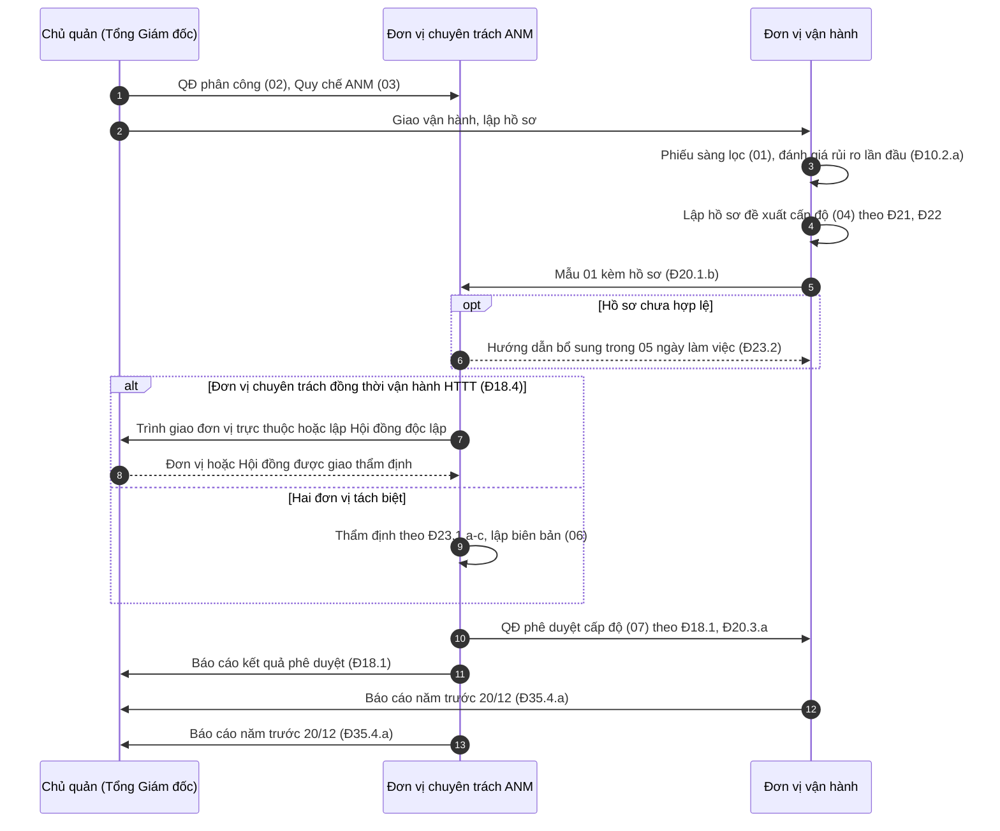

# 08 — Bộ mẫu hệ thống thông tin cấp độ 1–2

> **Căn cứ:** Luật 116/2025/QH15 Đ1.2, Đ8.1, Đ10, Đ45.1; NĐ 331/2026/NĐ-CP Đ2, Đ8, Đ10, Đ11–Đ13, Đ18, Đ20–Đ25, Đ29–Đ33, Đ35–Đ36 và Phụ lục (Mẫu số 01, 08); NĐ 330/2026/NĐ-CP Đ7, Đ21–Đ24, Đ27, Đ54; Luật 91/2025/QH15 Đ23; TCVN 14423:2026 mục 3, mục 4 · **Đối chiếu văn bản gốc:** 28/09/2026 · **Trạng thái:** Bản khung v0.1

Bộ mẫu **gọn** cho tổ chức chỉ có HTTT cấp độ 1 và cấp độ 2 — điển hình là doanh nghiệp vừa và nhỏ với thư điện tử, văn phòng điện tử/intranet, kế toán, nhân sự, mạng LAN/Active Directory, website hoặc CRM nhỏ. Mục tiêu: ít giấy tờ nhất nhưng đủ căn cứ để chứng minh đã thực hiện các nghĩa vụ bắt buộc khi bị kiểm tra.

Đối tượng dùng: người đứng đầu tổ chức (chủ quản), trưởng bộ phận CNTT/vận hành, người phụ trách an ninh mạng, kiểm soát nội bộ/pháp chế.

## 1. Khi nào dùng bộ này, khi nào phải chuyển sang bộ đầy đủ

**Dùng bộ này khi** mọi HTTT đưa vào hồ sơ đều qua [phiếu sàng lọc](01-phieu-sang-loc-cap-do.md) với kết luận cấp độ 1 hoặc 2, tức là:

- Cấp độ 1 (NĐ 331 Đ11): hệ thống phục vụ nội bộ **và** chỉ xử lý thông tin công cộng; hoặc theo Khung quản lý rủi ro ANM.
- Cấp độ 2 (NĐ 331 Đ12), một trong các tiêu chí: nội bộ có xử lý thông tin riêng, thông tin cá nhân, không có bí mật nhà nước (Đ12.1); dịch vụ trực tuyến không thuộc danh mục ngành, nghề đầu tư kinh doanh có điều kiện (Đ12.2.a); dịch vụ trực tuyến khác dưới 100.000 chủ thể DLCN cơ bản hoặc dưới 10.000 chủ thể DLCN nhạy cảm (Đ12.2.b); hạ tầng thông tin phục vụ **một** cơ quan, tổ chức (Đ12.3); do Thủ tướng quyết định hoặc theo Khung quản lý rủi ro (Đ12.4).

**Chuyển sang bộ đầy đủ** ([01-xac-dinh-cap-do](../01-xac-dinh-cap-do/) và [02-ho-so-cap-do](../02-ho-so-cap-do/)) cho hệ thống có **bất kỳ** dấu hiệu nào dưới đây (Phần D của phiếu sàng lọc):

| Dấu hiệu | Căn cứ |
|---|---|
| Xử lý thông tin bí mật nhà nước; phục vụ quốc phòng, an ninh | NĐ 331 Đ13.1 |
| Dịch vụ trực tuyến thuộc danh mục ngành, nghề đầu tư kinh doanh có điều kiện | Đ13.2.a |
| Hệ thống giải quyết thủ tục hành chính | Đ13.2.b |
| Dịch vụ trực tuyến xử lý thông tin của từ 100.000 chủ thể DLCN cơ bản hoặc từ 10.000 chủ thể DLCN nhạy cảm | Đ13.2.c |
| Hạ tầng thông tin cho các cơ quan, tổ chức trong một bộ, ngành, một hoặc một số tỉnh | Đ13.3 |
| Điều khiển công nghiệp phục vụ công trình xây dựng từ cấp IV trở lên | Đ13.4, Đ14.3, Đ15.4 |
| Đánh giá rủi ro cho mức tổn hại vượt cấp 2 | Luật 116 Đ8.1; NĐ 331 Đ10.5 |
| Có dấu hiệu HTTT quan trọng về an ninh quốc gia | NĐ 331 Đ16, Đ17 |

Nguyên tắc: hệ thống đáp ứng nhiều tiêu chí → áp dụng cấp cao nhất (Đ8.2); không tách, gộp phạm vi để hạ cấp (Đ8.3). Tổ chức có cả HTTT cấp 1–2 và HTTT cấp 3: dùng bộ này cho nhóm cấp 1–2 và bộ đầy đủ cho HTTT cấp 3 (thẩm quyền phê duyệt khác nhau — Đ18.1 và Đ18.2); có thể dùng chung một Quy chế nếu Quy chế đáp ứng yêu cầu quản lý của cấp cao nhất (Đ30.7). Chủ quản HTTT sử dụng ngân sách nhà nước có thêm nghĩa vụ riêng (Luật 116 Đ40.2) — đối chiếu bộ đầy đủ.

### Phạm vi áp dụng NĐ 331 — ghi chú về chữ "khuyến khích"

Nguyên văn NĐ 331 Đ2:

> "Nghị định này áp dụng đối với cơ quan, tổ chức, cá nhân tham gia hoặc có liên quan đến hoạt động xây dựng, thiết lập, quản lý, vận hành, nâng cấp, mở rộng hệ thống thông tin tại Việt Nam phục vụ ứng dụng công nghệ thông tin trong hoạt động của cơ quan, tổ chức nhà nước, ứng dụng công nghệ thông tin trong việc cung cấp dịch vụ trực tuyến phục vụ người dân và doanh nghiệp.
>
> Khuyến khích tổ chức, cá nhân liên quan khác áp dụng các quy định tại Nghị định này để bảo vệ hệ thống thông tin."

HTTT **thuần nội bộ** của doanh nghiệp tư (như bốn hệ thống trong dữ liệu mẫu) có thể được lập luận là thuộc diện "khuyến khích". Tuy vậy: Luật 116 áp dụng với mọi cơ quan, tổ chức, cá nhân Việt Nam (Đ1.2.a); nhiệm vụ "xác định cấp độ an ninh mạng của hệ thống thông tin" là một trong sáu nhiệm vụ tại Đ10.1, và chủ quản HTTT cấp độ 1, cấp độ 2 phải "thực hiện đầy đủ các nhiệm vụ quy định tại khoản 1" (Đ10.3); chế tài NĐ 330 Đ23, Đ24 không phân biệt loại chủ quản. Bộ này chọn cách thận trọng: vẫn xác định cấp độ và giữ bộ hồ sơ tối thiểu. Phân tích: [tieu-chi-cap-do.md mục 6.1](../01-xac-dinh-cap-do/tieu-chi-cap-do.md). Hệ thống nào **cung cấp dịch vụ trực tuyến** (website bán hàng, cổng khách hàng, ứng dụng) thì thuộc phạm vi bắt buộc (Đ2; khái niệm dịch vụ trực tuyến tại Đ3.5).

## 2. Luồng 6 bước

| Bước | Việc | Ai làm | Văn bản | Căn cứ |
|---|---|---|---|---|
| 1 | Phân công nhiệm vụ; ban hành Quy chế ANM | Chủ quản | [02](02-qd-phan-cong-anm.md), [03](03-quy-che-anm-cap-1-2.md) | NĐ 331 Đ31.1, Đ30.7 |
| 2 | Sàng lọc cấp độ, đánh giá rủi ro lần đầu | Đơn vị vận hành | [01](01-phieu-sang-loc-cap-do.md) | Đ10.2.a, Đ10.3, Đ11–Đ13 |
| 3 | Lập hồ sơ đề xuất cấp độ | Đơn vị vận hành | [04](04-ho-so-de-xuat-cap-do.md) | Đ20.1.a, Đ21, Đ22 |
| 4 | Gửi văn bản đề nghị (Mẫu 01) kèm hồ sơ | Đơn vị vận hành | [Mẫu 01](mau-01-de-nghi-tham-dinh-phe-duyet.md) | Đ20.1.b |
| 5 | Thẩm định (hướng dẫn bổ sung trong 05 ngày làm việc nếu hồ sơ chưa hợp lệ) | Đơn vị chuyên trách ANM | [06](06-bien-ban-tham-dinh.md) | Đ18.1, Đ23.1, Đ23.2 |
| 6 | Phê duyệt; báo cáo chủ quản | Đơn vị chuyên trách ANM | [07](07-qd-phe-duyet-cap-do.md) | Đ18.1, Đ20.3.a |

Quy chế phải được ban hành **trước khi** hồ sơ đề xuất cấp độ được phê duyệt (Đ30.7). Sau bước 6: triển khai, duy trì theo [kế hoạch năm](09-ke-hoach-anm-nam.md), xử lý sự cố theo [quy trình rút gọn](08-quy-trinh-su-co-rut-gon.md), báo cáo năm theo Mẫu 08.

## 3. Danh mục file

Bản Word/Excel được sinh bằng `tools/md2docx` và `tools/md2xlsx` vào `templates/08-bo-mau-cap-1-2/` (xem [tools/md2docx/README.md](../../tools/md2docx/README.md)). README này không xuất ra Word.

| File | Bản Word/Excel | Mục đích | Căn cứ | Người ký |
|---|---|---|---|---|
| [01-phieu-sang-loc-cap-do.md](01-phieu-sang-loc-cap-do.md) | [.docx](../../templates/08-bo-mau-cap-1-2/01-phieu-sang-loc-cap-do.docx) | Sàng lọc từng HTTT: phạm vi, tiêu chí cấp 1–2, dấu hiệu cấp 3 | NĐ 331 Đ2, Đ8, Đ10.5, Đ11–Đ13 | Đơn vị vận hành lập; chuyên trách xác nhận |
| [02-qd-phan-cong-anm.md](02-qd-phan-cong-anm.md) | [.docx](../../templates/08-bo-mau-cap-1-2/02-qd-phan-cong-anm.docx) | Chỉ định đơn vị chuyên trách, giao vận hành, phương án Đ18.4, đầu mối sự cố | Đ18, Đ20, Đ31–Đ33 | Người đứng đầu chủ quản |
| [03-quy-che-anm-cap-1-2.md](03-quy-che-anm-cap-1-2.md) | [.docx](../../templates/08-bo-mau-cap-1-2/03-quy-che-anm-cap-1-2.docx) | Quy chế ANM rút gọn, tham số theo cột Cấp 1 / Cấp 2 | Đ30.3, Đ30.4, Đ30.7; TCVN mục 3, 4 | Người đứng đầu chủ quản |
| [04-ho-so-de-xuat-cap-do.md](04-ho-so-de-xuat-cap-do.md) | [.docx](../../templates/08-bo-mau-cap-1-2/04-ho-so-de-xuat-cap-do.docx) | Hồ sơ gộp: tổng quan, đề xuất cấp độ và rủi ro sơ bộ, phương án ANM | Đ21, Đ22.3, Đ22.4, Đ22.6, Đ29 | Đơn vị vận hành lập |
| [mau-01-de-nghi-tham-dinh-phe-duyet.md](mau-01-de-nghi-tham-dinh-phe-duyet.md) | [.docx](../../templates/08-bo-mau-cap-1-2/mau-01-de-nghi-tham-dinh-phe-duyet.docx) | Văn bản đề nghị thẩm định, phê duyệt (nguyên văn Mẫu số 01) | Đ20.1.b; Phụ lục | Trưởng đơn vị vận hành |
| [06-bien-ban-tham-dinh.md](06-bien-ban-tham-dinh.md) | [.docx](../../templates/08-bo-mau-cap-1-2/06-bien-ban-tham-dinh.docx) | Biên bản thẩm định nội bộ | Đ18.1, Đ18.4, Đ23.1 | Trưởng đơn vị chuyên trách |
| [07-qd-phe-duyet-cap-do.md](07-qd-phe-duyet-cap-do.md) | [.docx](../../templates/08-bo-mau-cap-1-2/07-qd-phe-duyet-cap-do.docx) | QĐ phê duyệt cấp độ + báo cáo chủ quản | Đ18.1, Đ20.3.a | Trưởng đơn vị chuyên trách |
| [08-quy-trinh-su-co-rut-gon.md](08-quy-trinh-su-co-rut-gon.md) | [.docx](../../templates/08-bo-mau-cap-1-2/08-quy-trinh-su-co-rut-gon.docx) | Quy trình sự cố, mẫu báo cáo 24 giờ/72 giờ, vi phạm DLCN 72 giờ | Đ31.2.d; Luật 91 Đ23 | Đơn vị chuyên trách |
| [09-ke-hoach-anm-nam.md](09-ke-hoach-anm-nam.md) | [.docx](../../templates/08-bo-mau-cap-1-2/09-ke-hoach-anm-nam.docx) | Đào tạo, tuyên truyền, diễn tập, tự đánh giá, rà soát định kỳ, lịch báo cáo | Luật 116 Đ10.1; Đ28.5, Đ31.2.c, Đ31.3, Đ33.3 | Người đứng đầu chủ quản |
| [checklist-cap-1-2.md](checklist-cap-1-2.md) | [.xlsx](../../templates/08-bo-mau-cap-1-2/checklist-cap-1-2.xlsx) | Checklist TCVN mục 3/4, danh mục HTTT, lịch định kỳ, sổ sự cố, kế hoạch khắc phục | TCVN mục 3, 4; Đ33.3 | — |
| [Mẫu 08 (bộ đầy đủ)](../02-ho-so-cap-do/mau-08-bao-cao.md) | [.docx](../../templates/02-ho-so-cap-do/mau-08-bao-cao.docx) | Báo cáo năm — dùng mẫu hiện có, không tạo file mới | Đ35, Đ36 | Chủ quản |

Số thứ tự 05 là Mẫu 01 (giữ tên `mau-01-…` để công cụ xuất Word nhận diện đúng biểu mẫu nguyên văn).

## 4. Gói giấy tờ tối thiểu

Khi được kiểm tra, tổ chức cần xuất trình được:

1. QĐ phân công nhiệm vụ ANM (02) — kèm quyết định giao đơn vị/lập Hội đồng thẩm định nếu phát sinh Đ18.4.
2. Quy chế bảo đảm ANM (03) — ban hành trước ngày phê duyệt hồ sơ (Đ30.7).
3. Phiếu sàng lọc đã ký cho **từng** HTTT (01), kể cả HTTT cấp 1.
4. Hồ sơ đề xuất cấp độ (04), gồm kết quả đánh giá rủi ro sơ bộ và sơ đồ mạng/hồ sơ cấu hình làm "tài liệu có giá trị tương đương" thiết kế (Đ21.2.b).
5. Văn bản đề nghị Mẫu 01 có số, ngày.
6. Biên bản thẩm định (06).
7. QĐ phê duyệt cấp độ và báo cáo chủ quản (07).
8. Quy trình sự cố và danh sách đầu mối (08); sổ sự cố (sheet trong checklist Excel).
9. Kế hoạch ANM năm (09) và bằng chứng thực hiện: danh sách đào tạo, biên bản diễn tập, báo cáo tự đánh giá, kết quả quét lỗ hổng, rà soát tài khoản, nhật ký.
10. Checklist tự đánh giá TCVN mục 3/4 đã điền, kế hoạch khắc phục.
11. Báo cáo năm Mẫu 08 và bằng chứng gửi (Đ35).

Không cần: Mẫu 02, 03, 05, 07; ý kiến chuyên môn (Đ21.5 chỉ cấp 4–5); báo cáo đánh giá rủi ro chi tiết (Đ22.5 chỉ cấp 4–5); Mẫu 04 (Đ24.1.b chỉ bắt buộc ý kiến thẩm định với cấp 3 trở lên — biên bản 06 thay thế làm bằng chứng).

## 5. Lịch trong năm

Lịch cho năm vận hành ổn định. Năm đầu (dữ liệu mẫu): QĐ phân công 01/10/2026 → Quy chế 05/10 → hồ sơ 12/10 → Mẫu 01 15/10 → biên bản 22/10 → QĐ phê duyệt 26/10 → báo cáo chủ quản 27/10 → kế hoạch năm 2027 ngày 15/11 → báo cáo năm 2026 trước 20/12 và 25/12.

| Tháng | Việc | Căn cứ | Phụ trách |
|---|---|---|---|
| Hằng tháng | Vá máy người dùng; vô hiệu tài khoản không hoạt động 45 ngày; theo dõi cảnh báo | TCVN mục 3.6, 3.7 / 4.6, 4.7 | Đơn vị vận hành |
| 1 | Triển khai kế hoạch năm; cập nhật danh mục HTTT, tài sản, nhà cung cấp | TCVN mục 3.2, 3.14 / 4.2, 4.14 | Đơn vị vận hành |
| 3 | Đào tạo nâng cao nhận thức ANM cho toàn bộ nhân viên (tối thiểu 01 lần/năm) | NĐ 331 Đ31.3; TCVN mục 3.13.2.2 / 4.13.2.2 | Đơn vị chuyên trách |
| 5 | Diễn tập ứng phó sự cố (tabletop); cập nhật quy trình sự cố, đầu mối liên hệ | Đ31.3; TCVN mục 3.15 / 4.15 | Đơn vị chuyên trách |
| 6 | Rà quét lỗ hổng; khôi phục thử bản sao lưu | TCVN mục 3.7, 3.11 / 4.7, 4.11 | Đơn vị vận hành, chuyên trách phối hợp |
| 8 | Rà soát tài khoản, phân quyền, nhật ký; cập nhật sơ đồ mạng | TCVN mục 3.4, 3.6, 3.8, 3.12 / 4.4, 4.6, 4.8, 4.12 | Đơn vị vận hành |
| 9 | Tự đánh giá độc lập theo checklist; đánh giá hiệu quả biện pháp | Đ28.5.a, Đ31.2.c, Đ33.3 | Đơn vị chuyên trách (độc lập với vận hành) |
| 10 | Đánh giá lại rủi ro; rà soát Quy chế; xem xét xác định lại cấp độ nếu có thay đổi | Đ10.2.b–c, Đ25; TCVN mục 3.1 / 4.1 | Đơn vị vận hành, chuyên trách |
| 11 | Lập, trình kế hoạch ANM năm sau | Luật 116 Đ10.1 | Đơn vị chuyên trách |
| 12 | Chốt số liệu 14/12; báo cáo nội bộ trước 20/12; chủ quản gửi Bộ Công an trước 25/12 | Đ35.3, Đ35.4 | Chuyên trách, vận hành, chủ quản |
| Khi phát sinh | Sự cố: thông báo ban đầu sự cố nghiêm trọng 24 giờ, báo cáo 72 giờ; vi phạm DLCN: thông báo 72 giờ; thay đổi hệ thống: đánh giá rủi ro | Đ31.2.d; Luật 91 Đ23.1; Đ10.2.b–đ | Đầu mối sự cố |

Chu kỳ "tối thiểu 01 lần/năm" lấy theo TCVN 14423:2026 mục 3, mục 4; NĐ 331 Đ28.5.a chỉ yêu cầu kiểm tra định kỳ theo cấp độ và mức rủi ro, không cố định tần suất. Tổ chức có thể dồn các việc hằng năm vào 1–2 đợt.

## 6. Mẫu của bộ đầy đủ: dùng lại, không dùng, thay bằng

| Mẫu/tài liệu bộ đầy đủ | Xử lý | Thay bằng / lý do |
|---|---|---|
| [Mẫu 01](../02-ho-so-cap-do/mau-01-de-nghi-tham-dinh-phe-duyet.md) | **Dùng lại** | Bản sao trong bộ này; mẫu dành cho cấp 1–2 (Đ20.1.b) |
| [Mẫu 02](../02-ho-so-cap-do/mau-02-de-nghi-tham-dinh.md), [Mẫu 03](../02-ho-so-cap-do/mau-03-xin-y-kien-chuyen-mon.md) | Không dùng | Dành cho cấp 3–5 (Đ20.1.c–d) |
| [Mẫu 04](../02-ho-so-cap-do/mau-04-y-kien-tham-dinh.md) | Không bắt buộc | Đ24.1.b chỉ yêu cầu ý kiến thẩm định với cấp ≥ 3 → [06 biên bản thẩm định](06-bien-ban-tham-dinh.md) |
| [Mẫu 05](../02-ho-so-cap-do/mau-05-to-trinh-phe-duyet.md) | Không dùng | Cấp 1–2 không trình chủ quản phê duyệt (Đ20.3.a) → báo cáo chủ quản kèm [07](07-qd-phe-duyet-cap-do.md) |
| [Mẫu 06](../02-ho-so-cap-do/mau-06-quyet-dinh-phe-duyet-cap-do.md) | Điều chỉnh | [07](07-qd-phe-duyet-cap-do.md): giữ cấu trúc Mẫu 06, do đơn vị chuyên trách ban hành **[CẦN ĐỐI CHIẾU]** thể thức |
| [Mẫu 07](../02-ho-so-cap-do/mau-07-quyet-dinh-phe-duyet-phuong-an-anm.md) | Không dùng | Chỉ cấp 5 và HTTT thuộc Danh mục ANQG (Đ20.3.c, Đ20.4) |
| [Mẫu 08](../02-ho-so-cap-do/mau-08-bao-cao.md) | **Dùng lại** | Báo cáo năm, mọi cấp (Đ35, Đ36) |
| [Phiếu xác định cấp độ](../01-xac-dinh-cap-do/phieu-xac-dinh-cap-do.md) | Thay | [01 phiếu sàng lọc](01-phieu-sang-loc-cap-do.md); dùng lại phiếu đầy đủ khi có dấu hiệu cấp 3 |
| Thuyết minh [tổng quan](../02-ho-so-cap-do/thuyet-minh-tong-quan-httt.md), [đề xuất cấp độ](../02-ho-so-cap-do/thuyet-minh-de-xuat-cap-do.md), [phương án ANM](../02-ho-so-cap-do/thuyet-minh-phuong-an-anm.md), [báo cáo đánh giá rủi ro](../02-ho-so-cap-do/bao-cao-danh-gia-rui-ro.md) | Gộp | [04 hồ sơ đề xuất cấp độ](04-ho-so-de-xuat-cap-do.md) (một hồ sơ nhiều HTTT — Đ22.4.a); rủi ro ở mức sơ bộ (Đ22.4.c) |
| [QĐ chỉ định đơn vị chuyên trách](../04-chinh-sach-quy-trinh/qd-chi-dinh-don-vi-bo-phan-chuyen-trach-anm.md), [QĐ giao đơn vị vận hành](../04-chinh-sach-quy-trinh/qd-giao-don-vi-van-hanh.md) | Gộp | [02 QĐ phân công](02-qd-phan-cong-anm.md) |
| [QĐ thành lập Hội đồng thẩm định](../04-chinh-sach-quy-trinh/qd-thanh-lap-hoi-dong-tham-dinh.md) | Dùng khi phát sinh | Chỉ khi chọn phương án Đ18.4.b |
| [QĐ chỉ định chủ quản, ủy quyền](../04-chinh-sach-quy-trinh/qd-chi-dinh-chu-quan-uy-quyen.md) | Thường không cần | Doanh nghiệp: chủ quản là cấp quyết định đầu tư (Đ4.2); chỉ cần khi ủy quyền (Đ4.3) |
| [Quy chế bảo đảm ANM đầy đủ](../04-chinh-sach-quy-trinh/quy-che-bao-dam-anm.md) | Thay | [03 Quy chế rút gọn](03-quy-che-anm-cap-1-2.md) |
| [Quy trình ứng phó sự cố](../04-chinh-sach-quy-trinh/quy-trinh-ung-pho-su-co.md) | Thay | [08 quy trình rút gọn](08-quy-trinh-su-co-rut-gon.md) |
| Quy trình [quản lý rủi ro](../04-chinh-sach-quy-trinh/quy-trinh-quan-ly-rui-ro.md), [đánh giá trước vận hành](../04-chinh-sach-quy-trinh/quy-trinh-danh-gia-truoc-van-hanh.md), [quản lý nhà cung cấp](../04-chinh-sach-quy-trinh/quy-trinh-quan-ly-nha-cung-cap.md), [tiếp nhận yêu cầu cơ quan chức năng](../04-chinh-sach-quy-trinh/quy-trinh-tiep-nhan-yeu-cau-co-quan-chuc-nang.md) | Tùy chọn | Nội dung tối thiểu nằm trong Quy chế 03; dùng bản đầy đủ khi quy mô lớn |
| [Kế hoạch đào tạo, diễn tập](../04-chinh-sach-quy-trinh/ke-hoach-dao-tao-dien-tap.md) | Thay | [09 kế hoạch ANM năm](09-ke-hoach-anm-nam.md) |
| [Ma trận RACI](../04-chinh-sach-quy-trinh/ma-tran-raci.md) | Không cần | Phân công đã nêu trong 02 |
| [Checklist cấp 1](../03-yeu-cau-theo-cap-do/checklist-cap-1.md), [cấp 2](../03-yeu-cau-theo-cap-do/checklist-cap-2.md) | Thay | [checklist-cap-1-2](checklist-cap-1-2.md) (một bảng, hai cột cấp) |
| [Tờ trình lãnh đạo](../07-to-trinh-lanh-dao/) | Tùy chọn | Dùng khi cần xin chủ trương, kinh phí |

## 7. Mức phạt liên quan (NĐ 330/2026/NĐ-CP)

Mục 1–5 Chương II NĐ 330 ghi mức phạt cho **cá nhân**; tổ chức có cùng hành vi bị phạt **gấp hai lần** (Đ7.1). Mục 6 (dữ liệu cá nhân) ghi trực tiếp mức cho tổ chức. Bảng dưới ghi **mức cho tổ chức**.

| Hành vi | Căn cứ | Mức phạt tổ chức | Văn bản trong bộ phòng ngừa |
|---|---|---|---|
| Không lập hồ sơ đề xuất cấp độ hoặc không tổ chức thẩm định, phê duyệt (không giới hạn cấp) | Đ24.1 | 40–60 triệu đồng | 01, 04, 06, 07 |
| Không ban hành quy định về bảo đảm ANM trong thiết kế, xây dựng, quản lý, vận hành, sử dụng, nâng cấp, hủy bỏ HTTT | Đ23.1.a | 40–60 triệu đồng | 03 |
| Không kiểm tra, giám sát tuân thủ, lưu trữ nhật ký hệ thống theo quy định hoặc không đánh giá hiệu quả biện pháp | Đ23.2.a | 60–100 triệu đồng | 09, checklist |
| Không tổ chức thực thi, đôn đốc, kiểm tra, giám sát công tác bảo đảm ANM | Đ23.2.c | 60–100 triệu đồng | 02, 09 |
| Không báo cáo lực lượng chuyên trách Bộ Công an khi phát hiện sự cố; không triển khai ứng cứu và báo cáo | Đ21.2.a–b | 40–60 triệu đồng | 08 |
| Không thành lập/chỉ định đơn vị chuyên trách ứng cứu sự cố hoặc Đội ứng cứu; không ghi nhận, tiếp nhận, báo cáo sự cố đúng quy trình; không xây dựng Kế hoạch ứng phó sự cố | Đ21.3.b–d | 60–100 triệu đồng | 02, 08 |
| Không có biện pháp quản lý, phòng ngừa, phát hiện, ngăn chặn phát tán phần mềm độc hại | Đ22.1.a | 30–60 triệu đồng | 03, checklist |
| Không thực hiện hoặc thực hiện không đầy đủ yêu cầu của lực lượng chuyên trách về khắc phục điểm yếu, lỗ hổng | Đ27.1.c | 50–100 triệu đồng | 09 |
| Thông báo vi phạm quy định bảo vệ DLCN chậm hơn 72 giờ (vi phạm có thể gây tổn hại theo Luật 91 Đ23.1) | Đ54.3 (Mục 6) | 40–60 triệu đồng | 08 |

Ghi chú: Đ23.1.b–d (không xây dựng hồ sơ, đưa vào vận hành khi chưa phê duyệt, không triển khai đủ biện pháp) chỉ áp dụng với cấp 3–5. Mức phạt tối đa trong lĩnh vực ANM đối với tổ chức là 200 triệu đồng (Đ7.3). Không thấy chế tài riêng cho việc không nộp báo cáo năm Mẫu 08 **[CẦN ĐỐI CHIẾU]**. Tổng hợp đầy đủ: [nd-330-muc-phat.md](../05-nghia-vu-lien-quan/nd-330-muc-phat.md).

## 8. Dữ liệu mẫu

Các file trong bộ được điền sẵn bằng một kịch bản **giả lập** để bản Word dễ hình dung. Chỉ tên **Công ty cổ phần Giải pháp Công nghệ TURBO** là thật; họ tên, phòng ban, số văn bản, địa chỉ, email (`example.vn`), địa chỉ IP (`192.0.2.0/24`, dải riêng `10.x`) và mọi số liệu đều mô phỏng, không phản ánh thực tế. Giá trị mẫu riêng của từng file nằm trong mục `_theo_file` của `tools/md2docx/du-lieu-mau.json`. Không đưa dữ liệu thật lên repo công khai.

**Hệ thống thông tin** (một hồ sơ gồm nhiều HTTT — NĐ 331 Đ22.4.a; khoảng 120 nhân viên; máy chủ tại phòng máy trụ sở, Tầng 3):

| Mã | HTTT | Cấp đề xuất | Tiêu chí |
|---|---|---|---|
| HT-02-INTRANET | Cổng thông tin nội bộ (Intranet) – văn phòng điện tử, thư điện tử nội bộ | 2 | Đ12.1 |
| HT-03-ERP | Hệ thống kế toán – nhân sự nội bộ (ERP) | 2 | Đ12.1 |
| HT-04-LAN | Hạ tầng mạng nội bộ trụ sở (LAN, Wi-Fi, Active Directory) | 2 | Đ12.3 |
| HT-05-BANGTIN | Màn hình bảng tin điện tử tại sảnh (chỉ thông tin công khai, không có tài khoản) | 1 | Đ11.1 |

Thư điện tử dùng dịch vụ đám mây: nếu máy chủ đặt ở nước ngoài, cần rà soát nghĩa vụ chuyển DLCN xuyên biên giới (Luật 91 Đ20).

**Vai trò:** chủ quản — Công ty (Tổng Giám đốc Nguyễn Văn An); đơn vị chuyên trách ANM — Phòng An ninh mạng (Trưởng phòng Trần Thị Bình), thẩm định và phê duyệt; đơn vị vận hành — Phòng Vận hành hệ thống (Trưởng phòng Lê Minh Cường), lập hồ sơ, phụ trách tài sản, tài khoản; đầu mối sự cố — Trần Thị Bình (chính), Đỗ Văn Giang (dự phòng). Hai đơn vị tách biệt nên không phát sinh Đ18.4.

**Số, ngày văn bản mẫu:**

| Văn bản | Số | Ngày | Người ký |
|---|---|---|---|
| 02 QĐ phân công nhiệm vụ ANM | 40/2026/QĐ-TURBO | 01/10/2026 | Tổng Giám đốc |
| 03 Quy chế ANM (ban hành kèm QĐ) | 41/2026/QĐ-TURBO | 05/10/2026 | Tổng Giám đốc |
| 04 Hồ sơ đề xuất cấp độ, phiên bản 1.0 | — | 12/10/2026 | Trưởng phòng Vận hành hệ thống lập |
| Mẫu 01 đề nghị thẩm định, phê duyệt | 45/2026/CV-PVH | 15/10/2026 | Trưởng phòng Vận hành hệ thống |
| 06 Biên bản thẩm định | 01/2026/BB-PANM | 22/10/2026 | Trưởng phòng An ninh mạng |
| 07 QĐ phê duyệt cấp độ | 03/2026/QĐ-PANM | 26/10/2026 | Trưởng phòng An ninh mạng (theo QĐ 40/2026) |
| 07 kèm: Báo cáo chủ quản | 04/2026/BC-PANM | 27/10/2026 | Trưởng phòng An ninh mạng |
| 09 Kế hoạch ANM năm 2027 | 52/2026/KH-TURBO | 15/11/2026 | Tổng Giám đốc |
| Báo cáo năm (Mẫu 08) | — | nội bộ trước 20/12; gửi Bộ Công an trước 25/12 | Chủ quản |

## 9. Điểm cần lưu ý

| Vấn đề | Cách xử lý trong bộ | Tham chiếu |
|---|---|---|
| Luật 116 Đ10.3 cho cấp 1–2 chọn biện pháp Đ10.2 "theo nhu cầu, khả năng thực tế", nhưng NĐ 331 Đ30.7 buộc có Quy chế trước khi phê duyệt và NĐ 330 Đ23.1.a phạt việc không ban hành quy định | Ban hành Quy chế rút gọn (03) | [diem-can-doi-chieu.md C16](../00-tong-quan/diem-can-doi-chieu.md) |
| NĐ 331 không có mẫu quyết định phê duyệt cho cấp 1–2; phòng ban không có con dấu | Phân cấp ký tại QĐ 02 Điều 1 khoản 3; QĐ 07 theo cấu trúc Mẫu 06 | **[CẦN ĐỐI CHIẾU]** |
| Không có thời hạn thẩm định cho cấp 1–2 (Đ23.3 chỉ cấp 3–5); thời hạn 07 ngày làm việc xử lý hồ sơ phê duyệt (Đ24.2) viết chung | Tự đặt 10 ngày làm việc trong QĐ 02/Quy chế; vẫn tuân thủ 07 ngày của Đ24.2 | **[CẦN ĐỐI CHIẾU]** |
| HTTT đang vận hành nhưng chưa từng xác định cấp độ không có mốc chuyển tiếp; HTTT đã có cấp độ theo Luật 86/2015 giữ cấp và đáp ứng yêu cầu mới trong 12 tháng kể từ 01/7/2026 | Làm ngay; dùng 30/6/2027 làm hạn nội bộ | Luật 116 Đ45.1; NĐ 331 Đ39.1; [diem-can-doi-chieu.md B2](../00-tong-quan/diem-can-doi-chieu.md) |
| Khung quản lý rủi ro ANM (tiêu chí Đ11.2, Đ12.4) chưa có trong repo | Không dùng tiêu chí này cho đến khi có văn bản | NĐ 331 Đ34.1.c; **[CẦN ĐỐI CHIẾU]** |
