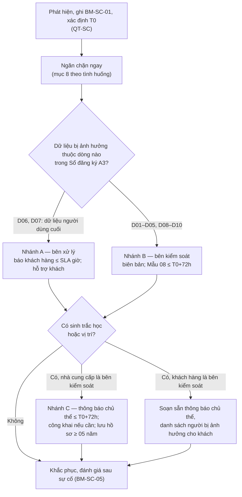

# Mẫu Quy trình xử lý sự cố, vi phạm dữ liệu cá nhân có nhánh sinh trắc học — nhà cung cấp giải pháp AI vision

> **Căn cứ:** Luật 91/2025/QH15 Đ3.3, Đ23, Đ31.4, Đ37.1.d, Đ37.2.e; NĐ 356/2025/NĐ-CP Đ4.1.đ, Đ4.1.h, Đ12.2.d, Đ14.1.d, Đ28, Đ29, Phụ lục Mẫu số 08; NĐ 330/2026/NĐ-CP Đ7.1, Đ54, Đ67.3.b, Đ70.1.c–h · **Đối chiếu văn bản gốc:** 28/09/2026 · **Trạng thái:** Bản khung v0.1

## Hướng dẫn sử dụng

Quy trình **bổ sung** cho [Quy trình ứng phó sự cố an ninh mạng](../04-chinh-sach-quy-trinh/quy-trinh-ung-pho-su-co.md) (gọi tắt **QT-SC**) của nhà cung cấp. Mã **A7** trong [bản thảo luận](thao-luan-tai-lieu-va-phuong-an-ho-tro.md). Không lặp lại những gì QT-SC đã có. Phân chia như sau:

| Việc | Ở đâu |
|---|---|
| Phát hiện, ghi nhận, xác định T0, phân loại mức sự cố, ứng phó kỹ thuật, báo cáo an ninh mạng 24 giờ/72 giờ | QT-SC mục 3–6; phiếu BM-SC-01, BM-SC-02, BM-SC-03 |
| Biên bản xác nhận vi phạm DLCN; đánh giá sau sự cố; danh bạ; diễn tập | QT-SC BM-SC-04, BM-SC-05, mục 9, mục 10 |
| **Xác định nhà cung cấp là bên xử lý hay bên kiểm soát** với dữ liệu bị ảnh hưởng | **A7 mục 4** |
| **Nhánh A — bên xử lý:** báo khách hàng "kịp thời", hỗ trợ khách hàng thông báo | **A7 mục 5** |
| **Nhánh B — bên kiểm soát:** thông báo cơ quan chuyên trách 72 giờ (Mẫu số 08) | **A7 mục 6** (bổ sung QT-SC mục 7) |
| **Nhánh C — sinh trắc học, vị trí:** thông báo chủ thể 72 giờ, công khai, lưu hồ sơ 05 năm | **A7 mục 7** |
| **Tình huống đặc thù AI vision** | **A7 mục 8** |

### Áp dụng theo mô hình

| Mô hình | Nhánh thường gặp |
|---|---|
| M1 | Nhánh B, C cho dữ liệu của chính nhà cung cấp (nhân viên, văn phòng). Lỗ hổng sản phẩm (ví dụ firmware camera) không phải vi phạm DLCN của nhà cung cấp vì nhà cung cấp không xử lý dữ liệu; vẫn nên phát cảnh báo an ninh cho khách hàng theo quy trình quản lý lỗ hổng |
| M2 | Nhánh A khi sự cố xảy ra trong phiên hỗ trợ, hoặc do kỹ thuật viên, đại lý |
| M3, M4 | Nhánh A là chính (dữ liệu người dùng cuối trên nền tảng); nhánh B cho tài khoản nền tảng, nhật ký |
| M5 | Nhánh B, C cho bộ dữ liệu huấn luyện |

### Yêu cầu nguồn

| Yêu cầu | Căn cứ |
|---|---|
| Bên kiểm soát, bên kiểm soát và xử lý, bên thứ ba phát hiện vi phạm có thể gây tổn hại đến quốc phòng, an ninh quốc gia, trật tự, an toàn xã hội hoặc xâm phạm tính mạng, sức khỏe, danh dự, nhân phẩm, tài sản của chủ thể: thông báo cơ quan chuyên trách **chậm nhất 72 giờ** kể từ khi phát hiện | Luật 91 Đ23.1 câu 1 |
| **Bên xử lý** phát hiện vi phạm: thông báo **kịp thời** cho bên kiểm soát | Luật 91 Đ23.1 câu 2 |
| Bên kiểm soát lập **biên bản xác nhận**, phối hợp cơ quan chuyên trách | Luật 91 Đ23.2 |
| Các trường hợp khác phải thông báo cơ quan chuyên trách: phát hiện vi phạm; xử lý sai mục đích, sai thỏa thuận; không bảo đảm quyền chủ thể | Luật 91 Đ23.3 |
| Ngăn chặn, khắc phục hậu quả, phối hợp xử lý | Luật 91 Đ23.4; Đ37.2.e |
| Nội dung thông báo: tính chất vi phạm (thời gian, địa điểm, hành vi, tổ chức, cá nhân, loại và số lượng dữ liệu); liên hệ nhân sự BVDLCN; hậu quả có thể xảy ra; biện pháp giải quyết. Gửi theo **Mẫu số 08** hoặc qua Cổng thông tin quốc gia về BVDLCN | NĐ 356 Đ28.1–28.2 |
| Sự cố liên quan dữ liệu **vị trí hoặc sinh trắc học**: bên kiểm soát thông báo **chủ thể** trong 72 giờ; báo cơ quan theo Đ28; lưu hồ sơ vi phạm **tối thiểu 05 năm** kể từ ngày khắc phục xong | NĐ 356 Đ29.1 |
| Thông báo chủ thể có tối thiểu **06 nội dung** | NĐ 356 Đ29.2.a–e |
| Không thông báo hết được trong 72 giờ vì lý do kỹ thuật, khẩn cấp: **thông báo công khai** trên trang thông tin điện tử, ứng dụng; gửi riêng ngay khi điều kiện cho phép | NĐ 356 Đ29.3 |
| Xử lý dữ liệu sinh trắc học gây thiệt hại: tổ chức thu thập và xử lý phải thông báo chủ thể | Luật 91 Đ31.4.b |

### Rủi ro phạt (mức cho tổ chức; cá nhân bằng một nửa — NĐ 330 Đ7.1)

| Hành vi | Mức phạt | Căn cứ |
|---|---|---|
| Bên xử lý không thông báo kịp thời cho bên kiểm soát | 10–20 triệu | NĐ 330 Đ54.1.a |
| Không lập biên bản xác nhận; báo cáo nhưng che giấu, sai lệch quy mô, loại dữ liệu, số chủ thể | 10–20 triệu | NĐ 330 Đ54.1.b–c |
| Không thông báo cơ quan chuyên trách (phát hiện vi phạm, sai mục đích, không bảo đảm quyền) | 20–40 triệu | NĐ 330 Đ54.2 |
| Thông báo cơ quan chuyên trách chậm hơn 72 giờ | 40–60 triệu | NĐ 330 Đ54.3 |
| Không ngăn chặn, không khắc phục; không phối hợp cơ quan chuyên trách | 60–80 triệu | NĐ 330 Đ54.4 |
| Sinh trắc học, vị trí: không thông báo cơ quan chuyên trách **và chủ thể** trong 72 giờ; thông báo thiếu nội dung tối thiểu; không lưu hồ sơ 05 năm; không thông báo công khai khi không liên hệ hết được | **50–70 triệu** | NĐ 330 Đ70.1.đ–h |
| Không bảo mật vật lý thiết bị lưu, truyền sinh trắc học; không hạn chế truy cập, không có hệ thống theo dõi xâm phạm (thường bị phát hiện qua sự cố) | 50–70 triệu | NĐ 330 Đ70.1.c–d |

### Vùng xám

- **Ai thông báo chủ thể khi nhà cung cấp là bên xử lý:** NĐ 356 Đ29.1 giao cho bên kiểm soát (khách hàng). Nhưng NĐ 330 Đ70.1.đ không nêu chủ thể vi phạm, và Luật 91 Đ31.4.b nói "tổ chức, cá nhân **thu thập và xử lý**" dữ liệu sinh trắc học. **[CẦN ĐỐI CHIẾU]** mức độ rủi ro phạt với bên xử lý. Cách làm an toàn: phụ lục xử lý dữ liệu (C1) quy định nhà cung cấp soạn sẵn thông báo, gửi thay khi khách hàng yêu cầu bằng văn bản, và được thông báo công khai trên ứng dụng của nền tảng nếu khách hàng không phản hồi sau {{SO_GIO_CHO_KH_PHAN_HOI}} giờ.
- **"Kịp thời"** không có số giờ. Mốc nội bộ đề xuất: thông báo sơ bộ cho khách hàng **≤ {{SO_GIO_BAO_SU_CO}} giờ** kể từ T0 (gợi ý 24 giờ, tối đa 36 giờ), để khách hàng còn thời gian đánh giá và thông báo trong 72 giờ. Mốc này phải trùng với cam kết trong C1 và Đề án A6.
- **Mốc tính 72 giờ khi nhà cung cấp là bên xử lý:** 72 giờ của khách hàng tính từ khi **khách hàng** phát hiện (Luật 91 Đ23.1). Chưa rõ thời điểm nhà cung cấp phát hiện có bị coi là thời điểm khách hàng phát hiện không — **[CẦN ĐỐI CHIẾU]**. Vì vậy cần báo khách hàng sớm nhất có thể.
- **Nhận diện nhầm hàng loạt** không phải lộ, mất dữ liệu, nhưng có thể là vi phạm nguyên tắc bảo đảm tính chính xác (Luật 91 Đ3.3) và quyết định tự động bất lợi không có người xem xét lại (NĐ 330 Đ67.3.b). **[CẦN ĐỐI CHIẾU]** có thuộc diện thông báo theo Luật 91 Đ23.3 không. Mẫu xử lý như sự cố, báo khách hàng, để khách hàng quyết định.
- Mốc T0 và ngưỡng "có thể gây tổn hại": xem QT-SC mục 6, 7.
- Mẫu liên quan: cam kết thời hạn báo sự cố cho khách hàng tại Điều 9 [C1](c1-phu-luc-xu-ly-du-lieu-ca-nhan.md) (cùng placeholder `{{SO_GIO_BAO_SU_CO}}`); mẫu thông báo sự cố sinh trắc học **do khách hàng ban hành** là [K7](k7-thong-bao-su-co-sinh-trac-hoc.md) — nhánh A bước A3 soạn sẵn theo mẫu này.

### Luồng tổng quát (xem bản trực tuyến)

---

| **{{TEN_NHA_CUNG_CAP_IN_HOA}}** ------- | **CỘNG HÒA XÃ HỘI CHỦ NGHĨA VIỆT NAM** **Độc lập - Tự do - Hạnh phúc** --------------- |
|:---:|:---:|
| Số: {{SO_VB}}/QT-{{VIET_TAT_NCC}} | *{{DIA_DANH}}, ngày ... tháng ... năm ...* |

<b>QUY TRÌNH</b> <b>Xử lý sự cố, vi phạm dữ liệu cá nhân đối với giải pháp AI vision</b> <i>(Mã QT-DLCN-SC; ban hành kèm theo Quyết định số {{SO_QD_BAN_HANH_QUY_TRINH}}; bổ sung Quy trình ứng phó sự cố an ninh mạng số {{SO_QT_UNG_PHO_SU_CO}})</i>

### 1. Mục đích, phạm vi

1. Quy định cách {{TEN_NHA_CUNG_CAP}} xử lý sự cố, vi phạm quy định về bảo vệ dữ liệu cá nhân phát sinh trong hoạt động của mình và trong sản phẩm, dịch vụ {{TEN_SAN_PHAM}}, {{TEN_NEN_TANG_CLOUD}}.
2. Áp dụng đối với mọi người lao động, cộng tác viên, đại lý, nhà thầu lắp đặt có tiếp cận dữ liệu cá nhân.
3. Việc phát hiện, phân loại mức độ, ứng phó kỹ thuật và báo cáo sự cố an ninh mạng thực hiện theo Quy trình ứng phó sự cố an ninh mạng (QT-SC). Quy trình này quy định phần riêng về dữ liệu cá nhân.

### 2. Định nghĩa

- **Sự cố dữ liệu cá nhân:** việc dữ liệu cá nhân bị lộ, mất, truy cập, sao chép, sửa đổi, xóa trái phép hoặc bị xử lý sai mục đích, sai thỏa thuận; hoặc quyền của chủ thể không được bảo đảm (khoản 3 Điều 23 Luật Bảo vệ dữ liệu cá nhân).
- **Dữ liệu sinh trắc học:** ảnh đăng ký, đặc trưng khuôn mặt (template, vector nhúng) dùng để xác định một người (khoản 2 Điều 31 Luật Bảo vệ dữ liệu cá nhân; điểm đ khoản 1 Điều 4 Nghị định số 356/2025/NĐ-CP).
- **Dữ liệu vị trí:** vị trí của cá nhân xác định qua dịch vụ định vị (điểm h khoản 1 Điều 4 Nghị định số 356/2025/NĐ-CP). Hành trình người, xe dựng từ nhiều camera được xử lý **như** dữ liệu vị trí trong quy trình này.
- **T0:** thời điểm phát hiện, xác định theo QT-SC.
- **Khách hàng:** tổ chức sử dụng sản phẩm, dịch vụ, là bên kiểm soát đối với dữ liệu của người dùng cuối.

### 3. Phân công

| Vai trò | Người đảm nhiệm | Nhiệm vụ trong quy trình này |
|---|---|---|
| Chỉ huy ứng phó | Theo QT-SC | Quyết định ngăn chặn; phê duyệt thông báo |
| Nhân sự bảo vệ dữ liệu cá nhân | {{NHAN_SU_BVDLCN_NCC}} | Xác định vai trò, loại dữ liệu, số chủ thể; chọn nhánh; soạn thông báo; lập biên bản; lưu hồ sơ (điểm d khoản 1 Điều 14 Nghị định số 356/2025/NĐ-CP) |
| Đầu mối khách hàng | {{DAU_MOI_QUAN_LY_KHACH_HANG}} | Liên hệ nhân sự bảo vệ dữ liệu cá nhân của khách hàng; xác nhận đã nhận thông báo |
| Vận hành nền tảng | {{TRUONG_BO_PHAN_VAN_HANH_NEN_TANG}} | Ngăn chặn; xuất danh sách chủ thể bị ảnh hưởng theo từng khách hàng; bảo toàn nhật ký |
| Kỹ thuật triển khai | {{TRUONG_BO_PHAN_KY_THUAT_TRIEN_KHAI}} | Sự cố tại cơ sở khách hàng, do kỹ thuật viên, đại lý |
| Phát triển sản phẩm, mô hình | {{TRUONG_BO_PHAN_PHAT_TRIEN}} | Firmware, lỗi mô hình, bản vá |
| Pháp chế | {{PHONG_PHAP_CHE}} | Rà soát thông báo, nghĩa vụ hợp đồng |

### 4. Các bước chung

| Bước | Việc | Người thực hiện | Thời hạn | Hồ sơ |
|---|---|---|---|---|
| 1 | Ghi nhận theo QT-SC; ghi T0 chính xác đến phút | Người phát hiện, trực sự cố | Ngay | BM-SC-01 |
| 2 | Ngăn chặn theo mục 8; **bảo toàn nhật ký, bằng chứng** trước khi khôi phục | Vận hành nền tảng; kỹ thuật | Ngay | Nhật ký ứng phó |
| 3 | Xác định dữ liệu bị ảnh hưởng: dòng nào trong Sổ đăng ký hoạt động xử lý; loại dữ liệu (cơ bản, nhạy cảm, sinh trắc học, vị trí); khách hàng nào; số chủ thể ước tính | Nhân sự bảo vệ dữ liệu cá nhân | ≤ T0 + {{THOI_HAN_XAC_DINH_VAI_TRO}} giờ | BM-SC-01 (mục DLCN) |
| 4 | Chọn nhánh: **A** nếu {{VIET_TAT_NCC}} là bên xử lý; **B** nếu là bên kiểm soát; cộng thêm **C** nếu có dữ liệu sinh trắc học hoặc vị trí. Một sự cố có thể đi cả A và B (ví dụ lộ cả tài khoản nền tảng lẫn dữ liệu khuôn mặt của khách hàng) | Nhân sự bảo vệ dữ liệu cá nhân; chỉ huy ứng phó phê duyệt | Cùng bước 3 | Biên bản họp |

### 5. Nhánh A — {{VIET_TAT_NCC}} là bên xử lý

| Bước | Việc | Thời hạn | Hồ sơ |
|---|---|---|---|
| A1 | **Thông báo sơ bộ cho từng khách hàng bị ảnh hưởng** qua kênh đã thỏa thuận trong hợp đồng (thư điện tử tới nhân sự bảo vệ dữ liệu cá nhân của khách hàng và điện thoại). Không chờ đủ thông tin mới báo (khoản 1 Điều 23 Luật Bảo vệ dữ liệu cá nhân) | ≤ T0 + **{{SO_GIO_BAO_SU_CO}}** giờ | BM-DLCN-01; xác nhận đã nhận |
| A2 | Cập nhật cho khách hàng khi có thông tin mới, tối thiểu {{CHU_KY_CAP_NHAT_KHACH_HANG}} giờ/lần đến khi kết thúc | Định kỳ | BM-DLCN-01 (cập nhật) |
| A3 | Cung cấp cho khách hàng dữ liệu cần thiết để khách hàng thông báo: danh sách chủ thể bị ảnh hưởng (xuất từ nền tảng, chỉ của khách hàng đó); loại dữ liệu; thời gian; nhật ký liên quan; dự thảo Mẫu số 08; dự thảo thông báo cho chủ thể đủ 06 nội dung (khoản 2 Điều 29 Nghị định số 356/2025/NĐ-CP) | ≤ T0 + {{THOI_HAN_CUNG_CAP_HO_SO_CHO_KH}} giờ | Gói hồ sơ gửi khách hàng |
| A4 | Theo yêu cầu bằng văn bản của khách hàng: gửi thay thông báo cho chủ thể qua ứng dụng, thư điện tử có trên nền tảng; đăng thông báo công khai trên ứng dụng của nền tảng | Theo yêu cầu | Văn bản yêu cầu; bản thông báo đã gửi |
| A5 | Không tự thông báo cho chủ thể, không công bố ra bên ngoài khi chưa thống nhất với khách hàng, trừ khi pháp luật buộc hoặc cơ quan có thẩm quyền yêu cầu | — | — |
| A6 | Phối hợp khách hàng và cơ quan chuyên trách bảo vệ dữ liệu cá nhân; cung cấp thông tin phục vụ điều tra, xử lý (điểm e khoản 2 Điều 37 Luật Bảo vệ dữ liệu cá nhân) | Khi được yêu cầu | Biên bản làm việc |
| A7 | Sự cố trên nền tảng dùng chung ảnh hưởng nhiều khách hàng: thông báo **riêng** cho từng khách hàng; không tiết lộ tên, dữ liệu của khách hàng này cho khách hàng khác | Như A1 | Danh sách khách hàng đã báo |
| A8 | Nếu nguyên nhân từ bên xử lý phụ (hạ tầng, đại lý): yêu cầu bên xử lý phụ báo cáo; vẫn tính T0 từ khi {{VIET_TAT_NCC}} phát hiện | Ngay | Văn bản yêu cầu |

Báo cáo sự cố an ninh mạng của chính nền tảng {{TEN_NEN_TANG_CLOUD}} (nếu có) vẫn thực hiện theo QT-SC, độc lập với nhánh này.

### 6. Nhánh B — {{VIET_TAT_NCC}} là bên kiểm soát

| Bước | Việc | Thời hạn | Hồ sơ |
|---|---|---|---|
| B1 | Đánh giá vi phạm có thể gây tổn hại đến quốc phòng, an ninh quốc gia, trật tự, an toàn xã hội hoặc xâm phạm tính mạng, sức khỏe, danh dự, nhân phẩm, tài sản của chủ thể. **Sự cố có dữ liệu sinh trắc học, vị trí, ảnh thẻ căn cước, mật khẩu: mặc định coi là đạt ngưỡng** | ≤ T0 + {{THOI_HAN_DANH_GIA_NGUONG}} giờ | Biên bản đánh giá |
| B2 | Lập **biên bản xác nhận** việc xảy ra vi phạm (khoản 2 Điều 23 Luật Bảo vệ dữ liệu cá nhân) | Trước khi gửi B3 | BM-SC-04 |
| B3 | Gửi thông báo vi phạm đến cơ quan chuyên trách bảo vệ dữ liệu cá nhân hoặc qua Cổng thông tin quốc gia về bảo vệ dữ liệu cá nhân **theo Mẫu số 08** Nghị định số 356/2025/NĐ-CP; nội dung đủ 04 nhóm tại khoản 1 Điều 28 | **≤ T0 + 72 giờ** | Mẫu số 08 đã gửi; xác nhận tiếp nhận |
| B4 | Trường hợp không đạt ngưỡng B1 nhưng thuộc khoản 3 Điều 23 Luật Bảo vệ dữ liệu cá nhân (phát hiện vi phạm; xử lý sai mục đích; không bảo đảm quyền chủ thể): vẫn thông báo cơ quan chuyên trách | Sớm nhất có thể; mục tiêu ≤ 72 giờ | Mẫu số 08 |
| B5 | Ngăn chặn, khắc phục hậu quả, phối hợp cơ quan chuyên trách (khoản 4 Điều 23) | Liên tục | Nhật ký ứng phó |
| B6 | Thông tin chưa đủ trong 72 giờ: gửi thông báo với thông tin hiện có, ghi rõ phần đang xác minh, gửi bổ sung sau. Không che giấu, không giảm nhẹ số liệu | — | Thông báo bổ sung |

### 7. Nhánh C — Dữ liệu sinh trắc học, dữ liệu vị trí

**7.1. Khi {{VIET_TAT_NCC}} là bên kiểm soát** (ví dụ: dữ liệu chấm công khuôn mặt của nhân viên; bộ dữ liệu huấn luyện có danh tính):

| Bước | Việc | Thời hạn | Căn cứ |
|---|---|---|---|
| C1 | Thông báo cho **từng chủ thể bị ảnh hưởng**, đủ 06 nội dung tại BM-DLCN-02 | **≤ T0 + 72 giờ** | Điểm a khoản 1, khoản 2 Điều 29 Nghị định số 356/2025/NĐ-CP |
| C2 | Báo cáo cơ quan chuyên trách theo Điều 28 (nhánh B, bước B3) | ≤ T0 + 72 giờ | Điểm b khoản 1 Điều 29 |
| C3 | Không thông báo hết được vì lý do kỹ thuật hoặc khẩn cấp: **thông báo công khai** trên {{WEBSITE_NCC}} và ứng dụng chính thức; gửi riêng cho từng người ngay khi điều kiện kỹ thuật cho phép | Trong 72 giờ | Khoản 3 Điều 29 |
| C4 | Ghi nhận, lưu trữ, cập nhật hồ sơ vi phạm; lưu **tối thiểu 05 năm kể từ ngày khắc phục xong** sự cố | Suốt thời hạn | Điểm c khoản 1 Điều 29 |
| C5 | Khắc phục riêng cho sinh trắc học: vô hiệu hóa template bị lộ; đăng ký lại bằng mô hình, khóa mới; tạm chuyển sang phương thức thay thế (thẻ, mã PIN) cho người bị ảnh hưởng | Ngay khi có thể | — |

**7.2. Khi khách hàng là bên kiểm soát:** {{VIET_TAT_NCC}} thực hiện nhánh A, trong đó bước A3 bắt buộc gồm danh sách chủ thể có dữ liệu sinh trắc học, vị trí bị ảnh hưởng và dự thảo thông báo đủ 06 nội dung; hỗ trợ bước C5 trên nền tảng (vô hiệu hóa template, đăng ký lại, bật phương thức thay thế).

### 8. Tình huống đặc thù AI vision

| Tình huống | Dấu hiệu phát hiện | Ngăn chặn ngay | Vai trò thường gặp | Nhánh | Lưu ý |
|---|---|---|---|---|---|
| **Lộ cơ sở dữ liệu template khuôn mặt** (sao lưu để công khai, truy vấn hàng loạt, rò khóa mã hóa) | Cảnh báo truy xuất hàng loạt; phát hiện bản sao lưu công khai; thông tin từ bên ngoài | Thu hồi quyền truy cập, xoay vòng khóa mã hóa, khóa bản sao lưu; xác định template có bị giải mã được không | Bên xử lý (M3); bên kiểm soát với dữ liệu nhân viên | A + C | Khuôn mặt không thay được như mật khẩu. Template mã hóa, khóa không bị lộ: vẫn ghi nhận, đánh giá, nhưng mức tác động thấp hơn — ghi rõ lập luận trong biên bản |
| **Lộ video** (liên kết chia sẻ không hết hạn, kho lưu trữ đặt công khai, video bị đăng lên mạng) | Truy cập từ địa chỉ lạ; khách hàng hoặc người dân phản ánh | Thu hồi liên kết; đóng quyền công khai; yêu cầu gỡ nội dung | Bên xử lý | A | Video có khuôn mặt nhưng chưa trích xuất đặc trưng là dữ liệu cơ bản (vùng xám V1); nếu có kết quả nhận diện kèm theo thì xem như sinh trắc học |
| **Truy cập trái phép VMS** (tài khoản quản trị của khách bị lộ mật khẩu, dò mật khẩu, lỗ hổng giao diện web) | Đăng nhập bất thường; xuất video hàng loạt; thay đổi cấu hình lưu | Khóa tài khoản; bắt buộc xác thực đa yếu tố; chặn địa chỉ nguồn; vá lỗ hổng | Bên xử lý (dữ liệu); bên kiểm soát (tài khoản) | A + B | Nếu do khách hàng tự để lộ mật khẩu: vẫn báo khách hàng; ghi nguyên nhân để phân định trách nhiệm |
| **Firmware camera, thiết bị biên bị chiếm quyền** (mã độc, botnet, cập nhật giả mạo) | Lưu lượng bất thường từ camera; thiết bị kết nối máy chủ lạ; cảnh báo của hãng, cộng đồng | Cách ly thiết bị; chặn kết nối ra ngoài; phát hành bản vá ký số; cảnh báo cho mọi khách hàng dùng dòng thiết bị | M1: không xử lý dữ liệu. M2–M4: bên xử lý | A (M2–M4) | Đánh giá có luồng video, ảnh khuôn mặt bị gửi ra ngoài không. Nếu gửi ra máy chủ ở nước ngoài: ghi rõ trong thông báo |
| **Kỹ thuật viên, đại lý sao chép dữ liệu** (khi lắp đặt, đăng ký khuôn mặt hộ, hỗ trợ từ xa) | Nhật ký phiên hỗ trợ; báo cáo của khách hàng; thiết bị lưu trữ cá nhân | Thu hồi quyền; thu giữ thiết bị theo quy định nội bộ và hợp đồng; yêu cầu xóa, ký xác nhận | Bên xử lý (M2) | A | Lập biên bản với người vi phạm; xử lý theo cam kết bảo mật (C4) và hợp đồng đại lý (C5); cân nhắc trình báo cơ quan có thẩm quyền |
| **Nhận diện nhầm hàng loạt** (cập nhật mô hình, đổi ngưỡng, lỗi đồng bộ danh sách) | Số lượt từ chối, nhận nhầm tăng đột biến; khiếu nại hàng loạt | Quay lại phiên bản mô hình, ngưỡng trước đó; bật phương thức thay thế; gắn nhãn "cần xác minh" cho kết quả trong khoảng thời gian lỗi | Bên xử lý | A | Có thể vi phạm nguyên tắc chính xác (khoản 3 Điều 3 Luật Bảo vệ dữ liệu cá nhân). Hỗ trợ khách hàng rà soát lại kết quả bất lợi (chấm công, từ chối ra vào) bằng con người |
| **Lẫn dữ liệu giữa khách hàng** trên nền tảng dùng chung | Khách hàng thấy danh sách, video của đơn vị khác | Tắt tính năng lỗi; thu hồi phiên | Bên xử lý | A (báo cả hai khách hàng) | Là chia sẻ trái phép dữ liệu giữa hai bên kiểm soát khác nhau |

### 9. Mốc thời gian tổng hợp

| Mốc | Việc | Nhánh |
|---|---|---|
| Ngay | Ghi nhận, ngăn chặn, bảo toàn bằng chứng | Chung |
| ≤ T0 + {{THOI_HAN_XAC_DINH_VAI_TRO}} giờ | Xác định vai trò, loại dữ liệu, chọn nhánh | Chung |
| ≤ T0 + {{SO_GIO_BAO_SU_CO}} giờ | Thông báo sơ bộ cho khách hàng | A |
| ≤ T0 + {{THOI_HAN_CUNG_CAP_HO_SO_CHO_KH}} giờ | Gói hồ sơ hỗ trợ khách hàng thông báo | A |
| ≤ T0 + 72 giờ | Mẫu số 08 gửi cơ quan chuyên trách | B, C |
| ≤ T0 + 72 giờ | Thông báo chủ thể bị ảnh hưởng hoặc thông báo công khai | C |
| ≤ {{THOI_HAN_DANH_GIA_SAU_SC}} ngày sau khi kết thúc | Đánh giá sau sự cố; cập nhật Sổ đăng ký, hồ sơ đánh giá tác động nếu thay đổi biện pháp | Chung |
| ≥ 05 năm từ ngày khắc phục xong | Lưu hồ sơ vi phạm sinh trắc học, vị trí | C |

### 10. Mẫu biểu

**BM-DLCN-01 — Thông báo sự cố cho khách hàng** *(nhánh A)*

| Mục | Nội dung |
|---|---|
| Gửi | Nhân sự bảo vệ dữ liệu cá nhân của {{TEN_KHACH_HANG}} — {{EMAIL_BVDLCN_KH}} |
| Loại thông báo | ☐ Sơ bộ ☐ Cập nhật số ... ☐ Kết thúc |
| Thời điểm {{VIET_TAT_NCC}} phát hiện (T0) | |
| Mô tả sự cố: thời gian, địa điểm (hệ thống, vị trí máy chủ, cơ sở của khách hàng), hành vi | |
| Loại dữ liệu bị ảnh hưởng | ☐ Hình ảnh, video ☐ Sinh trắc học (ảnh đăng ký, template) ☐ Biển số ☐ Nhật ký ra vào, chấm công ☐ Hành trình, vị trí ☐ Ảnh thẻ căn cước ☐ Tài khoản người dùng ☐ Khác |
| Số chủ thể ước tính (của riêng khách hàng) | |
| Dữ liệu có được mã hóa không; khóa có bị ảnh hưởng không | |
| Hậu quả có thể xảy ra | |
| Biện pháp đã thực hiện, đang thực hiện | |
| Việc khách hàng cần làm ngay (đổi mật khẩu, rà soát tài khoản, thông báo chủ thể…) | |
| Đầu mối của {{VIET_TAT_NCC}} | {{NHAN_SU_BVDLCN_NCC}} — {{EMAIL_BVDLCN_NCC}} — {{DIEN_THOAI_BVDLCN_NCC}} |
| Hạn gửi cập nhật tiếp theo | |

**BM-DLCN-02 — Thông báo cho chủ thể dữ liệu sinh trắc học, vị trí** *(nhánh C; khoản 2 Điều 29 Nghị định số 356/2025/NĐ-CP)*

| Nội dung bắt buộc | Nội dung thông báo |
|---|---|
| a) Thời điểm và hình thức phát hiện vi phạm | |
| b) Loại dữ liệu bị ảnh hưởng (vị trí, sinh trắc học hoặc cả hai) | |
| c) Mức độ nghiêm trọng và rủi ro có thể xảy ra đối với quyền và lợi ích hợp pháp của bạn | |
| d) Biện pháp đã, đang và sẽ thực hiện để khắc phục, giảm thiểu thiệt hại | |
| đ) Việc bạn nên làm để phòng ngừa, ngăn chặn tiếp theo | |
| e) Liên hệ: nhân sự bảo vệ dữ liệu cá nhân; bộ phận tiếp nhận, xử lý sự cố | {{NHAN_SU_BVDLCN_NCC}} — {{EMAIL_BVDLCN_NCC}} — {{DIEN_THOAI_BVDLCN_NCC}} |

Thông báo cho cơ quan chuyên trách dùng **Mẫu số 08** Nghị định số 356/2025/NĐ-CP; biên bản xác nhận dùng BM-SC-04 của QT-SC.

### 11. Hồ sơ phải lưu

Phiếu BM-SC-01; nhật ký ứng phó; biên bản xác nhận; BM-DLCN-01 và xác nhận đã nhận của khách hàng; Mẫu số 08 và xác nhận tiếp nhận; BM-DLCN-02 và danh sách người đã nhận; bản chụp thông báo công khai; đánh giá sau sự cố. Thời hạn lưu: hồ sơ có dữ liệu sinh trắc học, vị trí tối thiểu 05 năm kể từ ngày khắc phục xong; hồ sơ khác theo QT-SC.

| **Nơi nhận:** - Các phòng, ban, bộ phận; - Đại lý, nhà thầu lắp đặt (phần mục 5, mục 8); - Lưu: VT, {{TEN_BO_PHAN_BVDLCN}}. | **{{CHUC_DANH_NGUOI_KY_IN_HOA}}** *(Ký, ghi rõ họ tên, đóng dấu)*   **{{HO_TEN_NGUOI_KY}}** |
|:---|:---:|

## Hướng dẫn điền

| Chỗ điền | Gợi ý |
|---|---|
| `{{SO_GIO_BAO_SU_CO}}` | 24 giờ (tối đa 36 giờ). Pháp luật chỉ nói "kịp thời". Phải trùng C1, A6 |
| `{{THOI_HAN_XAC_DINH_VAI_TRO}}` | 4–8 giờ |
| `{{THOI_HAN_CUNG_CAP_HO_SO_CHO_KH}}` | 36–48 giờ, để khách hàng còn ít nhất 24 giờ trước mốc 72 giờ |
| `{{CHU_KY_CAP_NHAT_KHACH_HANG}}` | 12–24 giờ |
| `{{THOI_HAN_DANH_GIA_NGUONG}}` | 12–24 giờ |
| `{{SO_GIO_CHO_KH_PHAN_HOI}}` | Chỉ dùng nếu C1 có điều khoản cho phép gửi thay khi khách hàng không phản hồi |
| Mục 8 | Thêm tình huống theo sản phẩm thực tế (kiosk khách chụp thẻ căn cước; ứng dụng di động tự đăng ký khuôn mặt; API nhận diện đặt ở nước ngoài) |

Các mốc giờ trên là giá trị nội bộ đề xuất, không phải quy định pháp luật (trừ mốc 72 giờ và 05 năm).

## Bằng chứng cần lưu

| Bằng chứng | Mục đích |
|---|---|
| Hồ sơ từng sự cố theo mục 11 | NĐ 356 Đ29.1.c; phòng NĐ 330 Đ54, Đ70.1.đ–h |
| Kết quả diễn tập kịch bản lộ template khuôn mặt, lộ video (ít nhất 01 kịch bản/năm) | Chứng minh năng lực đáp ứng mốc 72 giờ; kết hợp diễn tập của QT-SC |
| Danh bạ nhân sự bảo vệ dữ liệu cá nhân của từng khách hàng, cập nhật khi ký hợp đồng | Thực hiện được bước A1 |
