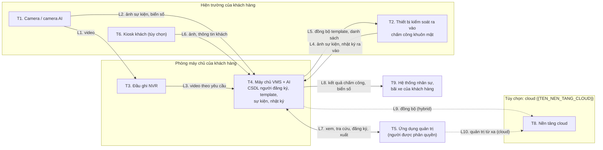

# Mẫu Mô tả luồng dữ liệu và kiến trúc sản phẩm AI vision

> **Căn cứ:** Luật 91/2025/QH15 Đ2.1, Đ2.7–2.9, Đ20.1, Đ31.2, Đ32.4; NĐ 356/2025/NĐ-CP Đ3.1, Đ3.6, Đ3.7, Đ3.11, Đ4.1.c, Đ4.1.đ, Đ4.1.h, Đ4.1.i, Đ4.2, Đ10.2, Đ12.4, Đ17.1, Đ19.3.c, Đ19.3.đ, Đ19.6, Đ20, Mẫu số 10 mục II.2, II.3, II.10, II.11.2; NĐ 330/2026/NĐ-CP Đ55.2, Đ67.2.e; NĐ 331/2026/NĐ-CP Đ13.2.c · **Đối chiếu văn bản gốc:** 28/09/2026 · **Trạng thái:** Bản khung v0.1

## Hướng dẫn sử dụng

**Mã tài liệu:** B1 (nhóm B — hồ sơ sản phẩm). Lập **cho từng dòng sản phẩm, từng phiên bản chính**.

**Ai lập:** nhóm sản phẩm và kiến trúc của nhà cung cấp; nhân sự BVDLCN của nhà cung cấp rà soát. **Ai dùng:** (1) khách hàng chép phần 7 vào hồ sơ đánh giá tác động xử lý DLCN (DPIA) theo Mẫu số 10 NĐ 356; (2) đội bán hàng, hồ sơ thầu; (3) đầu vào cho B2, B4, K6 (DPIA điền sẵn phần kỹ thuật).

**Áp dụng mô hình:** M1–M5. Mục 5 tách riêng on-premise (M1, M2), hybrid (M2 có đồng bộ cloud) và cloud (M3, M4). Nếu nhà cung cấp dùng dữ liệu khách hàng để huấn luyện (M5), ghi thêm luồng huấn luyện theo B7.

| Yêu cầu | Căn cứ |
|---|---|
| Báo cáo DPIA phải có mô tả loại dữ liệu, chi tiết hoạt động xử lý và **sơ đồ luồng dữ liệu cá nhân** | NĐ 356 Đ19.3.c |
| Báo cáo DPIA phải có phương án bảo đảm an toàn, biện pháp bảo vệ, **sơ đồ thiết kế hệ thống**, tiêu chuẩn áp dụng | NĐ 356 Đ19.3.đ |
| Mẫu số 10 mục II.2: luồng xử lý theo vai trò (đối tượng chủ thể, mục đích, loại dữ liệu cơ bản/nhạy cảm, hoạt động xử lý, sơ đồ); mục II.11.2: biện pháp bảo vệ, sơ đồ thiết kế hệ thống và biện pháp tương ứng | NĐ 356 Phụ lục, Mẫu số 10 |
| Phân loại dữ liệu cơ bản: hình ảnh của cá nhân; số biển số xe | NĐ 356 Đ3.6, Đ3.7 |
| Phân loại dữ liệu nhạy cảm: sinh trắc học; ảnh thẻ căn cước; vị trí qua dịch vụ định vị; đời sống riêng tư | NĐ 356 Đ4.1.đ, Đ4.1.i, Đ4.1.h, Đ4.1.c; Luật 91 Đ31.2 |
| Kết quả suy luận của AI xác định được người phải được bảo vệ như DLCN | NĐ 356 Đ10.2 |
| Dữ liệu trên cloud phải mã hóa khi lưu và truyền | NĐ 356 Đ12.4 |
| Các trường hợp chuyển dữ liệu xuyên biên giới (lưu trữ ở nước ngoài, cho tổ chức nước ngoài, dùng nền tảng ở nước ngoài) | Luật 91 Đ20.1; NĐ 356 Đ17.1 |

**Rủi ro nếu thiếu:** khách hàng không mô tả được luồng dữ liệu thì hồ sơ DPIA bị yêu cầu hoàn thiện (NĐ 356 Đ19.6); khai sai lệch thông tin trong hồ sơ bị phạt 50–100 triệu đồng (NĐ 330 Đ55.2). Với nhà cung cấp, B1 là một phần bằng chứng đã "xây dựng hệ thống đáp ứng tiêu chuẩn an ninh mạng và bảo vệ dữ liệu toàn diện" (NĐ 330 Đ67.2.e, 50–70 triệu đồng).

**Vùng xám liên quan:**

- **V1** — ảnh camera có khuôn mặt nhưng chưa trích xuất đặc trưng: tài liệu này phân loại là dữ liệu cơ bản, và ghi rõ trạng thái bật/tắt nhận diện của từng camera.
- **V4** — chuỗi nhận diện biển số hoặc khuôn mặt qua nhiều điểm có phải dữ liệu vị trí không: tài liệu coi là nhạy cảm khi hệ thống **dựng hành trình**.
- **V6** — không dựa vào miễn trừ Luật 91 Đ20.6.b cho nền tảng cloud của nhà cung cấp.

Mọi thông số kỹ thuật (thuật toán mã hóa, giao thức, thời hạn lưu mặc định) là **giá trị do nhà cung cấp tự khai**, phải khớp với sản phẩm thật. Không ghi thông số chưa kiểm chứng.

---

<b>MÔ TẢ LUỒNG DỮ LIỆU VÀ KIẾN TRÚC SẢN PHẨM</b> <b>{{TEN_SAN_PHAM}} — phiên bản {{PHIEN_BAN_SAN_PHAM}}</b>

| Thông tin tài liệu | |
|---|---|
| Mã tài liệu | {{MA_TAI_LIEU}} |
| Nhà cung cấp | {{TEN_NHA_CUNG_CAP}} — MST {{MST_NHA_CUNG_CAP}} |
| Ngày ban hành | {{NGAY_BAN_HANH_TAI_LIEU}} |
| Đầu mối bảo vệ dữ liệu cá nhân | {{NHAN_SU_BVDLCN_NCC}} — {{EMAIL_BVDLCN_NCC}} — {{DIEN_THOAI_BVDLCN_NCC}} |
| Tài liệu liên quan | Phân loại rủi ro hệ thống AI (B2); Giải thích thuật toán (B3); Tài liệu bảo mật sản phẩm (B4); Tuyên bố dữ liệu huấn luyện (B7) |

## 1. Phạm vi và cách dùng tài liệu

Tài liệu mô tả các thành phần của {{TEN_SAN_PHAM}}, dữ liệu cá nhân mà từng thành phần tạo ra hoặc lưu giữ, đường đi của dữ liệu và các biện pháp bảo vệ trên đường đi đó.

Tài liệu mô tả **cấu hình mặc định của sản phẩm**. Khách hàng là bên quyết định mục đích và phương tiện xử lý (khoản 7 Điều 2 Luật Bảo vệ dữ liệu cá nhân số 91/2025/QH15). Khi khách hàng thay đổi cấu hình (thời hạn lưu, tính năng bật, kết nối hệ thống khác), khách hàng cập nhật lại các bảng tại mục 4, mục 5 trước khi chép vào hồ sơ đánh giá tác động.

Phần 7 được viết sẵn để khách hàng chép vào mục II.2 và mục II.11.2 của Báo cáo đánh giá tác động xử lý dữ liệu cá nhân theo Mẫu số 10 ban hành kèm Nghị định số 356/2025/NĐ-CP.

## 2. Thành phần hệ thống

| # | Thành phần | Chức năng | Vị trí đặt | Dữ liệu cá nhân xử lý |
|---|---|---|---|---|
| T1 | Camera IP / camera AI ({{TEN_THIET_BI_BIEN}}) | Thu hình; với camera AI: phát hiện khuôn mặt, biển số, đếm người ngay tại thiết bị | Hiện trường của khách hàng | Video; ảnh cắt khuôn mặt, ảnh biển số (tạm thời trong bộ nhớ) |
| T2 | Thiết bị đầu cuối kiểm soát ra vào / chấm công bằng khuôn mặt | Chụp ảnh, kiểm tra người thật (liveness), so khớp 1:N với danh sách được đồng bộ, mở cửa | Cửa ra vào, cổng | Ảnh sự kiện; template khuôn mặt (bản đồng bộ); nhật ký ra vào |
| T3 | Đầu ghi hình (NVR) | Ghi và lưu video | Phòng kỹ thuật của khách hàng | Video |
| T4 | Máy chủ quản lý video và phân tích AI tại chỗ ({{TEN_PHAN_MEM_VMS}}) | Quản lý camera; trích xuất đặc trưng; so khớp; lưu cơ sở dữ liệu người đăng ký, sự kiện; giao diện quản trị | Phòng máy chủ của khách hàng | Toàn bộ các loại dữ liệu tại mục 4 |
| T5 | Ứng dụng quản trị (web, di động) | Xem video, tra cứu sự kiện, đăng ký khuôn mặt, quản lý danh sách, xuất dữ liệu | Máy trạm, điện thoại của người được khách hàng phân quyền | Hiển thị dữ liệu; không lưu lâu dài trên máy trạm (trừ tệp xuất) |
| T6 | Kiosk đăng ký khách *(tùy chọn)* | Khách tự đăng ký, chụp ảnh, {{có/không}} đọc thông tin thẻ căn cước | Sảnh lễ tân | Ảnh khách; họ tên; thông tin thẻ (nếu bật) |
| T7 | Cổng kết nối cloud *(chỉ hybrid, cloud)* | Đồng bộ dữ liệu được chọn lên nền tảng cloud | Máy chủ T4 | Dữ liệu được cấu hình đồng bộ |
| T8 | Nền tảng cloud {{TEN_NEN_TANG_CLOUD}} *(chỉ hybrid, cloud)* | Lưu trữ, xử lý, giao diện quản trị từ xa | {{VI_TRI_MAY_CHU}} | Theo mục 5 |
| T9 | Hệ thống bên ngoài do khách hàng kết nối *(tùy chọn)* | Nhân sự, tiền lương, quản lý bãi xe, quản lý tòa nhà | Theo khách hàng | Mã nhân viên, kết quả chấm công, biển số đăng ký |

## 3. Sơ đồ luồng dữ liệu

Bảng mô tả luồng (dùng thay sơ đồ khi in hoặc chép vào văn bản Word):

| Luồng | Từ → Đến | Dữ liệu | Kênh truyền và bảo vệ | Ghi chú |
|---|---|---|---|---|
| L1 | Camera → Đầu ghi | Video liên tục hoặc theo sự kiện | Mạng camera tách riêng; {{GIAO_THUC_TRUYEN_VIDEO}} | Không đi qua Internet |
| L2 | Camera AI → Máy chủ | Ảnh cắt khuôn mặt, ảnh biển số, siêu dữ liệu (thời gian, camera) | {{GIAO_THUC_TRUYEN_NOI_BO}} | Chỉ phát sinh khi camera bật phân tích |
| L3 | Đầu ghi → Máy chủ | Video được yêu cầu xem lại, xuất | {{GIAO_THUC_TRUYEN_NOI_BO}} | |
| L4 | Thiết bị đầu cuối → Máy chủ | Ảnh sự kiện, kết quả so khớp, nhật ký ra vào | {{GIAO_THUC_TRUYEN_NOI_BO}} | Thiết bị lưu đệm khi mất kết nối, xóa sau khi đồng bộ |
| L5 | Máy chủ → Thiết bị đầu cuối | Template đã mã hóa, mã người, quyền ra vào | {{GIAO_THUC_TRUYEN_NOI_BO}}; template mã hóa riêng | Thiết bị **không** nhận ảnh đăng ký gốc |
| L6 | Kiosk → Máy chủ | Ảnh khách, họ tên, đơn vị, người được gặp | {{GIAO_THUC_TRUYEN_NOI_BO}} | Không lưu ảnh thẻ căn cước (mặc định) |
| L7 | Máy chủ ↔ Ứng dụng quản trị | Video, ảnh, sự kiện; thao tác quản trị | HTTPS {{PHIEN_BAN_TLS}}; đăng nhập có xác thực đa yếu tố cho quản trị viên | Mọi thao tác xem, xuất, xóa được ghi nhật ký |
| L8 | Máy chủ → Hệ thống của khách hàng | Mã nhân viên, giờ vào/ra; biển số đăng ký | API có xác thực; {{PHIEN_BAN_TLS}} | Không gửi ảnh, không gửi template |
| L9 | Máy chủ → Cloud *(hybrid)* | Chỉ các loại dữ liệu khách hàng chọn tại mục 5 | {{PHIEN_BAN_TLS}}; xác thực thiết bị bằng chứng thư số | Tắt mặc định |
| L10 | Ứng dụng quản trị → Cloud *(cloud)* | Như L7 | Như L7 | |

## 4. Danh mục dữ liệu cá nhân

| Loại dữ liệu | Phân loại (căn cứ) | Nơi tạo | Nơi lưu | Định dạng | Mã hóa lưu / truyền | Thời hạn lưu mặc định | Ai truy cập | Rời khỏi Việt Nam? |
|---|---|---|---|---|---|---|---|---|
| D1. Video camera | Cơ bản — hình ảnh của cá nhân (NĐ 356 Đ3.6) | T1 | T3 (ổ cứng đầu ghi) | {{DINH_DANG_VIDEO}} | Lưu: {{có/không}} mã hóa ổ đĩa; truyền: L1, L3 | {{THOI_HAN_LUU_VIDEO}}, ghi đè vòng | Nhân viên an ninh, quản trị viên được phân quyền | Không (on-premise) |
| D2. Ảnh chụp sự kiện (ảnh cắt khuôn mặt, ảnh toàn cảnh) | Cơ bản (Đ3.6). Gắn với kết quả nhận diện thì bảo vệ như dữ liệu nhạy cảm (V1) | T1, T2 | T4 | JPEG | Lưu: {{THUAT_TOAN_MA_HOA_LUU}}; truyền: {{PHIEN_BAN_TLS}} | {{THOI_HAN_LUU_ANH_SU_KIEN}} | Quản trị viên, người xử lý sự kiện | Không |
| D3. Ảnh đăng ký khuôn mặt | **Nhạy cảm — sinh trắc học** (Luật 91 Đ31.2; NĐ 356 Đ4.1.đ) | T5, T6, T2 | T4 | JPEG | Lưu: {{THUAT_TOAN_MA_HOA_LUU}}; truyền: {{PHIEN_BAN_TLS}} | Mặc định **xóa ngay sau khi tạo template**; nếu khách bật lưu: {{THOI_HAN_LUU_ANH_DANG_KY}} | Quản trị viên được phân quyền đăng ký | Không |
| D4. Template khuôn mặt (vector đặc trưng {{SO_CHIEU_TEMPLATE}} chiều) | **Nhạy cảm — sinh trắc học** (Luật 91 Đ31.2; NĐ 356 Đ4.1.đ) | T4 (hoặc T2) | T4; bản đồng bộ tại T2 | Nhị phân riêng của sản phẩm | Lưu: {{THUAT_TOAN_MA_HOA_LUU}}, khóa riêng; truyền: {{PHIEN_BAN_TLS}} | Đến khi người được đăng ký bị xóa khỏi danh sách hoặc rút đồng ý | Không ai xem được dưới dạng bản rõ; chỉ tiến trình so khớp | Không |
| D5. Hồ sơ người đăng ký (họ tên, mã nhân viên, đơn vị, nhóm quyền) | Cơ bản (Đ3.1, Đ3.11) | T5, T9 | T4 | Bản ghi cơ sở dữ liệu | Lưu: {{THUAT_TOAN_MA_HOA_LUU}}; truyền: {{PHIEN_BAN_TLS}} | Như D4 | Quản trị viên, bộ phận nhân sự | Không |
| D6. Biển số xe (ký tự và ảnh biển số) | Cơ bản — số biển số xe (Đ3.7). Dựng hành trình nhiều điểm: coi là nhạy cảm (Đ4.1.h — V4) | T1 | T4 | Chuỗi ký tự; JPEG | Lưu: {{THUAT_TOAN_MA_HOA_LUU}}; truyền: {{PHIEN_BAN_TLS}} | Xe đăng ký: đến khi hủy đăng ký; xe vãng lai: {{THOI_HAN_LUU_BIEN_SO_VANG_LAI}} ngày | Nhân viên bãi xe, an ninh | Không |
| D7. Nhật ký sự kiện (ai, ở đâu, lúc nào; ra vào, chấm công, điểm danh, cảnh báo) | Cơ bản; là kết quả suy luận của AI (NĐ 356 Đ10.2). Tích lũy lâu dài có thể thành thông tin đời sống riêng tư (Đ4.1.c) | T2, T4 | T4 | Bản ghi cơ sở dữ liệu | Lưu: {{THUAT_TOAN_MA_HOA_LUU}}; truyền: {{PHIEN_BAN_TLS}} | {{THOI_HAN_LUU_NHAT_KY_SU_KIEN}} tháng *(khách hàng xác định theo pháp luật lao động, kế toán — [CẦN ĐỐI CHIẾU])* | Quản trị viên; bộ phận nhân sự (chấm công) | Không |
| D8. Ảnh và thông tin khách ra vào (kiosk) | Ảnh: cơ bản (Đ3.6); dùng để nhận diện lại: nhạy cảm (Đ4.1.đ). Ảnh thẻ căn cước: **nhạy cảm** (Đ4.1.i) | T6 | T4 | JPEG; bản ghi | Lưu: {{THUAT_TOAN_MA_HOA_LUU}}; truyền: {{PHIEN_BAN_TLS}} | {{THOI_HAN_LUU_ANH_KHACH}} ngày; **không lưu ảnh thẻ** (mặc định) | Lễ tân, an ninh | Không |
| D9. Tài khoản quản trị (tên đăng nhập, mật khẩu đã băm, yếu tố xác thực thứ hai) | Cơ bản (Đ3.11). **[CẦN ĐỐI CHIẾU]**: không phải "tài khoản định danh điện tử" tại Đ4.1.i | T5 | T4 | Bản ghi; mật khẩu băm {{THUAT_TOAN_BAM_MAT_KHAU}} | Lưu: băm, không lưu bản rõ; truyền: {{PHIEN_BAN_TLS}} | Đến khi vô hiệu hóa tài khoản + {{THOI_HAN_LUU_TAI_KHOAN_VO_HIEU}} ngày | Quản trị viên cấp cao | Không |
| D10. Nhật ký hệ thống (đăng nhập, xem, xuất, xóa, thay đổi cấu hình; tên người dùng, địa chỉ IP) | Cơ bản (Đ3.11) | T2–T5 | T4 (chỉ ghi thêm, không sửa) | Bản ghi có dấu thời gian | Lưu: {{THUAT_TOAN_MA_HOA_LUU}}, chống sửa; truyền: {{PHIEN_BAN_TLS}} | {{THOI_HAN_LUU_NHAT_KY_HE_THONG}} tháng | Nhân sự BVDLCN, kiểm toán nội bộ của khách hàng | Không |
| D11. Số liệu tổng hợp ẩn danh (đếm người, bản đồ nhiệt) | Không còn là DLCN nếu đã khử nhận dạng (Luật 91 Đ2.1) | T1 | T4 | Số đếm theo khung giờ | Không bắt buộc | Theo khách hàng | Quản lý vận hành | Không |

Ghi chú:

1. Cột "Rời khỏi Việt Nam?" ghi cho **mô hình on-premise**. Với hybrid, cloud: xem mục 5.
2. Kể cả khi đã mã hóa, dữ liệu vẫn là dữ liệu cá nhân (khoản 1 Điều 12 Luật Bảo vệ dữ liệu cá nhân).
3. Dữ liệu nhạy cảm (D3, D4, D8 ảnh thẻ) được áp dụng phân quyền giới hạn truy cập riêng theo khoản 2 Điều 4 Nghị định số 356/2025/NĐ-CP.
4. Trạng thái nhận diện khuôn mặt của từng camera (bật/tắt) được ghi trong báo cáo cấu hình xuất từ sản phẩm; khách hàng đính kèm báo cáo này vào hồ sơ.

## 5. Luồng dữ liệu theo mô hình triển khai

| Hạng mục | On-premise (M1, M2) | Hybrid | Cloud (M3, M4) |
|---|---|---|---|
| Nơi lưu video (D1) | Đầu ghi tại chỗ | Tại chỗ; {{có/không}} lưu clip sự kiện lên cloud | {{VI_TRI_MAY_CHU}} |
| Nơi lưu template (D4) và ảnh đăng ký (D3) | Máy chủ tại chỗ | Tại chỗ. Template **không** đồng bộ lên cloud (mặc định) | {{VI_TRI_MAY_CHU}} |
| Nơi so khớp khuôn mặt | Thiết bị đầu cuối hoặc máy chủ tại chỗ | Tại chỗ | {{tại thiết bị/trên cloud}} |
| Dữ liệu đồng bộ lên cloud | Không | Nhật ký sự kiện (D7), số liệu tổng hợp (D11), trạng thái thiết bị; loại khác chỉ khi khách hàng chọn | Toàn bộ dữ liệu của dịch vụ |
| Nhà cung cấp có truy cập dữ liệu không | M1: không. M2: chỉ khi hỗ trợ theo phiếu (Thỏa thuận hỗ trợ từ xa — C3) | Như M2; thêm vận hành nền tảng cloud | Có, trong phạm vi vận hành nền tảng; theo Phụ lục xử lý dữ liệu (C1) và điều khoản cloud (C2) |
| Vai trò nhà cung cấp (Luật 91 Đ2.7–2.9) | M1: không phải bên xử lý. M2: bên xử lý trong phạm vi hỗ trợ | Bên xử lý | Bên xử lý với dữ liệu người dùng cuối; bên kiểm soát với dữ liệu tài khoản của khách hàng |
| Chuyển dữ liệu xuyên biên giới (Luật 91 Đ20.1) | Không, trừ khi hỗ trợ từ xa từ nước ngoài | Có nếu {{VI_TRI_MAY_CHU}} ở ngoài Việt Nam | Có nếu {{VI_TRI_MAY_CHU}} ở ngoài Việt Nam hoặc gọi dịch vụ AI đặt ở nước ngoài |
| Mã hóa bắt buộc trên cloud (NĐ 356 Đ12.4) | Không áp dụng | Có — khi lưu và khi truyền | Có — khi lưu và khi truyền |
| Ghi chú cấp độ hệ thống thông tin | Hệ thống của khách hàng | Hệ thống của khách hàng + nền tảng của nhà cung cấp | Nền tảng xử lý dữ liệu nhạy cảm từ 10.000 chủ thể trở lên thuộc tiêu chí cấp độ 3 (NĐ 331 Đ13.2.c) |

Vị trí đặt máy chủ cloud của phiên bản này: **{{VI_TRI_MAY_CHU}}**. Dịch vụ AI bên ngoài được gọi (nếu có): **{{DICH_VU_AI_BEN_NGOAI}}** — đặt tại **{{VI_TRI_DICH_VU_AI_BEN_NGOAI}}**.

## 6. Điểm kiểm soát trên luồng dữ liệu

| Điểm | Rủi ro chính | Biện pháp mặc định của sản phẩm | Chi tiết |
|---|---|---|---|
| Thiết bị tại hiện trường (T1, T2, T6) | Tháo trộm thiết bị, đọc bộ nhớ | Template mã hóa trên thiết bị; thiết bị không lưu ảnh đăng ký; cổng gỡ lỗi vô hiệu hóa | B4 mục 1, 2 |
| Mạng camera (L1, L2, L4, L5) | Nghe lén, giả mạo thiết bị | Mạng tách riêng; mã hóa kênh; xác thực thiết bị | B4 mục 2 |
| Máy chủ tại chỗ (T3, T4) | Truy cập trái phép, sao chép cơ sở dữ liệu | Phân quyền theo vai trò; xác thực đa yếu tố; mã hóa cơ sở dữ liệu; nhật ký chống sửa; cảnh báo truy cập bất thường | B4 mục 1–4 |
| Xuất dữ liệu (L7) | Chia sẻ video trái phép | Quyền xuất riêng; làm mờ người không liên quan; ghi nhật ký lý do xuất | B4 mục 4, 5 |
| Kết nối hệ thống khác (L8) | Gửi thừa dữ liệu | Chỉ gửi mã nhân viên và thời gian; không gửi ảnh, template | Mục 3 |
| Cloud (L9, L10) | Truy cập trái phép trên cloud; chuyển xuyên biên giới | Tắt mặc định; mã hóa khi lưu và truyền; tách dữ liệu từng khách hàng | B4 mục 2, 9 |
| Hỗ trợ từ xa của nhà cung cấp | Nhân viên hỗ trợ sao chép dữ liệu | Truy cập theo phiếu, khách hàng phê duyệt phiên, ghi hình phiên | C3 |

## 7. Trích sẵn cho hồ sơ đánh giá tác động của khách hàng

> Khách hàng chép các đoạn dưới đây vào Báo cáo đánh giá tác động xử lý dữ liệu cá nhân (Mẫu số 10 Nghị định số 356/2025/NĐ-CP), sửa các chỗ trong ngoặc nhọn và xóa tình huống không áp dụng. Phần mục đích, cơ sở xử lý và sự đồng ý do khách hàng tự viết.

### 7.1. Đoạn chép vào mục II.2 — Luồng xử lý dữ liệu cá nhân theo vai trò

**1.1. Bên kiểm soát dữ liệu cá nhân / Bên kiểm soát và xử lý dữ liệu cá nhân: {{TEN_KHACH_HANG}}**

{{TEN_KHACH_HANG}} sử dụng hệ thống {{TEN_SAN_PHAM}} phiên bản {{PHIEN_BAN_SAN_PHAM}} do {{TEN_NHA_CUNG_CAP}} cung cấp, triển khai theo mô hình {{on-premise/hybrid/cloud}} tại {{DIA_DIEM_LAP_DAT}}. Hệ thống gồm camera, thiết bị kiểm soát ra vào bằng khuôn mặt, đầu ghi hình, máy chủ quản lý video và phân tích tại chỗ, ứng dụng quản trị. Các luồng xử lý như sau:

a) *Kiểm soát ra vào và chấm công của người lao động.* Đối tượng chủ thể: người lao động của {{TEN_KHACH_HANG}}. Dữ liệu cơ bản: họ tên, mã nhân viên, đơn vị, hình ảnh sự kiện, thời điểm ra vào. Dữ liệu nhạy cảm: ảnh đăng ký khuôn mặt và đặc trưng khuôn mặt (dữ liệu sinh trắc học). Hoạt động xử lý: thu thập ảnh đăng ký khi người lao động đồng ý; trích xuất đặc trưng khuôn mặt; xóa ảnh đăng ký sau khi tạo đặc trưng; lưu đặc trưng đã mã hóa trên máy chủ tại chỗ và thiết bị đầu cuối; so khớp khi người lao động đi qua cửa; ghi nhật ký ra vào; chuyển mã nhân viên và giờ vào/ra sang hệ thống chấm công; xóa đặc trưng khi người lao động nghỉ việc hoặc rút đồng ý. Người lao động không đồng ý dùng khuôn mặt được dùng {{PHUONG_THUC_THAY_THE}}.

b) *Quản lý khách ra vào.* Đối tượng chủ thể: khách đến làm việc. Dữ liệu cơ bản: họ tên, đơn vị, người được gặp, ảnh chụp tại kiosk, thời điểm ra vào. Dữ liệu nhạy cảm: {{không xử lý/đặc trưng khuôn mặt khi khách đồng ý nhận diện lại}}. Hoạt động xử lý: thu thập tại kiosk; lưu tại máy chủ tại chỗ; tự động xóa sau {{THOI_HAN_LUU_ANH_KHACH}} ngày. Hệ thống không lưu ảnh thẻ căn cước.

c) *Giám sát an ninh bằng camera.* Đối tượng chủ thể: mọi người xuất hiện trong vùng quan sát. Dữ liệu cơ bản: hình ảnh, video. Hoạt động xử lý: ghi hình; lưu tại đầu ghi; ghi đè sau {{THOI_HAN_LUU_VIDEO}}; trích xuất video khi có sự việc hoặc khi cơ quan có thẩm quyền yêu cầu bằng văn bản. Nhận diện khuôn mặt **không bật** trên các camera hướng ra khu vực công cộng: {{DANH_SACH_CAMERA_TAT_NHAN_DIEN}}.

d) *Quản lý bãi xe.* Đối tượng chủ thể: người sử dụng xe đăng ký và xe vãng lai. Dữ liệu cơ bản: số biển số xe, ảnh biển số, thời điểm vào/ra; với xe đăng ký thêm họ tên, căn hộ hoặc đơn vị. Hoạt động xử lý: nhận diện biển số tại lối vào/ra; đối chiếu danh sách xe đăng ký; lưu dữ liệu xe vãng lai {{THOI_HAN_LUU_BIEN_SO_VANG_LAI}} ngày. Hệ thống không dựng hành trình di chuyển của xe qua nhiều điểm.

**1.2. Bên xử lý dữ liệu cá nhân: {{TEN_NHA_CUNG_CAP}}** *(chọn một phương án)*

- *(On-premise, nhà cung cấp không hỗ trợ truy cập)* Không có bên xử lý. {{TEN_NHA_CUNG_CAP}} là nhà cung cấp thiết bị, phần mềm; không tiếp cận dữ liệu cá nhân.
- *(On-premise có hỗ trợ kỹ thuật)* {{TEN_NHA_CUNG_CAP}} thực hiện lắp đặt, bảo hành, hỗ trợ kỹ thuật tại chỗ và từ xa theo Hợp đồng số {{SO_HOP_DONG}} và Phụ lục xử lý dữ liệu cá nhân kèm theo. Nhà cung cấp chỉ truy cập hệ thống khi có phiếu yêu cầu và {{TEN_KHACH_HANG}} phê duyệt từng phiên; phiên truy cập được ghi nhật ký; không sao chép dữ liệu ra khỏi hệ thống.
- *(Hybrid, cloud)* {{TEN_NHA_CUNG_CAP}} vận hành nền tảng {{TEN_NEN_TANG_CLOUD}} đặt tại {{VI_TRI_MAY_CHU}}, lưu trữ và xử lý {{DANH_SACH_DU_LIEU_TREN_CLOUD}} thay mặt {{TEN_KHACH_HANG}} theo Hợp đồng số {{SO_HOP_DONG}} và Phụ lục xử lý dữ liệu cá nhân kèm theo.

**1.3. Bên thứ ba:** {{không có/tên tổ chức nhận dữ liệu, ví dụ đơn vị tính lương thuê ngoài, và dữ liệu được chuyển}}.

### 7.2. Gợi ý đánh dấu mục II.3 — Loại dữ liệu cá nhân được xử lý

- Mục 3.1 (dữ liệu cơ bản): đánh dấu **Họ, chữ đệm và tên khai sinh**; **Hình ảnh của cá nhân**; **Số biển số xe** (nếu dùng bãi xe); **Các thông tin khác gắn liền với một con người cụ thể** (mã nhân viên, nhật ký ra vào, tài khoản quản trị).
- Mục 3.2 (dữ liệu nhạy cảm): đánh dấu **Dữ liệu sinh trắc học, đặc điểm di truyền** khi bật nhận diện khuôn mặt; **Hình ảnh thẻ căn cước** chỉ khi khách hàng bật lưu ảnh thẻ tại kiosk; **Vị trí của cá nhân** chỉ khi khách hàng bật tính năng dựng hành trình.

### 7.3. Gợi ý trả lời mục II.10 — Chuyển dữ liệu cá nhân xuyên biên giới

- On-premise, không hỗ trợ từ nước ngoài: **Không**.
- Hybrid, cloud: **{{có/không}}** — "Có" khi máy chủ {{VI_TRI_MAY_CHU}} đặt ngoài Việt Nam, khi đội hỗ trợ ở nước ngoài truy cập dữ liệu, hoặc khi hệ thống gọi dịch vụ AI đặt ở nước ngoài (khoản 1 Điều 20 Luật Bảo vệ dữ liệu cá nhân). Khi "Có", khách hàng lập thêm hồ sơ đánh giá tác động chuyển dữ liệu cá nhân xuyên biên giới.

### 7.4. Đoạn chép vào mục II.11.2 — Sơ đồ thiết kế hệ thống và biện pháp bảo vệ tương ứng

Hệ thống {{TEN_SAN_PHAM}} được chia thành bốn vùng, mỗi vùng có biện pháp bảo vệ riêng:

a) *Vùng thiết bị hiện trường* (camera, thiết bị kiểm soát ra vào, kiosk): thiết bị đặt trong vỏ có khóa hoặc vị trí khó tiếp cận; đặc trưng khuôn mặt lưu trên thiết bị được mã hóa; thiết bị không lưu ảnh đăng ký; cổng gỡ lỗi bị vô hiệu hóa; mật khẩu mặc định đã được thay khi lắp đặt.

b) *Vùng mạng camera:* tách riêng khỏi mạng văn phòng bằng {{mạng LAN ảo (VLAN)/mạng vật lý riêng}}; không kết nối trực tiếp Internet; kênh truyền giữa thiết bị và máy chủ được mã hóa; thiết bị lạ không kết nối được với máy chủ.

c) *Vùng máy chủ* (đầu ghi, máy chủ quản lý video và phân tích): đặt tại phòng máy chủ có kiểm soát ra vào; cơ sở dữ liệu người đăng ký, đặc trưng khuôn mặt, nhật ký được mã hóa bằng {{THUAT_TOAN_MA_HOA_LUU}}; khóa mã hóa lưu tách khỏi dữ liệu; tài khoản quản trị dùng xác thực đa yếu tố; phân quyền theo vai trò (xem video, xử lý sự kiện, đăng ký khuôn mặt, xuất dữ liệu, quản trị hệ thống); nhật ký truy cập chỉ ghi thêm, không sửa; cảnh báo khi có đăng nhập sai nhiều lần, xuất dữ liệu số lượng lớn hoặc truy cập ngoài giờ.

d) *Vùng truy cập quản trị* (ứng dụng web, di động; *nếu dùng cloud:* nền tảng cloud tại {{VI_TRI_MAY_CHU}}): truy cập qua HTTPS {{PHIEN_BAN_TLS}}; phiên đăng nhập tự hết hạn; quyền xuất video, ảnh tách riêng và bắt buộc ghi lý do; video xuất ra có thể làm mờ khuôn mặt, biển số của người không liên quan.

Sơ đồ thiết kế hệ thống kèm theo: sơ đồ tại mục 3 tài liệu "Mô tả luồng dữ liệu và kiến trúc sản phẩm {{TEN_SAN_PHAM}}" số {{MA_TAI_LIEU}} của {{TEN_NHA_CUNG_CAP}}, đã cập nhật theo hiện trạng lắp đặt ngày {{NGAY_CAP_NHAT_SO_DO_THUC_TE}}. Chi tiết các biện pháp kỹ thuật, quản lý và tiêu chuẩn áp dụng: xem Tài liệu bảo mật sản phẩm của nhà cung cấp và đoạn trích sẵn cho mục II.11 trong tài liệu đó.

## Hướng dẫn điền

**Nhà cung cấp** điền khi lập tài liệu cho một dòng sản phẩm:

| Placeholder | Nội dung | Ghi chú |
|---|---|---|
| {{MA_TAI_LIEU}}, {{NGAY_BAN_HANH_TAI_LIEU}} | Mã, ngày ban hành tài liệu | Đổi mã khi đổi phiên bản chính |
| {{TEN_THIET_BI_BIEN}}, {{TEN_PHAN_MEM_VMS}} | Tên thương mại camera AI / thiết bị biên và phần mềm máy chủ | |
| {{GIAO_THUC_TRUYEN_VIDEO}}, {{GIAO_THUC_TRUYEN_NOI_BO}}, {{PHIEN_BAN_TLS}} | Giao thức thực tế và cơ chế mã hóa kênh | Nếu luồng video không mã hóa, ghi đúng "không mã hóa, mạng tách riêng" — không ghi sai |
| {{THUAT_TOAN_MA_HOA_LUU}}, {{THUAT_TOAN_BAM_MAT_KHAU}}, {{SO_CHIEU_TEMPLATE}}, {{DINH_DANG_VIDEO}} | Thông số thực của sản phẩm | Phải khớp B4 |
| Nhóm `THOI_HAN_LUU_*` | Giá trị **mặc định** khi xuất xưởng | Là gợi ý kỹ thuật, không phải thời hạn pháp định. Khách hàng tự quyết định và ghi lý do trong chính sách lưu trữ (K4). Thời hạn lưu hồ sơ chấm công theo pháp luật lao động, kế toán: **[CẦN ĐỐI CHIẾU]** — văn bản chưa có trong `sources/` (V9) |
| {{VI_TRI_MAY_CHU}}, {{DICH_VU_AI_BEN_NGOAI}}, {{VI_TRI_DICH_VU_AI_BEN_NGOAI}} | Nơi đặt hạ tầng cloud; dịch vụ AI của bên thứ ba (nếu có) | Ghi "Không sử dụng" nếu không có |

**Khách hàng** điền phần 7: {{DIA_DIEM_LAP_DAT}}, {{PHUONG_THUC_THAY_THE}}, {{DANH_SACH_CAMERA_TAT_NHAN_DIEN}}, {{DANH_SACH_DU_LIEU_TREN_CLOUD}}, {{NGAY_CAP_NHAT_SO_DO_THUC_TE}}; chọn phương án trong ngoặc nhọn; xóa tình huống không dùng.

Khi phát hành phiên bản sản phẩm mới làm thay đổi luồng dữ liệu (thêm loại dữ liệu, thêm đồng bộ cloud, đổi nơi đặt máy chủ), nhà cung cấp thông báo cho khách hàng để khách hàng cập nhật hồ sơ đánh giá tác động theo Điều 20 Nghị định số 356/2025/NĐ-CP (định kỳ 06 tháng hoặc trong 10 ngày với các trường hợp phải cập nhật ngay).

## Bằng chứng cần lưu

- Bản B1 đã ký duyệt theo từng phiên bản sản phẩm; lịch sử thay đổi.
- Báo cáo cấu hình xuất từ sản phẩm tại thời điểm bàn giao (thời hạn lưu, camera bật/tắt nhận diện, đồng bộ cloud bật/tắt).
- Sơ đồ thực tế tại từng khách hàng (nếu nhà cung cấp hỗ trợ lập) — lưu theo hợp đồng.
- Kết quả rà soát của nhân sự BVDLCN nhà cung cấp; bằng chứng khớp giữa B1 và B4.
