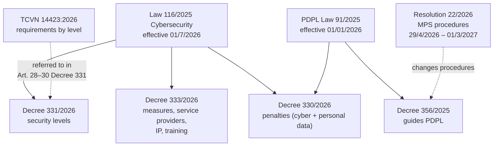
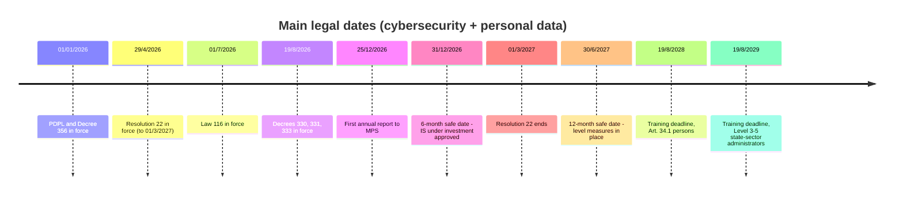
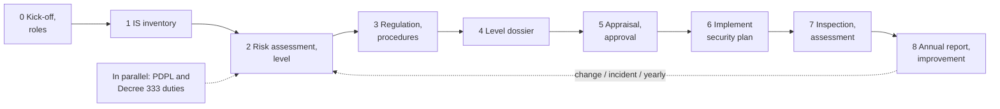

# Legal Landscape and Compliance Roadmap

> **Unofficial English guide.** Condensed from the Vietnamese pages listed below; the Vietnamese version prevails. Vietnamese laws have no official English translation — renderings follow the [glossary](glossary.md). **Synced with Vietnamese version:** 28/09/2026.
> **Vietnamese source:** [docs/00-tong-quan/tong-quan-luat-116.md](../docs/00-tong-quan/tong-quan-luat-116.md) · [docs/00-tong-quan/danh-muc-van-ban.md](../docs/00-tong-quan/danh-muc-van-ban.md) · [docs/00-tong-quan/lo-trinh-tuan-thu.md](../docs/00-tong-quan/lo-trinh-tuan-thu.md) · [docs/00-tong-quan/README.md](../docs/00-tong-quan/README.md)

This page answers three questions: which instruments apply, when they took effect, and which deadlines an organization must plan for. Vietnamese pages checked against the original texts on 24/09/2026. Full Vietnamese texts: [sources/van-ban-goc/](../sources/van-ban-goc/README.md).

## 1. Instruments in force

| Instrument | Effective | Replaces / ends | Main content for organizations |
|---|---|---|---|
| **Law on Cybersecurity 2025** (Law 116/2025/QH15) — passed 10/12/2025 | **01/7/2026** (Art. 44.1 Law 116) | Law on Network Information Security 86/2015 (as amended by Law 35/2018) and Law on Cybersecurity 24/2018 cease to be effective on 01/7/2026 (Art. 44.2 Law 116) | Five security levels (Art. 8), information systems critical to national security (Art. 9, 11), tasks and measures by level (Art. 10), duties of service providers (Art. 25, 41), system owner duties (Art. 40), transition (Art. 45) |
| **Decree 331/2026** on cybersecurity protection of information systems | **19/8/2026** (Art. 38 Decree 331) | De facto replaces Decree 85/2016, but the available text has **no repeal clause**; Art. 39.1 still refers to Decree 85/2016 for transition [TO VERIFY against the Official Gazette] | Level criteria (Art. 11–16), authority and procedure (Art. 18–25), inspection (Art. 26–27), measures and security plan (Art. 28–30), responsibilities (Art. 31–33), annual report (Art. 35–36), Forms 01–08 |
| **Decree 333/2026** detailing the Law on Cybersecurity | **19/8/2026** (Art. 30 Decree 333) | No repeal clause. Dossiers accepted under **Decree 53/2022** before 19/8/2026 continue under that decree (Art. 31 Decree 333) [TO VERIFY status of Decree 53/2022] | Procedures for protection measures (Art. 5–13); account verification, user information, takedowns, logs (Art. 16–18); **data localization** (Art. 19–20); IP identification (Art. 21–23); specialized training (Art. 24–29) |
| **Decree 330/2026** (Penalties Decree) | **19/8/2026** (Art. 80 Decree 330) | Lists no replaced decree. Acts before 19/8/2026 fall under the decree in force at the time, unless Decree 330 is more favorable (Art. 81.1 Decree 330) | Cybersecurity violations (Sections 1–5) and personal data violations (Section 6); limitation period one year (Art. 3); organizations pay twice the individual amount in cybersecurity (Art. 7.1) — see [05-penalties.md](05-penalties.md) |
| **Law on Personal Data Protection 2025** (PDPL, Law 91/2025/QH15) — passed 26/6/2025 | **01/01/2026** (Art. 38.1 PDPL) | Consents and impact assessment dossiers made under Decree 13/2023 remain usable (Art. 39 PDPL) | Basic/sensitive personal data (Art. 2), cross-border transfer (Art. 20), impact assessment (Art. 21–22), 72-hour breach notice (Art. 23), personal data protection staff (Art. 33.2), small-business exemption (Art. 38.2–3) — see [06-personal-data.md](06-personal-data.md) |
| **Decree 356/2025** guiding the PDPL — issued 31/12/2025 | **01/01/2026** (Art. 42.1 Decree 356) | **Decree 13/2023 ceases to be effective on 01/01/2026** (Art. 42.2 Decree 356) | Lists of basic and sensitive data (Art. 3–4), staff requirements (Art. 13–14), impact assessment and transfer dossiers (Art. 17–20), processing services (Art. 21–27), breach notices (Art. 28–29) |
| **Resolution 22/2026** — issued 29/4/2026 | **29/4/2026 to the end of 01/3/2027** (Art. 6.1 Resolution 22) | Prevails over other texts on the same procedures while in force (Art. 6.2) | Appendix I.7: licensing of network information security products and services, certificate for personal data processing services, filing of personal data impact assessments moved from MPS to provincial police |
| **TCVN 14423:2026** — published by Decision 3243/QĐ-BKHCN of 24/7/2026 [TO VERIFY number and date] | Per the publishing decision | Replaces **TCVN 14423:2025 and TCVN 11930:2017** (foreword) | Basic requirements per level: clause 3 (Level 1), 4 (Level 2), 5 (Level 3), 6 (Level 4), 7 (Level 5), Appendix A (physical security). Referred to in Art. 28.1, 28.4, 29.1, 30.1 Decree 331. Copyrighted — not stored in the repository |
| Decree 329/2026 (cybersecurity forces) and Decree 332/2026 (cybersecurity products and services business) | [TO VERIFY] | [TO VERIFY] | Full texts not in the repository; the toolkit does not cite their articles |

How they relate:

Key overlap: Level 2 and Level 3 criteria use the number of data subjects of **basic / sensitive personal data** (Art. 12.2(b), 13.2(c) Decree 331) — PDPL concepts (Art. 2.2–2.3 PDPL) listed in Art. 3–4 Decree 356.

### Superseded instruments — do not cite as a basis

| Instrument | Status | Still relevant when |
|---|---|---|
| Law 86/2015 (Network Information Security) | Ended 01/7/2026 (Art. 44.2 Law 116) | Systems already classified under it **keep their level** but must meet Law 116 conditions within 12 months from 01/7/2026 (Art. 45.1); licenses issued remain valid until expiry (Art. 45.2); products already in use must meet conditions within 12 months (Art. 45.3) |
| Law 24/2018 (Cybersecurity) | Ended 01/7/2026 | No |
| Decree 85/2016 (former security-level regime) | De facto replaced by Decree 331; no repeal clause [TO VERIFY] | Systems **under investment before 01/7/2026**: complete appraisal and approval **under Decree 85/2016** within **06 months** from 01/7/2026; meet Decree 331 measures within **12 months** (Art. 39.1 Decree 331) |
| Decree 53/2022 | [TO VERIFY] | Appraisal or readiness dossiers accepted before 19/8/2026 (Art. 31 Decree 333) |
| Decree 13/2023 (personal data) | Ended 01/01/2026 (Art. 42.2 Decree 356) | Existing consents need not be re-collected; filed impact assessments remain usable but must be updated (Art. 39 PDPL) |
| TCVN 14423:2025, TCVN 11930:2017 | Replaced by TCVN 14423:2026 | Not for new plans. "Network information security" in standards is read as "cybersecurity" under Decree 331 (Art. 39.2 Decree 331) |
| Decree 108/2016 (security product and service business) | [TO VERIFY] — Resolution 22 still simplifies its procedures | Checking a vendor license issued before 01/7/2026 (Art. 45.2 Law 116) |

### Guidance still pending (at 24/09/2026)

Where a law assigns a topic to MPS and no text exists yet, the toolkit writes "pending MPS guidance", cites the assigning article and offers an interim approach.

| Pending | Assigned by | Interim approach in the toolkit |
|---|---|---|
| Rules on cybersecurity risk assessment | Art. 10.8 Decree 331 | Minimum content of Art. 10.3 Decree 331 + TCVN 14423:2026 clauses 3.1/4.1/5.1/6.1/7.1 |
| **Cybersecurity risk management framework** (used in criteria Art. 11.2, 12.4, 13.5, 14.4, 15.5) | Art. 34.1(c) Decree 331 | Do not use it to lower a level; if risk is higher, propose a higher level (Art. 10.5) |
| Monitoring and incident response rules, incl. what counts as a "serious incident" | Art. 28.6 Decree 331 | Apply 24h / 72h / "immediately" from Art. 31.2(d) Decree 331 |
| Detailed guidance on defining an information system | Art. 34.1(b) Decree 331 | Apply Art. 7.2 and 8 Decree 331 |
| Self-assessment forms, criteria and methods | Art. 34.1(đ), 31.2(c) Decree 331 | Interim template — see [07-governance-inspection-reporting.md](07-governance-inspection-reporting.md) |
| Annual list of IS by type (before 15/01) | Art. 9.2(e) Decree 331 | Self-classify under Art. 9.2(a)–(đ) |
| List of information systems critical to national security | Art. 9.1, 9.4 Law 116 (Prime Minister) | Self-review against Art. 16–17 Decree 331 |
| Specialized training framework and certificates | Art. 24.5, 24.6, 29.1, 29.3 Decree 333 | See [04-enterprise-obligations.md](04-enterprise-obligations.md) |
| National technical regulation on cybersecurity | Art. 27.5 Law 116 | [TO VERIFY] |
| Replacement of Resolution 22 procedures before 01/3/2027 | Art. 4.1(b)–(c) Resolution 22 | Monitor before 01/3/2027 |
| Rules of the national incident response network | Art. 9.8 Decree 333 | [TO VERIFY] |

## 2. Law on Cybersecurity 2025 in brief

Law 116 has 8 chapters and 45 articles.

| Chapter | Articles | Main content | Guided by |
|---|---|---|---|
| I General | 1–7 | Scope; definitions; 14 protection measures (Art. 5.1); **prohibited acts** (Art. 7) | Decree 333 |
| II Protection of IS | 8–12 | **Five levels** (Art. 8); IS critical to national security (Art. 9, 11); **tasks and measures by level** (Art. 10); MPS inspection of other IS (Art. 12) | Decree 331; Decree 333 Art. 5–9 |
| III Preventing violations | 13–22 | Harmful content, espionage, children, malware, cyberattacks, cyberterrorism, emergencies | Decree 333 Art. 11, 13 |
| IV Protection activities | 23–26 | **Duties of service providers** (Art. 25); data security (Art. 26) | Decree 333 Chapter III |
| V Standards, products, services | 27–29 | Standards; **licensing** of cybersecurity services (Art. 29) | Decree 332/2026 [TO VERIFY] |
| VI Forces and resources | 30–38 | Staffing; **specialized training** (Art. 34); **budget** (Art. 38) | Decree 333 Chapter V |
| VII Responsibilities | 39–42 | **System owner** (Art. 40); **service providers** (Art. 41); users (Art. 42) | Decree 331 Art. 31–33; Decree 333 |
| VIII Final | 43–45 | Amendments; effect (Art. 44); **transition** (Art. 45) | Decree 331 Art. 39; Decree 333 Art. 31 |

### Scope

- Applies to Vietnamese organizations and individuals, foreign ones in Vietnam, and foreign ones directly involved in cybersecurity or cybersecurity business in Vietnam (Art. 1.2 Law 116).
- Security level determination under Decree 331 is **mandatory** for IS serving state bodies and for IS providing **online services** to citizens and businesses; other organizations are **encouraged** to apply it (Art. 2 Decree 331). However, Art. 10.1 Law 116 assigns "security level determination" to every IS and Art. 40.1 covers every system owner (*chủ quản hệ thống thông tin*) → mandatory scope for purely internal systems of private companies is **[TO VERIFY]**. See [02-security-levels.md](02-security-levels.md) and [gray-areas.md](gray-areas.md).

### Levels, tasks and measures

| Level | Harm (Art. 8.1 Law 116) |
|---|---|
| 1 | May harm the lawful rights and interests of organizations or individuals |
| 2 | **Serious** harm to those rights and interests, or harm to the public interest |
| 3 | **Particularly serious** harm to those rights and interests; serious harm to the public interest; harm or serious harm to social order and safety; or harm to national security |
| 4 | Particularly serious harm to the public interest or social order and safety, or serious harm to national security |
| 5 | Particularly serious harm to national security |

- **Six tasks** for every IS (Art. 10.1 Law 116): (a) security level determination; (b) risk assessment and management; (c) supervision and inspection; (d) implementing measures; (đ) reporting; (e) awareness.
- **Eight measures** (Art. 10.2): (a) cybersecurity rules across the IS life cycle; (b) cybersecurity appraisal of designs; (c) cybersecurity readiness assessment; (d) applying standards; (đ) storage and backup; (e) compliance checks and effectiveness assessment; (g) cybersecurity monitoring; (h) incident response and recovery.

| Level | Mandatory measures (Art. 10.2) | Optional | Basis |
|---|---|---|---|
| 1, 2 | — | All of clause 2 | Art. 10.3 Law 116 |
| 3, 4 (not on the national-security list) | a, d, đ, e, g, h | b (appraisal), c (readiness assessment) | Art. 10.4 |
| IS critical to national security | All of clause 2 | — | Art. 10.5 |

Decree 331 still requires a **cybersecurity assurance plan** (*phương án bảo đảm an ninh mạng*; "security plan" below) in the level dossier for **every** level (Art. 21.4, 29, 30 Decree 331). See [03-requirements-by-level.md](03-requirements-by-level.md).

### Information systems critical to national security

- Listed by the Prime Minister, in the fields of Art. 9.2 Law 116 (military, security, diplomacy, cipher; state secrets; national energy, finance, banking, telecoms, transport, health systems; automated control at key facilities, etc.). Criteria: Art. 16 Decree 331.
- Must be **appraised and certified as meeting cybersecurity conditions before operation** (Art. 9.3 Law 116; procedure Art. 5–6 Decree 333).
- The owner inspects before operation, **self-inspects every year and notifies the result in writing before 01/10** (Art. 11.1(b) Law 116: "before October"; Art. 8.5(b) Decree 333: "before 1 October").

### MPS inspection of other systems

For IS not on the national-security list, MPS inspects only in case of cybercrime, cyberattack, cyberterrorism or cyber-espionage, **or at the owner's request** (Art. 12.1 Law 116). Results are confidential (Art. 12.4). The owner **must notify** the specialized cybersecurity protection force when it detects a cybersecurity violation on its IS (Art. 12.3). Procedure: Art. 26 Decree 331 — see [07-governance-inspection-reporting.md](07-governance-inspection-reporting.md).

### Duties when preventing violations (Chapter III)

| Duty | Who | Basis |
|---|---|---|
| Management and technical measures to prevent, detect, stop and **remove** unlawful content on own IS or on request | System owners; domestic and foreign service providers | Art. 14.1, 14.3 Law 116 |
| Check for and remove malware and malicious hardware, fix vulnerabilities; anti-espionage; protect business and personal secrets | System owners | Art. 15.2 |
| Control content harmful to children | System owners, service providers | Art. 16.3 |
| Prevent malware; email, transmission and storage providers need **malware filtering** and reporting | Everyone; listed providers | Art. 17.1, 17.3, 17.4 |
| Technical measures against cyberattacks | System owners | Art. 18.2 |
| Review IS for cyberterrorism risks; report signs promptly | System owners; all organizations | Art. 19.2–19.3 |
| In a cybersecurity emergency: notify the specialized force, **immediately** activate the emergency plan, inform affected parties | Everyone | Art. 20.4(a) |
| Stop information conflicts originating from own IS | Organizations, individuals | Art. 22.3 |

### Service providers in cyberspace (Art. 25, 41)

Domestic and foreign enterprises providing services on telecommunications networks, the Internet and value-added services in Vietnam must (Art. 25.2 Law 116):

- **verify** user information at account registration; protect accounts; **provide user information** to MPS **within 24 hours** of a request (urgent: **03 hours**) (point a);
- **block or remove** unlawful content, services or apps **within 24 hours** (urgent: **06 hours**) and **keep system logs** for the prescribed period (point b);
- stop serving those posting unlawful content, on request (point c);
- **store** user personal information and user-generated data (account name, usage time, payments, IP, etc.) for the prescribed period after the user stops using the service (point d).

Enterprises that collect, exploit, analyze or process personal information, relationship data or data generated by users in Vietnam must **store it in Vietnam** for the period set by the Government; **foreign enterprises must set up a branch or representative office in Vietnam** (Art. 25.3 Law 116). Decree 333 Art. 19.3(a) imposes the branch/office duty only after an MPS Minister's decision following non-compliance — [TO VERIFY]. Details: [04-enterprise-obligations.md](04-enterprise-obligations.md).

General duties (Art. 41): warn users and give guidance; **prepare an emergency response plan** (41.2); on an incident, **immediately** activate it and **report immediately** to the specialized force (41.3); technical measures for data processing (41.4); **identify users' IP addresses** (41.5); set up technical connections for investigations on request (41.6).

### Data security, standards, staffing and budget

- **Data security** (Art. 26.2 Law 116): policies and procedures; standards; encryption; **strict control of staff who handle data**; **periodic risk assessment**; review of **cross-border data transfers**. Overlap with the PDPL: [06-personal-data.md](06-personal-data.md).
- **Standards and vendors** (Art. 27–29): cybersecurity services (inspection, assessment, consulting, monitoring, incident response, data recovery, etc. — Art. 28.2) require a **license** (Art. 29.1). When outsourcing, check the vendor's license. Licenses issued under Law 86/2015 stay valid until expiry (Art. 45.2).
- **Staffing:** owners of IS critical to national security must have dedicated staff matching the level (Art. 31.3). **People directly administering or operating Level 3, 4, 5 IS in state bodies, organizations and state-owned enterprises** need specialized training and a certificate, unless trained in cybersecurity (Art. 34.2; Art. 24 Decree 333).
- **Budget:** state-funded bodies and state-owned enterprises allocate cybersecurity budget in annual digital transformation estimates and **at least 15%** of digital transformation and IT program budgets (Art. 38.1). Others fund cybersecurity themselves (Art. 38.2).
- **Awareness:** organizations run cybersecurity awareness for their workers (Art. 35.2).

### System owner responsibilities (Art. 40)

| Responsibility | Basis | Guidance |
|---|---|---|
| Protect the IS as required by the Law | Art. 40.1(a) | Art. 31 Decree 331 |
| **Connect to the central cybersecurity monitoring and anti-malware systems** of the National Cybersecurity Center (MPS) or a provincial center | Art. 40.1(b) | Connection method pending MPS guidance (Art. 28.6, 34.1(e) Decree 331). Scope (all levels or Level 3+) [TO VERIFY] |
| **Report cybersecurity incidents** to MPS or the Ministry of National Defence | Art. 40.1(c) | 24h / 72h / immediate: Art. 31.2(d) Decree 331 |
| (State-funded IS) appraised security plan when building or upgrading; named person or unit for cybersecurity | Art. 40.2 | Art. 31.1(b) Decree 331 |

Users (Art. 42) must protect their digital account details and comply with authority requests — useful content for an employee undertaking in the internal cybersecurity regulation.

### Prohibited acts most relevant to companies (Art. 7)

- Unlawful collection, use, disclosure, exchange, transfer or trading of other people's personal data (Art. 7.2(h)).
- Causing incidents, attacking, intruding into or disrupting IS (Art. 7.3); unauthorized intrusion into others' networks (Art. 7.5) → **penetration tests need written approval and scope**.
- Spam emails, messages and calls (Art. 7.4).
- Using AI or new technology to unlawfully fake video, images or voice (Art. 7.2(g)).
- Obstructing the cybersecurity forces; unlawfully disabling protection measures (Art. 7.6).

### Notes on consistency

- "Before October" (Art. 11.1(b) Law 116) and "before 1 October" (Art. 8.5(b) Decree 333) mean the same.
- Service providers must "report immediately" (Art. 41.3 Law 116); Decree 331 sets 24 hours (serious incidents) and 72 hours (cause and remediation) (Art. 31.2(d)). Recommended: notify immediately and send the full report within 72 hours.

## 3. Key deadlines

### One-off dates

| Date | Event / who must act | Basis |
|---|---|---|
| **01/01/2026** | PDPL and Decree 356 take effect; Decree 13/2023 ends. Controllers and processors apply the new rules | Art. 38.1 PDPL; Art. 42.1–42.2 Decree 356 |
| **29/4/2026** | Resolution 22 takes effect (until 01/3/2027); personal data impact assessments filed under the decentralized procedure (MPS receives, provincial police handle) | Art. 6.1, Appendix I.7(B) Resolution 22 |
| **01/7/2026** | Law 116 takes effect; Laws 86/2015 and 24/2018 end | Art. 44 Law 116 |
| **19/8/2026** | Decrees 330, 331, 333 take effect. Level-based duties apply from this date, except transitional cases; Decree 330 fines apply to acts from this date | Art. 38 Decree 331; Art. 30 Decree 333; Art. 80, 81.1 Decree 330 |
| **06 months from 01/7/2026** (safe date **31/12/2026**) | IS **under investment before 01/7/2026** complete level appraisal and approval under Decree 85/2016 | Art. 39.1 (first sentence) Decree 331 |
| **Before 15/01/2027** (and yearly) | MPS publishes the list of IS by type; owners re-check their classification | Art. 9.2(e) Decree 331 |
| **01/3/2027** | Resolution 22 ends; MPS due to submit/issue replacement texts | Art. 4.1(b)–(c), 6.1 Resolution 22 |
| **12 months from 01/7/2026** (safe date **30/6/2027**) | (1) IS **already classified under Law 86/2015** keep their level but must meet Law 116 conditions, standards and measures. (2) IS under investment before 01/7/2026 must meet Decree 331 measures. (3) Products and solutions already in use must meet cybersecurity conditions | Art. 45.1, 45.3 Law 116; Art. 39.1 (second sentence) Decree 331 |
| **24 months from 19/8/2026** (19/8/2028) | State bodies and SOEs review and train the persons in Art. 34.1 Law 116 | Art. 24.8(a) Decree 333 |
| **36 months from 19/8/2026** (19/8/2029) | Owners of Level 3–5 IS **in the state sector** train their administrators and operators (private companies: see open question in [04-enterprise-obligations.md](04-enterprise-obligations.md)) | Art. 34.2 Law 116; Art. 24.8(b) Decree 333 |
| **05 years from 01/01/2026** (safe date **31/12/2030**) | End of the period in which small businesses and start-ups may **choose** not to perform personal data impact assessments or appoint personal data protection staff | Art. 38.2 PDPL; Art. 41.1 Decree 356 |

> **Counting deadlines.** The texts say "within X months from ...". The toolkit plans against a **safe date** (last day of the month before the corresponding date). For the exact legal expiry, the Civil Code rules on time limits apply [TO VERIFY — not in the source set].

> **Transition gap.** Art. 45.1 Law 116 covers only IS **already classified** under Law 86/2015; Art. 39.1 Decree 331 covers only IS **under investment** before 01/7/2026. An IS **in operation but never classified** has no specific transition → the Art. 20 Decree 331 procedure applies from 19/8/2026 [TO VERIFY any MPS guidance].

### Recurring and event-driven deadlines

| Topic | Deadline | What | Basis |
|---|---|---|---|
| Annual report | Data period **15/12 previous year → 14/12** | Cut-off | Art. 35.3 Decree 331 |
| | **Before 20/12** | Designated cybersecurity unit and operating unit report to the system owner | Art. 35.4(a) |
| | **Before 25/12** | System owner reports to MPS (Form 08) | Art. 35.4(b) |
| IS critical to national security | **Before 01/10** | Written notice of annual self-inspection results | Art. 11.1(b) Law 116; Art. 8.5(b) Decree 333 |
| Cybersecurity incident | **24 hours** from detection | Initial notice of a **serious** incident | Art. 31.2(d) Decree 331 |
| | **72 hours** from detection | Report on cause, impact, remediation; complex cases: preliminary, update and closing reports | Art. 31.2(d) |
| | **Immediately** | Incidents with signs of harm to national security or social order, or serious disruption | Art. 31.2(d); Art. 41.3 Law 116 |
| Personal data breach | **72 hours** | Notify the specialized personal data protection agency | Art. 23.1 PDPL |
| | **72 hours** | Notify data subjects for location or biometric data | Art. 29.1(a) Decree 356 |
| Personal data impact assessment | **60 days** from first processing / transfer | File the dossier | Art. 20.2, 21.1 PDPL; Art. 18.4, 19.4 Decree 356 |
| | Every **06 months** if changed; **10 days** for changes needing immediate update | Update | Art. 22 PDPL; Art. 20 Decree 356 |
| Authority requests (service providers) | **24 h** (urgent **03 h**) | Provide user information | Art. 25.2(a) Law 116; Art. 16.3(c) Decree 333 |
| | **24 h** (urgent **06 h**) | Block or remove content, services, apps | Art. 25.2(b) Law 116; Art. 16.4(b) Decree 333 |
| Level appraisal / approval | 05 working days (incomplete dossier); 15 working days (Level 3 appraisal); 25 working days (Level 4–5 appraisal); 07 working days (approval) | Time limits for the appraising or approving body | Art. 23.2, 23.3, 24.2 Decree 331 |

> **First annual report (2026).** The data period 15/12/2025 – 14/12/2026 starts before Decree 331 took effect, and there is no special rule [TO VERIFY with MPS]. Recommended: file before 25/12/2026 with data up to 14/12/2026.

## 4. Suggested roadmap for an organization starting now

Durations are estimates, not legal requirements. Two sequencing rules are legal: the **cybersecurity regulation** (internal; ≈ information security policy) must be approved and issued **before** the level dossier is approved (Art. 30.7 Decree 331), and new or upgraded IS must **fully implement the approved security plan before going live** (Art. 30.6).

| Phase | Estimate | Main work | Output | Basis |
|---|---|---|---|---|
| **0 Kick-off, roles** | 1–2 weeks | Identify the system owner (for companies: the management level with authority to decide the investment); written delegation if needed; appoint the designated cybersecurity unit (*đơn vị chuyên trách về an ninh mạng*); assign the operating unit; resolve role conflicts | Decisions on owner/delegation, designated unit, operating unit; if needed an independent appraisal council | Art. 3.2–3.3, 4.2–4.3, 5, 18.4, 31.1 Decree 331 |
| **1 IS inventory** | 2–4 weeks | List IS; define each by function, data flows, dependencies and impact; no artificial splitting or merging; classify information and IS type; count basic/sensitive data subjects | IS list + determination worksheet per system | Art. 7, 8, 9 Decree 331; Art. 3–4 Decree 356 |
| **2 Risk assessment, level** | 2–4 weeks (overlaps 1) | First risk assessment (7 minimum elements); match criteria Art. 11–16, take the highest; propose a higher level if risk is higher; screen for national-security criticality | Risk assessment report; proposed level per IS | Art. 8.2, 10.2(a), 10.3, 10.5, 10.6, 11–17 Decree 331; method pending (Art. 10.8) |
| **3 Regulation, procedures** | 3–6 weeks | Cybersecurity regulation covering 7 management groups (policy, organization, staff, design and build, operation, risk, decommissioning); incident, risk, vendor and authority-request procedures | Decision issuing the regulation + procedure annexes | Art. 28.1, 30.3, 30.7 Decree 331; Art. 10.2(a) Law 116 |
| **4 Level dossier** | 3–6 weeks | Operating unit prepares general description, design documents, level proposal statement, security plan statement (against TCVN 14423:2026), professional opinion of the designated unit (Level 4–5) | Dossier per Art. 21–22 | Art. 20.1, 21, 22, 29, 30 Decree 331 |
| **5 Appraisal, approval** | Level 1–2: internal; Level 3: appraisal ≤ 15 working days + approval ≤ 07 working days; Level 4–5: appraisal ≤ 25 working days (MPS / Ministry of National Defence / Government Cipher Committee) | Level 1–2: designated unit appraises and approves, reports to owner; Level 3: designated unit appraises, owner approves; Level 4: MPS appraises, owner approves; Level 5: Prime Minister approves the list, owner approves the plan | Appraisal opinion (Form 04); approval decisions (Forms 06/07) | Art. 18, 20.2–20.4, 23, 24 Decree 331 |
| **6 Implement security plan** | Per gap; aim to finish within the 12-month transition | Implement measures; connect monitoring; readiness assessment before go-live; plan for items not yet met | Implementation records, acceptance minutes, remediation plan | Art. 28.3–28.4, 30.6, 30.8–30.9, 33.1 Decree 331; Art. 40.1(b) Law 116 |
| **7 Inspection, assessment** | Annual plan; frequency by level and risk | Compliance and effectiveness checks, scans, penetration tests; self-assessment by a unit independent of operations, or an external body when required | Inspection report, remediation plan | Art. 27, 28.5, 31.2(c), 32.5, 33.3 Decree 331 |
| **8 Annual report, improvement** | November–December | Compile data 15/12–14/12; internal by 20/12; MPS by 25/12; revisit risk and level after changes | Form 08 report | Art. 10.2(b)–(đ), 25, 35, 36 Decree 331 |
| **Parallel — personal data** | Within 60 days of starting processing | Appoint personal data protection staff; file impact assessment (and transfer assessment); 72-hour breach procedure | DPIA, TIA, appointment decision | Art. 20–23, 33.2, 38 PDPL; Art. 13, 17–20, 28 Decree 356 |
| **Parallel — Decree 333** (if providing services on telecoms networks, the Internet or value-added services in Vietnam) | Before service launch | Account verification; 24h/03h/06h procedure; logs ≥ 12 months; data localization | Request-handling procedure, log configuration, localization records | Art. 25.2–25.3, 41 Law 116; Art. 16, 19, 20 Decree 333 |

Phase details and templates: [02-security-levels.md](02-security-levels.md), [03-requirements-by-level.md](03-requirements-by-level.md), [07-governance-inspection-reporting.md](07-governance-inspection-reporting.md), [06-personal-data.md](06-personal-data.md), [04-enterprise-obligations.md](04-enterprise-obligations.md).

### First 90 days — checklist

- [ ] Document identifying the system owner and, if any, a delegation stating scope, responsibilities and term (Art. 4.2–4.3 Decree 331).
- [ ] Decision appointing the designated cybersecurity unit (Art. 31.1(b)–(c)).
- [ ] Every IS has an operating unit; outsourcing contracts allocate data administration, access control and cybersecurity duties (Art. 5.3(a)).
- [ ] IS list done; each IS has a determination worksheet and a first risk assessment (Art. 10.2(a), 10.6).
- [ ] Transitional IS identified with their deadlines (Art. 45.1 Law 116; Art. 39.1 Decree 331).
- [ ] Cybersecurity regulation issued before the level dossier goes for approval (Art. 30.7).
- [ ] Contact point for 24h/72h incident reporting appointed (Art. 31.2(d)).
- [ ] Personal data protection staff appointed, or the exemption basis recorded (Art. 33.2, 38.2–3 PDPL; Art. 41 Decree 356).
- [ ] Annual report calendar set: cut-off 14/12, internal 20/12, MPS 25/12 (Art. 35 Decree 331).
- [ ] Evidence register set up — see [07-governance-inspection-reporting.md](07-governance-inspection-reporting.md).

## 5. Citation conventions

- `Art. 8.1(a) Law 116` = Law 116/2025/QH15, Article 8, clause 1, point (a). Same pattern for Decree 331, 333, 330, PDPL, Decree 356, Resolution 22.
- `TCVN 14423:2026 clause 5.8` = clause number of the standard (paraphrased only).
- In Decree 330 cybersecurity sections (Sections 1–5 of Chapter II), amounts in the article are for **individuals**; organizations pay **twice** (Art. 7.1 Decree 330). In the personal data section (Section 6), the amounts are for **organizations** (Art. 7.1, second paragraph).
- Terminology: [glossary.md](glossary.md). Open issues: [gray-areas.md](gray-areas.md).
