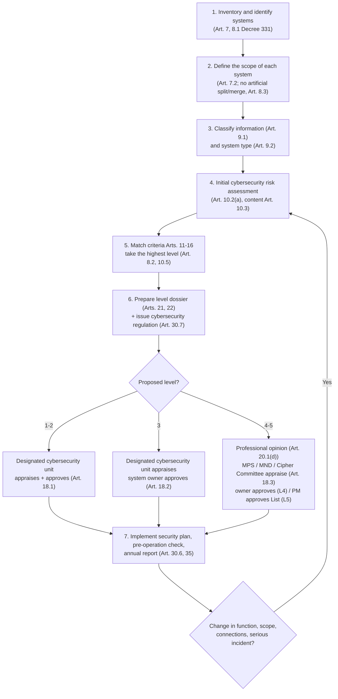
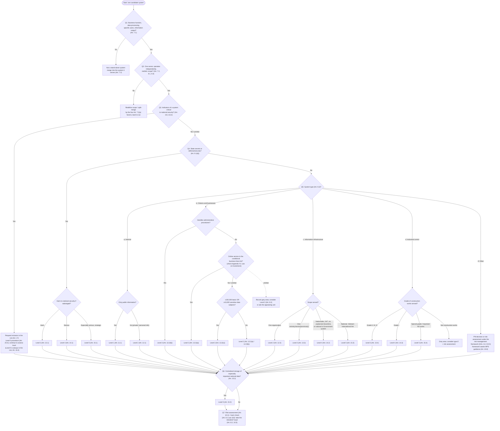

# Security Levels: Determination, Authority and Dossier

> **Unofficial English guide.** Condensed from the Vietnamese pages listed below; the Vietnamese version prevails. Vietnamese laws have no official English translation — renderings follow the [glossary](glossary.md). **Synced with Vietnamese version:** 28/09/2026.
> **Vietnamese source:** [docs/01-xac-dinh-cap-do/README.md](../docs/01-xac-dinh-cap-do/README.md) · [docs/01-xac-dinh-cap-do/tieu-chi-cap-do.md](../docs/01-xac-dinh-cap-do/tieu-chi-cap-do.md) · [docs/01-xac-dinh-cap-do/cay-quyet-dinh.md](../docs/01-xac-dinh-cap-do/cay-quyet-dinh.md) · [docs/01-xac-dinh-cap-do/phieu-xac-dinh-cap-do.md](../docs/01-xac-dinh-cap-do/phieu-xac-dinh-cap-do.md) · [docs/01-xac-dinh-cap-do/tham-quyen-trinh-tu.md](../docs/01-xac-dinh-cap-do/tham-quyen-trinh-tu.md) · [docs/02-ho-so-cap-do/README.md](../docs/02-ho-so-cap-do/README.md)

Every information system (*hệ thống thông tin*, IS) in scope must be assigned one of five security levels (*cấp độ*), Level 1 (lowest) to Level 5 (highest). The level decides three things: which requirements apply (see [03-requirements-by-level.md](03-requirements-by-level.md)), who appraises and approves the classification, and how long the procedure takes. This page answers three questions: **which systems**, **which level**, and **who appraises/approves, within what time**.

Legal basis: Law 116 Arts. 8, 9, 45; Decree 331 Arts. 2–25, 37, 39. This page is a reference framework. It does not replace the opinion of the appraising body or the competent authority.

## 1. Is Decree 331 mandatory for you? (Art. 2 Decree 331)

Decree 331 applies to organizations and individuals involved in building, operating, upgrading or expanding information systems in Vietnam that serve:

- IT applications in the activities of **state agencies and organizations**; and
- IT applications in the provision of **online services to citizens and businesses**.

Other organizations are **encouraged** to apply it (Art. 2 Decree 331). A private company whose systems are purely internal (ERP, email, HRM) can therefore argue that it falls in the "encouraged" category. The Vietnamese pages treat this as a grey area and point to factors that weigh against relying on it:

- Law 116 applies to all Vietnamese agencies, organizations and individuals (Art. 1.2(a) Law 116) and assigns the task of "determining the security level of the information system" to the system owner (Art. 10.1(a) Law 116). Art. 10.3 Law 116 requires owners of Level 1–2 systems to "fully perform the tasks" of Art. 10.1. So the duty to determine a level may arise from the Law itself, not only from Decree 331.
- The penalty provisions do not distinguish between types of system owner (Arts. 23, 24 Decree 330).
- Most companies run a website or app for customers. That is an "online service" (Art. 3.5 Decree 331), so **that system** is in mandatory scope.

**Toolkit position (cautious reading):** inventory all systems. Classify every system that provides an online service under Decree 331. Still classify purely internal systems (usually Level 1–2, internal procedure under Art. 18.1 Decree 331) to meet Art. 10.1(a) Law 116, and record the scope reasoning in the worksheet. See also [gray-areas.md](gray-areas.md).

## 2. Overall process

Key points of each step:

1. **Inventory.** Each system must have a clear business function, process data, have specific users or served parties, and produce information or data as output (Art. 7.1 Decree 331). It has **only one** system owner and belongs to one type under Art. 9.2 (Art. 8.1).
2. **Scope.** Define it by four factors: business function, data flows, operational dependency, and incident impact (Art. 7.2(a)). Scope must reflect how the system really operates, not the administrative structure, technical model or physical infrastructure. Where systems connect or share infrastructure, consider risk propagation (Art. 7.2(b)). Do not split or merge systems on paper to lower the level (Art. 8.3).
3. **Classify** the information and the system type (section 3 below).
4. **Risk assessment** is mandatory at first determination (Art. 10.2(a)); minimum content in Art. 10.3. The method awaits MPS guidance (Art. 10.8 Decree 331).
5. **Match criteria** in Arts. 11–15 (and Art. 16 if there are national-security indicators); apply the aggregation rules (section 5).
6. **Dossier** per Arts. 21–22. The system's cybersecurity regulation (internal) must be issued **before** the dossier is approved (Art. 30.7).
7. **Appraisal and approval** per level (Arts. 18, 20, 23, 24). Then implement the approved plan in full before operation (Art. 30.6) and report annually (Art. 35, Form 08).

**Roles.** The system owner (*chủ quản hệ thống thông tin*) of an enterprise is the level with authority to decide the investment in building, establishing, upgrading or expanding the system (Art. 4.2 Decree 331). It may delegate in writing to a subordinate organization (Art. 4.3). The operating unit (*đơn vị vận hành hệ thống thông tin*) is assigned by the owner; where IT services are rented, it is determined by the contract (Art. 5.3). The designated cybersecurity unit (*đơn vị chuyên trách về an ninh mạng*) is the owner's internal unit that appraises dossiers, and for Levels 1–2 also approves them.

## 3. Classification inputs

### 3.1 Information types (Art. 9.1 Decree 331)

| Type | Short definition | Article |
|---|---|---|
| Public information | Open to everyone, no identification needed | Art. 9.1(a) |
| Private information | Not public, or public only to identified parties | Art. 9.1(b) |
| Personal information | Linked to identifying a specific person | Art. 9.1(c) |
| State secrets | Confidential, Secret, Top Secret under state secrets law | Art. 9.1(d) |

For the data subject thresholds (Art. 12.2(b), 13.2(c)), "basic" and "sensitive" personal data follow Art. 2.2 and 2.3 PDPL, with lists in Art. 3 (basic) and Art. 4 (sensitive) Decree 356. Note that "personal information" (Decree 331) is not identical to "personal data" (PDPL).

Practical point: an internal system with employee login accounts already processes **users' personal information**. It is no longer "processing only public information" (Level 1, Art. 11.1) and usually falls under Art. 12.1 (Level 2).

### 3.2 System types (Art. 9.2 Decree 331)

| Code | Type | Short definition |
|---|---|---|
| a | Internal operations | Serves **only** internal administration and operations |
| b | Serving citizens and businesses | Directly provides **or supports** online services (public online services and other online services: telecoms, IT, commerce, finance, banking, health, education, etc.; "online service" defined in Art. 3.5) |
| c | Information infrastructure | Equipment and lines shared by many organizations: WAN, databases, data centers, cloud; e-authentication, digital signatures; interconnection |
| d | Industrial control | Monitors, collects data, manages and controls key components of construction works |
| đ | Other | Not a–d; directly serves a specialized business, production or service line |

The MPS updates and publishes the list of systems by type every year before 15/01 on its portal (Art. 9.2(e)). Check the latest list before classifying.

## 4. Level criteria (Arts. 11–15 Decree 331)

Read by row (system type). If several cells match, take the highest level (Art. 8.2). "—" means no specific criterion.

| System type (Art. 9.2) | Level 1 (Art. 11) | Level 2 (Art. 12) | Level 3 (Art. 13) | Level 4 (Art. 14) | Level 5 (Art. 15) |
|---|---|---|---|---|---|
| **a. Internal** | Internal **and only** public information (Art. 11.1) | Internal, processes private information or users' personal information, no state secrets (Art. 12.1) | Processes state secrets or serves defense/security; sabotage would **harm** national security (Art. 13.1) | Same, sabotage would cause **serious harm** to national security (Art. 14.1) | Same, **strategic**; sabotage would cause **especially serious harm** to national security (Art. 15.1) |
| **b. Citizens and businesses** | — | (i) Online service **not** in the list of conditional business lines (*ngành, nghề đầu tư kinh doanh có điều kiện*) (Art. 12.2(a)); or (ii) other online service processing private/personal information of **< 100,000** data subjects (basic) or **< 10,000** (sensitive) (Art. 12.2(b)) | (i) Online service **in** the conditional business lines list (Art. 13.2(a)); (ii) system **handling administrative procedures** (Art. 13.2(b)); (iii) other online service with **≥ 100,000** data subjects (basic) or **≥ 10,000** (sensitive) (Art. 13.2(c)) | — (see Art. 14.2 for national e-Government systems) | — (see Art. 15.2 for centralized storage of especially important national data) |
| **c. Information infrastructure** | — | Serves **one** organization (Art. 12.3) | Serves organizations within **one ministry, sector, province or several provinces** (Art. 13.3) | National e-Government system, **or** infrastructure serving organizations **nationwide**, requiring **24/7** operation with no unplanned downtime accepted (Art. 14.2) | **National** infrastructure for Vietnam's international interconnection (Art. 15.3) |
| **d. Industrial control** | — | — | Directly controls/operates construction works of **grade II, III or IV** (Art. 13.4) | ... works of **grade I** (Art. 14.3) | ... works of **special grade**, or important works related to national security (Art. 15.4) |
| **đ. Other** | Risk-assessed under the cybersecurity risk management framework (Art. 11.2) | Decided by the Prime Minister or risk-assessed under the framework (Art. 12.4) | Same (Art. 13.5) | Same (Art. 14.4) | Same (Art. 15.5) |
| **National data** | — | — | — | — | Centralized storage of certain especially important national information/data (Art. 15.2) |

Notes:

- **Risk management framework** (Arts. 11.2, 12.4, 13.5, 14.4, 15.5): issued or submitted by the MPS (Art. 34.1(c)); **awaiting MPS guidance** (Art. 10.8). Meanwhile, use the Art. 10.3 risk assessment as supporting evidence and apply Art. 10.5. Art. 11.2 reads like a separate Level 1 criterion; the reasonable reading is "classified Level 1 based on a framework risk assessment" **[TO VERIFY]** against MPS guidance.
- The "Internal" row for Levels 3–5 is in substance a **state secrets / defense-security** criterion and applies to any system type that processes state secrets.

### 4.1 Data subject thresholds (Art. 12.2(b), 13.2(c))

| Personal data | Level 2 | Level 3 |
|---|---|---|
| Basic | < 100,000 data subjects | ≥ 100,000 data subjects |
| Sensitive | < 10,000 data subjects | ≥ 10,000 data subjects |

Exceeding **either** Level 3 threshold is enough ("or"). The texts do not say how to count (cumulative or active, cut-off date, de-duplication).

### 4.2 Link to levels of harm (Art. 8.1 Law 116)

Law 116 defines the five levels by **harm** caused by an incident or violation; Decree 331 translates this into type-based criteria. The level proposal statement should argue both ways.

| Level | Harm (Art. 8.1 Law 116) | Decree 331 |
|---|---|---|
| 1 | May harm lawful rights and interests of organizations/individuals (Art. 8.1(a)) | Art. 11 |
| 2 | Serious harm to those rights and interests, or harm to public interest (Art. 8.1(b)) | Art. 12 |
| 3 | Especially serious harm to those rights and interests; serious harm to public interest; harm or serious harm to social order and safety; or harm to national security (Art. 8.1(c)) | Art. 13 |
| 4 | Especially serious harm to public interest or social order and safety, or serious harm to national security (Art. 8.1(d)) | Art. 14 |
| 5 | Especially serious harm to national security (Art. 8.1(đ)) | Arts. 15, 16 |

Law 116 does not quantify "serious" or "especially serious". State your own quantitative assumptions (people affected, outage duration, loss value) in the statement.

### 4.3 Information systems critical to national security (Art. 16 Decree 331; Art. 9 Law 116)

An information system critical to national security (*HTTT quan trọng về an ninh quốc gia*) meets **one** of these criteria: it serves direction and control of important works related to national security (Art. 16.1); it serves direction, control or operation of important telecommunications works related to national security (Art. 16.2); it belongs to a sector in Art. 9.2 Law 116 (military, security, diplomacy, cipher; state secrets; national systems in energy, finance, banking, telecoms, transport, agriculture, natural resources and environment, chemicals, health, culture; automated control of important national-security targets, etc.) **and** an incident would cause one of the consequences listed in Art. 16.3(a)–(g) (for example, serious consequences for the national economy, or a disaster for human life or the environment); or it is a Level 5 system (Art. 16.4).

The *List of information systems critical to national security* is decided by the Prime Minister (Art. 9.1, 9.4 Law 116; Art. 18.3(đ) Decree 331). The system owner must review its systems and file a request for inclusion (Art. 17.1, 17.2); the specialized cybersecurity protection force may require it (Art. 17.3). Level 3 and 4 systems found to belong to the List follow the Level 5 procedure (Art. 20.4).

**[TO VERIFY] — inconsistency:** Art. 16.4 and Art. 18.3(đ) equate the "List of Level 5 systems" with the "List of systems critical to national security", while Art. 20.4 mentions Level 3 and 4 systems in that List; Art. 9.1 Law 116 describes such systems as those that "may harm national security" (the Level 3 threshold in Art. 8.1(c) Law 116). If a system shows Art. 16.1–16.3 indicators, consult the MPS specialized cybersecurity protection force early.

## 5. Aggregation rules

| Rule | Content | Article |
|---|---|---|
| One owner | Each system has only one system owner | Art. 8.1(a) Decree 331 |
| Highest level wins | If a system meets criteria of different levels, the highest level applies | Art. 8.2 Decree 331 |
| No artificial split/merge | Scope must not be drawn on paper to change the level or reduce requirements; the competent authority may require re-determination if it finds an inappropriate split or merge | Art. 8.3 Decree 331 |
| Higher risk means higher level | If the risk assessment shows a higher risk than the determined level, the system owner must propose a higher level | Art. 10.5 Decree 331 |

Good practice: record in the worksheet the reason for each split or merge against the four Art. 7.2(a) factors. This is the evidence against an "artificial split/merge" challenge under Art. 8.3.

Consequence for a common case: a type b system outside the conditional business lines (Art. 12.2(a), Level 2) that exceeds a data subject threshold (Art. 13.2(c), Level 3) is **Level 3** under Art. 8.2. Art. 12.2(a) does not "exclude" Art. 13.2(c).

## 6. Decision tree

Follow **every** matching branch, note all levels found, then take the highest (Art. 8.2). If the risk assessment points higher, raise the level (Art. 10.5). The result is a **preliminary** level, to be completed with the worksheet and the risk assessment (Art. 10.2(a)).

Illustrative examples (hypothetical):

| Hypothetical system | Matching branches | Preliminary level | Note |
|---|---|---|---|
| Static corporate website, no login, no forms | Grey area: not "only internal" (Art. 9.2(a)), hard to call an "online service" (Art. 3.5, 9.2(b)); only public information | 1 or 2, reasoning recorded | With a contact/sign-up form collecting personal information: treat as type b, at least Level 2 |
| Internal email / HRM | a + employees' personal information | 2 (Art. 12.1) | — |
| E-commerce platform, 300,000 customer accounts | b + ≥ 100,000 data subjects | 3 (Art. 13.2(c)) | Also check Art. 13.2(a) |
| Telemedicine app, 8,000 patients (health data = sensitive) | b; < 10,000 sensitive | ≥ 2; check Art. 13.2(a) | Is the medical service a conditional business line? |
| SaaS for 50 companies, 400,000 end-customer records in total | b (possibly also c) | 3 (cautious) | Record the counting method |

The Vietnamese [worksheet](../docs/01-xac-dinh-cap-do/phieu-xac-dinh-cap-do.md) (*phiếu xác định cấp độ*) is an internal working document (not a statutory form), one per system: it records the inputs above, the matched criteria and proposed level, and is signed by the operating unit and reviewed by the designated cybersecurity unit. It feeds the dossier statements.

## 7. Grey areas in classification

Each is detailed in the Vietnamese criteria page (section 6) and in [gray-areas.md](gray-areas.md). Any choice below the cautious reading should be justified, kept on file (Art. 10.6 Decree 331) and preferably discussed with the appraising unit.

| Issue | Articles | Cautious reading |
|---|---|---|
| Mandatory scope vs "encouraged" | Art. 2 Decree 331; Art. 1.2(a), 10.1(a) Law 116 | See section 1: classify all systems |
| Is SaaS/cloud a conditional business line? (Level 2/3 boundary for type b) | Art. 12.2(a) vs 13.2(a) | Look up Appendix IV of the Law on Investment (current consolidated version) **[TO VERIFY]**; the test attaches to the **online service**, not to the company's registered lines. If the online service is the main way of carrying out a licensed conditional line, Level 3. If unsure, apply Art. 8.2 or ask the appraising unit; record the line number checked. Cloud/data center providers may also be type c (Art. 13.3, 14.2), whose criteria are written in terms of state administrative scope **[TO VERIFY]** |
| Counting data subjects, especially as a processor | Art. 12.2(b), 13.2(c) | Count **all** data subjects whose personal data is processed on the system, regardless of controller/processor role; unique subjects stored at filing date plus forecast over the planned lifecycle; count sensitive data separately; de-identified data is not personal data (Art. 2.1 PDPL); keep the query and results as evidence |
| Internal system or online service? | Art. 9.2(a) vs 9.2(b) | "Supports" in Art. 9.2(b) extends type b to back-office systems of online services (CRM, core, payments, APIs, partner portals). If data flows regularly with a customer-facing front end, consider merging scope (Art. 7.2(a)) or classify as type b |
| Industrial control outside "construction works" | Arts. 13.4–15.4 | No ICS criterion at Levels 1–2; a production line is not "construction works": consider type đ plus risk assessment **[TO VERIFY]** against MPS guidance (Art. 34.1(b)) |
| Risk management framework criterion | Art. 10.8, 34.1(c) | Framework not yet issued; do not rely on it alone; combine type criteria with the Art. 10.3 risk assessment |

## 8. Authority by level (Art. 18 Decree 331)

| Proposed level | Prepares dossier | Professional opinion | Appraisal (*thẩm định*) | Approval (*phê duyệt*) | Articles |
|---|---|---|---|---|---|
| **1, 2** | Operating unit | — | Designated cybersecurity unit of the owner | Designated cybersecurity unit of the owner, **reports to the system owner** | Art. 18.1, 20.1(a)–(b), 20.3(a) |
| **3** | Operating unit | — | Designated cybersecurity unit of the owner | **System owner** (operating unit submits) | Art. 18.2, 20.1(c), 20.3(b) |
| **4** | Operating unit | Designated cybersecurity unit | **MPS** leads, with the owner and relevant ministries (military systems: **MND**; cipher systems of the Government Cipher Committee: **Government Cipher Committee**) | **System owner** approves the level dossier | Art. 18.3(a)–(d), 20.1(d), 20.3(b), 21.5 |
| **5** | Operating unit | Designated cybersecurity unit | As Level 4 | **Prime Minister** approves the List of Level 5 systems (List of systems critical to national security) submitted by the MPS; **system owner** approves the **cybersecurity assurance plan** | Art. 18.3(d)–(đ), 20.3(c) |
| **3, 4 in the national-security List** | As Level 5 | As Level 5 | As Level 5 | As Level 5 | Art. 20.4 |

The approval dossier = the level dossier + the appraisal opinion of the lead appraising body (mandatory from Level 3 upward) (Art. 24.1 Decree 331).

Level 1–2 approval instrument: Decree 331 has no specific form. Form 06 is headed for the system owner and designed for Levels 3–4. The authority comes directly from Art. 18.1 and Art. 32.4, so the designated cybersecurity unit issues a decision in its own name, following the structure of Form 06. Where the designated unit also operates the system (Art. 18.4), the toolkit recommends that the head of the organization sign the approval. See the Vietnamese [Level 1–2 approval decision](../docs/08-bo-mau-cap-1-2/07-qd-phe-duyet-cap-do.md), point C18 in [gray-areas.md](gray-areas.md), and [08-level-1-2-toolkit.md](08-level-1-2-toolkit.md).

### 8.1 Independence rule (Art. 18.4 Decree 331)

When the **designated cybersecurity unit is also assigned to manage and operate** the system (common in small companies where the IT department does both), appraisal must follow one of two options:

| Option | Content | Article | Evidence to keep |
|---|---|---|---|
| A | The designated unit asks the owner to assign **a subordinate unit with sufficient capacity** to lead the appraisal | Art. 18.4(a) | Decision assigning the appraisal task |
| B | The designated unit asks the owner to **establish an independent appraisal council** (*hội đồng thẩm định độc lập*) | Art. 18.4(b) | Decision establishing the council, meeting minutes |

Art. 18.4 changes only the appraiser, not the approver (C18). If there is no independent designated cybersecurity unit yet, the owner must designate the IT / digital transformation unit for the task or establish/designate a designated cybersecurity team (Art. 31.1(c)). Complete the designation **before** filing. Decision templates: [docs/04-chinh-sach-quy-trinh](../docs/04-chinh-sach-quy-trinh/README.md), summarized in [07-governance-inspection-reporting.md](07-governance-inspection-reporting.md).

## 9. Procedure by level

The assignment of Forms to each step below is **inferred** from the title, addressee and content of the Forms in the Decree 331 Appendix; the Decree does not state which form is used at which step **[TO VERIFY]**.

**Levels 1–2 (system in operation).** The operating unit performs the risk assessment and prepares the dossier (Art. 10.2(a), 20.1(a), 21) and sends it with Form 01 to the designated cybersecurity unit (Art. 20.1(b)). If incomplete, the unit gives guidance within 05 working days (Art. 23.2). The unit appraises (Art. 18.1, 23.1) — or, if it also operates the system, an independent unit or council appraises (Art. 18.4) — approves the level proposal (Art. 20.3(a)), reports the result to the system owner (Art. 18.1) and returns the result to the operating unit.

**Level 3.** The operating unit prepares the dossier (Arts. 21, 22), with the cybersecurity regulation already issued (Art. 30.7), and sends Form 02 to the appraising unit (Art. 20.1(c)). Appraisal within 15 working days of a complete dossier (Art. 23.3(a)), result in Form 04. The operating unit then submits Form 05 with the dossier and appraisal opinion to the system owner (Art. 20.3(b), 24.1), who decides within 07 working days (Art. 24.2) by Form 06. The approved plan must be fully implemented before operation (Art. 30.6).

**Levels 4–5.** The operating unit performs a detailed risk assessment (Art. 22.5), prepares the dossier and requests a professional opinion from the designated cybersecurity unit using Form 03 (Art. 20.1(d)); the opinion becomes part of the dossier (Art. 21.5). The owner sends the dossier with Form 02 (plus, where relevant, a request for inclusion in the national-security List) to the MPS (or MND / Government Cipher Committee). The appraising body appraises within 25 working days, coordinating with ministries (Art. 18.3(a), 23.3(b)), and returns Form 04. **Level 4:** the operating unit submits Form 05; the owner approves by Form 06 within 07 working days (Art. 24.2). **Level 5** (and Level 3–4 systems in the List, Art. 20.4): the MPS submits the List to the Prime Minister (Art. 20.3(c), 18.3(đ)); the operating unit submits the cybersecurity assurance plan to the owner, who approves it by Form 07 (Art. 18.3(d)).

Systems in the national-security List are also subject to **cybersecurity appraisal** of designs for new builds or upgrades (Art. 5 Decree 333) and **assessment and certification of cybersecurity conditions** before operation (Art. 9.3 Law 116; Art. 6 Decree 333). The level determination result is carried over and not re-appraised unless there are changes (Art. 5.2 Decree 333).

**New projects, expansions and rented IT services (Art. 19, 22.1, 37 Decree 331).** For investment projects, the investor prepares the level proposal statement and integrates it into the feasibility study or investment report (Art. 19.1). For rented IT services, the unit leading the rental prepares it within the rental plan (Art. 19.2(a)), and the service provider **cooperates** in updating the dossier to the installed infrastructure (Art. 19.2(b)). Technical designs, rental plans, or outlines and detailed estimates must meet the security plan for the proposed level (Art. 22.1). Approval of the level dossier **before** the design or rental plan is approved is **encouraged** (Art. 37). The rental contract must set out each party's responsibilities for data governance, access control and cybersecurity (Art. 5.3(a)); Level 3–4 systems in rented data centers/cloud require logical separation (Art. 30.8), Level 5 / national-security systems physical separation (Art. 30.9).

## 10. Time limits

| Step | Maximum | From | Applies to | Article |
|---|---|---|---|---|
| Reply / guidance on incomplete dossier | **05 working days** | Receipt of dossier | All proposed levels | Art. 23.2 Decree 331 |
| Appraisal, Level 3 | **15 working days** | Receipt of complete valid dossier | Level 3 | Art. 23.3(a) |
| Appraisal, Levels 4–5 | **25 working days** | Receipt of complete valid dossier | Levels 4, 5 | Art. 23.3(b) |
| Appraisal, Levels 1–2 | No specific limit; appraisal + approval should fit within the **07 working days** of Art. 24.2 (suggested appraisal ≤ 05 days), set in the internal regulation | Receipt of complete valid dossier | Levels 1, 2 | Art. 23.3 silent; Art. 24.2 applies to all levels (C18) |
| Processing the approval dossier | **07 working days** | Receipt of complete valid dossier | Approval of the level proposal | Art. 24.2 |
| Cybersecurity appraisal of systems critical to national security (separate procedure) | 03 working days validity check; 25 working days appraisal; field survey ≤ 07 working days (not counted) | Receipt of dossier / acknowledgment | Systems in the national-security List | Art. 5.7, 5.8 Decree 333 |

**C18 reading — 07 working days also applies to Levels 1–2.** Art. 24.1(b) expressly limits the appraisal opinion requirement to "Level 3 and above", while Art. 24.2 (07 working days) contains no such limit. The toolkit therefore reads Art. 24.2 as applying to Levels 1–2 as well. For Levels 1–2 the approval dossier is the level dossier itself (Art. 24.1(a)) and the same unit receives it, so the "complete valid dossier" date may coincide with receipt for appraisal. Toolkit position: appraisal + approval within a **total of 07 working days** from receipt of a complete valid dossier (appraisal ≤ 05 days). Full analysis: [gray-areas.md](gray-areas.md) (C18) and the Vietnamese [points to verify](../docs/00-tong-quan/diem-can-doi-chieu.md).

**Indicative totals** (statutory maximums only, excluding preparation and corrections): Level 3 ≈ 5 + 15 + 7 = 27 working days; Level 4 ≈ 5 + 25 + 7 = 37 working days, plus the professional opinion stage (Art. 20.1(d) sets no time limit).

## 11. Dossier contents (Arts. 21–22 Decree 331)

| # | Component | Article | Applies to | Vietnamese framework / template |
|---|---|---|---|---|
| 1 | General description of the system | Art. 21.1; content Art. 22.3 | All levels | [general description](../docs/02-ho-so-cap-do/thuyet-minh-tong-quan-httt.md) · [.docx](../templates/02-ho-so-cap-do/thuyet-minh-tong-quan-httt.docx) |
| 2 | Design documents: (a) new build/expansion/upgrade — preliminary design or equivalent; (b) system in operation — approved construction design or equivalent | Art. 21.2 | All levels | Project documents (no template) |
| 3 | Level proposal statement based on the criteria | Art. 21.3; content Art. 22.4, plus Art. 22.5 for Levels 4–5 | All levels | [level proposal statement](../docs/02-ho-so-cap-do/thuyet-minh-de-xuat-cap-do.md) · [.docx](../templates/02-ho-so-cap-do/thuyet-minh-de-xuat-cap-do.docx) |
| 4 | Security plan statement for the level | Art. 21.4; content Art. 22.6, 29, 30 | All levels | [security plan statement](../docs/02-ho-so-cap-do/thuyet-minh-phuong-an-anm.md) · [.docx](../templates/02-ho-so-cap-do/thuyet-minh-phuong-an-anm.docx) |
| 5 | Professional opinion of the designated cybersecurity unit | Art. 21.5 | Levels 4, 5 | Result of Form 03 |
| + | Cybersecurity risk assessment report (mandatory at first determination; part of the level proposal statement for Levels 4–5) | Art. 10.2(a), 10.3, 22.5 | All levels (more detail at 4–5) | [risk assessment report](../docs/02-ho-so-cap-do/bao-cao-danh-gia-rui-ro.md) · [.docx](../templates/02-ho-so-cap-do/bao-cao-danh-gia-rui-ro.docx) · [risk register .xlsx](../templates/02-ho-so-cap-do/so-dang-ky-rui-ro.xlsx) |
| + | Cybersecurity regulation (internal) (*quy chế bảo đảm an ninh mạng*, ≈ information security policy) for the system — issued **before** the dossier is approved | Art. 30.7 | All levels | [docs/04-chinh-sach-quy-trinh](../docs/04-chinh-sach-quy-trinh/README.md) |

The dossier statement has three parts: general description, level proposal, and cybersecurity assurance plan (*phương án bảo đảm an ninh mạng*) (Art. 22.2).

### 11.1 Dossier statements (described, not translated)

These are drafting frameworks. Vietnamese staff complete them in Vietnamese.

| Statement | Purpose and content | Who prepares |
|---|---|---|
| General description (*thuyết minh tổng quan*) | Follows exactly Art. 22.3(a)–(d): system owner (basis, representative, any delegation under Art. 4.3), operating unit, scope and scale (users served), architecture (logical and physical model, main equipment, applications/services, network zones and IP plan). Contains network diagrams and IPs: treat as private information (Art. 9.1(b)), restrict access, send via secure channels | Operating unit |
| Level proposal statement (*thuyết minh đề xuất cấp độ*) | Art. 22.4(a)–(c): list of systems with type, proposed level and legal basis; detailed reasoning per system (information types, type, criteria met, harm per Art. 8.1 Law 116); preliminary risk identification. Levels 4–5 add Art. 22.5(a)–(d): connected systems, attack threats and impact, impact on public interest / social order / national security, 24/7 requirements (for Art. 14.2 systems) | Operating unit |
| Security plan statement (*thuyết minh phương án*) | Describes **for each requirement** how it is met (Art. 22.6): the seven plan components of Art. 29.2 (design, operation, inspection and assessment, risk management, monitoring, incident response and disaster recovery, decommissioning), management and technical requirements (Art. 30.3, 30.4), rented data center/cloud requirements (Art. 30.8, 30.9), status, evidence and remediation plan per item; lookup of TCVN 14423:2026 requirement groups by level (clause references only, see [03-requirements-by-level.md](03-requirements-by-level.md)) | Operating unit |
| Risk assessment report (*báo cáo đánh giá rủi ro*) | Follows the seven minimum contents of Art. 10.3(a)–(g): critical assets, information types, threats and vulnerabilities, likelihood and impact, existing capabilities, mitigation plan, risk communication and reporting. Scoring scale is an internal suggestion pending MPS guidance (Art. 10.8). Self-assessment must be done by a function independent of the direct operator (Art. 31.2(c)) | Operating unit / independent function |

## 12. Forms 01–08 (Decree 331 Appendix — described, not translated)

The Vietnamese pages reproduce each form verbatim from the Decree 331 Appendix (blanks replaced by `{{...}}`), with filling guidance. The "used when" and "level" columns are **inferred** from the addressee, content and Arts. 18, 20; the Decree does not state the scope of each form **[TO VERIFY]**.

| Form | Purpose (English description) | Level | Signed by | Sent to | Vietnamese file / template |
|---|---|---|---|---|---|
| 01 | Request for appraisal **and** approval of the level dossier; lists the system, operating unit, proposed level and the four attached documents | 1–2 | Representative of the requesting organization (usually head of the operating unit) | Designated cybersecurity unit (or independent unit/council under Art. 18.4) | [md](../docs/02-ho-so-cap-do/mau-01-de-nghi-tham-dinh-phe-duyet.md) · [docx](../templates/02-ho-so-cap-do/mau-01-de-nghi-tham-dinh-phe-duyet.docx) |
| 02 | Request for appraisal of the level dossier; item 5 attaches the professional opinion (Levels 4–5 only); optional request for inclusion in the national-security List | 3 (to the designated or independent unit); 4–5 (to MPS/MND/Cipher Committee) | Representative of the requesting organization (Levels 4–5: the system owner, Art. 20.1(d)) | Appraising body | [md](../docs/02-ho-so-cap-do/mau-02-de-nghi-tham-dinh.md) · [docx](../templates/02-ho-so-cap-do/mau-02-de-nghi-tham-dinh.docx) |
| 03 | Request for professional opinion on the suitability of the proposed level and security plan; mandatory before the owner sends the dossier to the MPS | 4–5 | Representative of the operating unit | Designated cybersecurity unit | [md](../docs/02-ho-so-cap-do/mau-03-xin-y-kien-chuyen-mon.md) · [docx](../templates/02-ho-so-cap-do/mau-03-xin-y-kien-chuyen-mon.docx) |
| 04 | Appraisal opinion: conclusion "suitable / not suitable", stating what is unsuitable; mandatory part of the approval dossier from Level 3 | 3–5 (may be used for 1–2) | Representative of the appraising body | System owner / operating unit | [md](../docs/02-ho-so-cap-do/mau-04-y-kien-tham-dinh.md) · [docx](../templates/02-ho-so-cap-do/mau-04-y-kien-tham-dinh.docx) |
| 05 | Internal submission (*tờ trình*) seeking approval after appraisal, attaching the dossier, appraisal opinion and a draft Form 06; Level 5: may be used to submit the security plan with a draft Form 07 | 3–5 | Representative of the operating unit | System owner | [md](../docs/02-ho-so-cap-do/mau-05-to-trinh-phe-duyet.md) · [docx](../templates/02-ho-so-cap-do/mau-05-to-trinh-phe-duyet.docx) |
| 06 | Decision approving the security level: states the level, the applicable national standard (TCVN 14423:2026) and technical regulation, and responsibilities of the operating unit (Art. 33) | 3–4 (adapted for 1–2 by the designated unit **[TO VERIFY]**) | Head of the system owner | Operating unit, designated cybersecurity unit | [md](../docs/02-ho-so-cap-do/mau-06-quyet-dinh-phe-duyet-cap-do.md) · [docx](../templates/02-ho-so-cap-do/mau-06-quyet-dinh-phe-duyet-cap-do.docx) |
| 07 | Decision approving the cybersecurity assurance plan; issued after the MPS/MND/Cipher Committee appraisal and the Prime Minister's List decision (sequence not specified **[TO VERIFY]**) | 5 (and 3–4 in the List, Art. 20.4) | Head of the system owner | Operating unit, designated cybersecurity unit | [md](../docs/02-ho-so-cap-do/mau-07-quyet-dinh-phe-duyet-phuong-an-anm.md) · [docx](../templates/02-ho-so-cap-do/mau-07-quyet-dinh-phe-duyet-phuong-an-anm.docx) |
| 08 | Report on the results of cybersecurity assurance for information systems (annual and ad hoc, Arts. 35, 36) | All | System owner | Designated cybersecurity unit / specialized cybersecurity protection force; the owner sends to the MPS | [md](../docs/02-ho-so-cap-do/mau-08-bao-cao.md) · [docx](../templates/02-ho-so-cap-do/mau-08-bao-cao.docx) |

Annual report timeline: data period 15/12 of the previous year to 14/12 of the reporting year; the designated cybersecurity unit and operating unit send to the owner before 20/12; the owner sends to the MPS before 25/12 (Art. 35.3, 35.4). Details: [07-governance-inspection-reporting.md](07-governance-inspection-reporting.md).

### 12.1 Mismatches between the Forms and the Decree body

| # | Issue | Suggested handling |
|---|---|---|
| 1 | Forms 01, 02, 03, 05 list only "approved construction design or equivalent", while Art. 21.2(a) allows a **preliminary design** for new builds/expansions | For new projects, name the actual document per Art. 21.2(a) and cite the basis **[TO VERIFY]** |
| 2 | Form 02 is titled "request for appraisal" but its lead sentence says "appraisal and approval" | Keep the form wording; its closing only requests an appraisal opinion |
| 3 | Form 05 item 6 refers to the opinion of the "**coordinating** appraising body"; Art. 24.1(b) requires the opinion of the "**lead** appraising body" | Attach the lead body's opinion (and coordinating opinions, if any) |
| 4 | Form 04 section 4.2 covers only "suitability of the proposed level"; Art. 23.1 also covers the security plan in design and in operation | Appraising body should address all three points of Art. 23.1(a)–(c) |
| 5 | Art. 22.5 (Levels 4–5) says "in addition to the content in **clause 3**" (the general description); logically it may mean clause 4 (level proposal statement) | Cover clauses 3, 4 and 5 **[TO VERIFY]** |

## 13. When a risk assessment is required and re-determination (Art. 10.2, 25 Decree 331)

A cybersecurity risk assessment is required: at first determination (Art. 10.2(a)); on changes in function, scope, users, information type or technology (Art. 10.2(b)); on expansion, integration, interconnection or data sharing (Art. 10.2(c)); after a serious incident or high risk to national security, social order and safety, or public interest (Art. 10.2(d)); and at the request of a competent state authority (Art. 10.2(đ)). The owner keeps the risk assessment records and provides them for inspections (Art. 10.6).

**Re-determination** (*xác định lại cấp độ*): where a system with an approved level must be re-determined to reflect reality, the **same procedure as the first determination** applies (Art. 25 Decree 331). Triggers:

- any of the Art. 10.2(b)–(đ) events above;
- a risk assessment showing higher risk than the approved level (Art. 10.5);
- a competent authority requires review (Art. 10.7) or finds an inappropriate split or merge (Art. 8.3);
- data subjects exceed 100,000 (basic) / 10,000 (sensitive) (Art. 13.2(c));
- a new online service falls in a conditional business line (Art. 13.2(a)).

## 14. Transitional rules

| Situation | Rule | Deadline (from 01/7/2026) | Article |
|---|---|---|---|
| System **already classified** under the Law on Network Information Security 2015 | Keeps its level; within 12 months must meet the conditions, standards and measures for that level under Law 116 | 12 months — around end of June 2027 **[TO VERIFY how the period is counted]** | Art. 44.1, 45.1 Law 116 |
| System **under investment/construction before 01/7/2026** | Within 06 months complete appraisal and approval of the level under **Decree 85/2016**; within 12 months meet the conditions, standards and measures under Decree 331 | 06 months — around end of December 2026; 12 months — around end of June 2027 | Art. 39.1 Decree 331 |
| Network information security products and solutions in use before 01/7/2026 | Continue in use; within 12 months meet cybersecurity conditions under Law 116 | Around end of June 2027 | Art. 45.3 Law 116 |
| Standards/technical regulations using "network information security" or "information system security" | Read as equivalent to "cybersecurity" within Decree 331 | — | Art. 39.2 Decree 331 |
| System **in operation but never classified** | No specific transitional rule: apply the Art. 20 procedure from Decree 331's effective date (19/8/2026, Art. 38) | — | Inference **[TO VERIFY]** |

Notes:

- Decree 331 takes effect on 19/8/2026 (Art. 38), after Law 116 (01/7/2026). The repository's copy of Decree 331 does **not** expressly repeal Decree 85/2016 in Art. 38, and Art. 39.1 still refers to Decree 85/2016 for transitional projects **[TO VERIFY]** against the Official Gazette version.
- A level retained under Art. 45.1 Law 116 was set under the old criteria. Review it against the new Arts. 11–15 criteria (especially the data subject thresholds) and re-determine (Art. 25) if they differ.

## 15. Penalties for skipping the procedure

Failing to prepare a level dossier for Level 3–5 systems, or putting a Level 3–5 system into operation without an approved level: individual VND 20–30 million, **organization VND 40–60 million** (Art. 23.1(b), (c) Decree 330). Failing to prepare the dossier or organize appraisal and approval: individual VND 20–30 million, **organization VND 40–60 million** (Art. 24.1 Decree 330). Organizations are fined twice the individual amount (Art. 7.1 Decree 330). Details: [05-penalties.md](05-penalties.md) and the Vietnamese [Decree 330 fine table](../docs/05-nghia-vu-lien-quan/nd-330-muc-phat.md).

## 16. Pre-filing checklist

- [ ] Designated cybersecurity unit/team designated (Art. 31.1); if it also operates the system, independent appraiser assigned or council established (Art. 18.4).
- [ ] Risk assessment completed (Art. 10.2(a), 10.3) and all Art. 21 components ready (Levels 4–5: professional opinion, Art. 21.5).
- [ ] System cybersecurity regulation issued, or to be issued before approval (Art. 30.7).
- [ ] Correct addressee and form for the level (sections 8, 12); timeline planned against sections 10 and 14.
- [ ] Evidence kept: signed worksheet, scope and data flow diagrams, data subject count query, Appendix IV lookup (date, version), risk assessment report. Do not send network diagrams or public IPs over insecure channels.
