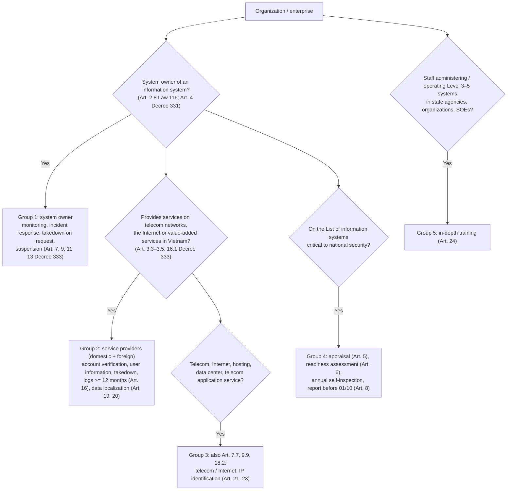

# Enterprise Obligations and Data Localization

> **Unofficial English guide.** Condensed from the Vietnamese pages listed below; the Vietnamese version prevails. Vietnamese laws have no official English translation — renderings follow the [glossary](glossary.md). **Synced with Vietnamese version:** 28/09/2026.
> **Vietnamese source:** [docs/05-nghia-vu-lien-quan/nd-333-nghia-vu-doanh-nghiep.md](../docs/05-nghia-vu-lien-quan/nd-333-nghia-vu-doanh-nghiep.md) · [docs/05-nghia-vu-lien-quan/luu-tru-du-lieu-tai-viet-nam-website-saas.md](../docs/05-nghia-vu-lien-quan/luu-tru-du-lieu-tai-viet-nam-website-saas.md)

Decree 333/2026 detailing the Law on Cybersecurity (effective 19/8/2026 — Art. 30 Decree 333) covers: the procedure for applying cybersecurity protection measures (Chapter II), **network information security** for enterprises providing services (Chapter III), **IP address identification** (Chapter IV) and **in-depth cybersecurity training** (Chapter V). This page lists obligations of **organizations and enterprises** only, then answers the most frequent question: *does a website, app, e-commerce platform or SaaS product — possibly hosted on a foreign cloud — have to store data in Vietnam?*

> **Fines** in this page are the amounts for **organizations**, i.e. twice the amounts written in Decree 330 Sections 1–5 (Art. 7.1 Decree 330). Details: [05-penalties.md](05-penalties.md).

## 1. Who is in scope?

## 2. Obligations tables

Row numbers follow the Vietnamese page, so cross-references stay valid.

### 2.1. System owner (all security levels)

The system owner (*chủ quản hệ thống thông tin*) is the body with direct management authority over the information system — see [02-security-levels.md](02-security-levels.md).

| # | Obligation | Deadline / frequency | Legal basis | Fine (organization) |
|---|---|---|---|---|
| 1 | Organize **cybersecurity monitoring** of systems under its management: self-monitoring, self-alerting, receiving alerts; maintain monitoring and centralized anti-malware systems able to **connect and share alert data** with the competent authority | Ongoing | Art. 7.2 Decree 333; Art. 40.1(b) Law 116 | Failure to inspect/monitor compliance, keep logs: VND 60–100 million (Art. 23.2(a) Decree 330) |
| 2 | When the specialized cybersecurity protection force deploys monitoring: cooperate, ensure technical conditions, provide configuration/connection/operating information on request, handle alerts | Per notice (force notifies in advance, except emergencies; in an emergency, written notice within 24 hours after deployment — Art. 7.5(a)–(b)) | Art. 7.6 Decree 333 | Non-cooperation: VND 60–100 million (Art. 23.2(b)); obstructing monitoring-data exchange between a contracted provider and the force: VND 60–100 million (Art. 23.2(d)) |
| 3 | Incident response and recovery: issue and maintain a response plan; detect, classify, initial response; **notify the specialized force immediately** if the incident exceeds capacity or a dangerous situation arises; **report the outcome** after recovery | Immediately; report after completion. 24h/72h milestones: Art. 31.2(d) Decree 331 | Art. 9.3, 9.7 Decree 333 (see grey area 3.1) | Several tiers under Art. 21 Decree 330 (VND 20–140 million) |
| 4 | **Encrypt** non-state-secret information before storing/transmitting on the Internet when the specialized force requests it (for national security, social order and safety, etc.) | Per written request | Art. 10.3 Decree 333 | No matching violation found in Decree 330 |
| 5 | **Delete** unlawful or false information infringing national security, social order and safety or lawful interests when the MPS specialized force requests in writing | Per request (Group 2 enterprises: 24h/06h — row 14) | Art. 11.2(b) Decree 333 | VND 50–100 million (Art. 32.1(a) Decree 330) |
| 6 | Execute decisions to **suspend, temporarily suspend or stop an information system**; in emergencies, a request may arrive in person/fax/email with the official document within 24 hours — if none arrives in time, the system may continue operating; minutes in 02 copies, one per party | Per decision | Art. 13.4(c)–(đ) Decree 333 | Not suspending/stopping, not withdrawing a domain on request: VND 50–100 million (Art. 32.1(b)) |
| 7 | Cooperate in blocking cross-border service providers publicly announced as violators | On request | Art. 14.3 Decree 333 | — |
| 8 | Notify and cooperate with authorities on detecting network information security violations | On detection | Art. 18.3 Decree 333; Art. 12.3 Law 116 | Not notifying violations on systems of state agencies or political organizations: VND 50–100 million (Art. 27.1(b)) |

### 2.2. Service providers on telecom networks, the Internet and value-added services in Vietnam (domestic and foreign)

| # | Obligation | Deadline / frequency | Legal basis | Fine (organization) |
|---|---|---|---|---|
| 9 | **Verify user information when a digital account is registered** | At registration | Art. 16.2(a) Decree 333; Art. 25.2(a) Law 116 | No verification: VND 60–100 million (Art. 29.1(a) Decree 330); no verification with lawful ID for mandatory-ID accounts: VND 40–60 million (Art. 34.1(a)) |
| 10 | Verify by **Vietnamese mobile number**; if none, by **personal identification number** or another lawful electronic identification method | At registration | Art. 16.2(b) | As row 9 |
| 11 | Users **livestreaming for commercial purposes** must be verified by personal identification number | Before enabling commercial livestream | Art. 16.2(c) | As row 9 |
| 12 | Security of information and accounts; **only verified accounts** may post, share or use interactive features | Continuous | Art. 16.2(d) | Failure to secure information/accounts: VND 60–100 million (Art. 29.1(b)) |
| 13 | **Provide user information** to the MPS specialized force on a valid request (written, electronic or other form authenticating the requester) | **≤ 24 hours** from receipt; emergencies (threat to national security, life) **≤ 03 hours** | Art. 16.3 Decree 333; Art. 25.2(a) Law 116 | Not providing, or late beyond 24 hours without good reason: VND 50–100 million (Art. 30.1(a)) |
| 14 | **Block/remove content, take down services or apps** on request of the MPS specialized force | **≤ 24 hours**; emergency threatening national security **≤ 06 hours** | Art. 16.4(a)–(b); Art. 25.2(b) Law 116 | VND 100–140 million (Art. 29.2(a)); forced removal from app stores, forced suspension of service in Vietnam (Art. 29.3(b)–(c)) |
| 15 | Restrict, suspend or stop service to users who **repeatedly** post violating content, at the authority's request | On request | Art. 16.4(c), 16.5; Art. 25.2(c) Law 116 | VND 100–140 million (Art. 29.2(b)) |
| 16 | **Restrict display in Vietnam / temporarily lock** accounts, pages, groups, channels: ≥ 03 violations in 30 days → up to **60 days**; ≥ 10 in 90 days → up to **180 days**. **Indefinite** restriction/lock for: content infringing national security; ≥ 03 prior temporary locks and continued violation; grounds that the account is still used as a tool for violations. Restoration considered when grounds cease, error, new facts | By threshold | Art. 16.4(d)–(e) (see grey area 3.4) | **[TO VERIFY]** — no specific violation found in Decree 330 |
| 17 | **Store and manage system logs**; minimum content: **user account, login/logout time, IP address, source port at login/logout, log of processing of posted content** | Retrievable for **at least 12 months** | Art. 16.6, 20.3 Decree 333 | Failure to ensure log retention period: VND 60–100 million (Art. 33.1(c)) |
| 18 | Retain users' personal information and user-generated data (account name, usage time, payments, IP…) after the user ends the service | "For the period prescribed by law" — **[TO VERIFY]** (Decree 333 sets no specific period) | Art. 25.2(d) Law 116 | See row 20 |

### 2.3. Data localization, branch / representative office (Art. 19–20 Decree 333)

| # | Obligation | Deadline / frequency | Legal basis | Fine (organization) |
|---|---|---|---|---|
| 19 | **Data that must be stored in Vietnam:** (a) personal information of service users in Vietnam; (b) data created by users in Vietnam: **account name, service usage time, credit card information, email address, most recent login/logout IP address, registered phone number linked to the account or data** | — | Art. 19.1 Decree 333 | — |
| 20 | **Domestic enterprises** store the row-19 data **in Vietnam** | Ongoing; retention **at least 24 months** (see grey area 3.2) | Art. 19.2, 20.1 | Not storing / storing incompletely: VND 60–100 million (Art. 33.1(a) Decree 330); not applying protection measures and storing in Vietnam: VND 100–140 million (Art. 29.2(c)) |
| 21 | **Foreign enterprises** in 11 sectors (telecom; data storage and sharing; domain names; e-commerce; online payment; payment intermediation; transport connection; social networks and social media; online games; online applications; messaging, voice, video, email, chat) must store data and set up a branch/representative office **only when** the service is used for violations and, after being notified and requested **3 times and up to 06 months**, they fail to remedy, do not comply, comply incompletely or obstruct protection measures | Complete within **12 months** of the MPS Minister's decision; force majeure: notify within **03 working days**, **25 working days** to find a solution | Art. 19.3, 19.6, 20.2 | Not executing the decision: VND 60–100 million (Art. 33.1(b)); foreign enterprise not setting up branch/representative office: VND 100–140 million (Art. 29.2(d)) |
| 22 | If fewer data types than row 19 are actually collected → confirm with the MPS specialized force and store those collected; if types are added → cooperate, **publicly notify users**, update the list | When arising | Art. 19.4 | — |
| 23 | Storage form is the enterprise's choice, provided data can be **retrieved and provided promptly** on request and information security meets national standards | — | Art. 19.5 | — |

### 2.4. Telecom, Internet, hosting, data center and telecom application service providers

| # | Obligation | Deadline | Legal basis | Fine (organization) |
|---|---|---|---|---|
| 24 | Cooperate, provide information and technical data, support the specialized force in **monitoring** and **incident response coordination** | On request | Art. 7.7, 9.9 Decree 333 | Not providing connection ports / technical conditions: VND 60–100 million (Art. 12.3(a) Decree 330); VND 100–140 million (Art. 21.4(c)) |
| 25 | **Block/remove** violating content, services, apps on request by **letter, phone or email**; refuse/suspend service to violators | **≤ 24 hours** | Art. 18.2(a)–(b) | As rows 14–15 |
| 26 | Connect to and receive takedown coordination requests through the technical system, report results; ensure infrastructure and capacity | Continuous | Art. 18.2(c)–(d) | Not deploying/maintaining access blocking on request: VND 60–100 million (Art. 12.3(c)–(d)) |
| 27 | **IP address identification**: system recording and storing IP identification linked to subscribers; accurately identify subscribers when assigning IPs | Whole lifecycle | Art. 21.2–21.3, 22.1; Art. 41.5 Law 116 | Not storing/providing subscriber IP, logs, DNS logs: VND 100–140 million (Art. 21.4(h)) |
| 28 | IP assignment logs synchronized to **national standard time**, minimum: source/destination IP and port, protocol; **NAT mapping**; session start/end; Gateway ID, Session ID; subscriber/account | Stored fully and continuously **at least 12 months**; extraction to the specialized force **in real time** | Art. 22.2–22.3 | As row 27 |
| 29 | **Provide IP identification information** (name, organization, ID number, subscriber name/code, installation address/phone) on lawful request; **no** commercial use or disclosure | **≤ 24 hours**; emergencies (national security, terrorism, cyberattack, particularly serious crime) **≤ 03 hours** | Art. 23.2–23.3 | As row 27 |

### 2.5. System owners of information systems critical to national security

| # | Obligation | Deadline | Legal basis | Fine (organization) |
|---|---|---|---|---|
| 30 | Submit one **cybersecurity appraisal** dossier (Form 01 Decree 333) after security level determination, reusing the level assessment | Before approving the design / new-build or upgrade project. Authority: 03 working days to check the dossier; ≤ 25 working days to appraise; site survey ≤ 07 working days (not counted) | Art. 5.2, 5.6–5.8 | VND 60–80 million (Art. 26.2 Decree 330) |
| 31 | Request **assessment and certification of cybersecurity readiness** (Form 02 Decree 333) before operation; maintain conditions throughout the lifecycle; meet 14 condition groups (Art. 6.3(a)–(o)) | Before operation. Authority: 03 working days check; ≤ 25 working days assessment | Art. 6.2–6.8 | No readiness assessment before operation: VND 80–100 million (Art. 26.3(a)) |
| 32 | **Self-inspection** when introducing equipment/services, on changes, **annually**; **send notice of periodic inspection results before 01/10 each year**; cooperate in ad hoc inspections; remediate | Annually, before 01/10 | Art. 8.2, 8.5; Art. 11.1(b) Law 116 | No annual inspection; no notice of results: VND 100–140 million (Art. 26.4(a), (c)) |
| 33 | Cooperate in continuous monitoring with the specialized force; ensure technical and staffing conditions | Ongoing | Art. 7.3 | VND 80–100 million (Art. 26.3(g)–(h)) |

### 2.6. In-depth cybersecurity training (Chapter V Decree 333)

| # | Obligation | Deadline | Legal basis |
|---|---|---|---|
| 34 | Members of **cybersecurity protection forces** under Art. 30.1(a)–(b) Law 116 must meet 1 of 4 criteria: (a) cybersecurity degree; (b) IT/related degree + MPS-recognized cybersecurity certificate; (c) IT/related degree + ≥ 05 years' experience; (d) IT/related degree + in-depth training | Review and train within **24 months** from 19/8/2026 | Art. 24.1, 24.8(a) Decree 333; Art. 34.1 Law 116 |
| 35 | **Staff directly administering/operating Level 3, 4, 5 systems in state agencies, organizations and state-owned enterprises**: a **foundation module** (law, cybersecurity policy, personal data protection, state secrets; cybersecurity overview) **plus at least one** of 9 specialist modules, unless trained in cybersecurity. Holders of valid foreign certificates recognized by the MPS as equivalent take only the foundation module | Level 3–5 system owners in the state sector organize within **36 months** from 19/8/2026 | Art. 24.2–24.5, 24.8(b); Art. 34.2 Law 116 |
| 36 | Certificate conditions: attend **≥ 80%** of hours, complete exercises, pass final test | — | Art. 28.1–28.2 |
| 37 | Agencies, organizations, SOEs periodically review and send staff for refresher training | Periodic | Art. 28.4 |
| 38 | If an organization **runs its own** training facility: meet Art. 25.1; **keep course records at least 05 years**; report to the MPS within **25 working days** after each course | — | Art. 25.1–25.2, 28.3 |

No specific training violation was found in Decree 330. Curriculum and standards: **pending MPS guidance** (Art. 24.6, 29.1, 29.3 Decree 333).

### 2.7. Grey areas in Decree 333

| # | Issue | Detail | Toolkit's interim position |
|---|---|---|---|
| 3.1 | Does incident response in Art. 9.3 apply to all system owners or only systems critical to national security? | Art. 9's title is limited to systems critical to national security, but clause 3 says "system owner" generally | Apply to all systems from Level 3 (also required by Art. 29.2(e), 31.2(d) Decree 331 and Art. 40.1(c) Law 116). **[TO VERIFY]** |
| 3.2 | Start of the ≥ 24-month retention for **domestic enterprises** | Art. 20.1 counts "from receipt of the storage request until the request ends", but Art. 19.2 imposes localization on domestic enterprises **without any request** | Store in Vietnam now and keep at least 24 months (safe reading; consistent with A05 guidance when Decree 53/2022 was disseminated). See section 3.3 below. **[TO VERIFY]** |
| 3.3 | Must foreign enterprises set up a branch/representative office **immediately**? | Art. 25.3 para. 2 Law 116: "must set up" (unconditional); Art. 29.2(d) Decree 330 fines "not setting up"; but Art. 19.3(a) Decree 333 triggers the duty only after an MPS Minister's decision following violations | Monitor guidance; foreign enterprises should prepare a plan. **[TO VERIFY]** — conflict between Law and Decree |
| 3.4 | Are threshold-based account locks (Art. 16.4(d)–(đ)) applied **on the enterprise's own initiative** or **on request**? | Points (a) and (c) say "on request"; (d), (đ) do not | Build a violation counter and procedure to apply on request; do not lock indefinitely without grounds. **[TO VERIFY]** |
| 3.5 | Scope of "services on telecom networks, the Internet and value-added services" | See section 3 below | Services with user accounts in Vietnam → treat as in scope. **[TO VERIFY]** |
| 3.6 | Is training mandatory for **private enterprises** with Level 3–5 systems? | Art. 34.2 Law 116 and Art. 24.8(b) Decree 333 say "in state agencies, organizations, state-owned enterprises" — "state" may qualify all three | Literally not mandatory for private enterprises; still recommended, since TCVN 14423:2026 has a personnel requirement group (clauses 3.13/4.13/5.14/6.14/7.14). **[TO VERIFY]** |
| 3.7 | Log retention: 12 months (Art. 16.6(c), 20.3 Decree 333) vs 90 days (Art. 34.1(c) Decree 330 — device, IP, login time of digital accounts) vs 01–12 months by level (TCVN 14423:2026 clauses 4.8/5.8/6.8/7.8) | Different subjects | Apply the highest: **≥ 12 months** for login and content-processing logs |
| 3.8 | Retention of user data after the service ends (Art. 25.2(d) Law 116) | "Period prescribed by law"; Decree 333 sets none | Provisionally ≥ 24 months (Art. 20.1) for row-19 data. **[TO VERIFY]** |

## 3. Data localization for websites, apps, e-commerce, SaaS and foreign cloud

*Analysis as at 25/9/2026.* **No official guidance** yet defines the scope of "services on telecom networks, the Internet, value-added services" for websites/SaaS. Every conclusion marked **[TO VERIFY]** is the toolkit's reading, not legal advice.

### 3.1. Short answers

| # | Question | Answer | Confidence |
|---|---|---|---|
| 1 | Must an in-scope domestic enterprise wait for a request before storing in Vietnam? | **No.** Art. 19.2 Decree 333 is unconditional; Art. 33.1(a) Decree 330 ("not storing") is separate from Art. 33.1(b) ("not executing a request decision"). Law firms (Duane Morris, DFDL) read it as **automatic** | High (practice) — Art. 20.1 wording still conflicts, see 3.4 |
| 2 | Is every Vietnamese website/SaaS in scope? | **Unclear.** Depends on "telecom application service" (Art. 3.12 Law 24/2023). Broad reading: almost any online service with user accounts. Narrow reading: carriers, ISPs, hosting, data centers, cloud, OTT, mobile content, intermediary platforms | Low — a genuine grey area |
| 3 | Services with user accounts, e-commerce, payments, social networks, games, data storage/sharing? | **Treat as in scope.** These sectors are in the 11-sector list of Art. 19.3(a) (for foreign enterprises) — hard to argue domestic enterprises in the same sectors fall outside Art. 19.2 | Medium–high |
| 4 | Is hosting on a foreign cloud a violation? | If the **only** copy is abroad and the enterprise is in scope → **does not meet** Art. 19.2. A parallel copy abroad alongside a retrievable copy in Vietnam is allowed (Art. 19.5 "form … decided by the enterprise"; no word "only", unlike Art. 30.1 Decree 163) | Medium — no guidance on whether a replica suffices |
| 5 | Which data must be in Vietnam? | Art. 19.1: (a) personal information of users in Vietnam; (b) account name, usage time, credit card information, email, most recent login/logout IP, phone number linked to the account. **Not** all business data, source code or anonymized analytics | Medium (trailing "or data" is ambiguous, see 3.5) |
| 6 | How long? | At least **24 months** (Art. 20.1). For domestic enterprises, the safe approach: store continuously while providing the service and keep ≥ 24 months after the user stops | Medium |
| 7 | What does a foreign cloud **certainly** trigger? | **Cross-border transfer of personal data** (Art. 20.1(c) PDPL; Art. 17.1(a) Decree 356 names "cloud computing services of a foreign provider") → prepare and file the impact assessment dossier within **60 days**. Independent of the cybersecurity grey area; small enterprises/start-ups are **not** exempt from Art. 20 | High |

**Toolkit's interim recommendation:** enterprises with user accounts in Vietnam should (i) keep a complete, retrievable copy of Art. 19.1 data in Vietnam; (ii) prepare a cross-border transfer dossier for every flow to foreign cloud/providers; (iii) record the reading chosen and its basis in internal files, to explain it on inspection.

### 3.2. What the texts say (key points)

- **Art. 25.3 Law 116** — domestic and foreign enterprises providing services on telecom networks, the Internet and value-added services in cyberspace in Vietnam **that collect, exploit, analyze or process** personal information data, relationship data and user-generated data must protect it and **store it in Vietnam for the period set by the Government**. Two cumulative conditions: (1) providing one of the three service types; (2) processing user data. The Law does not define the service types. Art. 41.7 Law 116 reuses the three-type phrase while Art. 41's title uses a broader phrase — suggesting Art. 25.3 targets a **subset** of online businesses.
- **Definitions (Art. 3 Decree 333):** "service user" = **organizations and individuals** (so B2B customers are users) (3.1); "user in Vietnam" = using the service on Vietnamese territory (3.2); "services on telecom networks" = telecom services and **telecom application services** (3.3 → Art. 3.7, 3.12 Law 24/2023); "services on the Internet" = Internet services and information content services on mobile networks (3.4); "value-added services in cyberspace" = value-added telecom services (3.5 → Art. 3.7(b) Law 24/2023; Art. 5.2 Decree 163).
- **Art. 18.2 Decree 333** groups "telecom application service providers" with telecom, ISPs, hosting and data centers — a sign the drafters meant intermediary providers. **Art. 15.2** requires measures proportionate to the nature, scale and risk of the service.
- **Law on Telecommunications 24/2023 and Decree 163/2024:** Art. 3.12 Law 24 defines "telecom application service" very broadly (using telecom networks to provide applications in IT, broadcasting, commerce, finance, banking, culture, information, health, education "and other fields"); no text narrows it. Art. 3.14 and 3.29 separate such providers from "telecom enterprises". Art. 20.2 limits their telecom duties to connection, telecom resources and technical standards. Art. 3.9, 3.11: data center and cloud services **are** telecom services. Art. 5.2 Decree 163 lists value-added telecom services (email, voicemail, value-added fax, Internet access, data center, cloud, OTT, others set by the Ministry) — **websites, e-commerce and SaaS are not listed**, so they are not "value-added services in cyberspace" (Art. 3.5 Decree 333) but may still be "telecom application services" (Art. 3.3). Art. 30.1 Decree 163: state agency data on data centers/cloud "**may only** be stored in Vietnam" — when lawmakers want exclusivity they say "only"; Art. 19 Decree 333 does not. Art. 27, 29 Decree 163: foreign providers may supply OTT, data center and cloud **cross-border** (notification under Art. 45).
- **Sanctions (Decree 330, organization amounts; full table in [05-penalties.md](05-penalties.md) §2.C–D):** Art. 29.2(c) not protecting **and** storing in Vietnam the data under Art. 25.3 Law 116 (including "relationship data"): VND 100–140 million; Art. 33.1(a) not storing data, or storing "data sensitive to national security" incompletely: VND 60–100 million, with forced storage and **forced suspension of telecom/Internet service** or disconnection in Vietnam (Art. 33.3); Art. 33.1(b) not executing a **request decision**: VND 60–100 million; Art. 33.1(c) log retention: VND 60–100 million; Art. 34.1(c) device/IP/login time of digital accounts not kept at least 90 days (no location requirement); Art. 56.1–56.4 cross-border transfer without a dossier: VND 30–100 million, or **1–5% of revenue** in Vietnam (Art. 56.3: failure/concealment/false declaration leading to leak or loss of 10,000+ data subjects, or continued transfer after a stop decision), with suspension of transfers for 06–12 months; Art. 69.1(b), 69.2(b)–(c) cloud without encryption at rest/in transit or without a contract defining data flows and roles.
  The split between Art. 33.1(a) (no decision needed) and 33.1(b) (decision not executed) only makes sense if a storage duty exists **without** a decision — i.e. Art. 19.2 for domestic enterprises. "Data sensitive to national security" appears in neither Law 116 nor Decree 333 — a new ambiguity.
- **PDPL and Decree 356 — an independent layer for foreign cloud:** Art. 20.1(c) PDPL treats **using a platform outside Vietnam** to process personal data collected in Vietnam as cross-border transfer; Art. 17.1(a) Decree 356 covers storage on foreign servers **or a foreign provider's cloud**. Art. 20.2 PDPL: file one original impact assessment dossier within **60 days** of the first transfer (Art. 18 Decree 356: contents incl. Form 09, result in 15 days, completion in 30 days; Art. 20: update every 06 months on changes; within 10 days on reorganization). Exemptions (Art. 20.6 PDPL; Art. 17.3 Decree 356) — e.g. an organization storing **its own employees'** data on cloud — do **not** cover hosting an entire customer database abroad. Art. 38 PDPL: the small/start-up exemption covers only Art. 21, 22 and 33.2 — **not** Art. 20. Art. 12.4 Decree 356: cloud personal data must be **encrypted at rest and in transit**; Art. 12.2: mandatory cloud contract terms. See [06-personal-data.md](06-personal-data.md).

### 3.3. Decision table — 7 scenarios (plus FDI)

Key: **Applies** = the text is explicit; **Treat as applying** = grey area, leaning towards application; **Grey** = two balanced readings; **No/low** = not applicable or very low risk.

| Scenario | Localization (Art. 19.2 Decree 333) | Other Chapter III duties (Art. 16: verification, 24h/03h, takedown 24h/06h, 12-month logs) | Cross-border transfer if hosted abroad (Art. 20 PDPL) |
|---|---|---|---|
| (i) Corporate website, no accounts (contact form, analytics) | **No/low** — hardly any Art. 19.1(b) data; contact form with personal data → slightly grey | **No/low** (no digital accounts). Art. 25.1 Law 116 (ban on posting violating content) still **applies** | **Applies** if forms/analytics collect personal data and servers/tools are abroad; static site with no personal data → no |
| (ii) App, e-commerce website with user accounts | **Treat as applying** — "commerce" is in Art. 3.12 Law 24; "e-commerce" is among the 11 sectors of Art. 19.3(a) | **Treat as applying** | **Applies** |
| (iii) User-generated content platform, social network, chat | **Applies** (very strong argument; OTT messaging/calling is a value-added telecom service — Art. 5.2(g) Decree 163) | **Applies** — Art. 16.2(d), 16.4 are written for this | **Applies**, plus Art. 29 PDPL |
| (iv) B2B SaaS | **Grey** — B2B customers are still "service users" (Art. 3.1); "data storage and sharing" and "online applications" are among the 11 sectors. Unclear whether **content** uploaded by customers is "user-generated data" — Art. 19.1(b) is mainly account metadata | **Grey** | **Applies**. The SaaS provider is usually the **processor**; the customer (controller) must also file if the SaaS is hosted abroad. Customers' own employee data on cloud is exempt (Art. 20.6(b) PDPL) |
| (v) Payments, e-wallets, fintech, banking | **Treat as applying** — online payment, payment intermediation among the 11 sectors; "credit card information" in Art. 19.1(b). State Bank rules (Circular 09/2020/TT-NHNN on cloud) to be checked separately **[TO VERIFY]** | **Applies**, plus Art. 34 Decree 330 (financial transaction accounts) | **Applies**, plus Art. 27 PDPL, Art. 8 Decree 356; partial exemption for "money transfer, payment" flows (Art. 17.3(đ) Decree 356) |
| (vi) Hosting, data center, cloud | **Applies** to customer/account information (value-added telecom — Art. 5.2(đ)–(e) Decree 163; named in Art. 18.2 Decree 333). **Grey** for tenants' content (provider may not access it — Art. 29.2(đ) Law 24) | **Applies** (Art. 18.2: takedown 24h, refusal of service) | **Applies** (Art. 12 Decree 356; Art. 69 Decree 330) |
| (vii) Foreign enterprise (no Vietnamese entity) serving users in Vietnam | Only when triggered under Art. 19.3(a) and a Minister's decision is issued (12 months to comply). **Conflict:** Art. 25.3 para. 2 Law 116 and Art. 29.2(d) Decree 330 require a branch/representative office unconditionally | **Applies** (Art. 16.1 names "foreign enterprises") | **Applies** (Art. 1.2, 20.1(c) PDPL "or abroad") |
| FDI company established in Vietnam; Vietnamese subsidiary of a foreign group | Treated as a **domestic enterprise** → as rows (ii)–(vi); does not benefit from the Art. 19.3 trigger (inferred from Art. 3.35 Law 24; Duane Morris reads it the same way) | As above | Sharing data with a foreign parent → Art. 20.1(b) PDPL |

### 3.4. Grey areas and readings

**(a) Scope of the three service types.**

| | Broad reading | Narrow reading |
|---|---|---|
| Scope | Every website/app/e-commerce/SaaS processing user data | Carriers, ISPs, hosting, data centers, cloud, OTT, mobile content, intermediary platforms |
| Arguments | Art. 3.3 Decree 333 pulls in "telecom application services", which Art. 3.12 Law 24 defines to include IT, commerce, finance "and other fields"; every website runs over the Internet, i.e. a telecom network. The 11-sector list (Art. 19.3(a)) treats e-commerce, online apps and games as Art. 19 "services". Decree 163 does not exclude ordinary websites | Art. 3.4 defines "Internet services" narrowly — if every website were already a telecom application service, Art. 3.4 would be redundant. Art. 3.5 ties to the closed value-added list in Art. 5.2 Decree 163. Art. 18.2 groups telecom applications with infrastructure. Art. 41.7 Law 116 separates a narrow group from a broad article title. Art. 15.2 requires proportionality. A decree may only detail Art. 25.3 Law 116, not widen its subjects |
| Supporters | Market practice, many comments since Decree 53/2022; Duane Morris, DFDL (2026) say domestic enterprises are "automatically" covered without discussing this limit | Tilleke & Gibbins, Freshfields (on Decree 53/2022: wording "not entirely clear", arguably limited to the three service types). An MPS Q&A (per excerpt): the rule "does not apply to all enterprises" |

Toolkit's view: enterprises with **user accounts** in Vietnam should apply it as if in scope (lowest risk). A website without accounts, with only a contact form, can argue it is out of scope but must still handle personal data duties. **[TO VERIFY]**

**(b) "Domestic enterprise" (Art. 19.2).** Not defined. By reference to Art. 3.35 Law 24 ("foreign organization" = established abroad under foreign law), an enterprise established under Vietnamese law, even 100% foreign-owned, is domestic. A branch/representative office of a foreign enterprise is **not** a domestic enterprise — it is the foreign enterprise's compliance vehicle. Open question: does Art. 19.2 cover **all** domestic enterprises or only those that are Art. 25.3 subjects? The narrow reading is technically stronger (Art. 25.4 Law 116 only delegates detailing), but leads back to (a).

**(c) Start and duration (Art. 20.1).** "Request needed" reading: Art. 20.1 refers to Art. 19 as a whole, and the only start rule is "from receipt of the request". "Automatic" reading: Art. 19.2 stands apart, unconditional, in contrast with Art. 19.3; Art. 19.6 (Minister's decision) concerns only foreign enterprises; Art. 33.1(a)/(b) Decree 330 separate the two violations; Art. 29.2(c) Decree 330 needs no request. **Decree 53/2022 precedent:** at A05's dissemination conference on 22/12/2022, domestic in-scope enterprises were reportedly told to store data **from the decree's effective date until they cease operating**; on request, the MPS could set a specific period **of not less than 24 months**; a 12-month transition for domestic enterprises was mentioned (not in the text). Secondary sources: Nishimura & Asahi (06/01/2023), Baker McKenzie. Art. 19–20 Decree 333 largely keep the structure of Art. 26–27 Decree 53, so similar application is likely. **[TO VERIFY]** — no equivalent guidance yet for Decree 333. **Recommendation:** store continuously in Vietnam while providing the service; for users who have stopped, keep at least 24 months (also meeting Art. 25.2(d) Law 116 — grey area 3.8); balance against data minimization and PDPL retention limits.

**(d) Data types.** "Personal information of service users" (Art. 19.1(a)) is undefined and differs from the PDPL term "personal data"; A05's 2022 precedent reads it per personal data law → broad reading: all users' personal data; narrow reading: account identifiers similar to point (b). The trailing phrase of Art. 19.1(b) "…registered phone number linked to the account or data" can be read as a **closed** list (metadata only) or as "or [other] data" created by users (including content). "Relationship data" (friends, groups) is in Art. 25.3 Law 116 and Art. 29.2(c) Decree 330 but **no longer** in Art. 19.1 Decree 333 (Art. 26.1(c) Decree 53 had it) — social networks should store it in Vietnam too. "Data sensitive to national security" (Art. 33.1(a)–(b) Decree 330) is defined nowhere.

**(e) "Stored in Vietnam" — location, exclusivity, copies.**
- **Location:** Art. 20.1(a) PDPL and Art. 17.1(a) Decree 356 use physical location ("systems **located** outside the territory"). A cloud region outside Vietnam is not storage in Vietnam.
- **Exclusive vs. a copy in Vietnam:** Art. 19.5 leaves the form to the enterprise, focusing on retrieval and timely provision; no "only" (compare Art. 30.1 Decree 163); Art. 20 PDPL allows transfers abroad with a dossier → a **solid textual argument** that one complete, retrievable copy in Vietnam suffices, with parallel processing abroad. Market commentary (VNG Cloud, lsvn.vn under Decree 53) says "the original must be in Vietnam"; Global Data Alliance's comments on the draft Decree 333 asked to clarify that copies abroad are allowed. **No official guidance** on whether replicas/backups suffice. **[TO VERIFY]**
- **A foreign cloud provider's region located in Vietnam** (if any): meets the cybersecurity location test, but "or on a foreign provider's cloud" (Art. 17.1(a) Decree 356) may be read as still triggering a cross-border transfer dossier. **[TO VERIFY]**
- **Who is liable:** the enterprise providing the service to users, not the infrastructure provider. Cloud providers are not liable for content (Art. 29.1(c) Law 24), may not access customer data without consent (Art. 29.2(đ)), and are **processors** for personal data. Using AWS/Azure/GCP does not shift the obligation.

**(f) Foreign enterprises: Law and Decree diverge.** Art. 25.3 para. 2 Law 116 and Art. 29.2(d) Decree 330 require a branch/representative office unconditionally; Art. 19.3, 19.6 Decree 333 only upon trigger, decision and 12 months to comply. Enforcement will likely follow Decree 333; Art. 29.2(d) remains an independent risk.

### 3.5. Sector rules to check separately

These may impose **stricter** requirements than Decree 333. Full texts are not in `sources/`; information is from secondary summaries — **[TO VERIFY]** before use.

| Sector | Instrument | Point to note (per summary) |
|---|---|---|
| Social networks, general information websites | Decree 147/2024/NĐ-CP | Licensing requires at least 01 server system in Vietnam; sites using a .vn domain must store data on servers with Vietnamese IPs |
| Banking | Circular 09/2020/TT-NHNN | Level 3+ systems may move to cloud if conditions are met; cloud contracts must state data center locations abroad; reporting to the State Bank in some outsourcing cases |
| E-commerce | Law on E-commerce 2025 (effective 01/7/2026) | Storage of transaction and livestream data; foreign marketplaces must set up a Vietnamese entity when conditions are met. No specific in-country server requirement seen |
| Public sector | Art. 30.1 Decree 163/2024; e-Government cloud criteria | State agency data on data centers/cloud **may only** be stored in Vietnam → SaaS sold to the public sector must in practice run in Vietnam |

## 4. Action checklist

- [ ] Determine whether the service is a "service on telecom networks, the Internet, value-added services in Vietnam" using the decision table in 3.3; record the reading chosen and its basis in the compliance file.
- [ ] Draw a **data flow map** with the physical location (region) of every data store, backup and third-party tool (analytics, CRM, email marketing, log/SIEM, customer support).
- [ ] Registration: verify by Vietnamese mobile number or personal ID number; commercial livestream by personal ID number; unverified accounts cannot post/share/interact (Art. 16.2 Decree 333).
- [ ] A 24/7 contact point and procedure for requests of the specialized force: information ≤ 24h (≤ 03h), takedown ≤ 24h (≤ 06h) (Art. 16.3–16.4). Vietnamese procedure: [quy-trinh-tiep-nhan-yeu-cau-co-quan-chuc-nang.md](../docs/04-chinh-sach-quy-trinh/quy-trinh-tiep-nhan-yeu-cau-co-quan-chuc-nang.md) · [Word template](../templates/04-chinh-sach-quy-trinh/quy-trinh-tiep-nhan-yeu-cau-co-quan-chuc-nang.docx).
- [ ] Logs contain the minimum fields (account, login/logout, IP, source port, content processing) and are retrievable ≥ 12 months (Art. 16.6, 20.3).
- [ ] If in scope: a complete copy of Art. 19.1 data, **retrievable in Vietnam** (domestic data center/cloud or a Vietnam region); test extraction against the 24h/03h deadlines; retain continuously while providing service and ≥ 24 months after users stop.
- [ ] Every personal data flow abroad (foreign cloud, third-party SaaS, parent company): cross-border transfer impact assessment dossier filed within 60 days and updated; cloud contract terms per Art. 12.2 Decree 356; encryption at rest and in transit (Art. 12.4) — see [06-personal-data.md](06-personal-data.md).
- [ ] Emergency response plan; report incidents immediately (Art. 41.2–41.3 Law 116).
- [ ] Monitor MPS guidance on the scope of Art. 19.2 and the start date in Art. 20.1.
- [ ] Keep evidence per [07-governance-inspection-reporting.md](07-governance-inspection-reporting.md).

**Internal submission (not translated):** the toolkit provides a Vietnamese internal submission (*tờ trình*) asking the head of the enterprise to approve the approach for data localization, system logs, account verification and handling requests from the specialized force under Decree 333. It is submitted by the designated cybersecurity unit, working with the legal department (scope conclusion) and the operating unit (technical solution), and is best submitted before launching a new service or when reviewing existing ones. Vietnamese file: [to-trinh-luu-tru-du-lieu-va-nhat-ky-tai-viet-nam.md](../docs/07-to-trinh-lanh-dao/to-trinh-luu-tru-du-lieu-va-nhat-ky-tai-viet-nam.md) · [Word template](../templates/07-to-trinh-lanh-dao/to-trinh-luu-tru-du-lieu-va-nhat-ky-tai-viet-nam.docx).

**External commentary** (not legal texts; accessed 25/9/2026) is listed with URLs in section 7 of the Vietnamese source page: Báo Chính phủ, the Government policy portal and an MPS Q&A; Duane Morris, Tilleke & Gibbins, Freshfields, Nishimura & Asahi, Vision & Associates; VietnamNet and Global Data Alliance.
