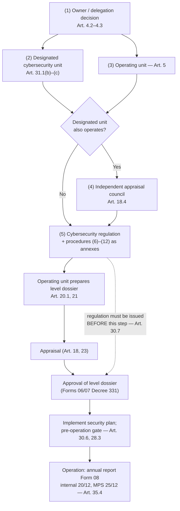
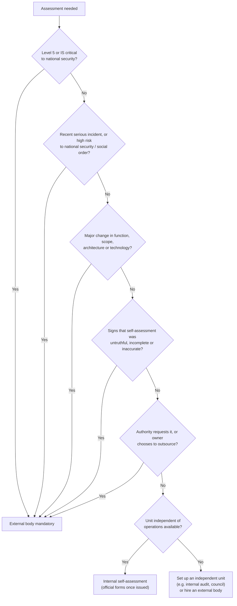
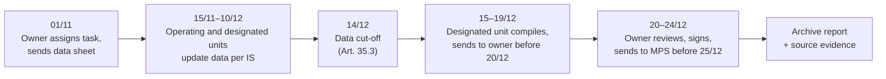
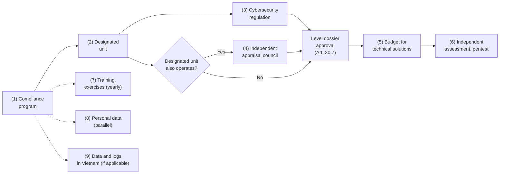

# Governance, Inspection and Reporting

> **Unofficial English guide.** Condensed from the Vietnamese pages listed below; the Vietnamese version prevails. Vietnamese laws have no official English translation — renderings follow the [glossary](glossary.md). **Synced with Vietnamese version:** 28/09/2026.
> **Vietnamese source:** [docs/04-chinh-sach-quy-trinh/README.md](../docs/04-chinh-sach-quy-trinh/README.md) · [docs/06-kiem-tra-bao-cao/README.md](../docs/06-kiem-tra-bao-cao/README.md) · [docs/06-kiem-tra-bao-cao/kiem-tra-danh-gia-dinh-ky.md](../docs/06-kiem-tra-bao-cao/kiem-tra-danh-gia-dinh-ky.md) · [docs/06-kiem-tra-bao-cao/bao-cao-nam-mau-08.md](../docs/06-kiem-tra-bao-cao/bao-cao-nam-mau-08.md) · [docs/06-kiem-tra-bao-cao/ho-so-luu-tru-bang-chung.md](../docs/06-kiem-tra-bao-cao/ho-so-luu-tru-bang-chung.md) · [docs/07-to-trinh-lanh-dao/README.md](../docs/07-to-trinh-lanh-dao/README.md)

This page covers what happens around the level dossier: who does what inside the organization, which internal documents must exist, how systems are inspected and assessed, what evidence to keep, how to file the annual report (Form 08), and how to get management approval through internal submissions. The documents themselves are **not translated**; each is described here with a link to the Vietnamese page and the Word template.

## 1. Roles

| Role | Vietnamese | What it does | Basis |
|---|---|---|---|
| **System owner** | *chủ quản hệ thống thông tin* | Body with direct management authority over the information system (IS); for a company, the level that decides the investment. Approves Level 3–5 dossiers, issues the internal regulation, files the annual report. The **head of the organization** directs and is accountable for cybersecurity (Art. 31.1(a) Decree 331) | Art. 4.2–4.3, 31 Decree 331 |
| **Designated cybersecurity unit** (or designated cybersecurity team inside IT) | *đơn vị chuyên trách về an ninh mạng* / *bộ phận chuyên trách về an ninh mạng* | Advises, implements, supervises and inspects; appraises Level 1–3 dossiers and approves Level 1–2; gives a professional opinion on Level 4–5 | Art. 3.2–3.3, 18.1, 18.2(a), 32 Decree 331 |
| **Operating unit** | *đơn vị vận hành hệ thống thông tin* | Runs the IS (in-house or outsourced); prepares the level dossier; implements the security plan; periodically assesses effectiveness and reports to the owner | Art. 5, 20.1, 33 Decree 331 |
| **Independent appraisal council** | *hội đồng thẩm định* | Needed when the designated cybersecurity unit is also the operating unit, to avoid appraising its own dossier | Art. 18.4 Decree 331 |
| **Independent assessment unit** | — | Unit independent of the operating unit that performs internal self-assessment | Art. 31.2(c) Decree 331 |
| **Personal data protection staff / function** (≈ DPO, but not identical) | *nhân sự / bộ phận bảo vệ dữ liệu cá nhân* | Handles PDPL duties; see [06-personal-data.md](06-personal-data.md) | Art. 33.2 PDPL; Art. 13–14 Decree 356 |

## 2. Internal documents to issue

Twelve organization-level templates, shared by all IS of one system owner. All personal details are placeholders (`{{...}}`). Decisions follow the usual Vietnamese administrative layout (national header, number, legal basis, articles, recipients). State bodies follow the clerical-work rules of Decree 30/2020 [TO VERIFY — not in the source set]; private companies may use their own format as long as it shows the signing authority, legal basis, content, effective date and recipients.

| # | Document (described, not translated) | Signed by | When | Basis | Vietnamese page · Word |
|---|---|---|---|---|---|
| 1 | **Decision identifying the system owner / delegating owner duties** — names the owner and, if delegated, the scope of systems, responsibilities and term | Body that decides investment (board, members' council, company chair or general director per charter) | Step 0, before everything else; on any change | Art. 4.2, 4.3, 31.2 Decree 331 | [VN](../docs/04-chinh-sach-quy-trinh/qd-chi-dinh-chu-quan-uy-quyen.md) · [docx](../templates/04-chinh-sach-quy-trinh/qd-chi-dinh-chu-quan-uy-quyen.docx) |
| 2 | **Decision establishing/appointing the designated cybersecurity unit or team** | Head of the system owner | Right after (1); before preparing dossiers | Art. 3.2–3.3, 31.1(b)–(c), 32 Decree 331; Art. 40.2(b) Law 116 | [VN](../docs/04-chinh-sach-quy-trinh/qd-chi-dinh-don-vi-bo-phan-chuyen-trach-anm.md) · [docx](../templates/04-chinh-sach-quy-trinh/qd-chi-dinh-don-vi-bo-phan-chuyen-trach-anm.docx) |
| 3 | **Decision assigning the operating unit** (incl. outsourced operation) | Head of the system owner | With (2); when the operating model or an outsourcing contract changes | Art. 5, 33 Decree 331 | [VN](../docs/04-chinh-sach-quy-trinh/qd-giao-don-vi-van-hanh.md) · [docx](../templates/04-chinh-sach-quy-trinh/qd-giao-don-vi-van-hanh.docx) |
| 4 | **Decision establishing an independent appraisal council** (or assigning a subordinate unit to appraise) | Head of the system owner, on proposal of the designated unit | When the designated unit also operates the IS; before appraisal | Art. 18.4 Decree 331 | [VN](../docs/04-chinh-sach-quy-trinh/qd-thanh-lap-hoi-dong-tham-dinh.md) · [docx](../templates/04-chinh-sach-quy-trinh/qd-thanh-lap-hoi-dong-tham-dinh.docx) |
| 5 | **Cybersecurity regulation** (*quy chế bảo đảm an ninh mạng*; internal, ≈ information security policy) + issuing decision — 7 management groups; parameter table by level | Head of the system owner | **Before the level dossier is approved**; reviewed at least once a year | Art. 28.1, 30.3, **30.7** Decree 331; Art. 10.2(a) Law 116 | [VN](../docs/04-chinh-sach-quy-trinh/quy-che-bao-dam-anm.md) · [docx](../templates/04-chinh-sach-quy-trinh/quy-che-bao-dam-anm.docx) |
| 6 | **Incident response procedure** (incl. personal data breach notice) | Head of the system owner (annex to the regulation) | With the regulation | Art. 31.2(d) Decree 331; Art. 40.1(c), 41.2–3 Law 116; Art. 9 Decree 333; Art. 21 Decree 330; Art. 23 PDPL; Art. 28–29 Decree 356 | [VN](../docs/04-chinh-sach-quy-trinh/quy-trinh-ung-pho-su-co.md) · [docx](../templates/04-chinh-sach-quy-trinh/quy-trinh-ung-pho-su-co.docx) |
| 7 | **Risk management procedure** | Head of the system owner (annex) | With the regulation; before the first risk assessment | Art. 10 Decree 331; TCVN 14423:2026 clauses 3.1/4.1/5.1/6.1/7.1 | [VN](../docs/04-chinh-sach-quy-trinh/quy-trinh-quan-ly-rui-ro.md) · [docx](../templates/04-chinh-sach-quy-trinh/quy-trinh-quan-ly-rui-ro.docx) |
| 8 | **Pre-operation readiness assessment procedure** ("gate" before go-live or major change) | Head of the system owner | With the regulation; for every new, extended or upgraded project | Art. 19, 28.3, 30.6, 37 Decree 331; Art. 10.2(c) Law 116 | [VN](../docs/04-chinh-sach-quy-trinh/quy-trinh-danh-gia-truoc-van-hanh.md) · [docx](../templates/04-chinh-sach-quy-trinh/quy-trinh-danh-gia-truoc-van-hanh.docx) |
| 9 | **Procedure for handling authority requests** (user information, takedowns, inspections, monitoring) | Head of the system owner | Before providing services in cyberspace | Art. 25.2, 41 Law 116; Art. 7, 11, 13, 16, 18 Decree 333; Art. 26 Decree 331 | [VN](../docs/04-chinh-sach-quy-trinh/quy-trinh-tiep-nhan-yeu-cau-co-quan-chuc-nang.md) · [docx](../templates/04-chinh-sach-quy-trinh/quy-trinh-tiep-nhan-yeu-cau-co-quan-chuc-nang.docx) |
| 10 | **Vendor management procedure** + model contract clauses | Head of the system owner | With the regulation; before signing or renewing contracts | Art. 5.3(a), 19.2(b), 30.8–9 Decree 331; Art. 12 Decree 356; TCVN clauses 3.14/4.14/5.15/6.15/7.15 | [VN](../docs/04-chinh-sach-quy-trinh/quy-trinh-quan-ly-nha-cung-cap.md) · [docx](../templates/04-chinh-sach-quy-trinh/quy-trinh-quan-ly-nha-cung-cap.docx) |
| 11 | **Annual training, awareness and exercise plan** | Head of the system owner | Yearly (Q4 of the previous year) | Art. 31.3 Decree 331; Art. 34 Law 116; Art. 24 Decree 333 | [VN](../docs/04-chinh-sach-quy-trinh/ke-hoach-dao-tao-dien-tap.md) · [docx](../templates/04-chinh-sach-quy-trinh/ke-hoach-dao-tao-dien-tap.docx) |
| 12 | **RACI matrix** of roles | Attached to the regulation | With the regulation | Art. 4, 5, 18, 31–33 Decree 331; Art. 14 Decree 356 | [VN](../docs/04-chinh-sach-quy-trinh/ma-tran-raci.md) · [xlsx](../templates/04-chinh-sach-quy-trinh/ma-tran-raci.xlsx) |

### Issuing order

**Key points:**

- The regulation must meet the management requirements for the level and be **approved and issued by the competent person before the level dossier is approved** (Art. 30.7 Decree 331). Without it the dossier cannot be approved, and the organization risks a fine of **VND 40–60 million** for "not issuing rules on cybersecurity in the design, construction, management, operation, use, upgrade and disposal of IS" (Art. 23.1(a) Decree 330; the article states VND 20–30 million for individuals, doubled for organizations under Art. 7.1).
- The regulation is **inspected** for completeness, fitness and compliance (Art. 27.2(a)–(b) Decree 331) and is **reported** in the annual report (Art. 36.6, 36.7, 36.11).
- The designated cybersecurity unit must exist before appraisal, because it appraises Level 1–3 dossiers (Art. 18.1, 18.2(a)).
- If IT is designated unit and operating unit at once, resolve the conflict with document (4) before appraisal (Art. 18.4).

### Open points on internal governance

| Issue | Status |
|---|---|
| What counts as a "serious incident" for the 24-hour notice (Art. 31.2(d) Decree 331) | Not defined; pending MPS rules on monitoring and incident response (Art. 28.6) |
| Risk assessment method and forms; self-assessment forms | Pending MPS guidance (Art. 10.8, 31.2(c), 34.1(đ) Decree 331) |
| Incident reception address, contact-point declaration, response team, response plan, 24/7 duty | Penalized under Art. 21 Decree 330, but Decrees 331/333 do not detail the underlying duty — recommended; [TO VERIFY] MPS texts on the response network |
| Log retention: TCVN (1–12 months by level) vs Decree 333 (≥ 12 months for service providers) | Apply the higher — regulation Article 28 |
| Incident reporting by service providers: "immediately" (Art. 41.3 Law 116) vs 24h/72h (Art. 31.2(d) Decree 331) | Apply "immediately" plus the 24h/72h milestones |

More in [gray-areas.md](gray-areas.md).

## 3. Inspection and assessment

Three different activities:

| Type | Who | When | Basis |
|---|---|---|---|
| **Self-inspection and assessment** by the owner (compliance, effectiveness, technical) | Unit independent of operations, or a qualified external body | Periodically by level and risk; continuously via monitoring; ad hoc; on request | Art. 27, 28.5, 31.2(c) Decree 331 |
| **Cybersecurity readiness assessment before operation** | Owner (IS critical to national security: competent authority) | Before go-live; on major change; on request | Art. 28.3 Decree 331; Art. 6 Decree 333 |
| **MPS inspection** | MPS inspection team | Cybercrime, attack, terrorism, espionage — or at the owner's request | Art. 12 Law 116; Art. 26 Decree 331 |

### What is checked (Art. 27 Decree 331)

- **Compliance (27.1):** the owner (designated unit, dossier, appraisal and approval, plan implementation, inspections, risk management, training and exercises); the designated unit (advice, appraisal or professional opinion); the operating unit (measures per the approved plan and Art. 10 Law 116); implementation of the plan's measures.
- **Effectiveness (27.2):** (a) is the regulation complete and fit for the approved plan; (b) is it followed in operation, decommissioning and disposal; (c) does the design match the plan (network zones, IP — Art. 22.3(d)); (d) setup and configuration; (đ) **hardening** of devices, OS, applications, databases. Results must show how far measures reduce risk, whether level requirements are met, and what to change (Art. 28.5(b)). The operating unit assesses effectiveness periodically and reports to the owner (Art. 33.3).
- **Technical (27.3):** scanning for malware and vulnerabilities and **penetration testing**; tracking remediation; **source code security review** for in-house software; remediation and hardening plan.
- **Three test modes (27.4):** **black box** (no internal information; for Internet-facing services), **gray box** (partial information such as a normal user account or API docs; for authorization testing), **white box** (full information incl. **source code**; for code and configuration reviews — needs a confidentiality agreement).

> **Penetration tests need written approval.** Unauthorized intrusion and causing disruption are prohibited (Art. 7.3, 7.5 Law 116), and detecting, testing or exploiting vulnerabilities "not in accordance with regulations" is fined (Art. 16.1(đ) Decree 330). Always have an owner approval stating scope, time, method, contacts and handling of collected data. TCVN 14423:2026 clauses 5.18.2.1/6.18.2.1/7.18.2.1 also require an approved test program.

### Frequency

Decree 331 sets **no number of inspections**: they are periodic **by level and risk**, continuous via monitoring, ad hoc on signs of violation or threat, and on request (Art. 28.5(a)). Minimum frequencies paraphrased from TCVN 14423:2026 (check against the official text):

| Activity | Level 1 | Level 2 | Level 3 | Level 4 | Level 5 | TCVN clause |
|---|---|---|---|---|---|---|
| Vulnerability scan / review of vulnerability process | ≥ 1/year | ≥ 1/year | ≥ 1/6 months | ≥ 1/6 months (critical assets ≥ 1/quarter) | ≥ 1/quarter (critical assets ≥ 1/month) | 3.7.2.1 … 7.7.2.1 |
| Security log review | ≥ 1/year | ≥ 1/year | ≥ 1/6 months | ≥ 1/month | ≥ 1/month | 3.8.2.1 … 7.8.2.1 |
| Minimum log retention | no figure | 1 month | 3 months | 6 months | 12 months | 4.8.2.1 … 7.8.2.1 |
| Periodic risk identification | — | — | ≥ 1/year | ≥ 1/6 months | ≥ 1/6 months | 5.1.2.2, 6.1.2.2, 7.1.2.2 |
| Penetration test | — | — | Approved test program (organization picks frequency) | **External ≥ 1/year; internal ≥ 1/year** | **External ≥ 1/6 months; internal ≥ 1/6 months** | 5.18, 6.18.2.2, 6.18.2.5, 7.18.2.2, 7.18.2.5 |
| Incident response exercise | — | — | Periodic (no figure) | ≥ 1/year | ≥ 1/year | 5.16, 6.17.2.6, 7.17.2.6 |

"—" means no numbered requirement was found at that level. Levels 1–2 only require reviewing the risk process at least yearly or on change (clauses 3.1(b), 4.1(b)). **IS critical to national security:** annual self-inspection, written notice of results **before 01/10** (Art. 11.1(b) Law 116; Art. 8.5(b) Decree 333).

### Internal self-assessment or external body? (Art. 31.2(c) Decree 331)

The owner is **legally responsible for the truthfulness, completeness and accuracy** of assessment results. Internal self-assessment is allowed if (1) done by a unit **independent of the operating unit**, and (2) it follows forms, criteria and methods issued by the competent authority — **not yet issued** at 24/09/2026; the toolkit provides an interim template.

A **qualified external body** (licensed; a state public-service organization with a matching function; or one designated by the competent authority) is **mandatory** when:

When outsourcing: the vendor needs a **cybersecurity product and service business license** (Art. 28.2(a), 29.1 Law 116); unlicensed business is fined **VND 150–200 million** for organizations (Art. 35.4(a) Decree 330). Licenses under Law 86/2015 remain valid to expiry (Art. 45.2 Law 116); new licensing rules: Decree 332/2026 [TO VERIFY]. The designated unit still coordinates scanning and penetration tests (Art. 32.5 Decree 331). Contracts should cover scope, test mode, confidentiality, handling and deletion of collected data.

### Fines for not inspecting (organizations)

| Act | Fine | Basis |
|---|---|---|
| No compliance checks, no log retention, or no effectiveness assessment | VND 60–100 million | Art. 23.2(a) Decree 330 |
| Measures not fully implemented as approved (Level 3–5) | VND 40–60 million | Art. 23.1(d) |
| IS critical to national security: no annual inspection; no notice of results | VND 100–140 million | Art. 26.4(a), (c) |
| Vulnerabilities not fixed as required by the specialized force (IS not on the national-security list) | VND 50–100 million | Art. 27.1(c) |

Full table: [05-penalties.md](05-penalties.md).

### Preparing for an MPS inspection (Art. 12 Law 116; Art. 26 Decree 331)

- **When:** for IS not on the national-security list, only for cybercrime, cyberattack, cyberterrorism or cyber-espionage, **or at the owner's request** (Art. 12.1). Scope: hardware, software, digital devices; information stored, processed and transmitted; state-secret protection (Art. 12.2). Results are confidential (Art. 12.4). The owner may **ask** MPS to inspect, e.g. after a suspected targeted attack (Art. 12.1(b)).
- **Procedure (Art. 26.1 Decree 331):** notice of plan → inspection team → inspection in coordination with the owner → minutes → notice of results.
- **Suspension to preserve the scene (Art. 26.2):** the specialized force may ask in writing to suspend (reason, purpose, duration); the owner **must set up a backup to keep services running** before isolation, except in emergencies.
- **Readiness checklist:** contact person and signatory for minutes; up-to-date IS list, network diagram, asset and IP plan matching the dossier (Art. 22.3(d)); dossier and approval decision, regulation, risk assessment (Art. 10.6); logs retrievable for the requested period and **evidence preservation** (no overwrite, snapshots, hashes); failover to isolate part of the system; internal confidentiality rule for results; follow-up register with owners and deadlines — failing to remediate as required is fined (Art. 27.1(c) Decree 330); notify violations found on own IS (Art. 12.3 Law 116).
- **IS critical to national security** have their own procedure: unannounced inspections with at least **12 hours** notice (incident, violation) or **72 hours** (state management need, expired remediation deadline); results within **25 working days** after completion; planned inspections: results within **03 working days** (Art. 8.6(a)–(b), 8.7(đ) Decree 333). [TO VERIFY] Art. 8.7(đ) is a general procedure, so the 03 and 25 working-day limits overlap in the decree itself; splitting them by inspection type is the toolkit's reading.

### Annual inspection plan and self-assessment report (templates)

The Vietnamese page provides two templates (not translated):

- **Annual inspection and assessment plan** — a quarter-by-quarter table: Q1 review of IS list, levels and risks (after the MPS list is published before 15/01) and organizational compliance check; Q1–Q4 vulnerability scans by level; Q2 effectiveness review (Level ≥ 3) and external black-box penetration test (Level 3–5 with public services, licensed vendor); Q3 gray-box/internal test and source code review, incident exercise, and — for IS critical to national security only — self-inspection and notice before 01/10; Q4 second penetration test round (Level 5 only), re-tests, year summary and Form 08; ad hoc assessments after serious incidents or major change by an **external body**. Approved by the head of the owner; led by the designated unit.
- **Self-assessment report** — signed by the head of the independent assessment unit, addressed to the head of the system owner. Sections: legal basis; **evidence of independence** and whether an external body was mandatory; scope, method and test mode (with the pentest approval number); compliance results (Art. 27.1); effectiveness results (Art. 27.2); technical findings (Art. 27.3); fulfillment per requirement group (feeds Art. 36.9–36.10 of the annual report); remediation plan; conclusion and any recommendation to raise the level (Art. 10.5). Replace with the official MPS form once issued.

Vietnamese page: [kiem-tra-danh-gia-dinh-ky.md](../docs/06-kiem-tra-bao-cao/kiem-tra-danh-gia-dinh-ky.md) (sections 6–7). Requirement checklists: [03-requirements-by-level.md](03-requirements-by-level.md).

## 4. Evidence retention

Keep evidence that proves compliance during MPS cybersecurity inspections (Art. 26–27 Decree 331), personal data inspections (Art. 31 Decree 356) or penalty proceedings. Retention periods below are **legal** only where a text sets them; everything else is the toolkit's recommendation.

### Principles

| Principle | Basis |
|---|---|
| The owner answers for the truthfulness of assessment results → keep original evidence, not just summaries | Art. 31.2(c) Decree 331 |
| Risk assessment records must be **kept and provided** on inspection | Art. 10.6 Decree 331 |
| DPIA and cross-border transfer dossiers must be **always available** | Art. 18.4, 19.4 Decree 356; Art. 55.1(a), 56.1(đ) Decree 330 |
| Limitation period for penalties is **one year** from the end of the act or completion of the duty → keep each period's evidence **at least until the end of the following year** | Art. 3.1–3.2 Decree 330 |
| System data may be collected as **electronic evidence** → logs and configurations need integrity and synchronized timestamps | Art. 8.1 Decree 330 |
| Records contain sensitive information (diagrams, IPs, vulnerabilities) → classify and restrict; MPS results are confidential | Art. 12.4 Law 116; Art. 8.11 Decree 333 |
| Do not keep personal data longer than necessary → set deletion dates for records with personal data | Art. 39.1(c) Decree 330 |

### Evidence register (summary)

| Group | Main records | Recommended retention (toolkit) |
|---|---|---|
| **A. Organization** | Owner and delegation decision; designated unit decision; operating unit decision and **outsourcing contracts** with cybersecurity duties (Art. 5.3); appraisal council decision; personal data protection staff appointment, qualifications and confidentiality undertaking | While in force + ≥ 2 years after replacement |
| **B. Level dossier** | IS list and determination worksheets; **risk assessments** (every version; Art. 10.6 — "keep", no period); full dossier; requests, **appraisal opinions**, submissions (Forms 01–05); **approval decisions** (Forms 06/07); re-determination; transitional Decree 85/2016 approvals; for IS critical to national security, appraisal and **certificate of cybersecurity conditions** | IS life cycle (+ ≥ 2 years for risk records) |
| **C. Regulation, procedures** | Issuing decision and every version of the regulation (**issue date before the level approval date** — Art. 30.7); procedures; personal data policy | All versions, IS life cycle |
| **D. Operations** | Service-provider **system logs** (≥ 12 months, Art. 16.6(c), 20.3 Decree 333); security logs by level (TCVN: Level 2 ≥ 1 month … Level 5 ≥ 12 months); device, IP and login time of digital accounts (**≥ 90 days**, Art. 34.1(c) Decree 330); IP allocation/NAT logs for telecoms and Internet providers (≥ 12 months, Art. 22.3 Decree 333); **user data stored in Vietnam** (**at least 24 months**, Art. 20.1 Decree 333 — start of the period unclear); network diagrams and IP plans; monitoring and backup records; register of authority requests (received / completed); suspension minutes (Art. 13.4(đ) Decree 333) | As legal minimum; request register ≥ 2 years; suspension minutes ≥ 5 years |
| **E. Incidents** | Incident log with 24h/72h/closing timestamps; reports sent and receipts; preserved technical evidence (images, hashes); personal data breach minutes and notice (Form 08 Decree 356); breaches involving **location or biometric data** (**at least 5 years** from remediation, Art. 29.1(c) Decree 356); response plan, contacts, response team | ≥ 5 years |
| **F. Inspection** | Approved annual plan; self-assessment reports and **evidence of independence**; pentest approvals and reports, code reviews, re-tests; vendor contracts and **licenses**; pre-operation readiness records; MPS minutes and results; annual self-inspection notices (national-security IS) | ≥ 3 years (MPS results and national-security notices ≥ 5 years) |
| **G. Training, exercises** | Training plans and attendance; exercise scripts and reports; **specialized training certificates** for Level 3–5 administrators (state sector); personal data protection training certificates | ≥ 3 years; certificates while the person holds the post |
| **H. Reports** | Internal reports to the owner (before 20/12); **annual report Form 08** to MPS (before 25/12) with proof of sending and source data; ad hoc reports | ≥ 5 years |
| **I. Personal data** | DPIA dossier and updates; cross-border transfer dossier; **consent log** (Art. 43.1(g) Decree 330); exemption evidence for small businesses; processing and cloud contracts | While processing/transfers continue (+ ≥ 1–2 years) |

Suggested folder structure: organization / regulation and procedures / one folder per IS (level, design, inspection, incidents) / reports by year / training by year / authority requests / personal data. Logs stay in the log management or SIEM system; the folder holds only the log policy and evidence of periodic retrieval tests. State bodies must also apply archiving law [TO VERIFY — Law on Archives 33/2024/QH15, not in the source set].

**Quarterly inspection-readiness check:** every IS has records B1–B5 and the regulation predates the level approval; the latest risk assessment is not older than the last major change; retrieve one random day of logs from 11–12 months ago; 100% of authority requests met the 24h/03h/06h limits; every closed incident has 24h/72h evidence and personal data breaches have a 72h notice; latest self-assessment shows independence; DPIA and transfer dossiers have filing receipts and were updated on the 6-month / 10-day cycle; past Form 08 reports have proof of timely sending; sensitive records are access-restricted.

Vietnamese page (full register A1–I5): [ho-so-luu-tru-bang-chung.md](../docs/06-kiem-tra-bao-cao/ho-so-luu-tru-bang-chung.md).

## 5. Annual report (Form 08)

"Reporting as required" is one of the six tasks of Art. 10.1(đ) Law 116. Decree 331 sets the general rules (Art. 35), 12 content items (Art. 36) and the form (**Form 08**). The form is **not translated**: [Vietnamese text](../docs/02-ho-so-cap-do/mau-08-bao-cao.md) · [Word template](../templates/02-ho-so-cap-do/mau-08-bao-cao.docx).

| Item | Rule | Basis |
|---|---|---|
| Frequency | **Annual**; **ad hoc** on request of a competent authority | Art. 35.2 Decree 331 |
| Data period | **15/12 of the previous year** to **14/12 of the reporting year** | Art. 35.3 |
| Internal deadline | Designated cybersecurity unit and operating unit report to the system owner **before 20/12** | Art. 35.4(a) |
| MPS deadline | System owner reports to **MPS before 25/12** | Art. 35.4(b) |
| Channels | (a) document management system; (b) **MPS reporting software**; (c) email; (d) other lawful means | Art. 35.1 |
| Other reports | Operating unit reports on request of the owner or sector regulator | Art. 33.6 |

> **[TO VERIFY]** (1) Address/account of the MPS reporting software is not in the source set. (2) Form 08 is addressed to the "designated cybersecurity unit / specialized cybersecurity force", while Art. 35.4(b) says the owner sends it to **MPS** → when sending to MPS, name the MPS unit indicated in its reception guidance. (3) The 2026 period starts before Decree 331 took effect (19/8/2026) — still file before 25/12/2026.

**Timeline** (only 14/12, 20/12 and 25/12 are legal; the rest is suggested):

**Content.** The 12 items of Art. 36: (1) details of owner, designated unit and operating unit per IS; (2) list of IS with operating unit and proposed level; (3) IS with grounds for inclusion in the national-security list; (4) IS with approved level dossiers; (5) IS with security plan measures fully / partly / not implemented; (6) IS with a cybersecurity regulation; (7) IS complying with the regulation in operation and disposal; (8) IS inspected and assessed; (9) implementation of plan measures **per criterion and requirement**; (10) approval decisions and status per criterion (met / not fully met, with a plan and timeline for unmet criteria); (11) the regulation and its issuing decision; (12) other information requested.

Form 08 directly covers items 1, 2, 4, 5, 6, 8 and 11. Its summary table has 12 columns: no.; IS name; system owner; operating unit; proposed level (1–5); approval status ("drafting" / "sent for appraisal" / "appraised" / "approved"); approval decision; regulation decision; expected approval date; security plan status ("not implemented" / "some items" / "fully implemented"); expected full implementation date; cybersecurity assessment done ("before use" / "periodic" / both). The toolkit recommends **three annexes** for the items Form 08 has no column for: Annex 1 — IS proposed for the national-security list (Art. 36.3); Annex 2 — compliance with the regulation in operation (Art. 36.7); Annex 3 — fulfillment per criterion and requirement with remediation timelines (Art. 36.9, 36.10).

**Consistency checks before signing:** table rows = total IS in section 1; "approved" rows = total approved and each has a decision; unapproved rows have an expected date; rows not fully implemented have an expected date; every approved row has a regulation decision (Art. 30.7); "periodic" rows = total periodically assessed; levels match criteria Art. 11–15 and the stored worksheets; section 1 states the expected completion date for all approvals.

**Before sending:** data cut at 14/12 and period stated; internal reports received before 20/12 (keep proof); all 12 items covered (Form 08 + Annexes 1–3); section 2 matches the current designated-unit decision; signed by the head of the owner or a delegate (Art. 4.3, 31.1(a)); sent to MPS before 25/12 through an Art. 35.1 channel, receipt kept; every "not met" item has a plan and date — inspectors may compare it with the act "measures not fully implemented as approved" (Art. 23.1(d) Decree 330).

Vietnamese page: [bao-cao-nam-mau-08.md](../docs/06-kiem-tra-bao-cao/bao-cao-nam-mau-08.md).

## 6. Internal submissions to management

Nine templates of **internal submissions** (*tờ trình*: memos seeking approval) help the IT, cybersecurity, legal, HR and finance teams ask management for decisions, staff and budget. They are internal company documents, not filings with the State. Each states the legal basis, current situation, risks (with **organization** fines), proposal, budget, timeline, assignments and recommendation, and ends with a box for management's decision. Layout follows common Vietnamese administrative style; adjust to the company's clerical rules [TO VERIFY — Decree 30/2020 not in the source set]. **Not translated** — use the Vietnamese files.

| # | Submission (described) | Submitted by | Purpose | Main basis | Order | Vietnamese page · Word |
|---|---|---|---|---|---|---|
| 1 | Launch of the cybersecurity compliance program | Designated cybersecurity unit (or IT) | Overall mandate: inventory, levels, roadmap, staff, total budget | Art. 2, 31, 35, 39 Decree 331; Art. 10, 45 Law 116 | **1st** | [VN](../docs/07-to-trinh-lanh-dao/to-trinh-trien-khai-chuong-trinh-tuan-thu-anm.md) · [docx](../templates/07-to-trinh-lanh-dao/to-trinh-trien-khai-chuong-trinh-tuan-thu-anm.docx) |
| 2 | Establishing the designated cybersecurity unit | IT (and HR) | Unit or team, staff, independence, personal data protection staff | Art. 3.2–3.3, 18.4, 31.1(b)–(c), 31.2(c), 32 Decree 331; Art. 33.2 PDPL; Art. 13 Decree 356 | **2nd** | [VN](../docs/07-to-trinh-lanh-dao/to-trinh-thanh-lap-bo-phan-chuyen-trach-anm.md) · [docx](../templates/07-to-trinh-lanh-dao/to-trinh-thanh-lap-bo-phan-chuyen-trach-anm.docx) |
| 3 | Issuing the cybersecurity regulation | Designated unit | Adopt the regulation | Art. 30.3, 30.7 Decree 331; Art. 23.1(a) Decree 330 | **3rd** — before dossier approval | [VN](../docs/07-to-trinh-lanh-dao/to-trinh-ban-hanh-quy-che-bao-dam-anm.md) · [docx](../templates/07-to-trinh-lanh-dao/to-trinh-ban-hanh-quy-che-bao-dam-anm.docx) |
| 4 | Establishing an independent appraisal council | Designated unit | When the designated unit also operates | Art. 18.4, 23 Decree 331 | **4th** — only if role conflict | [VN](../docs/07-to-trinh-lanh-dao/to-trinh-thanh-lap-hoi-dong-tham-dinh.md) · [docx](../templates/07-to-trinh-lanh-dao/to-trinh-thanh-lap-hoi-dong-tham-dinh.docx) |
| 5 | Budget for technical security solutions | Designated unit, operating unit | Buy or rent controls by level, based on checklist gaps | Art. 29, 30.4–30.6, 30.8 Decree 331; TCVN 14423:2026 | **5th** — after self-assessment | [VN](../docs/07-to-trinh-lanh-dao/to-trinh-phe-duyet-kinh-phi-giai-phap-ky-thuat-anm.md) · [docx](../templates/07-to-trinh-lanh-dao/to-trinh-phe-duyet-kinh-phi-giai-phap-ky-thuat-anm.docx) |
| 6 | Hiring an external assessment / penetration testing service | Designated unit or internal control | Independent assessment and pentest | Art. 27, 31.2(c) Decree 331; Art. 29.1 Law 116 | **6th** — per annual plan or when mandatory | [VN](../docs/07-to-trinh-lanh-dao/to-trinh-thue-dich-vu-danh-gia-kiem-thu-anm.md) · [docx](../templates/07-to-trinh-lanh-dao/to-trinh-thue-dich-vu-danh-gia-kiem-thu-anm.docx) |
| 7 | Training, awareness and exercise plan | Designated unit, HR | Annual plan and budget | Art. 31.3 Decree 331; Art. 34, 35.2 Law 116; Art. 24 Decree 333 | Yearly, Q4 | [VN](../docs/07-to-trinh-lanh-dao/to-trinh-ke-hoach-dao-tao-dien-tap.md) · [docx](../templates/07-to-trinh-lanh-dao/to-trinh-ke-hoach-dao-tao-dien-tap.docx) |
| 8 | Personal data protection compliance | Legal, personal data protection staff | DPIA, transfer dossier, staff, review of processing-service business, exemptions | Art. 20–23, 33, 38 PDPL; Art. 13, 21–22, 41 Decree 356 | In parallel with (1); **60-day** limit from first processing | [VN](../docs/07-to-trinh-lanh-dao/to-trinh-tuan-thu-bao-ve-du-lieu-ca-nhan.md) · [docx](../templates/07-to-trinh-lanh-dao/to-trinh-tuan-thu-bao-ve-du-lieu-ca-nhan.docx) |
| 9 | Data localization and logs in Vietnam | Designated unit, legal | Data in Vietnam, logs ≥ 12 months, account verification, 24h/03h and 24h/06h requests | Art. 25.2–25.3 Law 116; Art. 16, 19, 20 Decree 333 | In parallel with (1), if Art. 16.1 Decree 333 applies | [VN](../docs/07-to-trinh-lanh-dao/to-trinh-luu-tru-du-lieu-va-nhat-ky-tai-viet-nam.md) · [docx](../templates/07-to-trinh-lanh-dao/to-trinh-luu-tru-du-lieu-va-nhat-ky-tai-viet-nam.docx) |

Submission (5) may go earlier for new or upgraded IS: Art. 30.6 Decree 331 requires the approved plan to be fully implemented **before** go-live, so budget must be approved early.

### Arguments for management (organization fines)

Each violation is sanctioned separately; do **not** add fines into one "total risk" figure. Full table: [05-penalties.md](05-penalties.md).

| Duty | Basis | Organization fine | Timing |
|---|---|---|---|
| Head of the owner directs and is accountable for cybersecurity | Art. 31.1(a) Decree 331 | — (management responsibility) | From 19/8/2026 |
| Designated unit or staff; implementation, supervision, inspection | Art. 31.1(b)–(c), 32 Decree 331 | VND 60–100 million (Art. 23.2(c) Decree 330) | Before dossier appraisal |
| Cybersecurity regulation issued before dossier approval | Art. 30.7 Decree 331 | VND 40–60 million (Art. 23.1(a)) | Before approval date |
| Prepare level dossier; organize appraisal and approval | Art. 20, 31.2(a) Decree 331 | VND 40–60 million (Art. 24.1; for Levels 3–5, not preparing the dossier: Art. 23.1(b)) | IS in operation without a level: from 19/8/2026 [TO VERIFY]; IS under investment before 01/7/2026: 06 months from 01/7/2026 (Art. 39.1) |
| No Level 3–5 IS in operation without level approval | Art. 30.6 Decree 331 | VND 40–60 million (Art. 23.1(c)) | Before go-live |
| Fully implement approved measures (Level 3–5) | Art. 30.6 Decree 331; Art. 45.1 Law 116 | VND 40–60 million (Art. 23.1(d)) | 12 months from 01/7/2026, **only** for IS classified under Law 86/2015 or under investment before 01/7/2026 |
| Compliance checks, logs, effectiveness assessment | Art. 27, 28.5, 31.2(c) Decree 331 | VND 60–100 million (Art. 23.2(a)) | Periodic by level and risk |
| Incident reporting: 24h initial notice (serious); 72h report | Art. 31.2(d) Decree 331 | VND 40–60 million for not reporting (Art. 21.2(a)) | 24h / 72h from detection |
| Incident response plan; response team | Art. 21.3 Decree 330 (penalized act; underlying duty not detailed in Decrees 331/333 [TO VERIFY]) | VND 60–100 million (Art. 21.3(b), (d)) | Ongoing |
| Annual report to MPS | Art. 35.3–35.4 Decree 331 | — | Internal before 20/12; MPS before 25/12 |
| Service providers: provide user information on request | Art. 25.2(a) Law 116; Art. 16.3 Decree 333 | VND 50–100 million (Art. 30.1(a)) | 24h; urgent 03h |
| Service providers: remove unlawful content or services | Art. 25.2(b) Law 116; Art. 16.4 Decree 333 | VND 100–140 million; possible suspension of service in Vietnam (Art. 29.2(a), 29.3) | 24h; urgent 06h |
| Service providers: system logs | Art. 16.6, 20.3 Decree 333 | VND 60–100 million (Art. 33.1(c)) | At least 12 months |
| Domestic service providers: store user data in Vietnam | Art. 25.3 Law 116; Art. 19.2, 20.1 Decree 333 | VND 60–100 million (Art. 33.1(a)) or VND 100–140 million (Art. 29.2(c)) [TO VERIFY which applies] | At least 24 months (start of period [TO VERIFY]) |
| DPIA | Art. 21 PDPL; Art. 19 Decree 356 | VND 20–30 million; possible suspension of processing (Art. 55.1, 55.3(b)) | 60 days from first processing; updates 06 months / 10 days |
| Cross-border transfer dossier | Art. 20 PDPL; Art. 18 Decree 356 | VND 30–50 million; if it leads to leak or loss: 1–5% of revenue in Vietnam (Art. 56.1, 56.3) | 60 days from first transfer |
| Qualified personal data protection staff | Art. 33.2 PDPL; Art. 13 Decree 356 | VND 20–30 million (Art. 57.2) | When processing (unless exempt — Art. 38 PDPL; Art. 41 Decree 356) |
| Personal data breach notice | Art. 23.1 PDPL | VND 40–60 million for late notice (Art. 54.3) | 72h from detection |

Maximum fines: cybersecurity VND 200 million for organizations (Art. 7.3 Decree 330); personal data VND 3 billion, and for cross-border transfer 5% of the previous year's revenue if higher (Art. 7.4). Limitation period one year (Art. 3.1).

**How to argue:** rely on legal basis and operational consequences (no level approval, forced stop of processing, forced service suspension) — no scare tactics, no exaggeration. Do not overstate the law: Decree 331 is mandatory for IS of state bodies and IS providing online services; other organizations are encouraged (Art. 2). An online service is **not automatically Level 3**; the level follows Art. 11–16 criteria. Use the 30/6/2027 transition date only for the systems it covers. Certified specialized training under Art. 34.2 Law 116 is mandatory only for administrators and operators of Level 3–5 IS in state bodies, organizations and state-owned enterprises.

Vietnamese page: [docs/07-to-trinh-lanh-dao/README.md](../docs/07-to-trinh-lanh-dao/README.md). Related: [02-security-levels.md](02-security-levels.md) · [03-requirements-by-level.md](03-requirements-by-level.md) · [08-level-1-2-toolkit.md](08-level-1-2-toolkit.md).
