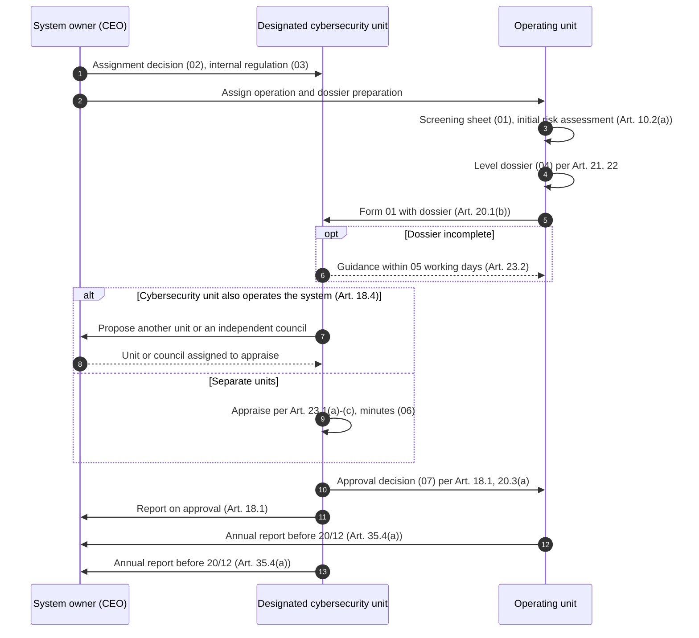

# Level 1–2 Toolkit

> **Unofficial English guide.** Condensed from the Vietnamese pages listed below; the Vietnamese version prevails. Vietnamese laws have no official English translation — renderings follow the [glossary](glossary.md). **Synced with Vietnamese version:** 28/09/2026.
> **Vietnamese source:** [docs/08-bo-mau-cap-1-2/README.md](../docs/08-bo-mau-cap-1-2/README.md) · [docs/00-tong-quan/diem-can-doi-chieu.md](../docs/00-tong-quan/diem-can-doi-chieu.md) (point C18)

**Legal basis:** Law 116 Art. 1.2, 8.1, 10, 45.1; Decree 331 Art. 2, 8, 10, 11–13, 18, 20–25, 29–33, 35–36 and Appendix (Forms 01, 08); Decree 330 Art. 7, 21–24, 27, 54; PDPL Art. 23; TCVN 14423:2026 clauses 3 and 4. Checked against originals on 28/09/2026.

A **slimmed-down set of templates** for organizations whose information systems are all at security level (*cấp độ*) 1 or 2 — typically small and medium-sized enterprises running email, intranet / e-office, accounting, HR, a LAN / Active Directory, a small website or CRM. Goal: the least paperwork that still proves, on inspection, that every mandatory obligation was met.

Intended users: the head of the organization (as system owner, *chủ quản hệ thống thông tin*), the IT / operations manager, the person in charge of cybersecurity, internal control / legal.

The templates are Vietnamese documents to be signed and filed in Vietnamese. This page **describes** them; it does not translate them.

## 1. When to use this toolkit — and when not

**Use it when** every information system in scope passes the [screening sheet](../docs/08-bo-mau-cap-1-2/01-phieu-sang-loc-cap-do.md) with a Level 1 or 2 result:

- **Level 1** (Art. 11 Decree 331): internal-use system processing only public information; or under the cybersecurity risk management framework.
- **Level 2** (Art. 12 Decree 331), any of: internal system processing private or personal information but no state secrets (Art. 12.1); online service not in a conditional business line (Art. 12.2(a)); other online service with fewer than 100,000 basic-personal-data subjects or fewer than 10,000 sensitive-personal-data subjects (Art. 12.2(b)); information infrastructure serving **one** organization (Art. 12.3); decided by the Prime Minister or under the risk management framework (Art. 12.4).

**Switch to the full toolkit** ([02-security-levels.md](02-security-levels.md)) for any system showing one of these signs (Part D of the screening sheet):

| Sign | Basis (Decree 331 unless stated) |
|---|---|
| Processes state secrets; serves defense or security | Art. 13.1 |
| Online service in a conditional business line | Art. 13.2(a) |
| System handling administrative procedures | Art. 13.2(b) |
| Online service processing data of ≥ 100,000 basic or ≥ 10,000 sensitive personal-data subjects | Art. 13.2(c) |
| Information infrastructure for organizations across a ministry / sector, or one or more provinces | Art. 13.3 |
| Industrial control for construction works of grade IV or above | Art. 13.4, 14.3, 15.4 |
| Risk assessment shows harm above Level 2 | Art. 8.1 Law 116; Art. 10.5 |
| Signs of an information system critical to national security | Art. 16, 17 |

Rules: a system meeting several criteria takes the highest level (Art. 8.2); do not split or merge scope to lower the level (Art. 8.3). An organization with both Level 1–2 and Level 3 systems uses this toolkit for the Level 1–2 group and the full toolkit for Level 3 (different approval authority — Art. 18.1 vs. 18.2); one internal regulation can serve both if it meets the management requirements of the highest level (Art. 30.7). System owners using state budget have extra obligations (Art. 40.2 Law 116) — see the full toolkit.

### Does Decree 331 even apply to purely internal systems?

Art. 2 Decree 331 applies to systems serving state bodies and to IT used to provide **online services** to citizens and businesses, and "encourages" other organizations to apply it. A private company's **purely internal** systems could therefore be argued to fall under "encouraged" only. The toolkit nonetheless takes the cautious view — determine the level and keep the minimum file — because:

- Law 116 applies to all Vietnamese organizations (Art. 1.2(a) Law 116);
- security level determination is one of the six tasks in Art. 10.1 Law 116, and owners of Level 1–2 systems must "fully perform" those tasks (Art. 10.3 Law 116);
- the penalties in Art. 23 and 24 Decree 330 do not distinguish between types of system owner.

Any system that **provides an online service** (e-commerce site, customer portal, app) is clearly in scope (Art. 2; online service defined in Art. 3.5 Decree 331). See [gray-areas.md](gray-areas.md).

## 2. Who approves, and how long it takes

For Levels 1–2, appraisal and approval take place inside the system owner's organization (Art. 18.1).

| Role | Level 1–2 task | Basis (Decree 331) |
|---|---|---|
| **Operating unit** (*đơn vị vận hành*) | Screens systems, prepares the security level proposal dossier (*hồ sơ đề xuất cấp độ*), sends it with Form 01 | Art. 20.1(a)–(b) |
| **Designated cybersecurity unit** (*đơn vị chuyên trách về an ninh mạng*) | **Appraises and approves** the dossier, then reports to the system owner | Art. 18.1, 20.3(a) |
| **System owner** (head of the organization) | Assigns roles, issues the internal regulation; receives the approval report; decides on an independent appraiser if needed | Art. 18.4, 30.7, 31.1 |

**Key points (gray area C18, reviewed 28/09/2026):**

- **Time limit:** incomplete dossier → guidance within **05 working days** (Art. 23.2, all levels). Art. 23.3 sets no appraisal deadline for Levels 1–2, but **Art. 24.2 (07 working days) applies to all levels**, because Art. 24.1(b) singles out "Level 3 and above" explicitly. Toolkit: appraisal plus approval within **07 working days in total** from receipt of a complete valid dossier (appraisal ≤ 05 days), written into decision 02 and Art. 22 of regulation 03.
- **Authority:** the power comes directly from the decree (Art. 18.1, 32.4), not from delegation (Art. 4.3), so the unit signs **in its own name**. Only a **form** is missing: Form 06 is designed for the system owner's signature; the toolkit's decision 07 follows its structure (format **[TO VERIFY]**). A decision fits Art. 36.10, which refers to "the approval decision".
- **Seal:** a department has no seal. Art. 43 Law on Enterprises 2020 lets a company decide seals for its "other units" (Decree 30/2020 covers state bodies and state-owned enterprises). Decision 02 names the signer, numbering and seal use.
- **Art. 18.4 case** (cybersecurity unit also operates the system): Art. 18.4 replaces only the appraiser; literally the unit still approves — a conflict of interest, not a gap. Toolkit: an independent unit or council appraises and the **head of the organization signs** the approval (Art. 31.1(a), 31.2(a)).
- **Art. 33.1** ("plan approved by the system owner") is not a real conflict: at Levels 1–2 the approved dossier includes the cybersecurity assurance plan (*phương án bảo đảm an ninh mạng*; "security plan") and is approved by a unit of the system owner (Art. 3.2); only Level 5 has separate plan approval (Art. 18.3(d), Form 07).
- A similar mechanism existed under Decree 85/2016 (Art. 12.1, 14.3(a) — per a legal Q&A source, not checked against the full text). MPS guidance and forms are still pending (Art. 40.1).

## 3. Six-step flow

| Step | Action | Who | Document | Basis (Decree 331) |
|---|---|---|---|---|
| 1 | Assign roles; issue the internal cybersecurity regulation | System owner | 02, 03 | Art. 31.1, 30.7 |
| 2 | Screen levels; initial risk assessment | Operating unit | 01 | Art. 10.2(a), 10.3, 11–13 |
| 3 | Prepare the level dossier | Operating unit | 04 | Art. 20.1(a), 21, 22 |
| 4 | Send Form 01 with the dossier | Operating unit | Form 01 | Art. 20.1(b) |
| 5 | Appraise (guidance within 05 working days if incomplete) | Designated cybersecurity unit | 06 | Art. 18.1, 23.1, 23.2 |
| 6 | Approve; report to the system owner | Designated cybersecurity unit | 07 | Art. 18.1, 20.3(a) |

The regulation must be issued **before** the dossier is approved (Art. 30.7). After step 6: implement and maintain per the annual plan (09), handle incidents per the short procedure (08), report yearly with Form 08.

## 4. The templates

Word / Excel files are generated from the Vietnamese Markdown sources into [templates/08-bo-mau-cap-1-2/](../templates/08-bo-mau-cap-1-2/). All are in Vietnamese.

| # | Template | What it is and does | Signed by | Files |
|---|---|---|---|---|
| 01 | **Level screening sheet** | Internal working sheet (not a statutory form), one per system: scope questions (is Decree 331 mandatory or "encouraged"), Level 1 / 2 criteria, Part D "escalation signs" to Level 3+, conclusion and evidence list. Its results feed Part II of dossier 04 | Operating unit prepares; cybersecurity unit confirms | [VN](../docs/08-bo-mau-cap-1-2/01-phieu-sang-loc-cap-do.md) · [.docx](../templates/08-bo-mau-cap-1-2/01-phieu-sang-loc-cap-do.docx) |
| 02 | **Assignment decision** | One decision replacing three from the full toolkit: designates the cybersecurity unit, assigns the operating unit, sets the Art. 18.4 independent-appraisal option, names incident contacts (main + backup), the 07-working-day limit, signer and seal use. Guidance covers four set-ups: two separate units, a single IT department, a one-person IT function (internal control or a 3-member independent council appraises), outsourced operation | Head of the organization | [VN](../docs/08-bo-mau-cap-1-2/02-qd-phan-cong-anm.md) · [.docx](../templates/08-bo-mau-cap-1-2/02-qd-phan-cong-anm.docx) |
| 03 | **Internal cybersecurity regulation (short form)** | The cybersecurity regulation (internal) (*quy chế bảo đảm an ninh mạng*, ≈ information security policy) for all Level 1–2 systems, 23 articles in 5 chapters following the Art. 30.3–30.4 groups; Art. 15 sets Level 1 / Level 2 parameters (session lock, lockout, password length, 45-day account disabling, yearly reviews, monthly patching, log retention). Omits Level 3+ items and online-service duties (add from the full regulation if relevant) | Head of the organization | [VN](../docs/08-bo-mau-cap-1-2/03-quy-che-anm-cap-1-2.md) · [.docx](../templates/08-bo-mau-cap-1-2/03-quy-che-anm-cap-1-2.docx) |
| 04 | **Combined level dossier** | One dossier for several Level 1–2 systems (Art. 22.4(a)), each with its own level rationale and security plan: Part I general description (owner, operator, scope, architecture); Part II level proposal, escalation check, preliminary risk identification; Part III security plan by the 7 parts of Art. 29.2 and the TCVN groups, shared solutions (Art. 30.5(a)), remediation plan | Operating unit prepares | [VN](../docs/08-bo-mau-cap-1-2/04-ho-so-de-xuat-cap-do.md) · [.docx](../templates/08-bo-mau-cap-1-2/04-ho-so-de-xuat-cap-do.docx) |
| 05 | **Form 01 — request for appraisal and approval** | The Decree 331 statutory form (reproduced verbatim in Vietnamese); only formatting change: the organization's (system owner's) name is added above the name of the sending department, since the sender is a department of the company. | Head of the operating unit | [VN](../docs/08-bo-mau-cap-1-2/mau-01-de-nghi-tham-dinh-phe-duyet.md) · [.docx](../templates/08-bo-mau-cap-1-2/mau-01-de-nghi-tham-dinh-phe-duyet.docx) |
| 06 | **Appraisal minutes** | Internal record proving the appraisal covered Art. 23.1(a)–(c). Replaces Form 04 (appraisal opinion), which is required only from Level 3 (Art. 24.1(b)). | Head of the designated cybersecurity unit | [VN](../docs/08-bo-mau-cap-1-2/06-bien-ban-tham-dinh.md) · [.docx](../templates/08-bo-mau-cap-1-2/06-bien-ban-tham-dinh.docx) |
| 07 | **Approval decision + report to the system owner** | Two documents: the level approval decision (Form 06 structure) and the report to the system owner required by Art. 18.1 / 20.3(a) | Head of the designated cybersecurity unit (head of the organization if Art. 18.4 applies) | [VN](../docs/08-bo-mau-cap-1-2/07-qd-phe-duyet-cap-do.md) · [.docx](../templates/08-bo-mau-cap-1-2/07-qd-phe-duyet-cap-do.docx) |
| 08 | **Short incident procedure** | Two-page procedure issued with the regulation: roles and contacts, timeline from detection (T0), MPS reporting (24h initial notice for serious incidents, 72h report, immediate for national-security signs — Art. 31.2(d) Decree 331), personal data breach notice within 72 hours (Art. 23 PDPL; Form 08 of Decree 356), internal quick-report form. "Serious incident" criteria and the form are internal proposals **[TO VERIFY]** pending MPS forms (Art. 28.6) | Designated cybersecurity unit drafts; issued with the regulation | [VN](../docs/08-bo-mau-cap-1-2/08-quy-trinh-su-co-rut-gon.md) · [.docx](../templates/08-bo-mau-cap-1-2/08-quy-trinh-su-co-rut-gon.docx) |
| 09 | **Annual cybersecurity plan** | Gathers all recurring work — training, awareness, exercises, independent self-assessment, periodic reviews, reporting calendar — with owners and budget, as evidence that the system owner directed them (Art. 31.3, 31.2(c), 33.3) | Head of the organization | [VN](../docs/08-bo-mau-cap-1-2/09-ke-hoach-anm-nam.md) · [.docx](../templates/08-bo-mau-cap-1-2/09-ke-hoach-anm-nam.docx) |
| — | **Management workbook** | Excel with 5 sheets: A system inventory; B TCVN clause 3 (Level 1) / clause 4 (Level 2) checklist, paraphrased; C periodic calendar; D incident log; E remediation plan | — | [VN](../docs/08-bo-mau-cap-1-2/checklist-cap-1-2.md) · [.xlsx](../templates/08-bo-mau-cap-1-2/checklist-cap-1-2.xlsx) |
| — | **Form 08 annual report** | Reuse the full-toolkit template (Art. 35, 36) | System owner | [VN](../docs/02-ho-so-cap-do/mau-08-bao-cao.md) · [.docx](../templates/02-ho-so-cap-do/mau-08-bao-cao.docx) |

**Full-toolkit documents not needed at Levels 1–2:** Forms 02 and 03 (Levels 3–5); Form 04 (replaced by minutes 06); Form 05 submission (Levels 1–2 are not submitted to the system owner for approval — Art. 20.3(a)); Form 07 (Level 5 and listed national-security systems only); professional opinion (Art. 21.5, Levels 4–5 only); detailed risk assessment report (Art. 22.5, Levels 4–5 only); RACI matrix (covered by 02). Separate risk, readiness, supplier and authority-request procedures are optional — their minimum content is in regulation 03. Internal submissions to management (*tờ trình*) are optional, for seeking budget ([07-governance-inspection-reporting.md](07-governance-inspection-reporting.md)).

## 5. Minimum paperwork on inspection

1. Assignment decision (02), plus any decision assigning an appraisal unit / council under Art. 18.4.
2. Internal regulation (03), issued before the approval date (Art. 30.7).
3. Signed screening sheet (01) for **every** system, including Level 1.
4. Level dossier (04), with the preliminary risk assessment and the network diagram / configuration records as "documents of equivalent value" to a design (Art. 21.2(b)).
5. Form 01 with number and date.
6. Appraisal minutes (06).
7. Approval decision and report to the system owner (07).
8. Incident procedure and contact list (08); incident log (workbook sheet D).
9. Annual plan (09) and evidence: training lists, exercise minutes, self-assessment report, vulnerability scan results, account reviews, logs.
10. Completed TCVN clause 3 / 4 checklist and remediation plan.
11. Form 08 annual report and proof of sending (Art. 35).

## 6. Annual calendar

Months are suggestions; the "at least yearly" cycles come from TCVN 14423:2026 clauses 3 and 4 — Art. 28.5(a) Decree 331 only requires periodic checks by level and risk. Yearly tasks can be grouped into 1–2 rounds.

| When | Tasks | Owner |
|---|---|---|
| Monthly | Patch user devices; disable accounts inactive for 45 days; follow alerts | Operating unit |
| March | Risk review; asset stocktake; rogue devices, unauthorized software | Operating unit with cybersecurity unit |
| April | Security awareness training for all staff (at least once a year); account and permission review | Cybersecurity unit; operating unit |
| May | Vulnerability scan | Cybersecurity unit with operating unit |
| June | Log review; backup restore test | Cybersecurity unit; operating unit |
| July | Update supplier list and classification | Operating unit |
| September | Tabletop incident exercise; update incident procedure and contacts | Cybersecurity unit |
| Oct–Nov | Independent self-assessment against the checklist; control effectiveness; review regulation, procedures, network diagram; consider re-determination if systems changed (Art. 10.2(b)–(c), 25) | Cybersecurity unit (independent of operation), operating unit |
| November | Prepare next year's plan (Art. 10.1 Law 116) | Cybersecurity unit |
| December | Data cut-off 14/12; internal reports before 20/12; system owner to the MPS before 25/12 (Art. 35.3, 35.4) | All three |
| On event | Incident: serious-incident notice 24h, report 72h; personal data breach: 72h notice (Art. 23.1 PDPL); system change: risk assessment (Art. 10.2(b)–(đ)) | Incident contact |

**Sample first-year timeline (simulated data):** assignment decision 01/10/2026 → regulation 05/10 → dossier 12/10 → Form 01 15/10 → appraisal minutes 22/10 → approval decision 26/10 → report to system owner 27/10 → 2027 annual plan 16/11 → 2026 annual report before 20/12 and 25/12.

## 7. Related penalties (Decree 330)

Sections 1–5 of Chapter II of Decree 330 state fines for **individuals**; organizations pay **twice** that (Art. 7.1). Section 6 (personal data) states organization amounts directly. Amounts below are **for organizations**. Full table: [05-penalties.md](05-penalties.md).

| Violation | Basis (Decree 330) | Organization fine | Preventive template |
|---|---|---|---|
| No level dossier, or no appraisal / approval (any level) | Art. 24.1 | VND 40–60 million | 01, 04, 06, 07 |
| No rules on cybersecurity in design, build, management, operation, use, upgrade, destruction | Art. 23.1(a) | VND 40–60 million | 03 |
| No compliance checks / monitoring, no log retention as required, or no effectiveness assessment | Art. 23.2(a) | VND 60–100 million | 09, workbook |
| Not organizing, urging, checking, supervising cybersecurity work | Art. 23.2(c) | VND 60–100 million | 02, 09 |
| Not reporting an incident to the MPS specialized force; not responding and reporting | Art. 21.2(a)–(b) | VND 40–60 million | 08 |
| No incident response unit / team; not recording, receiving, reporting incidents per procedure; no incident response plan | Art. 21.3(b)–(d) | VND 60–100 million | 02, 08 |
| No measures to manage, prevent, detect, stop malware | Art. 22.1(a) | VND 30–60 million | 03, workbook |
| Not (fully) fixing weaknesses / vulnerabilities as required by the specialized force | Art. 27.1(c) | VND 50–100 million | 09 |
| Personal data breach notice later than 72 hours | Art. 54.3 (Section 6) | VND 40–60 million | 08 |

Art. 23.1(b)–(d) (no dossier, operating before approval, measures not fully implemented) apply to Levels 3–5 only. The maximum cybersecurity fine for an organization is VND 200 million (Art. 7.3). No specific penalty was found for not filing the Form 08 annual report **[TO VERIFY]**.

## 8. Sample data

The templates are pre-filled with a **simulated** scenario so the Word files are easy to picture. Only the company name (Công ty cổ phần Giải pháp Công nghệ TURBO) is real; all names, departments, document numbers, addresses, emails (`example.vn`), IP ranges and figures are fictitious. Scenario: about 120 staff, servers in the head-office server room, one dossier covering four internal systems — intranet / e-office / internal email (Level 2, Art. 12.1), accounting–HR ERP (Level 2, Art. 12.1), head-office LAN / Wi-Fi / Active Directory (Level 2, Art. 12.3), lobby information screen (Level 1, Art. 11.1). The cybersecurity department appraises and approves; a separate systems operations department prepares the dossier, so Art. 18.4 does not arise. If cloud email servers are abroad, review cross-border transfer obligations (Art. 20 PDPL; see [06-personal-data.md](06-personal-data.md)). Never commit real data to the public repository.

## 9. Other points to note

- **Why issue a regulation at Levels 1–2 (C16):** Art. 10.3 Law 116 lets Level 1–2 owners choose Art. 10.2 measures "according to actual needs and capacity", but Art. 30.7 Decree 331 requires the regulation before approval and Art. 23.1(a) Decree 330 penalizes not issuing rules. Toolkit: issue the short regulation (03).
- **Transition (B2):** systems already running but never classified have no transition date; systems classified under the Law on Network Information Security 2015 keep their level and must meet the new requirements within 12 months from 01/7/2026 (Art. 45.1 Law 116; Art. 39.1 Decree 331). Toolkit: act now; use 30/6/2027 as the internal deadline.
- **Risk management framework** (criteria in Art. 11.2, 12.4) is not yet available (Art. 34.1(c) Decree 331): do not use these criteria until issued **[TO VERIFY]**.

Details: [gray-areas.md](gray-areas.md).
