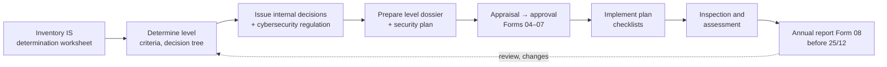

# Vietnam Cybersecurity Compliance Toolkit — English Guide

> **Unofficial English guide.** Condensed from the Vietnamese pages listed below; the Vietnamese version prevails. Vietnamese laws have no official English translation — renderings follow the [glossary](glossary.md). **Synced with Vietnamese version:** 28/09/2026.
> **Vietnamese source:** [README.md](../README.md) · [docs/00-tong-quan/README.md](../docs/00-tong-quan/README.md) · [docs/01-xac-dinh-cap-do/README.md](../docs/01-xac-dinh-cap-do/README.md) · [docs/02-ho-so-cap-do/README.md](../docs/02-ho-so-cap-do/README.md) · [docs/03-yeu-cau-theo-cap-do/README.md](../docs/03-yeu-cau-theo-cap-do/README.md) · [docs/04-chinh-sach-quy-trinh/README.md](../docs/04-chinh-sach-quy-trinh/README.md) · [docs/05-nghia-vu-lien-quan/README.md](../docs/05-nghia-vu-lien-quan/README.md) · [docs/06-kiem-tra-bao-cao/README.md](../docs/06-kiem-tra-bao-cao/README.md) · [docs/07-to-trinh-lanh-dao/README.md](../docs/07-to-trinh-lanh-dao/README.md) · [docs/08-bo-mau-cap-1-2/README.md](../docs/08-bo-mau-cap-1-2/README.md)

[Tiếng Việt](../README.md) · **English**

## What this is

An open toolkit for **security level determination** of information systems (IS), preparing the **security level proposal dossier** (*hồ sơ đề xuất cấp độ*) and complying with Vietnam's new cybersecurity and personal data rules. The Vietnamese pages contain the working documents: criteria, decision trees, Decree 331 forms, internal decisions, policies, procedures, checklists, and 42 Word and 5 Excel templates.

This English layer is a **condensed guide**, not a translation. It explains obligations so that readers can take decisions. Vietnamese staff still prepare and file the documents in Vietnamese.

**Who it is for:** executives of foreign-invested (FDI) companies in Vietnam, regional CISOs and compliance teams, parent-company legal counsel, auditors and foreign advisers.

> **Status:** toolkit v0.1. Vietnamese pages checked against the original legal texts on 24/09/2026. This is reference material, **not legal advice**. Before signing anything, re-check the original texts, the official TCVN 14423:2026 (sold by VSQI) and the open points in [gray-areas.md](gray-areas.md).

## Limitations — read before use

The toolkit helps organizations **understand their obligations, self-assess and draft documents faster**. It does **not replace** lawyers, compliance advisers or the views of the competent authorities.

| What the toolkit does | What it does not do |
|---|---|
| Summarizes and cites provisions from the full legal texts; flags where texts are inconsistent | Give **legal advice** on your organization's specific situation |
| Proposes a **cautious reading** of gray areas ([gray-areas.md](gray-areas.md)) | Guarantee that appraising or inspecting authorities **read them the same way** |
| Provides templates, checklists and illustrative sample data | Guarantee that a dossier is **approved**, a system **passes** inspection, or the organization **avoids penalties** |
| Paraphrases TCVN 14423:2026 with clause numbers | Replace the **official standard** (copyrighted, sold by VSQI) |
| Is updated monthly when new texts appear | Reflect newly issued texts or guidance **immediately**; there is always a lag |

Also note:

- **The rules are new and guidance is incomplete.** Law 116/2025 and Decrees 330, 331 and 333/2026 have only just taken effect; several MPS circulars and forms are still pending. Official guidance may differ from the toolkit's reading.
- **Limited scope.** Sector rules (banking, telecommunications, health, securities…), state-secret protection and the separate procedures for information systems critical to national security are not covered in depth. Level 4–5 systems require direct engagement with the MPS.
- **Sources.** Some full texts in `sources/` come from public legal websites; check the Official Gazette or the issuing body's version before citing formally.
- **Templates are starting points.** Adapt them to your structure, charter, internal rules and actual systems. The toolkit is **generic**, not tailored to TURBO. Sample data is an **illustrative, simulated use-case**: only the company name TURBO is real; size, structure, systems, figures and signatories are fictitious and do not describe the actual company.
- **Errors are possible.** Content was drafted with AI assistance (Claude Code) and cross-checked against the original texts, but mistakes may remain. Each page shows its check date; please report errors via [Issues](https://github.com/ldphuong-vn/vn-cyber-compliance/issues/new/choose).
- **This English guide is unofficial**; the Vietnamese pages and the original Vietnamese legal texts prevail.
- **No warranty, no liability.** Provided "as is" under the Apache License 2.0. Users remain responsible for their own decisions and filings.

**Consult a lawyer or the competent authority when:** a system sits near the Level 2/Level 3 boundary or falls in a conditional business line; you must decide on data localization, cross-border transfer of personal data or a personal data processing service business; a serious incident or data breach occurs; you face an inspection or penalty; or you sign contracts with cybersecurity or data clauses with vendors or customers.

## The legal landscape in 10 lines

1. **Law on Cybersecurity 2025** (Law 116) — effective **01/7/2026**. It replaces the Law on Network Information Security 2015 and the Law on Cybersecurity 2018.
2. It sets **five security levels** (Level 1–5) for information systems, based on the harm an incident would cause (Art. 8.1 Law 116).
3. **Decree 331/2026** — level criteria, who appraises and approves, dossier contents, annual reporting, Forms 01–08. Effective **19/8/2026**.
4. **Decree 333/2026** — duties of online service providers: account verification, 24h/3h information requests, 24h/6h takedowns, logs, **data localization**, IP identification. Effective 19/8/2026.
5. **Decree 330/2026** — administrative penalties for cybersecurity and personal data violations. Effective 19/8/2026. In the cybersecurity sections, organizations pay twice the individual amount (Art. 7.1 Decree 330).
6. **TCVN 14423:2026** — national standard with basic requirements per level. Decree 331 refers to it. It replaces TCVN 14423:2025 and TCVN 11930:2017.
7. **Law on Personal Data Protection 2025** (PDPL, Law 91) and **Decree 356/2025** — effective 01/01/2026; they replace Decree 13/2023.
8. **Resolution 22/2026** — simplifies Ministry of Public Security procedures (29/4/2026 to 01/3/2027).
9. Transitional deadlines run to about **30/6/2027** for systems that already had a level or were under investment before 01/7/2026 [TO VERIFY how the deadline is counted].
10. The system owner sends an **annual report (Form 08)** to the Ministry of Public Security (MPS) **before 25 December** every year.

Details: [01-overview.md](01-overview.md).

> **Key dates:** first annual report to the MPS before **25/12/2026**; IS under investment approved by **31/12/2026**; Resolution 22 ends **01/3/2027**; level measures in place and e-commerce filings redone by **30/6/2027**; the SME option on DPIA ends after **31/12/2030**. Full list: [01-overview.md §3](01-overview.md).

## How to use the toolkit

- The internal **cybersecurity regulation** must be issued **before** the level dossier is approved (Art. 30.7 Decree 331).
- **Only Level 1–2 systems?** Use the simplified [Level 1–2 toolkit](08-level-1-2-toolkit.md). The designated cybersecurity unit appraises and approves; Forms 02–05 and 07 are not needed; one combined dossier can cover several systems.
- To get management buy-in, the IT or cybersecurity team can use the Vietnamese **internal submission** templates described in [07-governance-inspection-reporting.md](07-governance-inspection-reporting.md).

## Page index

| Page | Content |
|---|---|
| [glossary.md](glossary.md) | Vietnamese–English terminology used on every page |
| [01-overview.md](01-overview.md) | Legal instruments, effective dates, transitional rules, compliance roadmap and key deadlines |
| [02-security-levels.md](02-security-levels.md) | Criteria for Levels 1–5, decision tree, authority and time limits, dossier contents, Forms 01–08 |
| [03-requirements-by-level.md](03-requirements-by-level.md) | TCVN 14423:2026 requirement groups by level, quantitative thresholds, Decree 331 Art. 29–30 mapping, Excel checklist |
| [04-enterprise-obligations.md](04-enterprise-obligations.md) | Decree 333 duties of online service providers; data localization for websites, SaaS and foreign cloud |
| [05-penalties.md](05-penalties.md) | Decree 330 principles and fine table |
| [06-personal-data.md](06-personal-data.md) | PDPL and Decree 356 interplay with cybersecurity: DPIA, cross-border transfer, 72-hour breach notice, SME exemptions |
| [07-governance-inspection-reporting.md](07-governance-inspection-reporting.md) | Roles and internal decisions, periodic inspection, evidence retention, annual report Form 08, internal submissions |
| [08-level-1-2-toolkit.md](08-level-1-2-toolkit.md) | Simplified toolkit for Level 1–2 systems |
| [09-templates-catalog.md](09-templates-catalog.md) | Catalog of all Word/Excel templates: purpose, who signs, whether filed with an authority |
| [10-form-reading-guide.md](10-form-reading-guide.md) | How to read Vietnamese forms, decisions and internal submissions before signing |
| [gray-areas.md](gray-areas.md) | Points to verify: conflicting provisions and the toolkit's position |

## What is not translated, and why

- **Forms and filed documents** — Decree 331 Forms 01–08, dossier statements, internal decisions, the cybersecurity regulation, procedures and internal submissions. They are filed with Vietnamese authorities or signed internally in Vietnamese; an English version has no legal standing and may drift from the official text. The English pages describe each one (purpose, who signs, where it goes) and link to the Vietnamese file and the [Word/Excel templates](../templates/README.md).
- **TCVN 14423:2026** — copyrighted. It is only paraphrased, with clause numbers.
- **Legal texts** — the full Vietnamese texts are in [sources/van-ban-goc/](../sources/van-ban-goc/README.md). There is no official English version.

## Conventions

- Citations: `Art. 18.1(a) Decree 331` = Decree 331, Article 18, clause 1, point (a). **[TO VERIFY]** marks readings not yet confirmed by official guidance.
- Fines are quoted for **organizations**, as on the Vietnamese pages.
- Templates use placeholders such as `{{TEN_TO_CHUC}}` (organization name). The toolkit holds no data of any real organization. Keep your own dossiers (names, IP addresses, network diagrams, staff) in a **private** repository.

## Monthly updates

MPS guidance under the Cybersecurity Law and the PDPL is still being issued (circulars on risk assessment, monitoring, incident response and more). The toolkit is therefore **reviewed monthly**:

- **On the 1st of each month:** review new, amended or expired instruments and official guidance.
- Each review is recorded in the [update log](../docs/00-tong-quan/cap-nhat-dinh-ky/README.md), even when nothing changed.
- Content changes are made only after checking the **full text**; each change goes through a reviewed Pull Request, and the Word/Excel templates are regenerated.
- To be notified: **Watch → Custom → Releases / Pull requests** on the repository page.

Every page shows the date it was checked against the original texts. English pages also show the date they were synced with the Vietnamese version.

## Disclaimer

This guide is for orientation only and is not legal advice (see [Limitations](#limitations--read-before-use)). The Vietnamese pages and, above all, the original Vietnamese legal texts prevail. Translations of legal terms are the toolkit's working renderings.

## Contributing

Feedback is welcome, especially from people preparing level dossiers, appraising them or advising on them. English-language feedback is fine.

- **New or amended instrument, or a wrong citation:** open an issue ["New instrument / citation"](https://github.com/ldphuong-vn/vn-cyber-compliance/issues/new?template=van-ban-moi-hoac-trich-dan.yml).
- **Content, templates, practical experience** (for example how an appraising body reads a gray area): open an issue ["Content feedback"](https://github.com/ldphuong-vn/vn-cyber-compliance/issues/new?template=gop-y-noi-dung.yml).
- **Direct edits:** send a Pull Request following [CONTRIBUTING.md](../CONTRIBUTING.md).

Contributors are credited in the Pull Request, the matching monthly update report and the repository's [Contributors](https://github.com/ldphuong-vn/vn-cyber-compliance/graphs/contributors) list. Do **not** post internal information, personal data or real dossiers in issues — the repository is public.

## Acknowledgments

- Sponsored and maintained by **Công ty cổ phần Giải pháp Công nghệ TURBO**.
- Thanks to everyone who reported errors and shared practical experience — see [Contributors](https://github.com/ldphuong-vn/vn-cyber-compliance/graphs/contributors) and the credits in each [monthly update report](../docs/00-tong-quan/cap-nhat-dinh-ky/README.md).
- Built with [Claude Code](https://claude.com/claude-code) (Anthropic): research, cross-checking of legal texts, drafting and generating the Word/Excel files. Content has been reviewed against the original texts but is not legal advice; Anthropic does not endorse it.

## License

Apache License 2.0. See [LICENSE](../LICENSE). The legal normative documents in `sources/` are not subject to copyright.

---

*English search keywords:* Vietnam cybersecurity law · Law on Cybersecurity 2025 (Law 116/2025/QH15) · Decree 331/2026 · information system security levels · Vietnam security level proposal dossier · TCVN 14423:2026 · Decree 333/2026 · Vietnam data localization · Decree 330/2026 penalties · Vietnam PDPL (Law 91/2025) · Decree 356/2025 · Vietnam DPIA · Vietnam cybersecurity compliance checklist · Ministry of Public Security annual report Form 08.
